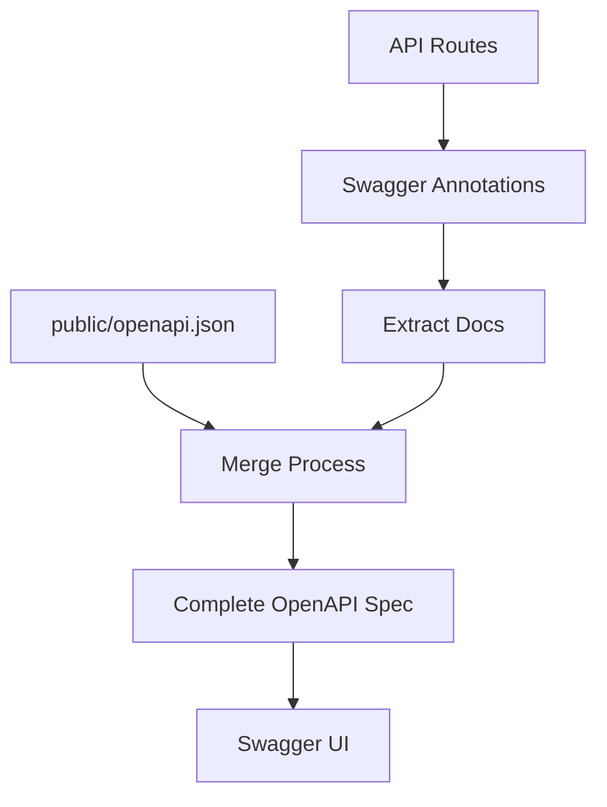

# מערכת תיעוד API אוטומטית

Ever Works כולל מערכת תיעוד OpenAPI אוטומטית שמייצרת תיעוד API מקיף מהקוד.

## סקירה כללית

המערכת מספקת:
- 📝 **יצירה אוטומטית** - מהערות קוד למפרט OpenAPI
- 🔄 **גישה היברידית** - שומרת תיעוד ידני, מוסיפה אוטומטי
- 🎯 **בטיחות טיפוסים** - אינטגרציה עם TypeScript
- 📊 **Swagger UI** - סייר API אינטראקטיבי
- 🔧 **טעינה חמה** - יצירה מחדש אוטומטית בזמן פיתוח

## ארכיטקטורה



### הגישה ההיברידית

- ✅ **שומרת** את הקובץ הקיים `public/openapi.json`
- ✅ **מוסיפה** הערות `@swagger` בקוד הנתיבים
- ✅ **ממזגת** את שני המקורות אוטומטית
- ✅ **מייצרת** קובץ OpenAPI שלם ועקבי

## התקנה

### 1. התקנת תלויות

```bash
# Run the installation script
./scripts/install-swagger-deps.sh

# Or manually with npm
npm install -D swagger-jsdoc @types/swagger-jsdoc tsx nodemon
```

### 2. סקריפטים זמינים

```bash
# Generate documentation once
npm run generate-docs

# Watch mode for development (auto-regenerates)
npm run docs:watch

# Development with automatic generation
npm run dev
```

## שימוש

### הוספת הערות לנתיבים

```typescript
// app/api/example/route.ts
import { NextRequest, NextResponse } from 'next/server';

/**
 * @swagger
 * /api/example:
 *   get:
 *     tags: ["Example"]
 *     summary: "Get example data"
 *     description: "Returns example data from the API"
 *     responses:
 *       200:
 *         description: "Success"
 *         content:
 *           application/json:
 *             schema:
 *               type: object
 *               properties:
 *                 success:
 *                   type: boolean
 *                   example: true
 *                 data:
 *                   type: array
 *                   items:
 *                     type: string
 */
export async function GET() {
  return NextResponse.json({ success: true, data: ["example"] });
}
```

### שימוש בכלי הערות

```typescript
import { createAdminRouteAnnotation, CommonAnnotations } from '@/lib/swagger/annotations';

/**
 * @swagger
 * /api/admin/users:
 *   get:
 *     tags: ["Admin"]
 *     summary: "Get all users"
 *     security:
 *       - bearerAuth: []
 *     responses:
 *       200:
 *         description: "Success"
 *       401:
 *         $ref: '#/components/responses/Unauthorized'
 *       500:
 *         $ref: '#/components/responses/ServerError'
 */
export async function GET() {
  // Implementation
}
```

### הערות נפוצות

המערכת מספקת רכיבי הערות לשימוש חוזר:

```typescript
// lib/swagger/annotations.ts

export const CommonAnnotations = {
  responses: {
    unauthorized: {
      description: "Unauthorized - Invalid or missing authentication",
      content: {
        "application/json": {
          schema: {
            type: "object",
            properties: {
              error: { type: "string", example: "Unauthorized" }
            }
          }
        }
      }
    },
    serverError: {
      description: "Internal Server Error",
      content: {
        "application/json": {
          schema: {
            type: "object",
            properties: {
              error: { type: "string", example: "Internal server error" }
            }
          }
        }
      }
    }
  },
  
  security: {
    bearerAuth: {
      type: "http",
      scheme: "bearer",
      bearerFormat: "JWT"
    }
  }
};
```

## מבנה קבצים

```
scripts/
├── generate-openapi.ts     # סקריפט יצירה ראשי
├── tsconfig.json          # הגדרת TypeScript לסקריפטים
└── install-swagger-deps.sh # מתקין תלויות

lib/swagger/
└── annotations.ts         # כלי הערות לשימוש חוזר

templates/
└── route-template.ts      # תבנית לנתיבים חדשים

public/
└── openapi.json          # מפרט OpenAPI שנוצר
```

## הגדרות

### הגדרת OpenAPI בסיסית

```typescript
// scripts/generate-openapi.ts
const swaggerDefinition = {
  openapi: '3.0.0',
  info: {
    title: 'Ever Works API',
    version: '1.0.0',
    description: 'API documentation for Ever Works directory platform',
  },
  servers: [
    {
      url: 'http://localhost:3000',
      description: 'Development server',
    },
    {
      url: 'https://yourdomain.com',
      description: 'Production server',
    },
  ],
  components: {
    securitySchemes: {
      bearerAuth: {
        type: 'http',
        scheme: 'bearer',
        bearerFormat: 'JWT',
      },
    },
  },
};
```

### הגדרת Swagger UI

גישה לתיעוד API אינטראקטיבי בכתובת:
- פיתוח: `http://localhost:3000/api-docs`
- ייצור: `https://yourdomain.com/api-docs`

## שיטות עבודה מומלצות

### 1. תיוג עקבי

קבץ נקודות קצה קשורות עם תגיות:

```typescript
/**
 * @swagger
 * /api/items:
 *   get:
 *     tags: ["Items"]  // Use consistent tag names
 */
```

### 2. תיאורים מפורטים

ספק תיאורים ודוגמאות ברורים:

```typescript
/**
 * @swagger
 * /api/items/{id}:
 *   get:
 *     summary: "Get item by ID"
 *     description: "Retrieves a single item from the directory by its unique identifier"
 *     parameters:
 *       - name: id
 *         in: path
 *         required: true
 *         description: "Unique item identifier"
 *         schema:
 *           type: string
 *           example: "item-123"
 */
```

### 3. הגדרות סכמה

הגדר סכמות לשימוש חוזר ברכיבים:

```typescript
/**
 * @swagger
 * components:
 *   schemas:
 *     Item:
 *       type: object
 *       required:
 *         - id
 *         - name
 *       properties:
 *         id:
 *           type: string
 *           example: "item-123"
 *         name:
 *           type: string
 *           example: "Example Item"
 *         description:
 *           type: string
 *           example: "Item description"
 */
```

### 4. תגובות שגיאה

תעד את כל תגובות השגיאה האפשריות:

```typescript
/**
 * @swagger
 * /api/items:
 *   post:
 *     responses:
 *       201:
 *         description: "Item created successfully"
 *       400:
 *         description: "Invalid request data"
 *       401:
 *         description: "Unauthorized"
 *       500:
 *         description: "Server error"
 */
```

## פתרון בעיות

### תיעוד לא נוצר

**בעיה**: קובץ OpenAPI לא מתעדכן

**פתרון**: בדוק את סקריפט היצירה

```bash
# Run manually to see errors
npm run generate-docs

# Check for syntax errors in annotations
```

### Swagger UI לא נטען

**בעיה**: דף תיעוד ה-API מציג שגיאה

**פתרון**: אמת שקובץ OpenAPI תקין

```bash
# Validate OpenAPI spec
npx swagger-cli validate public/openapi.json
```

### הערות לא מזוהות

**בעיה**: הערות נתיבים לא מופיעות בתיעוד

**פתרון**: וודא פורמט נכון

```typescript
// ✅ Correct
/**
 * @swagger
 * /api/route:
 *   get:
 *     ...
 */

// ❌ Incorrect (missing @swagger tag)
/**
 * /api/route:
 *   get:
 *     ...
 */
```

## תכונות מתקדמות

### סכמות גוף בקשה

```typescript
/**
 * @swagger
 * /api/items:
 *   post:
 *     requestBody:
 *       required: true
 *       content:
 *         application/json:
 *           schema:
 *             type: object
 *             required:
 *               - name
 *             properties:
 *               name:
 *                 type: string
 *               description:
 *                 type: string
 */
```

### אימות זהות

```typescript
/**
 * @swagger
 * /api/admin/settings:
 *   get:
 *     security:
 *       - bearerAuth: []
```
