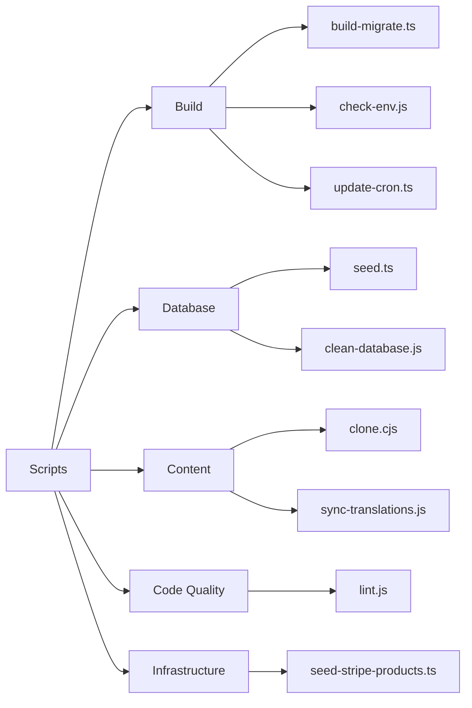
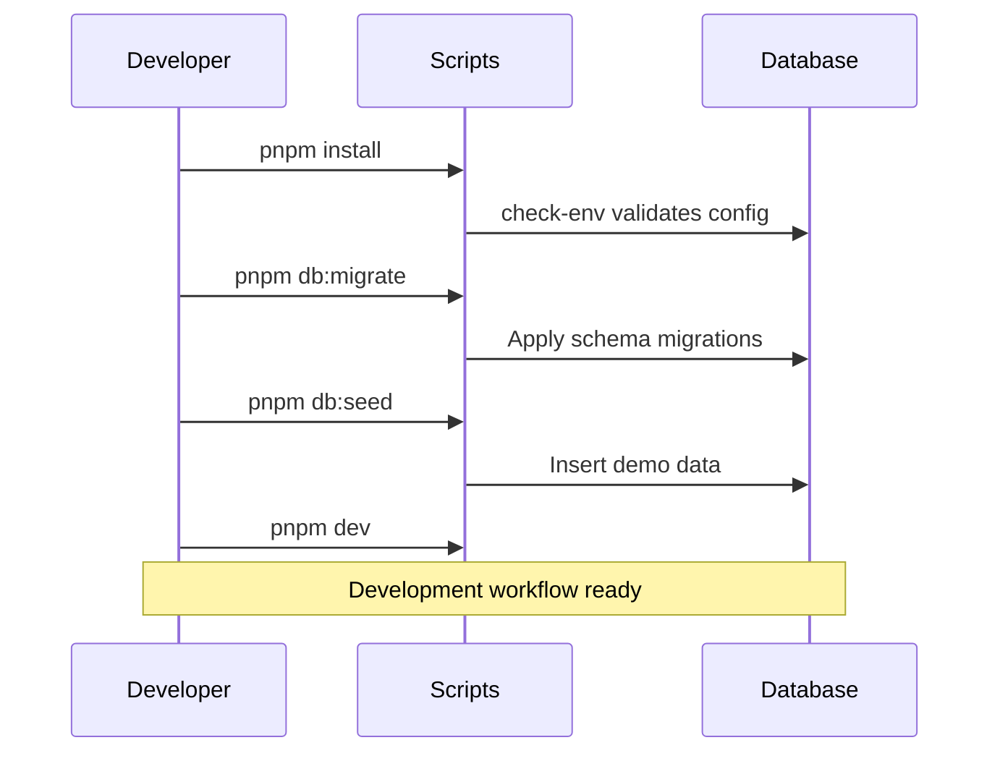

# סקירת סקריפטים

תיקיית `apps/web/scripts/` מכילה סקריפטים עזר לבנייה, ניהול מסד נתונים, ניהול תוכן ותחזוקת איכות קוד.

## קטגוריות סקריפטים



## סקריפטים לבנייה

### `build-migrate.ts`

מריץ העברות מסד נתונים בזמן הבנייה.

```bash
pnpm run build:migrate
```

רץ אוטומטית לפני בניית הייצור כדי לוודא שסכמת מסד הנתונים מעודכנת.

### `check-env.js`

מאמת שכל משתני הסביבה הנדרשים מוגדרים.

```bash
node scripts/check-env.js
```

מפסיק את הבנייה אם חסרים משתני סביבה קריטיים. סקריפטים רבים אחרים קוראים לו אוטומטית בתחילת הריצה.

### `update-cron.ts`

מעדכן הגדרת עבודות Cron ב-Vercel או Trigger.dev.

```bash
pnpm run update:cron
```

## סקריפטים למסד הנתונים

### `seed.ts`

ממלא את מסד הנתונים בנתוני הדגמה לפיתוח ובדיקות.

```bash
cd apps/web
pnpm run db:seed
```

#### נתונים שנוצרים על-ידי Seed

| סוג         | כמות | תיאור                                    |
|-------------|------|------------------------------------------|
| משתמשים     | 50   | תמהיל של לקוחות ומנהלים                  |
| חברות       | 20   | חברות לדוגמה עם פרופילים מלאים           |
| קטגוריות    | 10   | קטגוריות של הדירקטוריה                   |
| פריטים      | 100  | רשומות דירקטוריה לדוגמה                  |
| תגובות      | 200  | ביקורות ומשוב לדוגמה                     |

#### נתוני Seed למוצרי Stripe

| מוצר         | מחיר       | מחזור |
|--------------|------------|-------|
| Basic Plan   | $9/חודש    | חודשי |
| Pro Plan     | $29/חודש   | חודשי |
| Business     | $99/חודש   | חודשי |

### `clean-database.js`

**⚠️ פעולה הרסנית** — מוחק את כל הנתונים ממסד הנתונים. לפיתוח בלבד.

```bash
node scripts/clean-database.js
```

## סקריפטים לתוכן

### `clone.cjs`

משכפל מאגר CMS מבוסס-Git אל `.content/`.

```bash
node scripts/clone.cjs
```

משתמש ב-`DATA_REPOSITORY` מהסביבה לקביעת המאגר לשכפול.

### `sync-translations.js`

מסנכרן את כל קבצי התרגום עם המרחב הייחוסי האנגלי.

```bash
node scripts/sync-translations.js
```

ראה [תהליך עבודת תרגום](./translation-workflow.md) לפרטים מלאים.

## סקריפטים לאיכות קוד

### `lint.js`

מריץ ESLint עם הגדרת הפרויקט.

```bash
node scripts/lint.js
# או מתיקיית שורש ה-Monorepo:
pnpm lint
```

## התאמה ל-`package.json`

| npm script          | קובץ                            | תיאור                         |
|---------------------|---------------------------------|-------------------------------|
| `db:seed`           | `scripts/seed.ts`               | מילוי נתוני הדגמה             |
| `db:migrate`        | `drizzle-kit migrate`           | הרצת העברות                   |
| `generate:openapi`  | `scripts/generate-openapi.ts`   | יצירת תיעוד OpenAPI           |
| `sync:translations` | `scripts/sync-translations.js`  | סנכרון תרגומים                |

## תהליך עבודת פיתוח טיפוסי



## הוספת סקריפטים חדשים

בעת הוספת סקריפט חדש:

1. צור את הקובץ ב-`apps/web/scripts/`
2. השתמש ב-`.ts` עבור TypeScript, או ב-`.js`/`.cjs` עבור CommonJS
3. הוסף ערך מתאים בקטע `scripts` של `apps/web/package.json`
4. תעד את המטרה ואופן השימוש בתוך הסקריפט
5. הוסף בדיקות `check-env` אם הסקריפט תלוי במשתני סביבה
