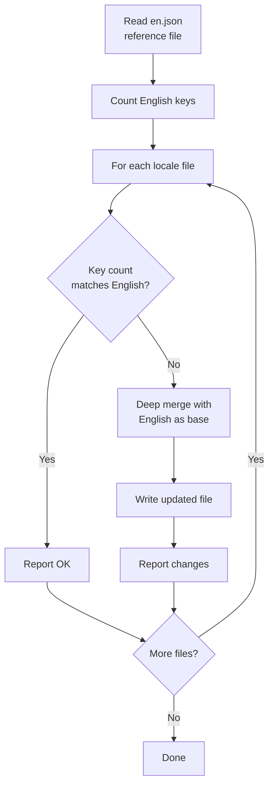
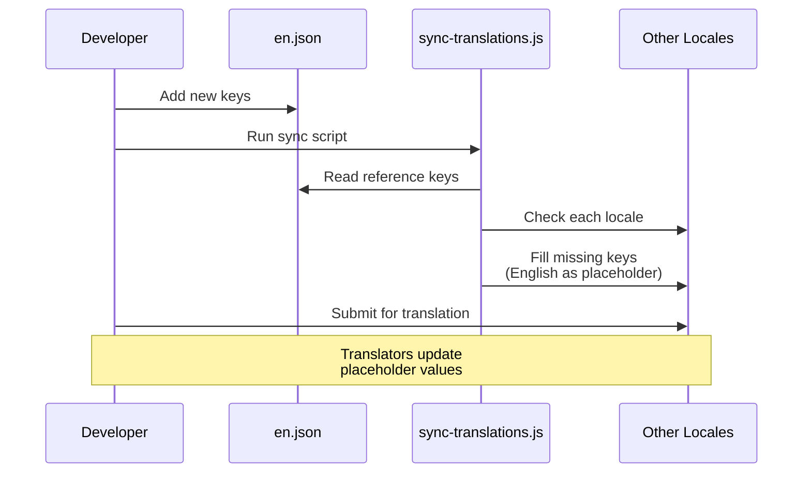

# תהליך עבודת תרגום

התבנית משתמשת ב-`next-intl` לבינאום (i18n) עם קבצי הודעות מבוססי-JSON. תהליך עבודת התרגום מבטיח שכל השפות הנתמכות מסונכרנות עם קובץ הייחוס האנגלי באמצעות סקריפט סנכרון אוטומטי.

## שפות נתמכות

התבנית מגיעה עם 20 שפות נתמכות:

| קוד  | שפה               | קוד  | שפה      |
|------|-------------------|------|----------|
| `en` | אנגלית (ייחוס)   | `ko` | קורית    |
| `ar` | ערבית             | `nl` | הולנדית  |
| `bg` | בולגרית           | `pl` | פולנית   |
| `de` | גרמנית            | `pt` | פורטוגזית|
| `es` | ספרדית            | `ru` | רוסית    |
| `fr` | צרפתית            | `th` | תאית     |
| `he` | עברית             | `tr` | טורקית   |
| `hi` | הינדי             | `uk` | אוקראינית|
| `id` | אינדונזית         | `vi` | וייטנאמית|
| `it` | איטלקית           | `ja` | יפנית    |

## מבנה הקבצים

```
messages/
├── en.json          # אנגלית (ייחוס - מקור האמת היחיד)
├── ar.json          # ערבית
├── bg.json          # בולגרית
├── de.json          # גרמנית
├── es.json          # ספרדית
├── fr.json          # צרפתית
├── he.json          # עברית
├── hi.json          # הינדי
├── id.json          # אינדונזית
├── it.json          # איטלקית
├── ja.json          # יפנית
├── ko.json          # קורית
├── nl.json          # הולנדית
├── pl.json          # פולנית
├── pt.json          # פורטוגזית
├── ru.json          # רוסית
├── th.json          # תאית
├── tr.json          # טורקית
├── uk.json          # אוקראינית
└── vi.json          # וייטנאמית
```

## סקריפט סנכרון תרגומים

הסקריפט `scripts/sync-translations.js` מבטיח שכל קובץ שפה מכיל את כל המפתחות המוגדרים ב-`en.json`.

### הרצת הסנכרון

```bash
node scripts/sync-translations.js
```

### אופן הפעולה



### אסטרטגיית מיזוג

הסנכרון משתמש במיזוג עמוק שבו תרגומים קיימים גוברים:

```javascript
function deepMerge(target, source) {
  const result = { ...source };  // Start with English (source)
  for (const key in target) {
    if (typeof target[key] === 'object' && !Array.isArray(target[key])) {
      result[key] = deepMerge(target[key], source[key] || {});
    } else {
      result[key] = target[key]; // Existing translation wins
    }
  }
  return result;
}
```

**התנהגות מרכזית:**

- מפתחות חסרים ממולאים בערכים אנגליים כמציינים-מקום
- תרגומים קיימים לעולם אינם נדרסים
- מבנים מקוננים מטופלים רקורסיבית
- מערכים מטופלים כערכי עלה (לא ממוזגים)

### פלט לדוגמה

```
English file has 342 translation keys

ar.json: 340/342 keys (missing 2)
  -> Updated ar.json with missing keys from English

bg.json: 342/342 keys - OK
de.json: 342/342 keys - OK
es.json: 338/342 keys (missing 4)
  -> Updated es.json with missing keys from English

Done!
```

## פורמט קובץ הודעות

קבצי תרגום משתמשים ב-JSON מקוונן עם גישה למפתחות בנקודה:

```json
{
  "common": {
    "loading": "Loading...",
    "error": "An error occurred",
    "save": "Save",
    "cancel": "Cancel"
  },
  "auth": {
    "signIn": "Sign In",
    "signOut": "Sign Out",
    "email": "Email Address",
    "password": "Password"
  },
  "navigation": {
    "home": "Home",
    "about": "About",
    "contact": "Contact"
  }
}
```

## שימוש בתרגומים בקוד

### קומפוננטים בצד הלקוח

```tsx
'use client';
import { useTranslations } from 'next-intl';

export function LoginButton() {
  const t = useTranslations('auth');
  return <button>{t('signIn')}</button>;
}
```

### קומפוננטים בצד השרת

```tsx
import { getTranslations } from 'next-intl/server';

export default async function Page() {
  const t = await getTranslations('common');
  return <h1>{t('loading')}</h1>;
}
```

### עם משתנים

```json
{
  "greeting": "Hello, {name}!",
  "itemCount": "You have {count, plural, =0 {no items} one {1 item} other {# items}}"
}
```

```tsx
const t = useTranslations('dashboard');
t('greeting', { name: 'John' });     // "Hello, John!"
t('itemCount', { count: 5 });         // "You have 5 items"
```

## הוספת שפה חדשה

בצע את הצעדים הבאים להוספת שפה חדשה:

### שלב 1: יצירת קובץ הודעות

```bash
# העתק את הקובץ האנגלי כנקודת התחלה
cp messages/en.json messages/NEW_LOCALE.json
```

### שלב 2: רישום השפה

הוסף את השפה להגדרת i18n:

```typescript
// i18n/config.ts (או מקביל)
export const locales = ['en', 'ar', 'de', ..., 'NEW_LOCALE'];
```

### שלב 3: תרגום התוכן

ערוך את `messages/NEW_LOCALE.json` והחלף מחרוזות אנגלית בערכים מתורגמים.

### שלב 4: הרצת סנכרון לאימות

```bash
node scripts/sync-translations.js
```

אם הקובץ מכיל את כל המפתחות יוצג "OK". מפתחות חסרים ימולאו במציינים-מקום אנגליים.

## הוספת מפתחות תרגום חדשים

בעת הוספת תכונות חדשות הדורשות טקסט למשתמש:

### שלב 1: הוספה לייחוס האנגלי

```json
// messages/en.json
{
  "newFeature": {
    "title": "New Feature",
    "description": "This is a new feature"
  }
}
```

### שלב 2: הרצת סנכרון

```bash
node scripts/sync-translations.js
```

פעולה זו תוסיף אוטומטית את המפתחות החדשים לכל קבצי השפה עם טקסט אנגלי כמציין-מקום.

### שלב 3: בקשת תרגומים

שתף את המפתחות שנוספו לאחרונה עם מתרגמים לכל שפה. הם צריכים רק לעדכן את ערכי המציין-מקום האנגליים.

## ספירת מפתחות

סקריפט הסנכרון סופר מפתחות בצורה רקורסיבית באובייקטים מקוננים:

```javascript
function countKeys(obj) {
  let count = 0;
  for (const key in obj) {
    if (typeof obj[key] === 'object' && !Array.isArray(obj[key])) {
      count += countKeys(obj[key]); // Recurse into nested objects
    } else {
      count++;                      // Count leaf values
    }
  }
  return count;
}
```

רק מחרוזות תרגום ברמת עלה נספרות, לא מפתחות קיבוץ ביניים.

## תמיכה בשפות RTL

התבנית תומכת בשפות הנקראות מימין לשמאל (RTL) כולל ערבית (`ar`) ועברית (`he`). פריסת RTL מטופלת אוטומטית דרך הגדרת השפה ותכונת CSS‏ `dir`.

## תרשים תהליך העבודה



## שיטות עבודה מומלצות

1. **תמיד שנה את `en.json` ראשון** — זה מקור האמת היחיד
2. **הרץ סנכרון לאחר כל שינוי אנגלי** — שומר על כל השפות מעודכנות
3. **לעולם אל תוסיף מפתחות ידנית לקבצים לא-אנגליים** — השתמש בסקריפט הסנכרון
4. **השתמש בקיבוצים מקוננים** — קבץ מפתחות לפי פיצ'ר או דף לנוחות ניהול
5. **הימנע ממחרוזות מקודדות** — תמיד השתמש ב-`useTranslations` או `getTranslations`
6. **בדוק פריסות RTL** — בדוק באופן קבוע את התצוגה בערבית ועברית
7. **השתמש במפתחות תיאוריים** — `auth.signInButton` במקום `auth.btn1`
