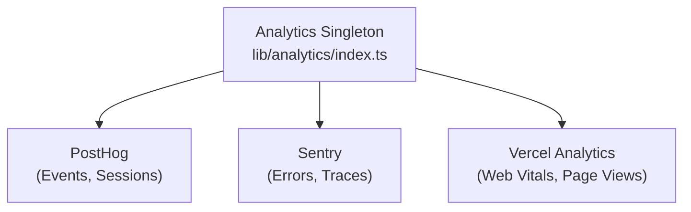

# מערכת אנליטיקה

התבנית Ever Works משתלבת עם **PostHog**, **Sentry** ו**Vercel Analytics** למעקב מקיף אחר אירועים, ניטור שגיאות, הקלטת ביקורים וניתוח ביצועים.

## אדריכלות



## שיעור אנליטיקס

מחלקת הליבה `Analytics` ב- `lib/analytics/index.ts` היא יחידה המנהלת אתחול ושיגור אירועים בין ספקים:

```typescript
class Analytics {
  private static instance: Analytics;
  private initialized: boolean;
  private exceptionTrackingProvider: ExceptionTrackingProvider;

  static getInstance(): Analytics;
  init(): void;
  trackEvent(name: string, properties?: EventProperties): void;
  trackPageView(url: string): void;
  identify(userId: string, properties?: UserProperties): void;
  reset(): void;
}
```

### פתרון ספק מעקב חריג

המערכת תומכת בתצורה גמישה של מעקב חריגים:

```typescript
type ExceptionTrackingProvider = 'sentry' | 'posthog' | 'both' | 'none';
```

הספק נקבע על ידי בדיקת זמינות:
1. קרא את ערך התצורה `EXCEPTION_TRACKING_PROVIDER` 2. ודא שהספק הנבחר מופעל
3. חזור לאלטרנטיבה הזמינה אם לא מוגדרת ראשית

## שילוב PostHog

### תצורה

```bash
NEXT_PUBLIC_POSTHOG_KEY=phc_xxx
NEXT_PUBLIC_POSTHOG_HOST=https://us.i.posthog.com

# Optional
NEXT_PUBLIC_POSTHOG_DEBUG=false
NEXT_PUBLIC_POSTHOG_SESSION_RECORDING=true
NEXT_PUBLIC_POSTHOG_AUTO_CAPTURE=true
NEXT_PUBLIC_POSTHOG_SAMPLE_RATE=1.0
NEXT_PUBLIC_POSTHOG_SESSION_RECORDING_SAMPLE_RATE=0.1
NEXT_PUBLIC_POSTHOG_EXCEPTION_TRACKING=true
```

### שירות API של PostHog

השירות בצד השרת, הממוקם ב- `lib/services/posthog-api.service.ts` , מספק נתוני ניתוח של מנהל מערכת:

```typescript
class PostHogApiService {
  constructor(); // Reads from analyticsConfig

  isConfigured(): boolean;
  async getTotalPageViews(days?: number): Promise<number>;
  async getTopPages(days?: number): Promise<PageData[]>;
  async getEventCounts(eventName: string, days?: number): Promise<number>;
}
```

**נדרש עבור גישה ל-API בצד השרת:**
```bash
POSTHOG_PERSONAL_API_KEY=phx_xxx
POSTHOG_PROJECT_ID=12345
```

### הוק בצד הלקוח

```typescript
import { useAnalytics } from '@/hooks/use-analytics';

const {
  trackEvent,      // (name: string, properties?: object) => void
  trackPageView,   // (url: string) => void
  identify,        // (userId: string, properties?: object) => void
} = useAnalytics();
```

### Geo Analytics Hook

```typescript
import { useGeoAnalytics } from '@/hooks/use-geo-analytics';

const {
  geoData,         // Geographic analytics data
  isLoading,
} = useGeoAnalytics();
```

## שילוב Sentry

### תצורה

```bash
NEXT_PUBLIC_SENTRY_DSN=https://xxx@sentry.io/xxx
SENTRY_AUTH_TOKEN=sntrys_xxx
SENTRY_ORG=your-org
SENTRY_PROJECT=your-project
NEXT_PUBLIC_SENTRY_EXCEPTION_TRACKING=true
```

Sentry מספק:
- **מעקב שגיאות** - לכידה אוטומטית של חריגים שלא טופלו
- **ניטור ביצועים** -- מעקב אחר עסקאות עבור מסלולי API וטעינת דפים
- **שידור חוזר של הפעלה** - הקלטת הפעלה אופציונלית

## Vercel Analytics

Vercel Analytics זמין באופן אוטומטי בעת פריסה ב-Vercel:

```bash
# Enabled by default on Vercel deployments
NEXT_PUBLIC_VERCEL_ANALYTICS=true
```

מספק:
- ** חיוני אינטרנט** -- ניטור חיוני רשת (LCP, FID, CLS).
- **צפיות בדף** - מעקב אוטומטי אחר צפיות בדף
- **תובנות קהל** - ניתוח גיאוגרפי ומכשיר

## מרכז השליטה של Admin Analytics

לוח המחוונים לניהול מספק ניתוח מצטבר באמצעות ה- `useAdminStats` :

```typescript
import { useAdminStats } from '@/hooks/use-admin-stats';

const {
  stats,           // Dashboard statistics
  isLoading,
} = useAdminStats();
```

הוו `useDashboardStats` מספק מדדים מפורטים יותר:

```typescript
import { useDashboardStats } from '@/hooks/use-dashboard-stats';

const {
  stats,           // { items, users, revenue, pageViews, ... }
  isLoading,
  refetch,
} = useDashboardStats();
```

## השבתת Analytics

ספקי Analytics מושבתים כאשר התצורה שלהם חסרה. לא נטען קוד מעקב אם משתני הסביבה המתאימים לא מוגדרים. זה מאפשר לתבנית לעבוד ללא כל ניתוח בפיתוח.
