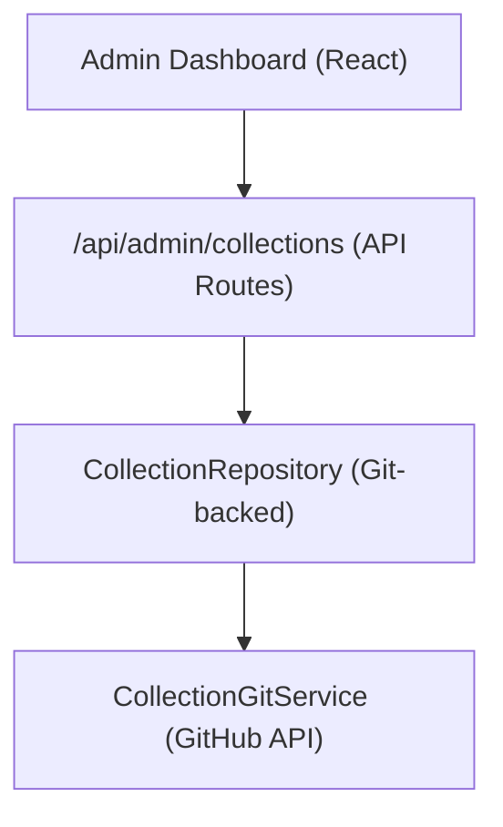

# מערכת גבייה

אוספים מאפשרים למנהלי מערכת לאצור קבוצות של פריטים להצגה באתר. המערכת מאחסנת נתוני איסוף במאגר CMS מבוסס Git ומספקת פעולות CRUD דרך לוח המחוונים של הניהול.

## אדריכלות



אוספים מאוחסנים כקבצים במאגר CMS מבוסס Git (מוגדר באמצעות `DATA_REPOSITORY` ), באמצעות `CollectionGitService` עבור פעולות קריאה/כתיבה דרך ה-API של GitHub.

## מודל נתונים

```typescript
interface Collection {
  id: string;
  name: string;
  slug: string;
  description?: string;
  isActive: boolean;
  items: string[];          // Array of item slugs
  item_count: number;       // Computed from items array
  displayOrder?: number;
  created_at: string;
  updated_at: string;
}
```

## מאגר אוסף

המאגר, הממוקם ב- `lib/repositories/collection.repository.ts` , מספק:

```typescript
class CollectionRepository {
  async findAll(options?: CollectionListOptions): Promise<Collection[]>;
  async findById(id: string): Promise<Collection | null>;
  async findBySlug(slug: string): Promise<Collection | null>;
  async create(data: CreateCollectionRequest): Promise<Collection>;
  async update(id: string, data: UpdateCollectionRequest): Promise<Collection>;
  async delete(id: string): Promise<void>;
  async assignItems(id: string, itemSlugs: string[]): Promise<void>;
}
```

### אפשרויות רשימה

```typescript
interface CollectionListOptions {
  search?: string;           // Filter by name
  includeInactive?: boolean; // Include inactive collections
  sortBy?: 'name' | 'item_count' | 'created_at';
  sortOrder?: 'asc' | 'desc';
  page?: number;
  limit?: number;
}
```

## הוק לניהול

```typescript
import { useAdminCollections } from '@/hooks/use-admin-collections';

const {
  collections,        // Collection[]
  total, page, totalPages, limit,
  isLoading, isSubmitting,
  createCollection,   // (data: CreateCollectionRequest) => Promise<boolean>
  updateCollection,   // (id: string, data: UpdateCollectionRequest) => Promise<boolean>
  deleteCollection,   // (id: string) => Promise<boolean>
  assignItems,        // (id: string, itemSlugs: string[]) => Promise<boolean>
  fetchAssignedItems, // (id: string) => Promise<Item[]>
  refetch, refreshData,
} = useAdminCollections({ page: 1, limit: 10, search: '' });
```

## נקודות קצה של ממשק API

| שיטה | נקודת קצה | תיאור |
|--------|--------|----------------|
| קבל | `/api/admin/collections` | רשימת אוספים (בעמודים) |
| פוסט | `/api/admin/collections` | צור אוסף חדש |
| PUT | `/api/admin/collections/:id` | עדכון אוסף |
| מחק | `/api/admin/collections/:id` | מחק אוסף |
| קבל | `/api/admin/collections/:id/items` | קבל פריטים שהוקצו |
| פוסט | `/api/admin/collections/:id/items` | הקצה פריטים לאוסף |

## תצוגה בצד הלקוח

ה- `useCollectionsExists` בודק אם קיימים אוספים פעילים, המשמשים לעיבוד מותנה:

```typescript
import { useCollectionsExists } from '@/hooks/use-collections-exists';
const { exists, isLoading } = useCollectionsExists();
```

## תצורה

אוספים דורשים את משתני הסביבה הבאים:

```bash
DATA_REPOSITORY=https://github.com/owner/repo   # Git CMS repository
GH_TOKEN=ghp_xxx                                  # GitHub API token
GITHUB_BRANCH=main                                # Branch for collection data
```

ה- `CollectionRepository` מנתח את כתובת האתר `DATA_REPOSITORY` כדי לחלץ את הבעלים והריפו של GitHub, ולאחר מכן משתמש באסימון לאימות API.
