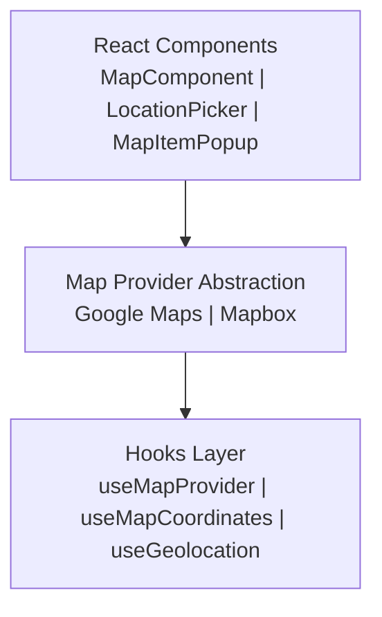

# מפות ותכונות מיקום

התבנית Ever Works תומכת במפות אינטראקטיביות עם שכבת הפשטה של ספק עבור **מפות Google** והן עבור **Mapbox**. המערכת כוללת קידוד גיאוגרפי, בחירת מיקום, קיבוץ סמנים ואיתור גיאוגרפי.

## אדריכלות



המודול `lib/maps/` מייצא מחדש את כל הסוגים והספקים:

```typescript
// lib/maps/index.ts
export * from './types';
export * from './providers';
```

## סוגי ליבה

### קואורדינטות

```typescript
interface Coordinates {
  latitude: number;
  longitude: number;
}

interface MapBounds {
  north: number;
  south: number;
  east: number;
  west: number;
}
```

### סמנים

```typescript
interface MapMarkerData {
  id: string;
  coordinates: Coordinates;
  title: string;
  icon?: string;
  category?: string;
  slug: string;              // Item slug for linking
  description?: string;
}

interface MapMarkerWithDistance extends MapMarkerData {
  distanceKm?: number;       // Distance from reference point
}
```

### אשכול

```typescript
interface MapClusterData {
  id: string;
  coordinates: Coordinates;
  count: number;
  markerIds: string[];
  expansionZoom: number;
}

interface ClusterOptions {
  radius?: number;           // Cluster radius in pixels (default: 60)
  maxZoom?: number;          // Max zoom for clustering (default: 16)
  minZoom?: number;          // Min zoom for clustering (default: 0)
  minPoints?: number;        // Min points per cluster (default: 2)
}
```

### נקודת מבט

```typescript
interface MapViewport {
  center: Coordinates;
  zoom: number;
  bounds?: MapBounds;
}
```

## אבזרי MapComponent

רכיב המפה הראשי מקבל קבוצה מקיפה של אביזרים:

```typescript
interface MapComponentProps {
  markers?: MapMarkerData[];
  center?: Coordinates;
  zoom?: number;                  // 1-20
  style?: MapStyle;               // 'streets' | 'satellite'
  className?: string;
  height?: string | number;
  width?: string | number;
  controls?: MapControlsConfig;
  enableClustering?: boolean;
  clusterOptions?: ClusterOptions;
  isLoading?: boolean;
  isDisabled?: boolean;
  error?: string | null;
  onMarkerClick?: (marker: MapMarkerData) => void;
  onClusterClick?: (cluster: MapClusterData) => void;
  onViewportChange?: (viewport: MapViewport) => void;
  onReady?: () => void;
  onError?: (error: Error) => void;
  ariaLabel?: string;
}
```

### בקרות מפה

```typescript
interface MapControlsConfig {
  showZoomControls?: boolean;
  showFullscreenControl?: boolean;
  showNavigationControl?: boolean;
  showScaleControl?: boolean;
}
```

## רכיב בוחר מיקום

רכיב טופס לבחירת מיקומים עם השלמה אוטומטית של כתובת, תצוגה מקדימה של מפה ובחירת אזור שירות:

```typescript
interface LocationPickerProps {
  value?: LocationPickerValue;
  onChange?: (location: LocationPickerValue) => void;
  errors?: { address?: string; coordinates?: string; serviceArea?: string };
  showMap?: boolean;
  showServiceArea?: boolean;
  showRemoteOption?: boolean;
  mapHeight?: string | number;
  isDisabled?: boolean;
  isLoading?: boolean;
}

interface LocationPickerValue {
  address?: string;
  city?: string;
  state?: string;
  country?: string;
  postalCode?: string;
  latitude?: number;
  longitude?: number;
  serviceArea?: 'local' | 'regional' | 'national' | 'global';
  isRemote?: boolean;
}
```

## ווים

### השתמש ב-MapProvider

קובע את ספק המפה הפעיל ואת מצב התצורה שלו:

```typescript
import { useMapProvider } from '@/hooks/use-map-provider';

const {
  provider,        // 'google' | 'mapbox'
  isConfigured,    // boolean -- API keys present
  isLoading,
  error,
  mapStyle,        // 'streets' | 'satellite'
} = useMapProvider();
```

### השתמש במפת קואורדינטות

מנהל את מרכז המפה ואת מצב הזום:

```typescript
import { useMapCoordinates } from '@/hooks/use-map-coordinates';

const {
  center, zoom, bounds,
  setCenter, setZoom, setBounds,
  fitToBounds,
} = useMapCoordinates(initialCenter, initialZoom);
```

### השתמש במיקום גיאוגרפי

מיקום גיאוגרפי של דפדפן עם טיפול בהרשאות:

```typescript
import { useGeolocation } from '@/hooks/use-geolocation';

const {
  coordinates,     // Coordinates | null
  error,           // 'PERMISSION_DENIED' | 'POSITION_UNAVAILABLE' | 'TIMEOUT' | 'NOT_SUPPORTED'
  isLoading,
  permission,      // PermissionState | null
} = useGeolocation();
```

### useLocationItems

מביא פריטים מסוננים לפי קרבה גיאוגרפית:

```typescript
import { useLocationItems } from '@/hooks/use-location-items';
const { items, isLoading } = useLocationItems(coordinates, radius);
```

### useUserLocation

מנהל את העדפת המיקום המאוחסן של המשתמש:

```typescript
import { useUserLocation } from '@/hooks/use-user-location';
const { location, setLocation, clearLocation } = useUserLocation();
```

## קידוד גיאוגרפי

התבנית מספקת קידוד גיאוגרפי דרך נקודת הקצה `/api/geocode` , תומכת הן בקידוד גיאוגרפי קדימה (כתובת לקואורדינטות) והן בקידוד גיאוגרפי הפוך (קואורדינטות לכתובת). שירות הקידוד הגיאוגרפי נמצא בכתובת `lib/services/geocoding/` .

## השלמה אוטומטית של כתובת

```typescript
interface AddressSuggestion {
  id: string;
  mainText: string;          // Street address
  secondaryText: string;     // City, state
  fullAddress: string;
  coordinates?: Coordinates;
}
```

## תצורה

```bash
# Google Maps
NEXT_PUBLIC_GOOGLE_MAPS_API_KEY=your_key
NEXT_PUBLIC_GOOGLE_MAPS_MAP_ID=your_map_id

# Mapbox (alternative)
NEXT_PUBLIC_MAPBOX_ACCESS_TOKEN=your_token
```

הספק נבחר אוטומטית על סמך איזה מפתח API מוגדר.
