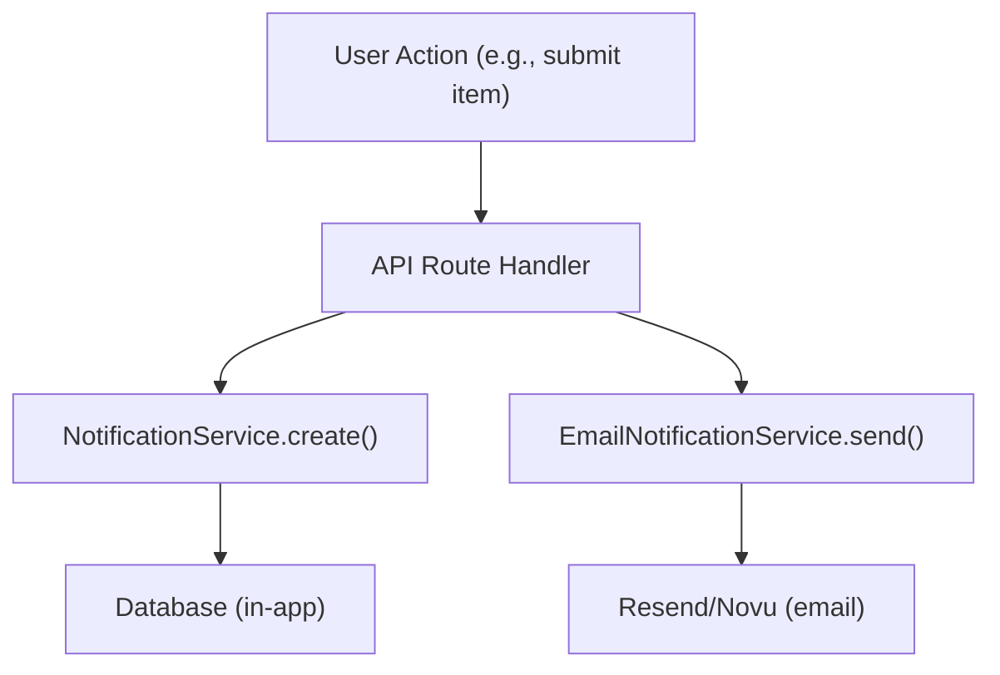

# מערכת התראות

תבנית Ever Works מספקת הן הודעות בתוך האפליקציה (מאוחסנות במסד הנתונים) והן הודעות דוא"ל (דרך שלח מחדש או Novu). הודעות מופעלות על ידי אירועי מערכת כגון הגשת פריטים, דוחות תוכן וכישלונות תשלום.

## התראות בתוך האפליקציה

### שירות הודעות

השירות, הממוקם ב- `lib/services/notification.service.ts` , מנהל הודעות מגובות מסד נתונים:

```typescript
class NotificationService {
  // Create a generic notification
  static async create(data: CreateNotificationData);

  // Convenience methods for specific events
  static async createItemSubmissionNotification(adminUserId, itemId, itemName, submittedBy);
  static async createCommentReportedNotification(adminUserId, commentId, content, reportedBy);
  static async createItemReportedNotification(adminUserId, itemId, itemName, reportedBy);
  static async createUserRegisteredNotification(adminUserId, userName, userEmail);
  static async createPaymentFailedNotification(userId, subscriptionId, errorMessage);
  static async createSystemAlertNotification(adminUserId, title, message);
}
```

### סוגי הודעות

```typescript
type NotificationType =
  | "item_submission"      // New item requires admin review
  | "comment_reported"     // Comment flagged by user
  | "item_reported"        // Item flagged by user
  | "user_registered"      // New user account created
  | "payment_failed"       // Subscription payment failed
  | "system_alert";        // Generic system notification
```

### מבנה נתוני הודעה

```typescript
interface CreateNotificationData {
  userId: string;                    // Recipient user ID
  type: NotificationType;
  title: string;
  message: string;
  data?: Record<string, unknown>;    // Arbitrary metadata (actionUrl, etc.)
}
```

### סטטיסטיקת התראות

```typescript
interface NotificationStats {
  total: number;
  unread: number;
  byType: Record<string, number>;
}
```

### הוק לניהול

```typescript
import { useAdminNotifications } from '@/hooks/use-admin-notifications';

const {
  notifications,     // Notification[]
  stats,             // NotificationStats
  isLoading,
  markAsRead,        // (id: string) => Promise<boolean>
  markAllAsRead,     // () => Promise<boolean>
  deleteNotification,// (id: string) => Promise<boolean>
  refetch,
} = useAdminNotifications();
```

## הודעות דוא"ל

### EmailNotificationService

שירות זה, הממוקם ב- `lib/services/email-notification.service.ts` , מטפל במשלוח דוא"ל עסקאות:

```typescript
class EmailNotificationService {
  // Send notification emails for various events
  static async sendItemSubmissionEmail(adminEmail, itemData);
  static async sendPaymentSuccessEmail(userEmail, paymentData);
  static async sendPaymentFailedEmail(userEmail, paymentData);
  static async sendSubscriptionCancelledEmail(userEmail, subscriptionData);
  static async sendTrialEndingEmail(userEmail, trialData);
  static async sendWelcomeEmail(userEmail, userData);
}
```

### תצורת ספק הדוא"ל

התבנית תומכת בשני ספקי דוא"ל:

**שלח מחדש** (ברירת מחדל):
```bash
RESEND_API_KEY=re_xxx
```

**נובו**:
```bash
NOVU_API_KEY=xxx
NOVU_TEMPLATE_ID=xxx        # Optional: custom template ID
NOVU_BACKEND_URL=xxx         # Optional: self-hosted Novu URL
```

בחירת הספק מוגדרת בתצורת האתר:
```json
{
  "mail": {
    "provider": "resend",
    "default_from": "noreply@yourdomain.com"
  }
}
```

### שירות דוא"ל תשלום

לתת-מערכת התשלומים יש שירות דואר אלקטרוני משלה ( `lib/payment/services/payment-email.service.ts` ) עם עוזרים לעיצוב נתוני תשלום:

```typescript
import {
  paymentEmailService,
  extractCustomerInfo,    // Extract customer data from webhook event
  formatAmount,           // Format currency amounts
  formatPaymentMethod,    // Format card details
  formatBillingDate,      // Format billing period dates
  getPlanName,            // Map plan ID to display name
  getBillingPeriod,       // Format billing interval
} from '@/lib/payment/services/payment-email.service';
```

## העדפות הודעה

משתמשים יכולים לנהל את העדפות ההתראות שלהם דרך ממשק ההגדרות. ההעדפות קובעות אילו סוגי הודעות מפעילים משלוח דוא"ל בעוד שהודעות בתוך האפליקציה נוצרות תמיד.

## זרימת אירועים



## תיעוד קשור

- [דוחות וניהול תוכן](./reports-moderation.md) -- התראות המופעלות על ידי דוחות
- [Payment Webhooks](../payment/webhooks.md) -- הודעות דוא"ל הקשורות לתשלום
