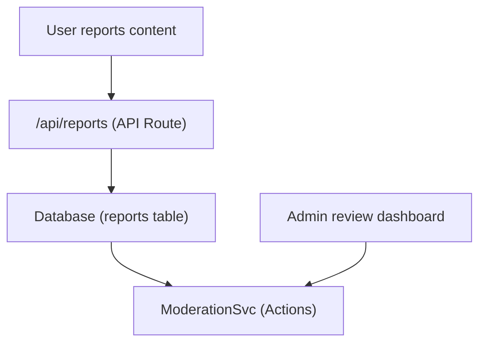

# דוחות וניהול תוכן

התבנית Ever Works כוללת מערכת דיווח וניהול תוכן המאפשרת למשתמשים לסמן תוכן בלתי הולם ולמנהלי מערכת לנקוט פעולה על פריטים והערות שדווחו.

## אדריכלות



## סוגי תוכן

המערכת תומכת בדיווח על שני סוגי תוכן:

```typescript
enum ReportContentType {
  ITEM = 'item',
  COMMENT = 'comment',
}
```

## שירות ניהול

השירות ממוקם ב- `lib/services/moderation.service.ts` ומספק פעולות ניהול:

### החלטה של בעל תוכן

```typescript
async function getContentOwner(
  contentType: ReportContentTypeValues,
  contentId: string
): Promise<ContentOwnerResult>;
// Returns: { success: boolean, userId?: string, error?: string }
```

פותר את המחבר של תוכן שדווח על ידי חיפוש הערות דרך `getCommentById()` או פריטים באמצעות `ItemRepository.findById()` .

### פעולות מתן

| פעולה | תיאור | אפקט |
|--------|-------------|--------|
| **הסר תוכן** | מחק את הפריט המדווח או ההערה | תוכן הוסר, היסטוריה נרשמה |
| **הזהיר משתמש** | הגדל את ספירת האזהרות | מונה אזהרה הוגדל |
| **השעיית משתמש** | השעיית חשבון זמנית | הגישה לחשבון מוגבלת |
| **חסום משתמש** | חסום חשבון לצמיתות | חשבון מוגבל לצמיתות |
| **סגור דוח** | סמן את הדוח כפתור ללא פעולה | הדוח נסגר |

### יישום פעולה

כל פעולה יוצרת ערך היסטוריית ניהול ועשויה להפעיל הודעות דוא"ל:

```typescript
// Example: Remove content
async function removeContent(
  contentType: ReportContentTypeValues,
  contentId: string,
  reportId: string,
  adminId: string
): Promise<ModerationResult>;
```

השירות מוסר ל:
- `deleteComment()` -- להסרת הערות
- `ItemRepository` -- להסרת פריט
- `createModerationHistory()` -- לשביל ביקורת
- `incrementWarningCount()` -- לאזהרות משתמשים
- `suspendUserQuery()` / `banUserQuery()` -- עבור פעולות בחשבון
- `EmailNotificationService` -- עבור הודעות דוא"ל של משתמשים

## הוק לניהול

```typescript
import { useAdminReports } from '@/hooks/use-admin-reports';

const {
  reports,           // Report[]
  total, page, totalPages,
  isLoading, isSubmitting,
  resolveReport,     // (id, action, reason?) => Promise<boolean>
  dismissReport,     // (id, reason?) => Promise<boolean>
  deleteReport,      // (id) => Promise<boolean>
  refetch, refreshData,
} = useAdminReports({ page: 1, limit: 10 });
```

## זרימת עבודה של ניהול

1. **משתמש מדווח על תוכן** -- בוחר סיבה ושולח דרך ממשק ה-API של הדוחות
2. **התראת אדמין** -- `NotificationService.createItemReportedNotification()` או `createCommentReportedNotification()` מתריעות על מנהלי מערכת
3. **ביקורות מנהלים** -- צפיות בפרטי הדוח במרכז השליטה של מנהל המערכת
4. **המנהל נוקט בפעולה** -- בוחר מתוך: להסיר תוכן, להזהיר משתמש, להשעות, לחסום או לדחות
5. **היסטוריה נרשמה** -- `createModerationHistory()` מתעד את הפעולה עם מזהה מנהל מערכת, חותמת זמן וסיבה
6. **התראה על ידי משתמש** -- הודעת אימייל שנשלחה לבעל התוכן לגבי הפעולה שננקטה

## פעולות ניהול Enum

```typescript
enum ModerationAction {
  REMOVE_CONTENT = 'remove_content',
  WARN_USER = 'warn_user',
  SUSPEND_USER = 'suspend_user',
  BAN_USER = 'ban_user',
  DISMISS = 'dismiss',
}
```

## נקודות קצה של ממשק API

| שיטה | נקודת קצה | תיאור |
|--------|--------|----------------|
| פוסט | `/api/reports` | שלח דוח חדש |
| קבל | `/api/admin/reports` | רשימת דוחות (מנהל, מעומד) |
| פוסט | `/api/admin/reports/:id/resolve` | פתרון דוח עם פעולה |
| פוסט | `/api/admin/reports/:id/dismiss` | ביטול דיווח |
| מחק | `/api/admin/reports/:id` | מחק דוח |

## תיעוד קשור

- [מערכת התראות](./notifications.md) -- כיצד נמסרות הודעות דוחות
- [הצבעות והערות](./voting-comments.md) -- מערכת הערות שניתן לדווח עליה
