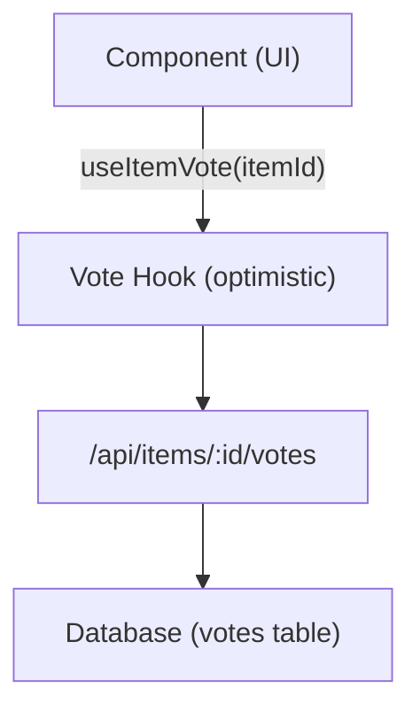

# מערכת הצבעה והערות

תבנית Ever Works כוללת מערכת הצבעה והערות מלאה המאפשרת למשתמשים להצביע בעד/להצביע בעד פריטים, להשאיר ביקורות עם דירוגי כוכבים ולעסוק בתוכן. שתי המערכות משתמשות בעדכונים אופטימיים עבור משוב מיידי של ממשק המשתמש.

## מערכת הצבעה

### אדריכלות

מערכת ההצבעה משתמשת במודל הצבעה לפי פריט שבו כל משתמש מאומת יכול להצביע קול אחד (למעלה או למטה) לכל פריט. המערכת עוקבת אחר ספירת הקולות נטו והצבעות משתמש בודדים.



### useItemVote Hook

```typescript
import { useItemVote } from '@/hooks/use-item-vote';

const {
  voteCount,       // number -- net vote count
  userVote,        // 'up' | 'down' | null
  isLoading,       // boolean
  handleVote,      // (type: 'up' | 'down') => void
  refreshVotes,    // () => void
} = useItemVote(itemId);
```

### התנהגות הצבעה

| מצב נוכחי | פעולה | תוצאה |
|-------------|--------|--------|
| אין הצבעה | לחץ למעלה | הצבעה בעד (+1) |
| אין הצבעה | לחץ למטה | הצבעה כלפי מטה (-1) |
| הצביע בעד | לחץ למעלה | הסר הצבעה (החלפת מצב) |
| הצביע בעד | לחץ למטה | עבור להצבעה מטה (-2 נטו) |
| הצביע נגד | לחץ למטה | הסר הצבעה (החלפת מצב) |
| הצביע נגד | לחץ למעלה | עבור להצבעה בעד (+2 נטו) |

### עדכונים אופטימיים

וו ההצבעה מיישם עדכונים אופטימיים עם החזרה לאחור:

1. **onMutate** -- בטל שאילתות יוצאות, צילום מצב נוכחי, החל עדכון אופטימי
2. **onSuccess** -- החלף נתונים אופטימיים בתגובת שרת
3. **onError** -- חזור לצילום מצב, הראה טוסט שגיאה

### אימות

משתמשים לא מאומתים שמנסים להצביע רואים מודל כניסה דרך `useLoginModal` :

```typescript
if (!user) {
  loginModal.onOpen('Please sign in to vote on this item');
  throw new Error('Authentication required');
}
```

### ניהול מטמון

קרס השירות `useVoteCache` מספק פעולות מטמון חוצות רכיבים:

```typescript
import { useVoteCache } from '@/hooks/use-item-vote';

const {
  invalidateAllVotes,     // () => void
  invalidateItemVotes,    // (itemId: string) => void
  clearVoteCache,         // () => void
  prefetchItemVotes,      // (itemId: string) => Promise<void>
} = useVoteCache();
```

## מערכת הערות

### אדריכלות

הערות תומכות בפעולות CRUD מלאות עם דירוגי כוכבים, ניהול ועדכונים בזמן אמת.

### השתמש ב-Comments Hook

```typescript
import { useComments } from '@/hooks/use-comments';

const {
  comments,              // CommentWithUser[]
  isPending,
  createComment,         // ({ content, itemId, rating }) => Promise
  isCreating,
  updateComment,         // ({ commentId, content?, rating? }) => Promise
  isUpdating,
  deleteComment,         // (commentId) => Promise
  isDeleting,
  rateComment,           // ({ commentId, rating }) => void
  isRatingComment,
  updateCommentRating,   // ({ commentId, rating }) => void
  isUpdatingRating,
  commentRating,         // number
  isLoadingRating,
} = useComments(itemId);
```

### מודל נתוני תגובה

כל הערה כוללת:
- `id` -- מזהה ייחודי
- `content` -- טקסט תגובה
- `rating` -- דירוג כוכבים אופציונלי (1-5)
- `userId` -- התייחסות מחבר
- `itemId` -- פריט משויך
- `user` -- נתוני משתמש מאוכלסים (שם, אימייל, תמונה)
- `createdAt` / `updatedAt` -- חותמות זמן

### שילוב דירוג

הערות ודירוגים משולבים באופן הדוק:
- יצירת הערה עם דירוג מעדכנת את הדירוג המצטבר של הפריט
- עריכת דירוג הערה מפעילה חישוב מחדש
- השאילתה `["item-rating", itemId]` מאוחזרת לאחר כל מוטציה של הערה

### אירועים חוצי רכיבים

מערכת ההערות שולחת אירועי DOM מותאמים אישית עבור תיאום בין רכיבים:

```typescript
const COMMENT_MUTATION_EVENT = "comment:mutated";
window.dispatchEvent(new CustomEvent(COMMENT_MUTATION_EVENT, { detail: comment }));
```

רכיבים אחרים יכולים להאזין לשינויים בהערות ללא צימוד ישיר של React Query.

### ניהול מנהל

ה-hook `useAdminComments` מספק ניהול הערות ברמת המנהל:

```typescript
import { useAdminComments } from '@/hooks/use-admin-comments';

const {
  comments,         // AdminCommentItem[]
  totalComments,
  totalPages,
  isDeleting,       // string | null (ID of comment being deleted)
  deleteComment,    // (id: string) => Promise<boolean>
} = useAdminComments({ page: 1, limit: 10, search: '' });
```

### נקודות קצה של ממשק API

| שיטה | נקודת קצה | תיאור |
|--------|--------|----------------|
| קבל | `/api/items/:id/comments` | אחזר הערות לפריט |
| פוסט | `/api/items/:id/comments` | צור תגובה חדשה |
| PUT | `/api/items/:id/comments/:commentId` | עדכן תגובה |
| מחק | `/api/items/:id/comments/:commentId` | מחק תגובה |
| פוסט | `/api/items/:id/comments/rating` | דרג תגובה |
| PUT | `/api/items/:id/comments/rating` | עדכון דירוג הערות |
| קבל | `/api/items/:id/comments/rating` | קבל דירוג מצטבר |

## שילוב דגל תכונה

גם ההצבעות וגם ההערות מכבדות דגלים:

```typescript
const flags = getFeatureFlags();
// flags.ratings -- Controls star rating display
// flags.comments -- Controls comment section visibility
```

כאשר מסד הנתונים אינו מוגדר ( `DATABASE_URL` חסר), תכונות אלו מושבתות אוטומטית.
