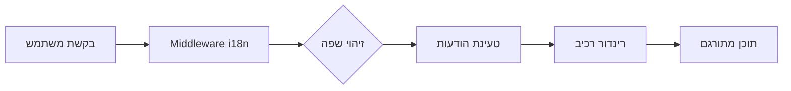

# סקירת בינאום

Ever Works תוכנן עם בינאום בראש סדר העדיפויות, ותומך במספר שפות באמצעות `next-intl`.

## 🌍 שפות נתמכות

התבנית כוללת תמיכה מובנית עבור:

- 🇬🇧 **אנגלית** (en) – שפת ברירת המחדל
- 🇫🇷 **צרפתית** (fr)
- 🇪🇸 **ספרדית** (es)
- 🇩🇪 **גרמנית** (de)
- 🇨🇳 **סינית** (zh)
- 🇸🇦 **ערבית** (ar)
- 🇧🇬 **בולגרית** (bg)
- 🇳🇱 **הולנדית** (nl)
- 🇮🇱 **עברית** (he)
- 🇮🇹 **איטלקית** (it)
- 🇵🇱 **פולנית** (pl)
- 🇵🇹 **פורטוגזית** (pt)
- 🇷🇺 **רוסית** (ru)

## כיצד זה עובד

### לוקליזציה מבוססת URL

Ever Works משתמש בזיהוי שפה מבוסס URL:

```
https://yoursite.com/en/about    → אנגלית
https://yoursite.com/fr/about    → צרפתית
https://yoursite.com/es/about    → ספרדית
```

### זיהוי שפה אוטומטי

המערכת אוטומטית:
1. מזהה את שפת הדפדפן של המשתמש
2. מפנה ללוקאל המתאים
3. זוכרת את העדפות השפה של המשתמש
4. חוזרת לשפת ברירת המחדל (אנגלית)

## ארכיטקטורת תרגום



## קבצי תרגום

תרגומים מאוחסנים בקבצי JSON:

```
messages/
├── en.json    # אנגלית
├── fr.json    # צרפתית
├── es.json    # ספרדית
├── de.json    # גרמנית
├── zh.json    # סינית
└── ar.json    # ערבית
```

## דוגמה מהירה

```typescript
import { useTranslations } from 'next-intl';

export function MyComponent() {
  const t = useTranslations('common');

  return (
    <div>
      <h1>{t('welcome')}</h1>
      <p>{t('description')}</p>
    </div>
  );
}
```

## תכונות

### ✅ כיסוי תרגום מלא
- רכיבי UI
- תוויות טפסים והודעות אימות
- תבניות דוא"ל
- הודעות שגיאה
- מטה-נתוני SEO

### ✅ תמיכת RTL
- פריסת RTL אוטומטית לערבית ועברית
- שיקוף רכיבי UI
- יישור טקסט נכון

### ✅ עיצוב תאריכים ומספרים
- פורמטי תאריך ספציפיים לשפה
- עיצוב מטבע
- עיצוב מספרים

### ✅ ריבוי
- צורות ריבוי אוטומטיות
- כללים ספציפיים לשפה

## הצעדים הבאים

- [מדריך תרגום ←](./translation-guide) – למד כיצד להוסיף ולנהל תרגומים
- [התחלה](/getting-started) – הגדר את הפרויקט שלך
- [התאמה אישית](/guides/customization) – התאם אישית את האתר שלך

## צריך עזרה?

בקר ב[דף התמיכה](/advanced-guide/support) שלנו לעזרה עם בינאום.
