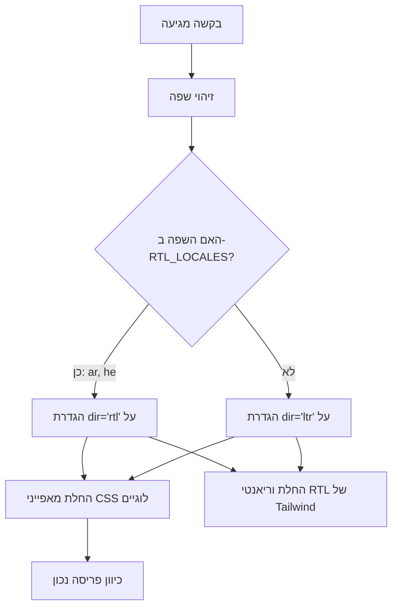

# תמיכה ב-RTL (מימין לשמאל)

התבנית מספקת תמיכה מלאה בשפות עם כיוון טקסט מימין לשמאל (RTL), כגון ערבית ועברית. דף זה מתעד כיצד זיהוי RTL פועל, כיצד כיוון הפריסה מוחל, וכיצד רכיבים מותאמים להקשרי RTL.

## סקירת ארכיטקטורה



## קבצי מקור

| קובץ | מטרה |
|------|---------|
| `lib/constants.ts` | הגדרת רשימת שפות RTL |
| `app/layout.tsx` | פריסת שורש עם תכונת `dir` |
| `components/language-switcher.tsx` | מפת שפות עם מטא-נתוני `isRTL` |

## תצורת שפות RTL

```typescript
export const RTL_LOCALES: readonly Locale[] = ['ar', 'he'] as const;
```

## כיצד כיוון מוחל

### זיהוי בפריסת שורש

```typescript
export default async function RootLayout({ children }) {
  const locale = await getLocale();
  const dir = RTL_LOCALES.includes(locale as Locale) ? 'rtl' : 'ltr';

  return (
    <html lang={locale} dir={dir} suppressHydrationWarning>
      <body className={`${getFontClassNames(locale)} antialiased`}>
        {children}
      </body>
    </html>
  );
}
```

## אסטרטגיות CSS עבור RTL

### 1. מאפייני CSS לוגיים

| מאפיין פיזי | מאפיין לוגי | ערך LTR | ערך RTL |
|-------------------|-----------------|-------------|-------------|
| `margin-left` | `margin-inline-start` | שוליים שמאל | שוליים ימין |
| `margin-right` | `margin-inline-end` | שוליים ימין | שוליים שמאל |
| `padding-left` | `padding-inline-start` | ריווח שמאל | ריווח ימין |
| `text-align: left` | `text-align: start` | יישור שמאל | יישור ימין |
| `left` | `inset-inline-start` | מיקום שמאל | מיקום ימין |

### 2. תמיכת RTL ב-Tailwind CSS

```html
<div class="ml-4 rtl:mr-4 rtl:ml-0">
  תוכן עם שוליים מודעי כיוון
</div>

<svg class="rtl:rotate-180">
  <path d="M1 9 4-4-4-4" />
</svg>
```

### 3. כלי Tailwind לוגיים

```html
<div class="ps-4">  <!-- padding-inline-start: 1rem -->
<div class="pe-4">  <!-- padding-inline-end: 1rem -->
<div class="ms-4">  <!-- margin-inline-start: 1rem -->
<div class="me-4">  <!-- margin-inline-end: 1rem -->
```

## בעיות RTL נפוצות

| בעיה | סיבה | פתרון |
|-------|-------|-----|
| יישור טקסט שגוי | שימוש ב-`text-left` במקום `text-start` | השתמש במאפיינים לוגיים |
| אייקונים לא משוקפים | חסר `rtl:rotate-180` על אייקונים כיווניים | הוסף וריאנט RTL |
| שוליים בצד הלא נכון | שימוש ב-`ml-*` במקום `ms-*` | השתמש בכלי Tailwind לוגיים |

## הוספת שפת RTL חדשה

1. **הוסף את השפה** ל-`LOCALES` ב-`lib/constants.ts`
2. **הוסף ל-`RTL_LOCALES`**
3. **צור קובץ הודעות** `messages/ur.json`
4. **הוסף ערך למפת השפות** ב-`components/language-switcher.tsx`
5. **הוסף SVG דגל** ב-`public/flags/ur.svg`
6. **בדוק את הפריסה ביסודיות** במצב RTL

## שיטות עבודה מומלצות

1. **העדף מאפייני CSS לוגיים** על פני מאפיינים פיזיים
2. **השתמש ב-`dir="rtl"` על `<html>`** (כבר מטופל על ידי פריסת השורש)
3. **בדוק עם תוכן ערבי/עברי אמיתי**, לא אנגלי במצב RTL
4. **אל תשקף תמונות דקורטיביות** או לוגואים של המותג
