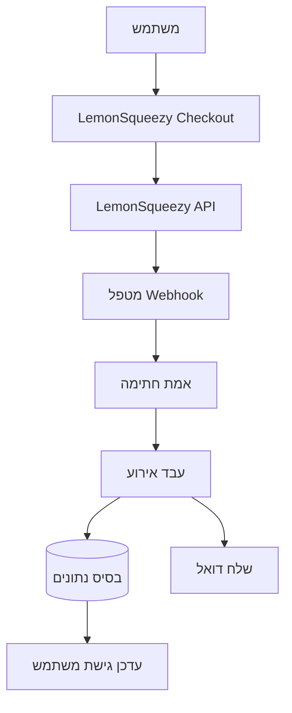

# הגדרת LemonSqueezy

מדריך זה מסביר כיצד להגדיר את LemonSqueezy כספק תשלומים ביישום Ever Works.

## סקירה כללית

LemonSqueezy היא פלטפורמת merchant of record שמפשטת:

- 💰 תשלומים גלובליים עם ציות מס אוטומטי
- 🌍 תמיכה ב-135+ מדינות
- 📊 הגנה מובנית מפני הונאות
- 🔄 ניהול מנויים
- 💳 שיטות תשלום מרובות
- 📧 קבלות דואל אוטומטיות

:::tip למה LemonSqueezy?
LemonSqueezy פועלת כ-merchant of record, ומטפלת אוטומטית בכל ציות המס, מע"מ ומס מכירה. משמעות הדבר היא שאינך צריך להירשם למסים במדינות שונות.
:::

## משתני סביבה נדרשים

הוסף משתנים אלה לקובץ `.env.local` שלך:

```env
# הגדרת LemonSqueezy
LEMONSQUEEZY_API_KEY=your_api_key_here
LEMONSQUEEZY_WEBHOOK_SECRET=your_webhook_secret_here
LEMONSQUEEZY_STORE_ID=your_store_id_here

# מזהה מוצר/גרסה (אופציונלי)
NEXT_PUBLIC_LEMONSQUEEZY_PRO_VARIANT_ID=variant_id_here
NEXT_PUBLIC_LEMONSQUEEZY_SPONSOR_VARIANT_ID=variant_id_here
```

## הגדרת לוח הבקרה של LemonSqueezy

### שלב 1: צור את החנות שלך

1. הירשם ב-[LemonSqueezy](https://lemonsqueezy.com)
2. צור חנות חדשה
3. מלא את הגדרות החנות (שם, מטבע וכו')
4. העתק את **מזהה החנות** מה-URL או ההגדרות

### שלב 2: צור מוצרים

1. עבור ל**מוצרים** → **מוצר חדש**
2. צור את רמות התמחור שלך:

| מוצר | מחיר | סוג | תיאור |
|------|------|-----|-------|
| **תוכנית Pro** | $10/חודש | מנוי | תכונות מתקדמות |
| **תוכנית נותן חסות** | $20 | חד-פעמי | תמיכה פרמיום |

3. לכל מוצר, צור **גרסאות** עם מחירים ספציפיים
4. העתק את **מזהה הגרסה** לכל אפשרות תמחור

### שלב 3: קבל מפתח API

1. עבור ל**הגדרות** → **API**
2. צור מפתח API חדש
3. העתק את מפתח ה-API (מתחיל עם `ls_`)
4. הוסף אותו ל-`.env.local` בתור `LEMONSQUEEZY_API_KEY`

### שלב 4: הגדר Webhooks

1. עבור ל**הגדרות** → **Webhooks**
2. לחץ על **צור Webhook**
3. הגדר את ה-webhook:
   - **URL**: `https://הדומיין-שלך.com/api/lemonsqueezy/webhook`
   - **אירועים**: בחר את כל אירועי המנוי וההזמנה
   - **סוד**: ייצר מפתח סודי

4. העתק את **סוד ה-Webhook** והוסף אותו ל-`.env.local`

#### אירועים מומלצים

בחר את האירועים האלה בהגדרת ה-webhook:

- ✅ `subscription_created` - מנוי חדש
- ✅ `subscription_updated` - שינויי מנוי
- ✅ `subscription_cancelled` - ביטול
- ✅ `subscription_payment_success` - תשלום מוצלח
- ✅ `subscription_payment_failed` - תשלום נכשל
- ✅ `subscription_trial_will_end` - תקופת ניסיון מסתיימת
- ✅ `order_created` - רכישה חד-פעמית
- ✅ `order_refunded` - החזר כספי עובד

## נקודת קצה של Webhook

ה-Webhook זמין ב: `/api/lemonsqueezy/webhook`

### מיפוי אירועים נתמך

| אירוע LemonSqueezy | אירוע פנימי | תיאור |
|-------------------|------------|-------|
| `subscription_created` | `SUBSCRIPTION_CREATED` | מנוי חדש נוצר |
| `subscription_updated` | `SUBSCRIPTION_UPDATED` | מנוי עודכן |
| `subscription_cancelled` | `SUBSCRIPTION_CANCELLED` | מנוי בוטל |
| `subscription_payment_success` | `SUBSCRIPTION_PAYMENT_SUCCEEDED` | תשלום הצליח |
| `subscription_payment_failed` | `SUBSCRIPTION_PAYMENT_FAILED` | תשלום נכשל |
| `subscription_trial_will_end` | `SUBSCRIPTION_TRIAL_ENDING` | תקופת ניסיון מסתיימת בקרוב |
| `order_created` | `PAYMENT_SUCCEEDED` | תשלום חד-פעמי |
| `order_refunded` | `REFUND_SUCCEEDED` | החזר כספי עובד |

## מימוש

### ארכיטקטורת מערכת התשלומים



### תכונות

#### אבטחה

- ✅ אימות חתימת HMAC (SHA-256)
- ✅ אימות סוד ה-webhook
- ✅ טיפול מקיף בשגיאות
- ✅ רישום בקשות

#### פונקציונליות

- ✅ ניהול מחזור חיי מנוי
- ✅ עיבוד תשלומים אוטומטי
- ✅ התראות דואל
- ✅ סנכרון בסיס נתונים
- ✅ ניטור שגיאות

## דוגמת שימוש

### צור Checkout

```typescript
import { LemonSqueezyProvider } from '@/lib/payment/providers/lemonsqueezy-provider';

const lsProvider = new LemonSqueezyProvider({
  apiKey: process.env.LEMONSQUEEZY_API_KEY!,
  storeId: process.env.LEMONSQUEEZY_STORE_ID!,
});

// צור סשן checkout
const checkout = await lsProvider.createCheckout({
  variantId: 'variant_id_here',
  customerId: 'customer_id',
  redirectUrl: 'https://yoursite.com/success',
});

// הפנה משתמש ל-checkout.url
```

## בדיקות

### מצב בדיקה

1. LemonSqueezy מספקת מצב בדיקה לפיתוח
2. השתמש במפתחות API לבדיקה (זמינים בלוח הבקרה)
3. בדוק webhooks עם כלי הבדיקה של LemonSqueezy

### בדיקות מקומיות

```bash
# השתמש בכלי כמו ngrok לחשוף את השרת המקומי
ngrok http 3000

# עדכן את URL ה-webhook בלוח הבקרה של LemonSqueezy
https://your-ngrok-url.ngrok.io/api/lemonsqueezy/webhook
```

## ניטור

כל אירועי ה-webhook נרשמים:

- ✅ **הצלחה**: `✅ LemonSqueezy [event] handled successfully`
- ❌ **שגיאות**: `❌ Failed to handle [event]: [error details]`

בדוק את יומני היישום לפעילות webhook.

## פתרון בעיות

### בעיות נפוצות

**בעיה**: שגיאה "No signature provided"

- **פתרון**: ודא ש-LemonSqueezy שולחת את הכותרת `x-signature`
- בדוק את הגדרת ה-webhook בלוח הבקרה של LemonSqueezy

**בעיה**: שגיאה "Invalid signature"

- **פתרון**: אמת ש-`LEMONSQUEEZY_WEBHOOK_SECRET` תואם לסוד ב-LemonSqueezy
- ודא שה-URL של ה-webhook מוגדר כהלכה

**בעיה**: Webhook לא מקבל אירועים

- **פתרון**: אמת שה-URL של ה-webhook נגיש ציבורית
- השתמש ב-ngrok לבדיקות מקומיות
- בדוק את יומני ה-webhooks של LemonSqueezy

## שיטות עבודה מומלצות לאבטחה

1. **HTTPS בלבד**: השתמש תמיד ב-HTTPS לנקודות קצה של webhook בייצור
2. **סיבוב סודות**: סובב סודות webhook באופן קבוע
3. **ניטור**: נטר יומני webhook לפעילות חשודה
4. **משתני סביבה**: לעולם אל תכניס סודות לבקרת גרסאות
5. **הגבלת קצב**: יישם הגבלת קצב ל-webhooks של ייצור
