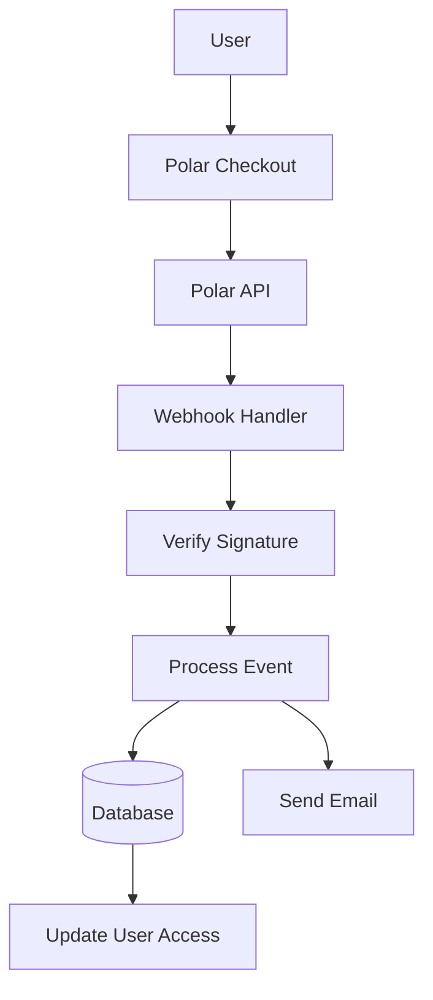

# תצורת פולאר

מדריך זה מסביר כיצד להגדיר את Polar כספק תשלום באפליקציית Ever Works שלך.

## סקירה כללית

Polar היא פלטפורמת תשלום מודרנית המיועדת למפתחים ויוצרים המציעה:

- 💻 API ותיעוד ידידותיים למפתחים
- 🔄 תמיכה במנוי ותשלום חד פעמי
- 🐙 שילוב GitHub עבור חסויות
- 💰 מבנה תמחור שקוף
- 🔒 עיבוד תשלום מאובטח
- 📊 ניתוח ודיווח מובנים

:::טיפ למה Polar?
Polar נבנה במיוחד עבור מפתחים ופרויקטים בקוד פתוח, ומציעה API נקי, תיעוד מעולה ושילוב GitHub חלק עבור חסויות ומונטיזציה.
:::

## משתני סביבה נדרשים

הוסף את המשתנים האלה לקובץ `.env.local` שלך:

```env
# Polar Configuration
POLAR_API_KEY=your_polar_api_key_here
POLAR_WEBHOOK_SECRET=your_webhook_secret_here
POLAR_APP_URL=https://your-app-url.com

# Product IDs (optional)
NEXT_PUBLIC_POLAR_SUBSCRIPTION_PRODUCT_ID=product_id_here
NEXT_PUBLIC_POLAR_ONETIME_PRODUCT_ID=product_id_here
```

:::warning
לעולם אל תתחייב את המפתחות הסודיים שלך לבקרת גרסאות. שמור את `.env.local` בקובץ `.gitignore` שלך.
:::

## הגדרת לוח המחוונים של Polar

### שלב 1: צור את החשבון שלך

1. הירשם ב-[Polar](https://polar.sh)
2. השלם את הגדרת החשבון שלך
3. אמת את כתובת הדוא"ל שלך

### שלב 2: צור מוצרים

1. נווט אל **מוצרים** → **מוצר חדש**
2. צור את רמות התמחור שלך:

| מוצר | מחיר | הקלד | תיאור |
|--------|-------|------|-------------|
| **תוכנית פרו** | $10 לחודש | מנוי | תכונות מתקדמות |
| **תוכנית ספונסרים** | 20 דולר | חד פעמי | תמיכת פרימיום |

3. הגדר את הגדרות המוצר:
   - הגדר תמחור ומחזור חיובים
   - הוסף תיאורי מוצרים
   - הגדר רמות גישה
4. העתק את **מזהה המוצר** לכל מוצר

### שלב 3: קבל מפתח API

1. עבור אל **הגדרות** → **מפתחות API**
2. צור מפתח API חדש
3. העתק את מפתח ה-API
4. הוסף אותו ל- `.env.local` שלך כ- `POLAR_API_KEY` :::טיפ
Polar מספק מפתחות נפרדים לפיתוח וייצור. השתמש במפתחות בדיקה במהלך הפיתוח.
:::

### שלב 4: הגדר Webhooks

1. עבור אל **הגדרות** → **Webhooks**
2. לחץ על **צור Webhook**
3. הגדר את ה-webhook:
   - **כתובת אתר**: `https://yourdomain.com/api/polar/webhook` - **אירועים**: בחר את כל אירועי התשלום וההרשמה
   - **סוד**: צור מפתח סודי

4. העתק את **סוד ה-Webhook** והוסף אותו ל- `.env.local` שלך

#### אירועים מומלצים

בחר את האירועים האלה בתצורת ה-webhook שלך:

- ✅ `payment.succeeded` - תשלום מוצלח
- ✅ `payment.failed` - תשלום נכשל
- ✅ `subscription.created` - מנוי חדש
- ✅ `subscription.updated` - שינויים במנוי
- ✅ `subscription.cancelled` - ביטול
- ✅ `subscription.trial_will_end` - סיום ניסיון
- ✅ `refund.created` - ההחזר עובד

## ארכיטקטורת מערכת התשלומים



### ספק פולאר

ספק Polar ( `lib/payment/lib/providers/polar-provider.ts` ) מיישם:

- ✅ ניהול לקוחות
- ✅ ניהול מוצר ותמחור
- ✅ מחזור חיים של מנוי
- ✅ עיבוד תשלומים
- ✅ טיפול ב-Webhook
- ✅ תמיכה בהחזרים

### נתיבי API

מסלולי ה-API הבאים זמינים:

| מסלול | שיטה | תיאור |
|-------|--------|-------------|
| `/api/polar/webhook` | פוסט | ידית Polar webhooks |
| `/api/polar/subscription` | פוסט | צור מנוי |
| `/api/polar/subscription` | PUT | עדכון מנוי |
| `/api/polar/subscription` | מחק | בטל מנוי |
| `/api/polar/checkout` | פוסט | צור סשן קופה |
| `/api/polar/payment` | קבל | אימות סטטוס תשלום |

### רכיבי ממשק משתמש

המערכת משתמשת ברכיבי התשלום של Polar:

- `PolarCheckoutButton` - רכיב לחצן התשלום
- `PolarPaymentForm` - טופס תשלום עם אימות
- עיצוב רספונסיבי למובייל ולשולחן העבודה
- תמיכה במספר שיטות תשלום

## דוגמאות לשימוש

### צור מנוי

```typescript
import { PolarProvider } from '@/lib/payment/providers/polar-provider';

const configs = createProviderConfigs({
  apiKey: process.env.POLAR_API_KEY!,
  webhookSecret: process.env.POLAR_WEBHOOK_SECRET!,
  options: {
    appUrl: process.env.POLAR_APP_URL!
  }
});

const polarProvider = new PolarProvider(configs.polar);

const subscription = await polarProvider.createSubscription({
  customerId: 'customer_id',
  productId: 'product_id',
  paymentMethodId: 'payment_method_id',
  trialPeriodDays: 7
});
```

### צור סשן קופה

```typescript
const checkout = await polarProvider.createCheckout({
  productId: 'product_id_here',
  customerId: 'customer_id',
  successUrl: 'https://yoursite.com/success',
  cancelUrl: 'https://yoursite.com/cancel'
});

// Redirect user to checkout.url
```

### השתמש ברכיב התשלום

```tsx
import { PolarCheckoutButton } from '@/lib/payment';

function PaymentPage() {
  return (
    <PolarCheckoutButton
      productId="product_id_here"
      amount={1000} // 10.00 USD in cents
      currency="usd"
      isSubscription={true}
      onSuccess={(paymentId) => {
        console.log('Payment succeeded:', paymentId);
        // Redirect to success page or update UI
      }}
      onError={(error) => {
        console.error('Payment error:', error);
        // Show error message to user
      }}
    />
  );
}
```

## בדיקת האינטגרציה שלך

### מצב בדיקה

1. **השתמש במפתחות API לבדיקה** (זמין בלוח המחוונים של Polar)
2. **השתמש באמצעי תשלום לבדיקה**:
   - כרטיסי בדיקה מסופקים בלוח המחוונים של Polar
   - מצב בדיקה עבור כל תזרימי התשלום

3. **בדוק את ה-webhooks באופן מקומי** עם כלי כמו ngrok:

   ```באש
   ngrok http 3000
   ```

   עדכן את כתובת ה-webhook במרכז השליטה של Polar לכתובת ה-ngrok שלך.

### בדיקת Webhook

```bash
# Use ngrok to expose your local server
ngrok http 3000

# Update webhook URL in Polar dashboard
https://your-ngrok-url.ngrok.io/api/polar/webhook

# Trigger test events from Polar dashboard
```

## טיפול בשגיאות

המערכת מטפלת אוטומטית בשגיאות נפוצות:

| סוג שגיאה | טיפול |
|------------|--------|
| התשלום נדחה | הודעת שגיאה ידידותית למשתמש |
| בעיות רשת | הגיון ניסיון חוזר אוטומטי |
| תקלות Webhook | נרשם לסקירה ידנית |
| שגיאות אימות | הדגשת שדה טופס |
| שגיאות מנוי | נקה הודעות שגיאה |

## שיטות עבודה מומלצות לאבטחה

1. **מפתחות API**:
   - לעולם אל תחשוף מפתחות סודיים בקוד בצד הלקוח
   - השתמש במשתני סביבה
   - סובב מקשים באופן קבוע

2. **אימות Webhook**:
   - אמת תמיד חתימות webhook
   - אימות נתוני אירועים לפני עיבוד
   - השתמש ב-HTTPS עבור כל נקודות הקצה של webhook

3. **נתוני תשלום**:
   - לעולם אל תשמור פרטי תשלום
   - השתמש בעיבוד התשלום המאובטח של Polar
   - ליישם אימות נכון

4. **הפעלות משתמש**:
   - אמת את אימות המשתמש
   - אימות הרשאות משתמש
   - רישום את כל פעילויות התשלום

## שילוב GitHub

Polar מציעה אינטגרציה חלקה של GitHub:

- **חסויות GitHub**: חברו את Polar עם נותני החסות של GitHub
- **גישה למאגר**: הענק גישה על סמך מנויים
- **תמיכה בארגון**: ניהול מנויי צוות
- **גישה אוטומטית**: ניהול גישה אוטומטי

### הגדר את שילוב GitHub

1. עבור אל **הגדרות** → **שילובים** → **GitHub**
2. חבר את חשבון GitHub שלך
3. הגדר כללי גישה למאגר
4. הגדר ניהול גישה אוטומטי

## תלות

חבילות נדרשות (כבר כלולות ב-Ever Works):

```json
{
  "@polar-sh/sdk": "^1.0.0"
}
```

## פתרון בעיות

### בעיות נפוצות

**בעיה**: Webhook לא מקבל אירועים

- **פתרון**: בדוק שכתובת האתר של webhook נגישה לציבור
- השתמש ב-ngrok לבדיקות מקומיות
- ודא שסוד ה-webhook נכון

**בעיה**: התשלום נכשל בשקט

- **פתרון**: בדוק את קונסולת הדפדפן לאיתור שגיאות
- ודא שמפתחות API נכונים
- בדוק את יומני לוח המחוונים של Polar

**בעיה**: המנוי לא מתעדכן

- **פתרון**: ודא שאירועי webhook מוגדרים
- בדוק את יומני המטפל ב-webhook
- ודא שעדכוני מסד הנתונים פועלים

**בעיה**: שילוב GitHub לא עובד

- **פתרון**: אמת את חיבור GitHub בלוח המחוונים של Polar
- בדוק את הגדרות הגישה למאגר
- ודא שניתנו הרשאות מתאימות

## השוואה: Polar לעומת ספקים אחרים

| תכונה | פולאר | פס | LemonSqueezy |
|--------|--------|--------|----------------|
| **מיקוד למפתחים** | ✅ מעולה | ⚠️ טוב | ⚠️ טוב |
| **שילוב GitHub** | ✅ יליד | ❌ לא | ❌ לא |
| **ידידותי בקוד פתוח** | ✅ כן | ⚠️ מוגבל | ⚠️ מוגבל |
| **מורכבות ההתקנה** | ✅ פשוט | ⚠️ מתון | ✅ פשוט |
| **איכות API** | ✅ מעולה | ✅ מעולה | ⚠️ טוב |
| **ציות למס** | ⚠️ מדריך | ⚠️ מדריך | ✅ אוטומטי |
| **הכי מתאים ל** | מפתחים, OSS | נפח גבוה | מכירות גלובליות |

## השלבים הבאים

- [Stripe Configuration](./stripe) - ספק תשלומים חלופי
- [תצורת LemonSqueezy](./lemonsqueezy) - ספק תשלומים חלופי
- [סקירת תשלום](/תשלום) - השווה בין ספקי תשלום
- [משתני סביבה](/deployment/environment-variables) - הגדרת סביבה מלאה
- [פריסה](/פריסה) - פרוס את שילוב התשלומים שלך

## משאבים

- [תיעוד פולאר](https://docs.polar.sh/)
- [Reference API](https://docs.polar.sh/api)
- [מדריך Webhook](https://docs.polar.sh/webhooks)
- [שילוב GitHub](https://docs.polar.sh/integrations/github)

## תמיכה

זקוק לעזרה באינטגרציה של Polar? בדוק את [דף התמיכה](/advanced-guide/support) או הצטרף לקהילה שלנו.
