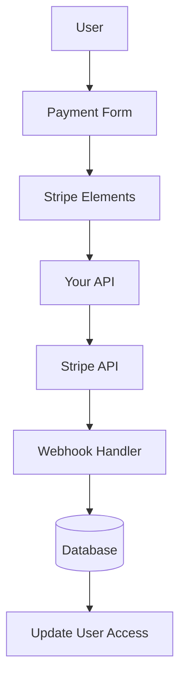

# תצורת פס

מדריך זה מסביר כיצד להגדיר את Stripe באפליקציית Ever Works שלך עם מנוי ותשלומים מלאים.

## סקירה כללית

Stripe היא פלטפורמת תשלום מקיפה התומכת ב:

- 💳 תשלומים חד פעמיים
- 🔄 מנויים חוזרים
- 🌍 שיטות תשלום מרובות (כרטיסים, Apple Pay, Google Pay)
- 💰 מספר מטבעות
- 📊 ניתוח ודיווח מתקדמים

## משתני סביבה נדרשים

הוסף את המשתנים האלה לקובץ `.env.local` שלך:

```bash
# Stripe Configuration
STRIPE_SECRET_KEY=sk_test_your_stripe_secret_key_here
STRIPE_WEBHOOK_SECRET=whsec_your_stripe_webhook_secret_here
NEXT_PUBLIC_STRIPE_PUBLISHABLE_KEY=pk_test_your_stripe_publishable_key_here

# Stripe Price IDs
NEXT_PUBLIC_STRIPE_SUBSCRIPTION_PRICE_ID=price_subscription_id_here
NEXT_PUBLIC_STRIPE_ONETIME_PRICE_ID=price_onetime_id_here
NEXT_PUBLIC_STRIPE_FREE_PRICE_ID=price_free_id_here

# Product Pricing (for display purposes)
NEXT_PUBLIC_PRODUCT_PRICE_PRO=10.00
NEXT_PUBLIC_PRODUCT_PRICE_SPONSOR=20.00
NEXT_PUBLIC_PRODUCT_PRICE_FREE=0.00
```

:::warning
לעולם אל תתחייב את המפתחות הסודיים שלך לבקרת גרסאות. שמור את `.env.local` בקובץ `.gitignore` שלך.
:::

## תצורת לוח המחוונים של Stripe

### שלב 1: צור מוצרים

ב-[Stripe Dashboard](https://dashboard.stripe.com/):

1. נווט אל **מוצרים** → **הוסף מוצר**
2. צור את המוצרים הבאים:

| מוצר | מחיר | הקלד | תיאור |
|--------|-------|------|-------------|
| **תוכנית חינם** | $0.00 | חד פעמי | תכונות בסיסיות |
| **תוכנית פרו** | $10.00 | מנוי חודשי | תכונות מתקדמות |
| **תוכנית ספונסרים** | $20.00 | חד פעמי | תמיכת פרימיום |

3. העתק את **מזהה המחיר** עבור כל מוצר (מתחיל ב- `price_` )

### שלב 2: הגדר Webhooks

Webhooks מאפשר ל-Stripe להודיע לאפליקציה שלך על אירועי תשלום.

1. עבור אל **מפתחים** → **Webhooks** → **הוסף נקודת קצה**
2. הגדר את כתובת האתר של נקודת הקצה:
   - פיתוח: `http://localhost:3000/api/stripe/webhook` - הפקה: `https://your-domain.com/api/stripe/webhook` 3. בחר אירועים להאזנה:
   - `payment_intent.succeeded` - `payment_intent.payment_failed` - `customer.subscription.created` - `customer.subscription.updated` - `customer.subscription.deleted` - `customer.subscription.trial_will_end` - `invoice.payment_succeeded` - `invoice.payment_failed` 4. העתק את **סוד החתימה** (מתחיל ב- `whsec_` )

### שלב 3: אחזר מפתחות API

בלוח המחוונים שלך ב-Stripe:

1. **מפתח סודי**: **מפתחים** → **מפתחות API** → **מפתח סודי** (מתחיל עם `sk_` )
2. **מפתח ניתן לפרסום**: **מפתחים** → **מפתחות API** → **מפתח ניתן לפרסום** (מתחיל עם `pk_` )
3. **סוד ה-Webhook**: **מפתחים** → **Webhook** → בחר את ה-Webhook שלך → **סוד החתימה**

:::טיפ
השתמש במקשי **מצב בדיקה** במהלך הפיתוח (הם מתחילים עם `sk_test_` ו `pk_test_` ). עבור למקשים **מצב חי** להפקה.
:::

## ארכיטקטורת מערכת התשלומים



### ספק פסים

ספק ה-Stripe ( `lib/payment/lib/providers/stripe-provider.ts` ) מיישם:

- ✅ ניהול לקוחות
- ✅ יצירת כוונת תשלום
- ✅ ניהול מנויים
- ✅ טיפול ב-Webhook
- ✅ תמיכה בכוונות הגדרה
- ✅ החזרים וביטולים

### נתיבי API

מסלולי ה-API הבאים זמינים:

| מסלול | שיטה | תיאור |
|-------|--------|-------------|
| `/api/stripe/webhook` | פוסט | Handle Stripe webhooks |
| `/api/stripe/subscription` | פוסט | צור מנוי |
| `/api/stripe/subscription` | PUT | עדכון מנוי |
| `/api/stripe/subscription` | מחק | בטל מנוי |
| `/api/stripe/payment-intent` | פוסט | צור כוונת תשלום |
| `/api/stripe/payment-intent` | קבל | אימות תשלום |
| `/api/stripe/setup-intent` | פוסט | הגדרת אמצעי תשלום |

### רכיבי ממשק משתמש

המערכת משתמשת ב-Stripe Elements עבור טפסי תשלום מאובטחים:

- `StripeElementsWrapper` - רכיב העטיפה הראשי
- `StripePaymentForm` - טופס תשלום עם אימות
- תמיכה ב-Apple Pay ו-Google Pay
- עיצוב רספונסיבי למובייל ולשולחן העבודה

## דוגמאות לשימוש

### צור מנוי

```typescript
import { StripeProvider } from '@/lib/payment/providers/stripe-provider';

const configs = createProviderConfigs({
  apiKey: process.env.STRIPE_SECRET_KEY!,
  webhookSecret: process.env.STRIPE_WEBHOOK_SECRET!,
  options: {
    publishableKey: process.env.NEXT_PUBLIC_STRIPE_PUBLISHABLE_KEY!,
    apiVersion: '2023-10-16'
  }
});

const stripeProvider = new StripeProvider(configs.stripe);

const subscription = await stripeProvider.createSubscription({
  customerId: 'cus_customer_id',
  priceId: 'price_subscription_id',
  paymentMethodId: 'pm_payment_method_id',
  trialPeriodDays: 7
});
```

### השתמש ברכיב התשלום

```tsx
import { PaymentForm } from '@/lib/payment';

function PaymentPage() {
  return (
    <PaymentForm
      amount={1000} // 10.00 USD in cents
      currency="usd"
      isSubscription={true}
      onSuccess={(paymentId) => {
        console.log('Payment succeeded:', paymentId);
        // Redirect to success page or update UI
      }}
      onError={(error) => {
        console.error('Payment error:', error);
        // Show error message to user
      }}
    />
  );
}
```

## בדיקת האינטגרציה שלך

### מצב בדיקה

1. **השתמש במפתחות API לבדיקה** (התחל עם `sk_test_` ו `pk_test_` )
2. **השתמש במספרי כרטיסי בדיקה**:
   - הצלחה: `4242 4242 4242 4242` - ירידה: `4000 0000 0000 0002` - 3D Secure: `4000 0025 0000 3155` 3. **בדוק את ה-webhooks באופן מקומי** עם Stripe CLI:

   ```באש
   האזנה לסטריפ --forward-to localhost:3000/api/stripe/webhook
   ```

### בדיקת Webhook

```bash
# Install Stripe CLI
brew install stripe/stripe-cli/stripe

# Login to your Stripe account
stripe login

# Forward webhooks to your local server
stripe listen --forward-to localhost:3000/api/stripe/webhook

# Trigger test events
stripe trigger payment_intent.succeeded
```

## טיפול בשגיאות

המערכת מטפלת אוטומטית בשגיאות נפוצות:

| סוג שגיאה | טיפול |
|------------|--------|
| הכרטיס נדחה | הודעת שגיאה ידידותית למשתמש |
| אין מספיק כספים | נסה שוב עם כרטיס אחר |
| בעיות רשת | הגיון ניסיון חוזר אוטומטי |
| תקלות Webhook | נרשם לסקירה ידנית |
| שגיאות אימות | הדגשת שדה טופס |

## שיטות עבודה מומלצות לאבטחה

1. **מפתחות API**:
   - לעולם אל תחשוף מפתחות סודיים בקוד בצד הלקוח
   - השתמש במשתני סביבה
   - סובב מקשים באופן קבוע

2. **אימות Webhook**:
   - אמת תמיד חתימות webhook
   - אימות נתוני אירועים לפני עיבוד

3. **נתוני תשלום**:
   - לעולם אל תשמור מספרי כרטיסים
   - השתמש בטוקניזציה של Stripe
   - יישום תאימות PCI

4. **הפעלות משתמש**:
   - אמת את אימות המשתמש
   - אימות הרשאות משתמש
   - רישום את כל פעילויות התשלום

## תלות

חבילות נדרשות (כבר כלולות ב-Ever Works):

```json
{
  "@stripe/react-stripe-js": "^3.7.0",
  "@stripe/stripe-js": "^7.3.0",
  "stripe": "^18.1.0"
}
```

## פתרון בעיות

### בעיות נפוצות

**בעיה**: Webhook לא מקבל אירועים

- **פתרון**: בדוק שכתובת האתר של webhook נגישה לציבור
- השתמש ב-Stripe CLI לבדיקות מקומיות
- ודא שסוד ה-webhook נכון

**בעיה**: התשלום נכשל בשקט

- **פתרון**: בדוק את קונסולת הדפדפן לאיתור שגיאות
- ודא שמפתחות API נכונים
- בדוק את יומני לוח המחוונים של Stripe

**בעיה**: 3D Secure לא עובד

- **פתרון**: ודא שאתה מטפל בסטטוס `requires_action` - ליישם זרימת הפנייה נכונה
- בדיקה עם כרטיסי בדיקה 3D Secure

## השלבים הבאים

- [תצורת LemonSqueezy](./lemonsqueezy) - ספק תשלומים חלופי
- [משתני סביבה](/deployment/environment-variables) - הגדרת סביבה מלאה
- [פריסה](/פריסה) - פרוס את שילוב התשלומים שלך

## משאבים

- [תיעוד פס](https://stripe.com/docs)
- [מדריך השילוב של Next.js](https://stripe.com/docs/payments/accept-a-payment?platform=web&ui=elements)
- [ניהול מנויים](https://stripe.com/docs/billing/subscriptions)
- [Webhook Events](https://stripe.com/docs/api/events/types)

## תמיכה

זקוק לעזרה בשילוב Stripe? בדוק את [דף התמיכה](/advanced-guide/support) או הצטרף לקהילה שלנו.
