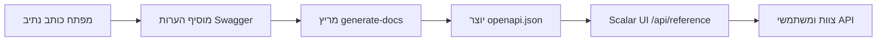

# הכשרה בתיעוד API

שלוט במערכת תיעוד ה-API האוטומטית באמצעות הערות Swagger וממשק Scalar UI.

## 🎯 מטרות

לאחר השלמת מודול זה, תוכל:

- ✅ להבין את תהליך העבודה של תיעוד API
- ✅ לכתוב הערות Swagger נכונות
- ✅ לעקוב אחר מוסכמות תגיות סטנדרטיות
- ✅ לייצר ולאמת תיעוד
- ✅ לפתור בעיות נפוצות
- ✅ לתחזק תיעוד API איכותי

**זמן משוער**: 2–3 ימים

---

## למה מערכת זו?

### בעיות שנפתרו

- **תיעוד לא עקבי**: בעבר היו 8 תגיות Stripe שונות פזורות בין נקודות הקצה
- **סנכרון ידני**: התיעוד נשאר לעתים קרובות מאחורי הקוד האמיתי
- **חוויית מפתח גרועה**: Swagger UI בסיסי עם יכולות מוגבלות

### יתרונות שהושגו

- **סנכרון אוטומטי**: תיעוד נוצר ישירות מהערות בקוד
- **ממשק מודרני**: Scalar UI עם בדיקות אינטראקטיביות וחוויית משתמש טובה יותר
- **תקנים עקביים**: מערכת תגיות מאוחדת ותבניות תיעוד

---

## ארכיטקטורת המערכת

### רכיבים מרכזיים

1. **הערות Swagger בקוד**
   - תגובות JSDoc עם תג `@swagger`
   - פורמט מפרט OpenAPI 3.0
   - מוטמעות ישירות בקבצי נתיב

2. **סקריפט generate-docs**
   - סורק את כל קבצי `app/api/**/route.ts`
   - מחלץ ומאמת הערות Swagger
   - יוצר `public/openapi.json` מאוחד

3. **ממשק Scalar UI**
   - ממשק תיעוד מודרני ומגיב
   - בדיקת API אינטראקטיבית
   - נגיש ב-`/api/reference`

### תהליך עבודה מלא



---

## פקודות מרכזיות

```bash
yarn generate-docs
yarn docs:watch
yarn docs:validate
git status public/openapi.json
```

---

## מערכת תגיות סטנדרטית

### מוסכמות תגיות

#### פעולות אדמין

```yaml
"Admin - Users"        # ניהול משתמשים
"Admin - Categories"   # ניהול קטגוריות
"Admin - Items"        # ניהול תוכן
"Admin - Comments"     # ניהול תגובות
```

#### פונקציות אפליקציה מרכזיות

```yaml
"Authentication"       # כניסה, יציאה, איפוס סיסמה
"Favorites"           # מועדפים של משתמש
"Items & Content"     # גלישת תוכן ציבורי
```

#### מערכות תשלום

```yaml
"Stripe - Core"              # Checkout, Payment Intent
"Stripe - Subscriptions"     # ניהול מנויים
"LemonSqueezy - Core"        # כל פעולות LemonSqueezy
```

---

## שיטות עבודה מומלצות

### כתיבת תיאורים אפקטיביים

- השתמש בפעלי פעולה: "צור", "עדכן", "מחק", "קבל"
- היה ספציפי: "קבל פרופיל משתמש", לא "קבל משתמש"
- אל תחרוג מ-50 תווים לקריאות בממשק

### דוגמאות ריאליסטיות

```yaml
# ❌ דוגמאות גרועות
example: "string"

# ✅ דוגמאות טובות
example: "john.doe@company.com"
example: "user_123abc456def"
```

---

## רשימת בדיקה למפתח

לפני commit של שינויי API:

- [ ] הערת Swagger נוספה או עודכנה
- [ ] נעשה שימוש בתגית הנכונה מהמערכת הסטנדרטית
- [ ] כותרת ותיאור משמעותיים נוכחים
- [ ] כל שדות גוף הבקשה מתועדים
- [ ] כל קודי תגובה מתועדים
- [ ] הורץ `yarn generate-docs`
- [ ] התיעוד נבדק ב-`/api/reference`
- [ ] `public/openapi.json` כלול ב-commit
