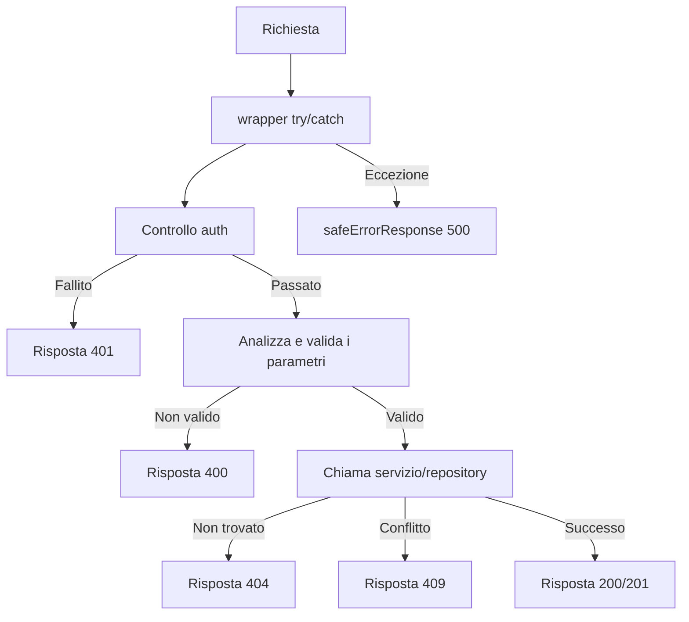

---
id: response-patterns
title: "Pattern di Risposta API"
sidebar_label: "Pattern di Risposta"
---

# Pattern di Risposta API

Tutte le route API seguono convenzioni di risposta coerenti: tipi union discriminati per successo/errore, messaggi di errore consapevoli dell'ambiente, codici di stato HTTP standard e documentazione Swagger/JSDoc. Questa pagina illustra ogni pattern.

## Sistema dei Tipi di Risposta

### Union Discriminata (`lib/api/types.ts`)

Le risposte API utilizzano un booleano `success` come discriminante:

```typescript
export type ApiResponse<T = unknown> =
  | { success: true; data: T; total?: number; page?: number; limit?: number; totalPages?: number }
  | { success: false; error: string };
```

Ciò consente ai chiamanti di restringere il tipo in modo sicuro:

```typescript
const response: ApiResponse<User[]> = await fetchUsers();
if (response.success) {
  // TypeScript sa: response.data è User[]
  console.log(response.data);
} else {
  // TypeScript sa: response.error è string
  console.error(response.error);
}
```

### Risposta Paginata

Gli endpoint lista utilizzano un wrapper paginato dedicato:

```typescript
export type PaginatedResponse<T> =
  | {
      success: true;
      data: T[];
      meta: {
        page: number;
        totalPages: number;
        total: number;
        limit: number;
      };
    }
  | { success: false; error: string };
```

### Tipi di Errore

```typescript
export interface ApiError {
  message: string;
  status?: number;
  code?: string;
}

export interface ErrorResponse {
  success: false;
  error: string;
}
```

## Forme delle Risposte Standard

### Risposte di Successo

#### Risorsa Singola

```typescript
return NextResponse.json({
  success: true,
  item,
  message: "Item created successfully",
}, { status: 201 });
```

#### Lista con Paginazione

```typescript
return NextResponse.json({
  success: true,
  items: result.items,
  total: result.total,
  page: result.page,
  limit: result.limit,
  totalPages: result.totalPages,
});
```

#### Conferma Azione

```typescript
return NextResponse.json({
  success: true,
  message: "Profile updated successfully",
});
```

### Risposte di Errore

Tutte le risposte di errore includono `success: false` e una stringa `error`:

```typescript
// Non autorizzato
return NextResponse.json(
  { success: false, error: "Unauthorized. Admin access required." },
  { status: 401 }
);

// Errore di validazione
return NextResponse.json(
  { success: false, error: "Invalid page parameter. Must be a positive integer." },
  { status: 400 }
);

// Conflitto
return NextResponse.json(
  { success: false, error: `Item with slug '${slug}' already exists` },
  { status: 409 }
);
```

## Convenzioni per i Codici di Stato HTTP

| Stato | Utilizzo | Esempio |
|--------|-------|----------|
| `200` | GET, PUT, PATCH, DELETE riuscito | Elenca elementi, aggiorna profilo |
| `201` | POST riuscito (risorsa creata) | Crea elemento, crea commento |
| `400` | Parametri o corpo non validi | Paginazione errata, campi obbligatori mancanti |
| `401` | Autenticazione richiesta o fallita | Sessione mancante, utente non amministratore |
| `404` | Risorsa non trovata | Elemento non trovato, profilo non trovato |
| `409` | Conflitto (risorsa duplicata) | ID o slug elemento duplicato |
| `413` | Corpo della richiesta troppo grande | Il corpo supera il massimo di `readBodyWithLimit` |
| `500` | Errore interno del server | Eccezioni non gestite |

## Risposta di Errore Sicura (`lib/utils/api-error.ts`)

### `safeErrorResponse`

Previene la perdita di informazioni mostrando messaggi generici in produzione e messaggi dettagliati in sviluppo:

```typescript
export function safeErrorResponse(
  error: unknown,
  fallbackMessage: string,
  status: number = 500
): NextResponse {
  const detail = error instanceof Error ? error.message : String(error);

  // Registra sempre i dettagli completi lato server
  console.error(`[API Error] ${fallbackMessage}:`, detail);

  const message = process.env.NODE_ENV === "development" ? detail : fallbackMessage;

  return NextResponse.json({ success: false, error: message }, { status });
}
```

Utilizzo nei gestori di route:

```typescript
export async function GET(request: NextRequest) {
  try {
    // ... logica del gestore
  } catch (error) {
    return safeErrorResponse(error, 'Failed to fetch items');
  }
}
```

### `safeErrorMessage`

Estrae una stringa di messaggio sicura senza creare una `NextResponse`:

```typescript
export function safeErrorMessage(error: unknown, fallbackMessage: string): string {
  if (process.env.NODE_ENV === "development") {
    return error instanceof Error ? error.message : String(error);
  }
  return fallbackMessage;
}
```

### Comportamento in Base all'Ambiente

| Ambiente | Output Errori | Log Server |
|-------------|-------------|------------|
| Sviluppo | `error.message` (dettaglio completo) | Errore completo registrato |
| Produzione | `fallbackMessage` (generico) | Errore completo registrato |

## Struttura del Gestore di Route

Tutti i gestori di route API seguono una struttura coerente:



## Documentazione Swagger / JSDoc

Le route API sono documentate con annotazioni Swagger inline per la documentazione API auto-generata:

```typescript
/**
 * @swagger
 * /api/admin/items:
 *   get:
 *     tags: ["Admin - Items"]
 *     summary: "Get paginated items list"
 *     security:
 *       - sessionAuth: []
 *     parameters:
 *       - name: "page"
 *         in: "query"
 *         schema:
 *           type: integer
 *           minimum: 1
 *           default: 1
 *     responses:
 *       200:
 *         description: "Items list retrieved successfully"
 *       400:
 *         description: "Bad request"
 *       401:
 *         description: "Unauthorized"
 *       500:
 *         description: "Internal server error"
 */
```

## Riepilogo delle Convenzioni

| Convenzione | Descrizione |
|------------|-------------|
| Tutte le risposte includono `success` | Union discriminata per la sicurezza dei tipi |
| Gli errori usano `{ success: false, error: string }` | Forma di errore coerente |
| `safeErrorResponse` avvolge i blocchi catch | Mascheratura degli errori consapevole dell'ambiente |
| La paginazione usa `total`, `page`, `limit`, `totalPages` | Metadati coerenti |
| Il controllo auth è la prima operazione | Pattern fail-fast |
| La validazione ritorna in anticipo in caso di fallimento | Nessun condizionale annidato |
| Annotazioni Swagger su tutte le route admin | Documentazione API auto-generata |
