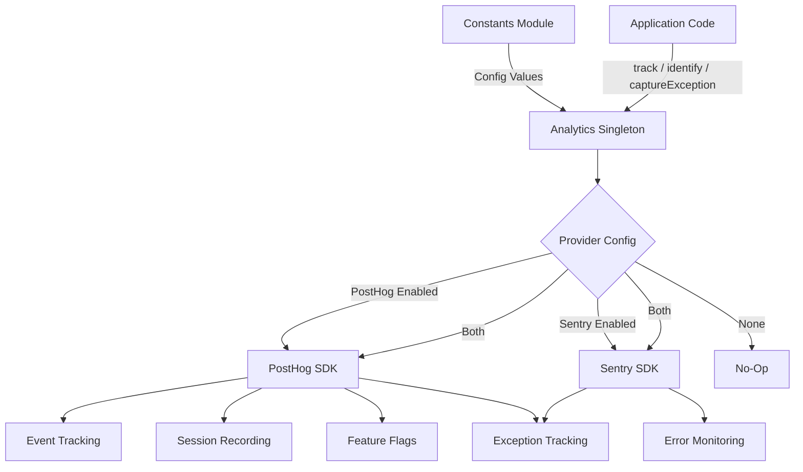
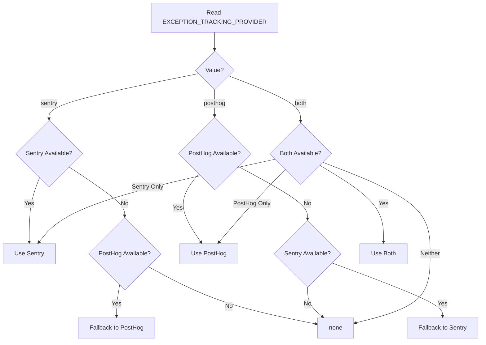

# Modulo di analisi

Il modulo di analisi (`template/lib/analytics/`) fornisce una classe singleton unificata per il monitoraggio degli eventi lato client, l'identificazione dell'utente, la valutazione dei flag di funzionalità e l'acquisizione delle eccezioni. Integra **PostHog** per l'analisi dei prodotti e **Sentry** per il monitoraggio degli errori, con supporto per l'utilizzo di uno dei fornitori individualmente, di entrambi contemporaneamente o di nessuno dei due.

## Panoramica dell'architettura



## File di origine

|Archivio|Descrizione|
|------|-------------|
|`lib/analytics/index.ts`|`Analytics` classe singleton ed esportazione `analytics`|

## Classe principale: `Analytics`

La classe `Analytics` è un singleton che racchiude PostHog e Sentry. È sicuro chiamare dal lato server: tutti i metodi ritornano silenziosamente quando `window` non è definito.

### Definizioni di tipo

```typescript
type EventProperties = Properties;          // PostHog Properties type
type UserProperties = Record<string, any>;
type ExceptionTrackingProvider = 'sentry' | 'posthog' | 'both' | 'none';
```

### Accesso singleton

```typescript
// Get the singleton instance
const analytics = Analytics.getInstance();

// Or use the pre-created export
import { analytics } from '@/lib/analytics';
```

### `init(): void`

Inizializza PostHog con configurazione centralizzata e imposta il monitoraggio delle eccezioni. Deve essere chiamato una volta sul lato client (in genere in un layout root o in un componente del provider).

```typescript
// In your root layout or PostHog provider
'use client';
import { analytics } from '@/lib/analytics';

useEffect(() => {
  analytics.init();
}, []);
```

**Comportamento:**
- Salta l'inizializzazione se già inizializzata o se in esecuzione sul lato server
- Legge la configurazione dalle costanti (`POSTHOG_KEY`, `POSTHOG_HOST`, `POSTHOG_ENABLED`, ecc.)
- Configura la registrazione della sessione con mascheramento quando `POSTHOG_SESSION_RECORDING_ENABLED` è vero
- Applica la frequenza di campionamento (`POSTHOG_SAMPLE_RATE`) -- in produzione il valore predefinito è 10%
- Imposta i gestori globali `window.onerror` e `unhandledrejection` quando il monitoraggio delle eccezioni PostHog è abilitato
- Collega PostHog a Sentry quando entrambi i provider sono attivi

### `identify(userId: string, properties?: UserProperties): void`

Associa l'utente anonimo corrente a un ID utente identificato. Imposta inoltre il contesto utente Sentry quando Sentry è abilitato.

```typescript
analytics.identify(session.user.id, {
  email: session.user.email,
  plan: 'premium',
});
```

### `reset(): void`

Reimposta l'identità dell'utente corrente (ad esempio, al momento del logout). Cancella i contesti utente PostHog e Sentry.

```typescript
analytics.reset();
```

### `track(eventName: string, properties?: EventProperties): void`

Cattura un evento personalizzato in PostHog.

```typescript
analytics.track('item_submitted', {
  itemId: 'abc-123',
  category: 'SaaS Tools',
});
```

### `trackPageView(url: string, properties?: EventProperties): void`

Cattura manualmente un evento di visualizzazione della pagina. Da utilizzare quando `POSTHOG_AUTO_CAPTURE` è disabilitato ed è necessario il monitoraggio esplicito delle visualizzazioni di pagina.

```typescript
analytics.trackPageView(window.location.href, {
  referrer: document.referrer,
});
```

### `isFeatureEnabled(flagKey: string, defaultValue?: boolean): boolean`

Valuta un flag di funzionalità PostHog in modo sincrono.

```typescript
const showNewUI = analytics.isFeatureEnabled('new-dashboard-ui', false);
```

### `reloadFeatureFlags(): Promise<void>`

Forza il recupero dei flag di funzionalità dal server PostHog.

```typescript
await analytics.reloadFeatureFlags();
```

### `captureException(error: Error | string, context?: Record<string, any>): void`

Monitoraggio unificato delle eccezioni che invia ai provider configurati.

```typescript
try {
  await riskyOperation();
} catch (error) {
  analytics.captureException(error, {
    component: 'PaymentForm',
    action: 'submit',
  });
}
```

**Instradamento del fornitore:**
- `'posthog'` -- Invia l'evento `$exception` a PostHog con l'analisi dello stack
- `'sentry'` -- Chiama `Sentry.captureException` con contesto aggiuntivo
- `'both'` -- Invia a entrambi i provider
- `'none'` -- Scarta silenziosamente

### `captureError(error: Error, context?: Record<string, any>): void`

**Deprecato.** Alias per `captureException`. Registra un avviso di deprecazione.

### `getExceptionTrackingProvider(): ExceptionTrackingProvider`

Restituisce il provider di monitoraggio delle eccezioni attualmente attivo.

### `setUserProperties(properties: UserProperties): void`

Imposta le proprietà utente persistenti sul profilo personale PostHog tramite `posthog.people.set()`.

```typescript
analytics.setUserProperties({
  subscription_tier: 'premium',
  company: 'Acme Corp',
});
```

### `setSuperProperties(properties: Record<string, any>): void`

Registra le super proprietà inviate con ogni evento successivo tramite `posthog.register()`.

```typescript
analytics.setSuperProperties({
  app_version: '2.1.0',
  environment: 'production',
});
```

## Costanti di configurazione

Tutta la configurazione dell'analisi è guidata dalle costanti di `lib/constants.ts`:

|Costante|Predefinito|Descrizione|
|----------|---------|-------------|
|`POSTHOG_KEY`|var|Chiave API del progetto PostHog|
|`POSTHOG_HOST`|var|URL dell'host dell'API PostHog|
|`POSTHOG_ENABLED`|derivato|Vero quando sono impostati sia la chiave che l'host|
|`POSTHOG_DEBUG`|var|Abilita la registrazione del debug di PostHog|
|`POSTHOG_SESSION_RECORDING_ENABLED`|`'true'`|Abilita la registrazione della sessione|
|`POSTHOG_AUTO_CAPTURE`|`'false'`|Acquisizione automatica delle visualizzazioni di pagina|
|`POSTHOG_SAMPLE_RATE`|`0.1` (produttore) / `1.0` (sviluppatore)|Frequenza di campionamento degli eventi|
|`POSTHOG_SESSION_RECORDING_SAMPLE_RATE`|`0.1` (produttore) / `1.0` (sviluppatore)|Frequenza di campionamento della registrazione|
|`EXCEPTION_TRACKING_PROVIDER`|`'both'`|Quale provider gestisce le eccezioni|
|`SENTRY_ENABLED`|derivato|Vero quando DSN è impostato e env lo consente|

## Risoluzione del provider di monitoraggio delle eccezioni

Il fornitore viene determinato in fase di costruzione con logica di fallback:



## Utilizzo con Next.js

Integrazione tipica in un progetto Next.js App Router:

```tsx
// app/providers.tsx
'use client';
import { useEffect } from 'react';
import { analytics } from '@/lib/analytics';
import { useSession } from 'next-auth/react';
import { usePathname } from 'next/navigation';

export function AnalyticsProvider({ children }: { children: React.ReactNode }) {
  const { data: session } = useSession();
  const pathname = usePathname();

  useEffect(() => {
    analytics.init();
  }, []);

  useEffect(() => {
    if (session?.user?.id) {
      analytics.identify(session.user.id, {
        email: session.user.email,
      });
    }
  }, [session]);

  useEffect(() => {
    analytics.trackPageView(pathname);
  }, [pathname]);

  return <>{children}</>;
}
```
