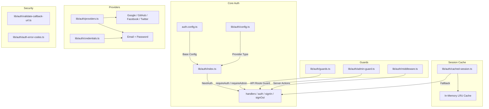
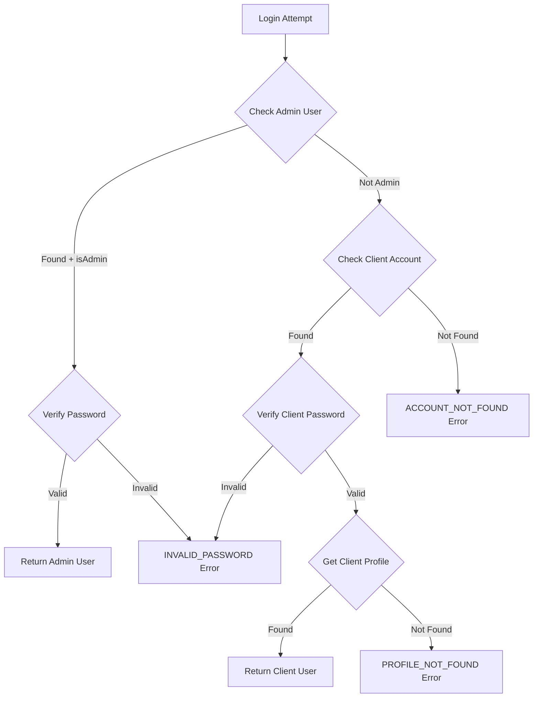

# Modulo Utilità di autenticazione

Il modulo delle utilità di autenticazione (`template/lib/auth/`) fornisce un livello di autenticazione completo basato su NextAuth.js (Auth.js) con supporto per più provider, memorizzazione nella cache delle sessioni, protezioni lato server, azioni server convalidate e Supabase come backend di autenticazione alternativo.

## Panoramica dell'architettura



## File di origine

|Archivio|Descrizione|
|------|-------------|
|`lib/auth/index.ts`|Configurazione NextAuth.js con adattatore Drizzle|
|`lib/auth/config.ts`|Configurazione del tipo di provider di autenticazione|
|`lib/auth/credentials.ts`|Fornitore di credenziali e-mail/password|
|`lib/auth/providers.ts`|Factory del provider OAuth|
|`lib/auth/guards.ts`|Protezioni della pagina lato server|
|`lib/auth/admin-guard.ts`|Protezione amministrativa del percorso API|
|`lib/auth/middleware.ts`|Middleware di azione del server convalidato|
|`lib/auth/cached-session.ts`|Livello di memorizzazione nella cache della sessione|
|`lib/auth/session-cache.ts`|Implementazione della cache|
|`lib/auth/validate-callback-url.ts`|Convalida dell'URL di reindirizzamento|
|`lib/auth/auth-error-codes.ts`|Enumerazione codice errore|
|`lib/auth/supabase/`|Client/server/middleware di autenticazione Supabase|

## Configurazione NextAuth.js (`index.ts`)

L'esportazione principale fornisce l'interfaccia NextAuth.js standard:

```typescript
import { auth, signIn, signOut, handlers, unstable_update } from '@/lib/auth';
```

### Strategia della sessione

- **Strategia:** JWT (non sessioni di database)
- **Età massima:** 30 giorni
- **Età dell'aggiornamento:** 24 ore (intervallo di aggiornamento della sessione)

### Richiamata JWT

La callback JWT arricchisce i token con:
- `userId` -- da oggetto utente o token `sub`
- `clientProfileId` -- creato automaticamente per gli utenti OAuth al primo accesso
- `isAdmin` -- determinato dai flag `isClient`/`isAdmin` o predefinito su `false`
- `provider` -- il nome del provider di autenticazione

### Richiamata della sessione

Il callback della sessione associa i campi JWT all'oggetto della sessione:
- `session.user.id`
- `session.user.clientProfileId`
- `session.user.provider`
- `session.user.isAdmin`

### Pagine personalizzate

```typescript
pages: {
  signIn: '/auth/signin',
  signOut: '/auth/signout',
  error: '/auth/error',
  verifyRequest: '/auth/verify-request',
  newUser: '/auth/register',
}
```

### Eventi

- **signOut**: invalida la cache della sessione per l'utente
- **updateUser**: invalida la cache della sessione quando i dati dell'utente cambiano

## Configurazione autenticazione (`config.ts`)

### `AuthProviderType`

```typescript
type AuthProviderType = 'supabase' | 'next-auth' | 'both';
```

### `AuthConfig`

```typescript
interface AuthConfig {
  provider: AuthProviderType;
  supabase?: {
    url: string;
    anonKey: string;
    redirectUrl?: string;
  };
  nextAuth?: {
    enableCredentials?: boolean;
    enableOAuth?: boolean;
    providers?: any[];
  };
}
```

### `getAuthConfig(): AuthConfig`

Risolve la configurazione con questa priorità:
1. Override globale tramite `configureAuth()`
2. Rilevamento basato sull'ambiente (presenza URL/chiave Supabase)
3. Impostazione predefinita: `next-auth` con credenziali e OAuth abilitati

## Fornitore di credenziali (`credentials.ts`)

### Funzioni della password

```typescript
async function hashPassword(password: string): Promise<string>;
// Uses bcryptjs with 10 salt rounds, loaded via dynamic import

async function comparePasswords(plainText: string, hashed: string | null): Promise<boolean>;
// Returns false if hashed is null
```

### Flusso di autenticazione



### `AuthProviders` Enum

```typescript
enum AuthProviders {
  CREDENTIALS = 'credentials',
  GOOGLE = 'google',
  FACEBOOK = 'facebook',
  GITHUB = 'github',
  TWITTER = 'twitter',
  X = 'x',
  MICROSOFT = 'microsoft',
}
```

## Provider OAuth (`providers.ts`)

### `createNextAuthProviders(config?): Provider[]`

Crea dinamicamente istanze del provider NextAuth in base alla configurazione:

```typescript
import { createNextAuthProviders } from '@/lib/auth/providers';

const providers = createNextAuthProviders({
  google: { enabled: true, clientId: '...', clientSecret: '...' },
  github: { enabled: true, clientId: '...', clientSecret: '...' },
  credentials: { enabled: true },
});
```

Provider supportati: **Google**, **GitHub**, **Facebook**, **Twitter**, **Credenziali**.

## Protezioni lato server (`guards.ts`)

### `requireAuth(): Promise<Session>`

Richiede l'autenticazione. Reindirizza a `/auth/signin` se non autenticato.

```typescript
export default async function ProtectedPage() {
  const session = await requireAuth();
  return <div>Welcome {session.user.email}</div>;
}
```

### `requireAdmin(): Promise<Session>`

Richiede il ruolo di amministratore. Reindirizza a `/admin/auth/signin` se non autenticato, `/unauthorized` se non è amministratore.

```typescript
export default async function AdminPage() {
  const session = await requireAdmin();
  return <div>Admin Dashboard</div>;
}
```

### `getSession(): Promise<Session | null>`

Ottiene la sessione corrente senza reindirizzamento. Restituisce `null` per gli utenti non autenticati.

### `checkIsAdmin(): Promise<boolean>`

Controlla lo stato dell'amministratore senza reindirizzare.

## API Route Guard (`admin-guard.ts`)

### `checkAdminAuth(): Promise<NextResponse | null>`

Restituisce `null` se autorizzato, oppure un errore `NextResponse` (401/403/500) in caso contrario:

```typescript
export async function GET() {
  const authError = await checkAdminAuth();
  if (authError) return authError;
  // ... handle authorized request
}
```

### `withAdminAuth(handler): handler`

Funzione di ordine superiore che avvolge i gestori di route API:

```typescript
import { withAdminAuth } from '@/lib/auth/admin-guard';

export const GET = withAdminAuth(async (request) => {
  // Only reached if user is authenticated admin
  return NextResponse.json({ data: await getAdminData() });
});
```

## Azioni server convalidate (`middleware.ts`)

### `validatedAction(schema, action)`

Avvolge un'azione del server con la convalida Zod:

```typescript
import { validatedAction } from '@/lib/auth/middleware';
import { z } from 'zod';

const schema = z.object({ name: z.string().min(1), email: z.string().email() });

export const updateProfile = validatedAction(schema, async (data, formData) => {
  await db.update(users).set(data);
  return { success: 'Profile updated' };
});
```

### `validatedActionWithUser(schema, action)`

Come sopra ma verifica anche l'autenticazione e inserisce l'utente:

```typescript
export const submitItem = validatedActionWithUser(schema, async (data, formData, user) => {
  await db.insert(items).values({ ...data, userId: user.id });
  return { success: 'Item submitted' };
});
```

### `ActionState` Digitare

```typescript
type ActionState = {
  error?: string;
  success?: string;
  redirect?: string;
  [key: string]: any;
};
```

## Caching della sessione (`cached-session.ts`)

Riduce il sovraccarico di autenticazione memorizzando nella cache le sessioni decodificate in memoria.

### `getCachedSession(request?): Promise<Session | null>`

```typescript
import { getCachedSession } from '@/lib/auth/cached-session';

// In server components
const session = await getCachedSession();

// In API routes (pass request for token extraction)
const session = await getCachedSession(request);
```

### `invalidateSessionCache(token?, userId?): Promise<void>`

Invalida le sessioni memorizzate nella cache in base al token o all'ID utente.

### `clearSessionCache(): void`

Cancella tutte le sessioni memorizzate nella cache (per distribuzioni o aggiornamenti critici).

### Estrazione di token

I token vengono estratti dalle richieste in questo ordine:
1. `next-auth.session-token` o `__Secure-next-auth.session-token` cookie
2. `Authorization: Bearer <token>` intestazione
3. `X-Session-Token` intestazione personalizzata

## Codici di errore (`auth-error-codes.ts`)

```typescript
enum AuthErrorCode {
  ACCOUNT_NOT_FOUND = 'ACCOUNT_NOT_FOUND',
  INVALID_PASSWORD = 'INVALID_PASSWORD',
  PROFILE_NOT_FOUND = 'PROFILE_NOT_FOUND',
  GENERIC_ERROR = 'GENERIC_ERROR',
  RATE_LIMITED = 'RATE_LIMITED',
  USE_OAUTH_PROVIDER = 'USE_OAUTH_PROVIDER',
  SESSION_REFRESH_FAILED = 'SESSION_REFRESH_FAILED',
  PAGE_REFRESH_FAILED = 'PAGE_REFRESH_FAILED',
}
```

## Convalida URL di richiamata (`validate-callback-url.ts`)

### `isValidCallbackUrl(url: string | null): boolean`

Previene le vulnerabilità di reindirizzamento aperto:

```typescript
isValidCallbackUrl('/admin/items')       // true
isValidCallbackUrl('/client/dashboard')  // true
isValidCallbackUrl('https://evil.com')   // false
isValidCallbackUrl('//evil.com')         // false
```

### `getSafeRedirectPath(callbackUrl, fallbackPath): string`

Restituisce l'URL di callback se valido, altrimenti il percorso di fallback.

### `createSafeCallbackUrl(pathname, search?): string`

Crea un URL di richiamata limitato a 2048 caratteri per evitare l'inquinamento dei parametri.
