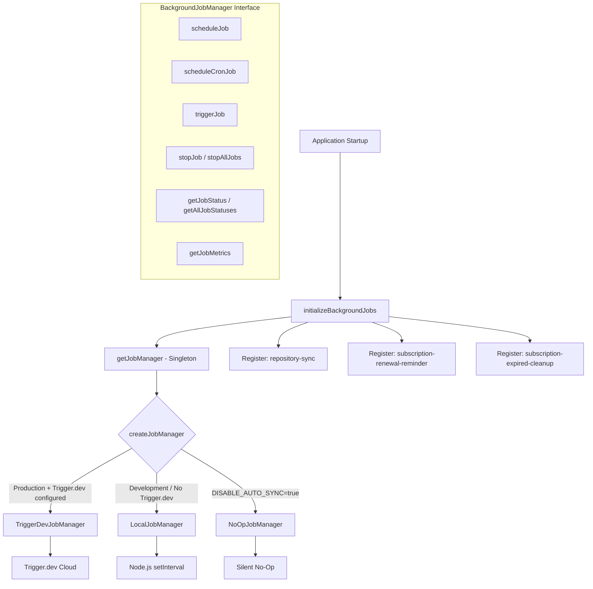
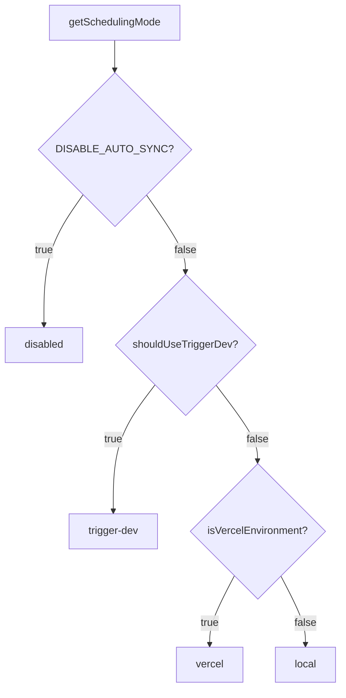

# Modulo Lavori in background

Il modulo dei lavori in background (`template/lib/background-jobs/`) fornisce un livello di astrazione per la pianificazione e l'esecuzione di attività ricorrenti. Supporta tre strategie di runtime: **Trigger.dev** per la produzione, **locale `setInterval`** per lo sviluppo e una modalità **no-op** per disabilitare completamente i processi, selezionate automaticamente in base alla configurazione dell'ambiente.

## Panoramica dell'architettura



## File di origine

|Archivio|Descrizione|
|------|-------------|
|`lib/background-jobs/types.ts`|Definizioni di interfaccia e tipo|
|`lib/background-jobs/config.ts`|Rilevamento della configurazione e della modalità di pianificazione di Trigger.dev|
|`lib/background-jobs/job-factory.ts`|Funzione di fabbrica e gestore singleton|
|`lib/background-jobs/local-job-manager.ts`|`LocalJobManager` implementazione|
|`lib/background-jobs/trigger-dev-job-manager.ts`|`TriggerDevJobManager` implementazione|
|`lib/background-jobs/noop-job-manager.ts`|`NoOpJobManager` implementazione|
|`lib/background-jobs/initialize-jobs.ts`|Registrazione del lavoro all'avvio dell'app|
|`lib/background-jobs/index.ts`|Esportazioni di barili|

## Definizioni di tipo

### `BackgroundJobManager` Interfaccia

```typescript
interface BackgroundJobManager {
  scheduleJob(id: string, name: string, job: () => void | Promise<void>, interval: number): void;
  scheduleCronJob(id: string, name: string, job: () => void | Promise<void>, cronExpression: string): void;
  triggerJob(id: string): Promise<void>;
  stopJob(id: string): void;
  stopAllJobs(): void;
  getJobStatus(id: string): JobStatus | undefined;
  getAllJobStatuses(): JobStatus[];
  getJobMetrics(): JobMetrics;
}
```

### `JobStatus`

```typescript
type JobStatusType = 'running' | 'completed' | 'failed' | 'scheduled' | 'stopped';

interface JobStatus {
  id: string;
  name: string;
  status: JobStatusType;
  lastRun: Date | null;
  nextRun: Date | null;
  duration: number;     // Last execution duration in ms
  error?: string;       // Error message if status is 'failed'
}
```

### `JobMetrics`

```typescript
interface JobMetrics {
  totalExecutions: number;       // Total invocations (not unique jobs)
  successfulJobs: number;
  failedJobs: number;
  averageJobDuration: number;    // Rolling average in ms
  lastCleanup: Date;
}
```

### `TriggerDevConfig`

```typescript
interface TriggerDevConfig {
  enabled: boolean;
  apiKey?: string;
  apiUrl?: string;
  environment: string;
  isFullyConfigured: boolean;
  isPartiallyConfigured: boolean;
}
```

### `SchedulingMode`

```typescript
type SchedulingMode = 'trigger-dev' | 'vercel' | 'local' | 'disabled';
```

## Funzioni di configurazione

### `getTriggerDevConfig(): TriggerDevConfig`

Legge le impostazioni di Trigger.dev da ConfigService.

### `shouldUseTriggerDev(): boolean`

Restituisce `true` quando Trigger.dev è completamente configurato, abilitato e l'ambiente è di produzione.

### `getSchedulingMode(): SchedulingMode`

Determina quale sistema di pianificazione dovrebbe essere attivo utilizzando questa priorità:



## Fabbrica e Singleton

### `createJobManager(): BackgroundJobManager`

Crea il gestore lavori appropriato in base all'ambiente:

```typescript
import { createJobManager } from '@/lib/background-jobs';

const manager = createJobManager();
// Returns: TriggerDevJobManager | LocalJobManager | NoOpJobManager
```

### `getJobManager(): BackgroundJobManager`

Restituisce l'istanza singleton, creandola alla prima chiamata:

```typescript
import { getJobManager } from '@/lib/background-jobs';

const manager = getJobManager();
manager.scheduleJob('my-job', 'My Job', async () => {
  await doWork();
}, 60_000);
```

### `resetJobManager(): void`

Interrompe tutti i lavori e distrugge il singleton (utile per i test):

```typescript
import { resetJobManager } from '@/lib/background-jobs';
resetJobManager();
```

## LocalJobManager

Utilizza Node.js `setInterval` per ambienti di sviluppo e fallback.

**Comportamenti chiave:**
- Salta l'esecuzione quando un lavoro è già in esecuzione (evita la sovrapposizione)
- Tiene traccia delle metriche con durata media mobile
- Converte le espressioni cron in intervalli tramite mappatura semplificata
- Riduce la registrazione della console in modalità di sviluppo

### Mappatura cron-intervallo

|Modello Cron|Intervallo|
|-------------|----------|
| `*/30 * * * * *` |30 secondi|
| `*/2 * * * *` |2 minuti|
| `*/5 * * * *` |5 minuti|
| `*/15 * * * *` |15 minuti|
| `0 * * * *` |1 ora|
| `0 9 * * *` |24 ore|
|Predefinito|1 minuto|

## TriggerDevJobManager

Registra le pianificazioni con l'API delle pianificazioni `@trigger.dev/sdk` v4. **Non** esegue i timer locali: l'esecuzione è gestita dal processo di lavoro Trigger.dev.

**Comportamenti chiave:**
- Caricamenti lenti `@trigger.dev/sdk` tramite importazione dinamica
- Converte le pianificazioni basate su intervalli in espressioni cron
- Tiene traccia delle metriche locali quando le attività vengono eseguite nel contesto di lavoro
- `stopJob` / `stopAllJobs` cancella solo lo stato locale (le pianificazioni remote sono gestite da Trigger.dev)

## NoOpJobManager

Tutte le operazioni sono no-op silenziose. Utilizzato quando `DISABLE_AUTO_SYNC=true` in fase di sviluppo.

## Registrazione del lavoro

La funzione `initializeBackgroundJobs()` registra tutti i processi dell'applicazione all'avvio:

```typescript
import { initializeBackgroundJobs } from '@/lib/background-jobs/initialize-jobs';

// Called once during app initialization
await initializeBackgroundJobs();
```

### Lavori registrati

|ID lavoro|Programma|Descrizione|
|--------|----------|-------------|
|`repository-sync`|Ogni 5 minuti|Sincronizza i contenuti CMS basati su Git tramite `syncManager.performSync()`|
|`subscription-renewal-reminder`|Tutti i giorni alle 9:00|Invia promemoria di rinnovo per gli abbonamenti che scadono tra 7 giorni|
|`subscription-expired-cleanup`|Tutti i giorni a mezzanotte|Elabora e fa scadere gli abbonamenti oltre la data di fine|

**Importante:** tutti i callback dei lavori utilizzano importazioni dinamiche per impedire al webpack di raggruppare moduli specifici di Node.js in fase di compilazione:

```typescript
manager.scheduleJob('repository-sync', 'Repository Synchronization', async () => {
  // Dynamic import prevents webpack bundling of isomorphic-git chain
  const { syncManager } = await import('@/lib/services/sync-service');
  await syncManager.performSync();
}, 5 * 60 * 1000);
```

## Esempi di utilizzo

### Pianificazione di un lavoro personalizzato

```typescript
import { getJobManager } from '@/lib/background-jobs';

const manager = getJobManager();

// Interval-based (every 10 minutes)
manager.scheduleJob('cleanup-temp', 'Temp File Cleanup', async () => {
  await cleanupTempFiles();
}, 10 * 60 * 1000);

// Cron-based (every hour)
manager.scheduleCronJob('hourly-report', 'Hourly Report', async () => {
  await generateReport();
}, '0 * * * *');
```

### Monitoraggio dei lavori

```typescript
const manager = getJobManager();

// Check specific job
const status = manager.getJobStatus('repository-sync');
console.log(status?.status, status?.lastRun, status?.duration);

// List all jobs
const allStatuses = manager.getAllJobStatuses();

// Get aggregate metrics
const metrics = manager.getJobMetrics();
console.log(`Total: ${metrics.totalExecutions}, Failed: ${metrics.failedJobs}`);
```

### Attivazione manuale

```typescript
const manager = getJobManager();
await manager.triggerJob('repository-sync');
```
