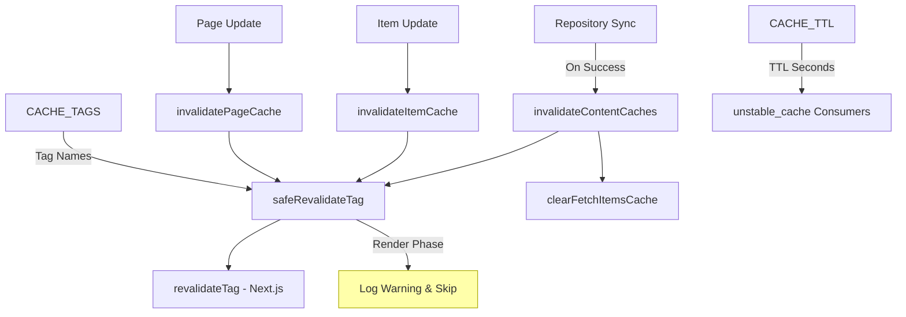
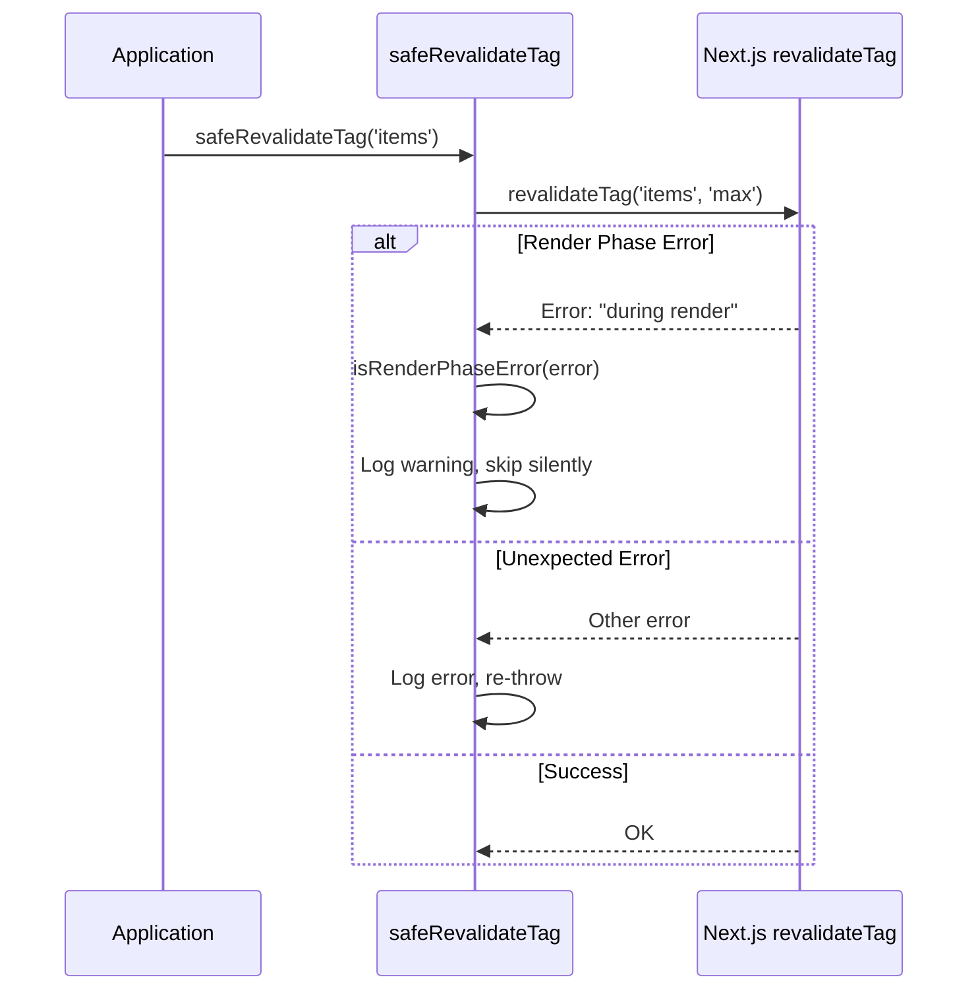
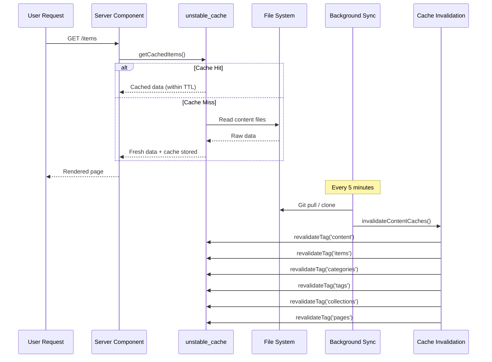

# Modulo di invalidamento della cache

Il modulo di invalidamento della cache (`template/lib/cache-config.ts` e `template/lib/cache-invalidation.ts`) fornisce un sistema di tag di cache centralizzato e funzioni di invalidamento per Next.js `unstable_cache` e `revalidateTag`. Garantisce che le cache dei contenuti vengano invalidate correttamente dopo la sincronizzazione del repository, gestendo con garbo le restrizioni della fase di rendering di Next.js.

## Panoramica dell'architettura



## File di origine

|Archivio|Descrizione|
|------|-------------|
|`lib/cache-config.ts`|Memorizza nella cache le costanti TTL e le definizioni dei tag|
|`lib/cache-invalidation.ts`|Funzioni di invalidamento con sicurezza della fase di rendering|

## Configurazione TTL della cache

Tutti i valori TTL sono in **secondi**, utilizzati con Next.js `unstable_cache`:

```typescript
const CACHE_TTL = {
  CONTENT: 600,   // 10 minutes -- content listings
  ITEM: 600,      // 10 minutes -- individual items
  CONFIG: 600,    // 10 minutes -- site configuration
  PAGES: 600,     // 10 minutes -- static pages
} as const;
```

### Utilizzo con `unstable_cache`

```typescript
import { unstable_cache } from 'next/cache';
import { CACHE_TTL, CACHE_TAGS } from '@/lib/cache-config';

const getCachedItems = unstable_cache(
  async () => fetchAllItems(),
  ['items-list'],
  {
    revalidate: CACHE_TTL.CONTENT,
    tags: [CACHE_TAGS.CONTENT, CACHE_TAGS.ITEMS],
  }
);
```

## Tag della cache

I tag vengono utilizzati con `revalidateTag()` per invalidare selettivamente le cache.

### Tag statici

|Etichetta costante|Valore|Descrizione|
|-------------|-------|-------------|
|`CACHE_TAGS.CONTENT`|`'content'`|Tag principale: invalida tutte le cache dei contenuti|
|`CACHE_TAGS.ITEMS`|`'items'`|Collezione di tutti gli articoli|
|`CACHE_TAGS.CATEGORIES`|`'categories'`|Tutte le categorie|
|`CACHE_TAGS.TAGS`|`'tags'`|Tutti i tag|
|`CACHE_TAGS.COLLECTIONS`|`'collections'`|Tutte le collezioni|
|`CACHE_TAGS.CONFIG`|`'config'`|Configurazione del sito|
|`CACHE_TAGS.PAGES`|`'pages'`|Tutte le pagine statiche|

### Tag dinamici (funzioni)

|Funzione etichetta|Esempio di output|Descrizione|
|-------------|---------------|-------------|
|`CACHE_TAGS.ITEM(slug)`|`'item:my-tool'`|Articolo specifico per lumaca|
|`CACHE_TAGS.PAGE(slug)`|`'page:about'`|Pagina specifica per slug|
|`CACHE_TAGS.ITEMS_LOCALE(locale)`|`'items:en'`|Elementi filtrati per lingua|
|`CACHE_TAGS.CATEGORIES_LOCALE(locale)`|`'categories:fr'`|Categorie per località|
|`CACHE_TAGS.TAGS_LOCALE(locale)`|`'tags:de'`|Tag per località|
|`CACHE_TAGS.COLLECTIONS_LOCALE(locale)`|`'collections:es'`|Raccolte per località|

### Esempio: memorizzazione nella cache specifica della locale

```typescript
import { CACHE_TAGS, CACHE_TTL } from '@/lib/cache-config';

const getCachedItemsByLocale = unstable_cache(
  async (locale: string) => fetchItemsByLocale(locale),
  ['items-by-locale'],
  {
    revalidate: CACHE_TTL.CONTENT,
    tags: [CACHE_TAGS.ITEMS, CACHE_TAGS.ITEMS_LOCALE('en')],
  }
);
```

## Funzioni di invalidazione

### `invalidateContentCaches(): Promise<void>`

Invalida **tutte** le cache relative ai contenuti. Chiamato dopo il completamento corretto della sincronizzazione del repository.

```typescript
import { invalidateContentCaches } from '@/lib/cache-invalidation';

// After successful repository sync
await performSync();
await invalidateContentCaches();
```

**Invalida questi tag:**
- `CONTENT`, `ITEMS`, `CATEGORIES`, `TAGS`, `COLLECTIONS`, `PAGES`
- Cancella anche la cache in memoria `fetchItems` tramite `clearFetchItemsCache()`

### `invalidateItemCache(slug: string): Promise<void>`

Invalida la cache per un singolo elemento.

```typescript
import { invalidateItemCache } from '@/lib/cache-invalidation';

await invalidateItemCache('my-saas-tool');
// Revalidates tag: 'item:my-saas-tool'
```

### `invalidatePageCache(slug: string): Promise<void>`

Invalida la cache per una singola pagina statica.

```typescript
import { invalidatePageCache } from '@/lib/cache-invalidation';

await invalidatePageCache('about');
// Revalidates tag: 'page:about'
```

## Sicurezza in fase di rendering

Next.js non consente `revalidateTag()` durante la fase di rendering dei componenti server. Il modulo lo gestisce con un wrapper `safeRevalidateTag`.

### Come funziona



### Modelli di rilevamento degli errori

La funzione `isRenderPhaseError` controlla che più pattern siano resilienti rispetto alle modifiche dei messaggi di errore Next.js:

- `"during render"` -- Messaggio Next.js corrente
- `"render phase"` -- Frasari alternativi
- `"revalidate"` + `"render"` -- Sono presenti entrambe le parole chiave
- `"unsupported"` + `"render"` -- Controllo combinato

## Diagramma del flusso della cache


