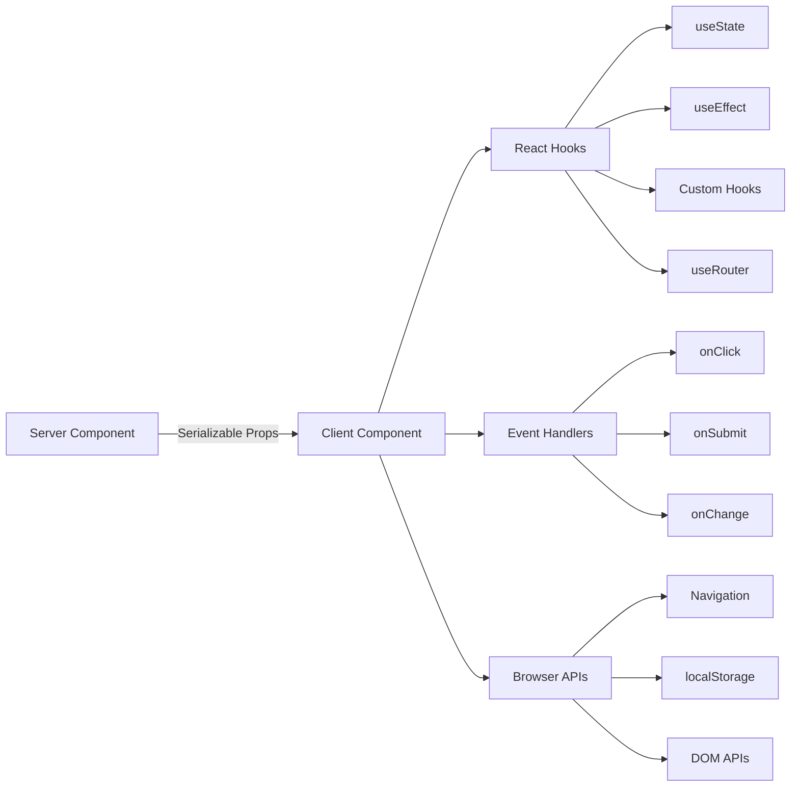

# Modelli dei componenti client

## Panoramica

I componenti client nel modello Ever Works sono "isole" interattive che gestiscono gli eventi dell'utente, gestiscono lo stato locale e si integrano con le API del browser. Sono identificati dalla direttiva `"use client"` nella parte superiore del file e vengono utilizzati selettivamente laddove è richiesta l'interattività.

## Architettura



## File di origine

|Archivio|Modello|
|------|---------|
|`template/app/[locale]/admin/page.tsx`|Wrapper client minimo che delega al componente|
|`template/app/not-found.tsx`|Navigazione del cliente con `useRouter`|
|`template/app/global-error.tsx`|Limite di errore con funzionalità di ripristino|
|`template/components/filters/filter-url-parser.tsx`|Gestione dello stato dell'URL|
|`template/components/header/more-menu.tsx`|Menu a discesa interattivi|

## Modelli fondamentali

### Modello 1: wrapper client minimi

Molti componenti della pagina utilizzano il wrapper client più sottile possibile:

```typescript
"use client";

import { AdminDashboard } from "@/components/admin";

export default function AdminPage() {
    return <AdminDashboard />;
}
```

Questo modello mantiene il file di paging piccolo delegando tutta la logica a un componente separato. La direttiva `"use client"` segna il confine in cui l'albero dei componenti server passa al rendering client.

### Modello 2: Componenti del limite di errore

Il gestore errori globale mostra il modello dei limiti di errore:

```typescript
'use client';

export default function GlobalError({
    error,
    reset,
}: {
    error: Error & { digest?: string };
    reset: () => void;
}) {
    useEffect(() => {
        console.error(error);
    }, [error]);

    return (
        <html lang="en">
            <body>
                <div>
                    <h1>Something went wrong!</h1>
                    {process.env.NODE_ENV !== 'production' && (
                        <div>
                            <p>{error.message}</p>
                            {error.digest && <p>Error ID: {error.digest}</p>}
                        </div>
                    )}
                    <Button onPress={() => reset()}>Refresh</Button>
                    <Link href="/">Go Home</Link>
                </div>
            </body>
        </html>
    );
}
```

Aspetti chiave:
- L'oggetto `error` include un `digest` opzionale per il monitoraggio degli errori del server
- La funzione `reset()` esegue nuovamente il rendering dei figli del limite di errore
- Le analisi dello stack vengono visualizzate solo in fase di sviluppo
- Il componente racchiude i propri tag `<html>` e `<body>` poiché gli errori globali sostituiscono l'intera pagina

### Modello 3: navigazione lato client

La pagina Non trovato mostra i modelli di navigazione lato client:

```typescript
'use client';

import { useRouter } from 'next/navigation';

export default function NotFound() {
    const router = useRouter();

    return (
        <div>
            <Button onClick={() => router.back()}>Go Back</Button>
            <Button onClick={() => router.push('/')}>Back to Home</Button>
            <button onClick={() => router.push('/help')}>Contact Support</button>
        </div>
    );
}
```

L'hook `useRouter` di `next/navigation` fornisce la navigazione programmatica. Tieni presente che questo proviene da `next/navigation`, non `next/router` (Pages Router).

### Modello 4: navigazione client compatibile con i18n

Il modello fornisce hook di navigazione compatibili con le impostazioni locali tramite `i18n/navigation.ts`:

```typescript
import { createNavigation } from "next-intl/navigation";
import { routing } from "./routing";

export const { Link, redirect, usePathname, useRouter, getPathname } =
    createNavigation(routing);
```

Componenti client che richiedono l'importazione della navigazione con riconoscimento delle impostazioni locali da questo modulo anziché da `next/navigation`:

```typescript
'use client';

import { Link, useRouter, usePathname } from '@/i18n/navigation';

function LocaleAwareComponent() {
    const router = useRouter();
    const pathname = usePathname();

    // router.push('/about') automatically includes the current locale prefix
    return <Link href="/about">About</Link>;
}
```

### Modello 5: azioni del server con convalida del modulo

I componenti client si integrano con le azioni del server utilizzando il modello di azione convalidato da `lib/auth/middleware.ts`:

```typescript
// Server action (lib/auth/middleware.ts)
export function validatedAction<S extends z.ZodType, T>(
    schema: S,
    action: ValidatedActionFunction<S, T>
) {
    return async (prevState: ActionState, formData: FormData): Promise<T> => {
        const result = schema.safeParse(Object.fromEntries(formData));
        if (!result.success) {
            return { error: result.error.issues[0].message } as T;
        }
        return action(result.data, formData);
    };
}

// Client component
'use client';

import { useActionState } from 'react';
import { myServerAction } from './actions';

function MyForm() {
    const [state, formAction, isPending] = useActionState(myServerAction, {});

    return (
        <form action={formAction}>
            {state.error && <p>{state.error}</p>}
            <input name="email" type="email" />
            <button type="submit" disabled={isPending}>Submit</button>
        </form>
    );
}
```

### Modello 6: gestione dello stato con hook personalizzati

Il modello organizza la logica lato client in hook personalizzati nella directory `hooks/`:

```typescript
'use client';

import { useFavorites } from '@/hooks/useFavorites';
import { useFilters } from '@/hooks/useFilters';

function ItemList() {
    const { favorites, toggleFavorite } = useFavorites();
    const { filters, updateFilter, resetFilters } = useFilters();

    return (
        <div>
            <FilterBar filters={filters} onChange={updateFilter} onReset={resetFilters} />
            <ItemGrid items={items} favorites={favorites} onToggleFavorite={toggleFavorite} />
        </div>
    );
}
```

## Confini dei componenti client

### Quando utilizzare `"use client"`

- **Gestori eventi**: `onClick`, `onSubmit`, `onChange`
- **Hook di reazione**: `useState`, `useEffect`, `useRef`, hook personalizzati
- **API del browser**: `window`, `localStorage`, `navigator`
- **Librerie client di terze parti**: librerie di componenti dell'interfaccia utente che richiedono interattività

### Quando mantenerlo come componente server

- Rendering del contenuto statico
- Recupero e trasformazione dei dati
- Caricamento traduzione (`getTranslations`)
- Generazione di metadati
- Involucri di layout

## Migliori pratiche nel modello

1. **Spingi `"use client"` il più in profondità possibile** -- mantieni il confine vicino alla foglia interattiva
2. **Passa i dati del server come oggetti di scena** -- evita di recuperarli nuovamente sul client
3. **Utilizzare `useEffect` solo per gli effetti collaterali** -- non per il recupero dei dati
4. **Preferire le azioni del server rispetto ai percorsi API** -- per l'invio e le mutazioni dei moduli
5. **Importa la navigazione da `@/i18n/navigation`** -- garantisce il routing basato sulle impostazioni locali
6. **Interfaccia utente solo per lo sviluppo del gate** -- utilizza i controlli `process.env.NODE_ENV !== 'production'`
