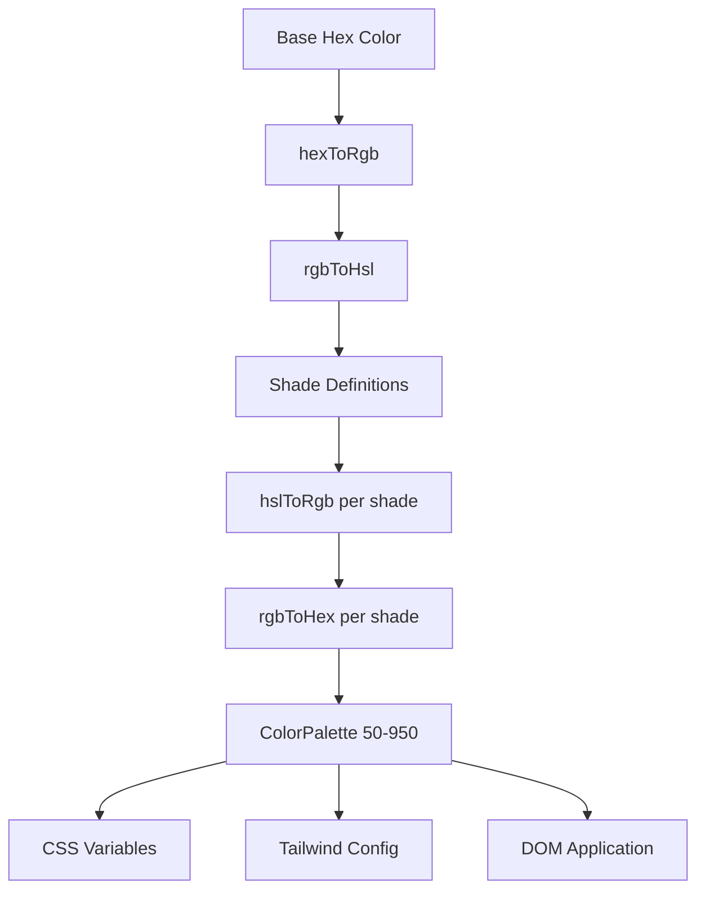

# Sistema di colori

Il modello utilizza un sistema di generazione del colore dinamico che crea tavolozze di colori complete da colori esadecimali di base. Ciò alimenta il motore dei temi e consente la personalizzazione del colore in fase di esecuzione tramite variabili CSS e integrazione CSS Tailwind.

## Panoramica dell'architettura



## File di origine

|Archivio|Scopo|
|------|---------|
|`lib/color-generator.ts`|Generazione della tavolozza principale da colori esadecimali|
|`lib/theme-color-manager.ts`|Applicazione colore a livello di tema e generazione di CSS|
|`lib/theme-utils.ts`|Classi di utilità, assistenti per l'opacità e preimpostazioni di temi|

## Pipeline di conversione del colore

Il sistema converte i colori attraverso rappresentazioni multiple per generare sfumature con precisione. Quattro funzioni di conversione gestiscono l'intero viaggio di andata e ritorno.

```typescript
// Hex -> RGB -> HSL (for manipulation) -> RGB -> Hex (output)
export function hexToRgb(hex: string): { r: number; g: number; b: number };
export function rgbToHsl(r: number, g: number, b: number): { h: number; s: number; l: number };
export function hslToRgb(h: number, s: number, l: number): { r: number; g: number; b: number };
export function rgbToHex(r: number, g: number, b: number): string;
```

Le regolazioni di luminosità e saturazione avvengono nello spazio colore HSL, che fornisce transizioni di tonalità percettivamente uniformi nella tavolozza.

## Definizioni di tonalità

Ogni livello di tonalità ha regolazioni fisse di luminosità e saturazione relative al colore di base (500):

|Ombra|Regolazione luminosità|Regolazione della saturazione|Utilizzo|
|-------|-----------------|-------------------|-------|
| 50 | +45 | -30 |Sfondi più chiari|
| 100 | +40 | -25 |Passa il mouse sugli sfondi|
| 200 | +30 | -20 |Sfondi attivi|
| 300 | +20 | -10 |Confini|
| 400 | +10 | -5 |Testo segnaposto|
| **500** | **0** | **0** |**Colore base**|
| 600 | -10 | +5 |Stati al passaggio del mouse|
| 700 | -20 | +10 |Stati attivi|
| 800 | -30 | +15 |Testo in enfasi|
| 900 | -40 | +20 |Titoli|
| 950 | -45 | +25 |Sfondi più scuri|

## Interfaccia della tavolozza dei colori

```typescript
export interface ColorPalette {
  50: string;
  100: string;
  200: string;
  300: string;
  400: string;
  500: string;  // Base color
  600: string;
  700: string;
  800: string;
  900: string;
  950: string;
}
```

## Generazione di una tavolozza

La funzione `generateColorPalette` accetta qualsiasi colore esadecimale e produce la tavolozza completa di 11 tonalità:

```typescript
import { generateColorPalette } from '@/lib/color-generator';

const palette = generateColorPalette('#3b82f6');
// Returns: { 50: '#e8f0fe', 100: '#d4e4fd', ..., 950: '#0a1d3d' }
```

I valori sono compresi tra 0 e 100 sia per la luminosità che per la saturazione per evitare colori fuori intervallo.

## Generazione di variabili CSS

Il sistema genera proprietà personalizzate CSS per ciascuna tonalità:

```typescript
import { generateCssVariables } from '@/lib/color-generator';

const palette = generateColorPalette('#3b82f6');
const css = generateCssVariables('theme-primary', palette);
// Output:
// --theme-primary: #3b82f6;
// --theme-primary-50: #e8f0fe;
// --theme-primary-100: #d4e4fd;
// ... (all 11 shades)
```

## Integrazione CSS Tailwind

Genera oggetti di configurazione Tailwind che fanno riferimento a variabili CSS:

```typescript
import { generateTailwindConfig } from '@/lib/color-generator';

const config = generateTailwindConfig('theme-primary');
// Returns: {
//   DEFAULT: 'var(--theme-primary)',
//   50: 'var(--theme-primary-50)',
//   100: 'var(--theme-primary-100)',
//   ...
// }
```

## Gestore colore tema

Il modulo `theme-color-manager.ts` applica le tavolozze al DOM in fase di runtime.

### Configurazioni di temi estesi

Quattro temi integrati definiscono i colori di base per primario, secondario, accento, sfondo, superficie e testo:

```typescript
export const EXTENDED_THEME_CONFIGS: Record<ThemeKey, ThemeConfig> = {
  everworks: {
    primary: "#3d70ef",
    secondary: "#00c853",
    accent: "#0056b3",
    background: "#ffffff",
    surface: "#f8f9fa",
    text: "#1a1a1a",
    textSecondary: "#6c757d",
  },
  corporate: { /* ... */ },
  material: { /* ... */ },
  funny: { /* ... */ },
};
```

### Applicazione delle tavolozze al DOM

```typescript
import { applyColorPalette, applyThemeWithPalettes } from '@/lib/theme-color-manager';

// Apply a single color palette
applyColorPalette('theme-primary', '#3d70ef');

// Apply an entire theme (primary + secondary + accent + utility colors)
applyThemeWithPalettes('everworks');
```

La funzione `applyColorPalette` genera anche una variante RGB per il supporto dell'opacità:

```typescript
// Sets both:
// --theme-primary: #3d70ef
// --theme-primary-rgb: 61, 112, 239
```

### Generazione di CSS statici

Per il rendering lato server o la generazione di CSS in fase di compilazione:

```typescript
import { generateThemeCss } from '@/lib/theme-color-manager';

const css = generateThemeCss('everworks');
// Returns full CSS variable string for all theme colors
```

## Classi di utilità tematica

Il modulo `theme-utils.ts` fornisce combinazioni di classi Tailwind predefinite:

```typescript
import { themeClasses } from '@/lib/theme-utils';

// Button variants
themeClasses.button.primary   // "bg-theme-primary hover:bg-theme-accent text-white"
themeClasses.button.secondary // "bg-theme-secondary hover:bg-theme-secondary/80 text-white"
themeClasses.button.outline   // "border-2 border-theme-primary text-theme-primary ..."
themeClasses.button.ghost     // "text-theme-primary hover:bg-theme-primary/10"

// Text variants
themeClasses.text.primary     // "text-theme-text"
themeClasses.text.secondary   // "text-theme-text-secondary"
themeClasses.text.accent      // "text-theme-primary"
```

### Funzioni di aiuto

```typescript
import { withOpacity, getCssVariable, cn, buildThemeClasses } from '@/lib/theme-utils';

// Generate opacity variant
withOpacity('bg-theme-primary', 50); // "bg-theme-primary/50"

// Get CSS variable reference
getCssVariable('theme-primary'); // "var(--theme-primary)"

// Conditional class building
buildThemeClasses('base-class', 'theme-class', {
  'active-class': isActive,
  'disabled-class': isDisabled,
});
```

## Generazione di colori a tema batch

Genera configurazione CSS e Tailwind per più colori contemporaneamente:

```typescript
import { generateThemeColors } from '@/lib/color-generator';

const result = generateThemeColors({
  primary: '#3d70ef',
  secondary: '#00c853',
  accent: '#0056b3',
});

// result.css - Complete CSS variable declarations
// result.tailwind - Tailwind config object for all colors
```

## Applicazione per temi personalizzati

Applica colori arbitrari senza utilizzare i temi preimpostati:

```typescript
import { applyCustomTheme } from '@/lib/theme-color-manager';

applyCustomTheme({
  primary: '#e91e63',
  secondary: '#9c27b0',
  accent: '#673ab7',
});
```

## Gestione degli errori

Il gestore dei colori del tema include un comportamento di fallback:

- Se non viene trovata una chiave del tema, viene utilizzato il tema predefinito `everworks`.
- Se l'applicazione di un tema genera un errore e il tema richiesto non è `everworks`, riprova automaticamente con il tema predefinito.
- Sicurezza SSR: `useThemeWithPalettes` verifica la disponibilità di `window` prima di applicare le modifiche DOM.
