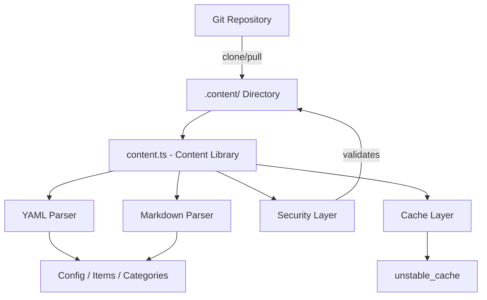
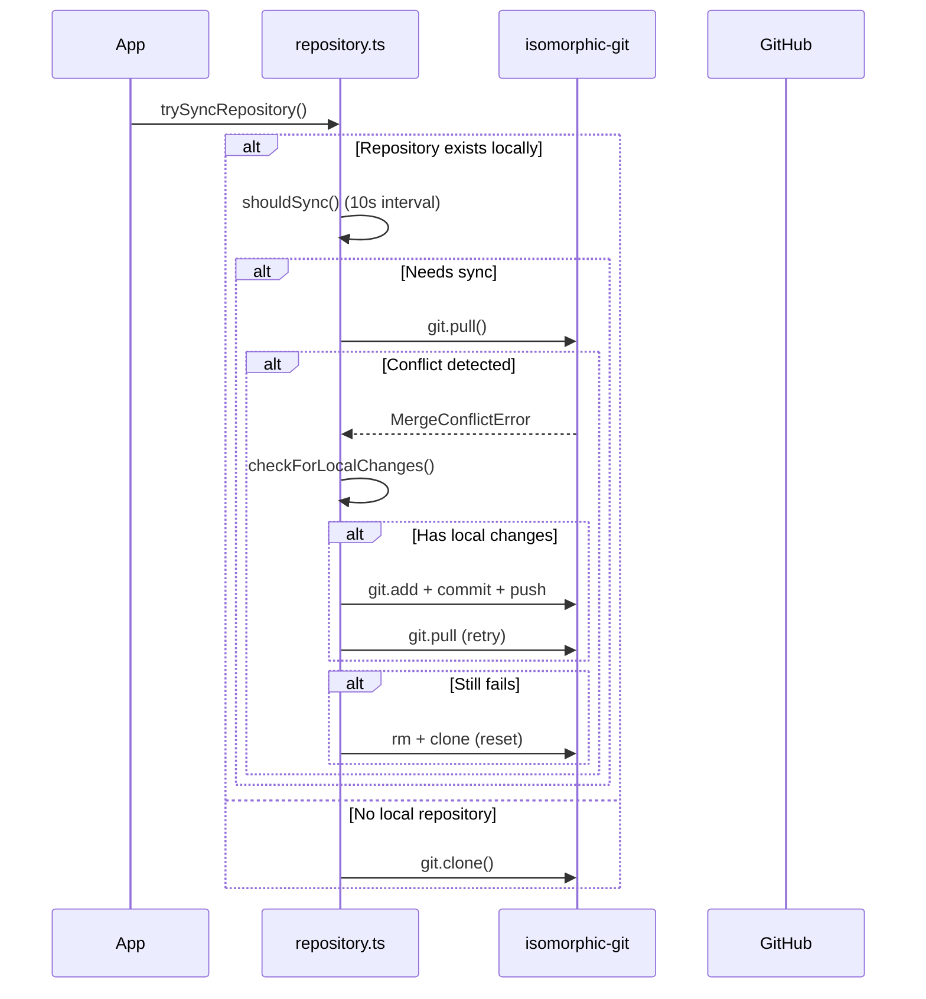

# Libreria dei contenuti

La libreria di contenuti (`lib/content.ts`) fornisce utilità lato server per la lettura, l'analisi e la memorizzazione nella cache dei contenuti da un repository CMS basato su Git. Gestisce file di contenuto YAML/Markdown, gestione della configurazione e sincronizzazione dei contenuti con solide misure di sicurezza.

## Panoramica dell'architettura



## File di origine

|Archivio|Scopo|
|------|---------|
|`lib/content.ts`|Elaborazione, lettura e memorizzazione nella cache dei contenuti principali|
|`lib/repository.ts`|Sincronizzazione clone/pull di Git con repository remoto|
|`lib/lib.ts`|Utilità percorso (`getContentPath`, `fsExists`, `dirExists`)|
|`lib/cache-config.ts`|Tag della cache e configurazione TTL|

## Livello di sicurezza

La libreria di contenuti applica molteplici misure di sicurezza per impedire l'attraversamento del percorso e gli attacchi di injection.

### Convalida del codice della lingua

```typescript
function validateLanguageCode(lang: string): boolean {
  const validLangPattern = /^[a-zA-Z0-9_-]+$/;
  return validLangPattern.test(lang) && lang.length <= 10;
}
```

Sono accettati solo caratteri alfanumerici, trattini e trattini bassi con una lunghezza massima di 10 caratteri.

### Sanificazione del nome file

```typescript
function sanitizeFilename(filename: string): string {
  const sanitized = path.basename(filename);
  if (sanitized.includes('..') || sanitized.includes('/') || sanitized.includes('\\')) {
    throw new Error('Invalid filename: contains dangerous characters');
  }
  return sanitized;
}
```

Utilizza `path.basename` per eliminare i componenti della directory e rifiuta tutti i caratteri di attraversamento rimanenti.

### Convalida del percorso

```typescript
function validatePath(filepath: string, basePath: string): void {
  const resolvedPath = path.resolve(filepath);
  const resolvedBase = path.resolve(basePath);
  if (!resolvedPath.startsWith(resolvedBase + path.sep) && resolvedPath !== resolvedBase) {
    throw new Error('Invalid file path: outside of allowed directory');
  }
}
```

La funzione `safeReadFile` esegue un doppio controllo: convalida il percorso e quindi verifica che il percorso reale risolto (seguendo i collegamenti simbolici) rimanga all'interno della directory di base.

### Convalida dell'URL

```typescript
function isValidUrl(url: string): boolean {
  const trimmed = url.trim();
  if (trimmed.startsWith('/') && !trimmed.startsWith('//')) return true;
  return trimmed.startsWith('http://') || trimmed.startsWith('https://');
}
```

Blocchi `javascript:`, `data:`, `vbscript:` e altri schemi di protocollo pericolosi.

### Convalida delle dimensioni CSS

```typescript
function isValidCssSize(value: string): boolean {
  if (['auto', 'inherit', 'initial', 'unset'].includes(value.trim())) return true;
  return /^\d+(\.\d+)?(px|em|rem|vh|vw|%|pt|cm|mm|in)?$/.test(value.trim());
}
```

Impedisce l'inserimento di CSS tramite campi frontmatter personalizzati dell'eroe.

## Elaborazione dei contenuti

### Analisi YAML

I file di contenuto vengono analizzati utilizzando la libreria `yaml` con convalida dello schema Zod per frontmatter:

```typescript
const customHeroFrontmatterSchema = z.object({
  background_image: z.string().refine(isValidUrl, {
    message: 'Invalid URL: must be http, https, or relative path'
  }).optional(),
  // ... additional validated fields
});
```

### Cache della configurazione

La configurazione del sito viene memorizzata nella cache utilizzando Next.js `unstable_cache` con TTL definiti e tag di cache:

```typescript
import { CACHE_TAGS, CACHE_TTL } from './cache-config';

const getCachedConfig = unstable_cache(
  async () => { /* read and parse config.yml */ },
  [CACHE_TAGS.CONFIG],
  { revalidate: CACHE_TTL }
);
```

## Sincronizzazione del repository Git

Il modulo `repository.ts` gestisce le operazioni Git utilizzando `isomorphic-git`.

### Sincronizza il flusso



### Protezione dal timeout

Tutte le operazioni Git sono racchiuse in timeout configurabili:

```typescript
async function withTimeout<T>(promise: Promise<T>, timeoutMs: number = 120000): Promise<T> {
  const timeoutPromise = new Promise<never>((_, reject) => {
    setTimeout(() => reject(new Error(`Operation timeout after ${timeoutMs}ms`)), timeoutMs);
  });
  return Promise.race([promise, timeoutPromise]);
}
```

### Risoluzione dei conflitti

Il sistema gestisce i conflitti di unione attraverso una strategia in più fasi:

1. **Rileva modifiche locali** tramite `git.statusMatrix()`
2. **Tentare il push** delle modifiche locali prima di eseguire il pull
3. **Riprovare a tirare** dopo aver eseguito con successo il push
4. **Reimpostazione completa** (eliminazione + clonazione) come ultima risorsa

### Comportamento di riserva

Se `DATA_REPOSITORY` non è configurato o la clonazione non riesce, il sistema crea un contenuto di fallback minimo:

```typescript
// Creates empty content directory with minimal config
const DEFAULT_CONFIG = `site_name: Website
item_name: Item
items_name: Items
copyright_year: ${new Date().getFullYear()}
`;
```

## Applicazione solo server

Sia `content.ts` che `repository.ts` utilizzano l'importazione `server-only` per impedire l'utilizzo accidentale sul lato client:

```typescript
'use server';
import 'server-only';
```

Ciò garantisce che le operazioni sui contenuti con accesso al filesystem non si diffondano mai nei bundle client.

## Funzioni chiave esportate

|Funzione|Descrizione|
|----------|-------------|
|`getCachedConfig()`|Restituisce la configurazione del sito memorizzata nella cache da `config.yml`|
|`trySyncRepository()`|Clona o estrae contenuti dal repository Git remoto|
|`pullChanges()`|Estrae le ultime modifiche con la risoluzione dei conflitti|
|`validateLanguageCode()`|Convalida il formato del codice della lingua i18n|
|`sanitizeFilename()`|Rimuove i componenti della directory dai nomi dei file|
|`safeReadFile()`|Legge i file con protezione completa del percorso|
