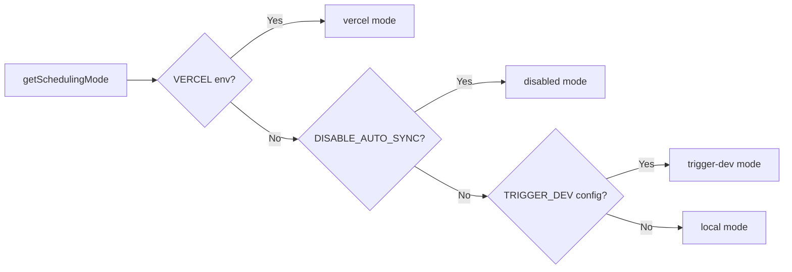

# Sistema Cron Job

## Panoramica

Il modello Ever Works implementa un sistema di lavoro in background flessibile che supporta tre modalità di pianificazione: **Vercel Cron**, **Trigger.dev** e uno **schedulatore locale**. Gli endpoint Cron sono percorsi API Next.js standard autenticati tramite `CRON_SECRET` e il sistema include un modulo di inizializzazione singleton che garantisce che i processi vengano impostati esattamente una volta per processo.

## Architettura

```mermaid
flowchart TD
    A[Scheduling Mode Detection] --> B{getSchedulingMode}

    B -->|vercel| C[Vercel Cron]
    B -->|trigger-dev| D[Trigger.dev]
    B -->|local| E[Local Scheduler]
    B -->|disabled| F[No Jobs]

    C --> G[vercel.json crons]
    G --> G1[/api/cron/sync]
    G --> G2[/api/cron/subscription-reminders]
    G --> G3[/api/cron/subscription-expiration]

    G1 --> H[CRON_SECRET Verification]
    G2 --> H
    G3 --> H

    H -->|Valid| I[Execute Job]
    H -->|Invalid| J[401 Unauthorized]

    I --> I1[triggerManualSync]
    I --> I2[subscriptionRenewalReminderJob]
    I --> I3[processExpiredSubscriptions]

    D --> K[Trigger.dev SDK]
    E --> L[Internal setInterval]

    K --> I
    L --> I
```

## File di origine

|Archivio|Scopo|
|------|---------|
|`template/vercel.json`|Definizioni della pianificazione cron di Vercel|
|`template/app/api/cron/sync/route.ts`|Endpoint cron di sincronizzazione dei contenuti|
|`template/app/api/cron/subscription-reminders/route.ts`|Email di promemoria per il rinnovo|
|`template/app/api/cron/subscription-expiration/route.ts`|Elaborazione dell'abbonamento scaduto|
|`template/app/api/cron/jobs/background-jobs-init.ts`|Inizializzazione del lavoro singleton|

## Configurazione della pianificazione cron

### vercel.json

```json
{
    "crons": [
        {
            "path": "/api/cron/sync",
            "schedule": "0 3 * * *"
        },
        {
            "path": "/api/cron/subscription-reminders",
            "schedule": "0 9 * * *"
        },
        {
            "path": "/api/cron/subscription-expiration",
            "schedule": "0 0 * * *"
        }
    ]
}
```

|Lavoro|Programma|Tempo|Descrizione|
|-----|----------|------|-------------|
|Sincronizzazione dei contenuti| `0 3 * * *` |3:00 UTC tutti i giorni|Sincronizza il contenuto dal CMS basato su Git|
|Promemoria di abbonamento| `0 9 * * *` |9:00 UTC tutti i giorni|Invia e-mail di promemoria per il rinnovo|
|Scadenza dell'abbonamento| `0 0 * * *` |Mezzanotte UTC tutti i giorni|Elabora gli abbonamenti scaduti|

## Autenticazione

### Verifica segreta sicura in termini di tempistica

Tutti gli endpoint cron verificano `CRON_SECRET` utilizzando il confronto timing-safe per prevenire attacchi temporali:

```typescript
import crypto from 'crypto';

function verifyCronSecret(request: NextRequest): boolean {
    const authHeader = request.headers.get('authorization');
    const cronSecret = process.env.CRON_SECRET;

    // Development bypass
    if (!cronSecret && process.env.NODE_ENV === 'development') {
        console.log('[Cron] Bypassing cron auth in development');
        return true;
    }

    if (!cronSecret || !authHeader) return false;

    const expectedValue = `Bearer ${cronSecret}`;

    // Length check before timing-safe comparison
    if (authHeader.length !== expectedValue.length) return false;

    return crypto.timingSafeEqual(
        Buffer.from(authHeader, 'utf8'),
        Buffer.from(expectedValue, 'utf8')
    );
}
```

Principali funzionalità di sicurezza:
- **Confronto temporale** tramite `crypto.timingSafeEqual` -- impedisce agli aggressori di misurare le differenze nei tempi di risposta per indovinare il segreto
- **Pre-controllo della lunghezza** -- `timingSafeEqual` richiede buffer di uguale lunghezza
- **Bypass sviluppo** -- solo quando `CRON_SECRET` non è configurato e `NODE_ENV=development`

### Autenticazione automatica Vercel

Quando distribuita su Vercel, la piattaforma include automaticamente l'intestazione `Authorization: Bearer <CRON_SECRET>` per i processi cron configurati. Devi solo impostare la variabile di ambiente `CRON_SECRET` nella dashboard Vercel.

## Implementazioni lavorative

### Lavoro di sincronizzazione del contenuto

```typescript
export async function GET(request: Request): Promise<NextResponse> {
    const startTime = Date.now();

    // Verify authorization
    if (!isAuthorized) {
        return NextResponse.json({ success: false, message: "Unauthorized" }, { status: 401 });
    }

    try {
        const result = await triggerManualSync();
        const duration = Date.now() - startTime;

        return NextResponse.json({
            success: result.success,
            timestamp: new Date().toISOString(),
            duration,
            message: result.message,
        }, {
            headers: { "Cache-Control": "no-cache, no-store, must-revalidate" },
        });
    } catch (error) {
        return NextResponse.json({
            success: false,
            message: "Cron sync failed",
            details: safeErrorMessage(error, "Unknown error"),
        }, { status: 500 });
    }
}
```

Formato della risposta:
```json
{
    "success": true,
    "timestamp": "2025-01-15T03:00:05.123Z",
    "duration": 5123,
    "message": "Sync completed successfully"
}
```

### Lavoro di scadenza dell'abbonamento

Questo processo elabora gli abbonamenti scaduti e invia e-mail di notifica:

```typescript
export async function GET(request: NextRequest) {
    if (!verifyCronSecret(request)) {
        return NextResponse.json({ success: false, message: 'Unauthorized' }, { status: 401 });
    }

    // 1. Find and update expired subscriptions
    const result = await subscriptionService.processExpiredSubscriptions();

    // 2. Send notification emails
    const { service: emailService } = await createEmailService();
    if (emailService.isServiceAvailable()) {
        for (const subscription of result.subscriptions) {
            const user = await getUserById(subscription.userId);
            const emailTemplate = getSubscriptionExpiredTemplate({ /* ... */ });
            await sendEmailSafely(emailService, emailConfig, emailTemplate, user.email);
        }
    }

    // 3. Return results
    return NextResponse.json({
        success: true,
        data: {
            processed: result.processed,
            affectedUsers,
            errors: result.errors,
            timestamp: new Date().toISOString()
        }
    });
}
```

Comportamenti chiave:
- Gli errori di posta elettronica non causano il fallimento del lavoro
- Anche il metodo `POST` viene esportato come alias per i trigger manuali
- Restituisce `207 Multi-Status` per successi parziali

### Lavoro di promemoria di abbonamento

```typescript
export async function GET(request: NextRequest) {
    if (!verifyCronSecret(request)) {
        return NextResponse.json({ error: 'Unauthorized' }, { status: 401 });
    }

    const result = await subscriptionRenewalReminderJob();

    if (!result.success) {
        return NextResponse.json(
            { error: 'Job completed with errors', ...result },
            { status: 207 }  // Multi-Status for partial success
        );
    }

    return NextResponse.json({
        message: 'Subscription reminder job completed',
        ...result
    });
}

// Support POST for Vercel Cron
export async function POST(request: NextRequest) {
    return GET(request);
}
```

## Inizializzazione dei lavori in background

### Modello Singleton

Il modulo di inizializzazione utilizza `globalThis` per garantire che i processi vengano impostati esattamente una volta, anche attraverso invocazioni di funzioni serverless:

```typescript
const GLOBAL_KEY = '__BACKGROUND_JOBS_INIT__' as const;

interface BackgroundJobsGlobalState {
    initializationState: 'pending' | 'initializing' | 'completed';
    initializationPromise: Promise<void> | null;
    loggedMode: SchedulingMode | null;
}

export async function ensureBackgroundJobsInitialized(): Promise<void> {
    // Skip during tests and builds
    if (process.env.NODE_ENV === 'test') return;
    if (process.env.NEXT_PHASE === 'phase-production-build') return;

    const state = getGlobalState();

    // Fast path: already completed
    if (state.initializationState === 'completed') return;

    // Wait for in-progress initialization
    if (state.initializationState === 'initializing') {
        return state.initializationPromise;
    }

    // Start initialization
    state.initializationState = 'initializing';
    state.initializationPromise = doInitialize();

    try {
        await state.initializationPromise;
        state.initializationState = 'completed';
    } catch (error) {
        state.initializationState = 'pending'; // Allow retry
        throw error;
    }
}
```

### Modalità di pianificazione



|Modalità|Comportamento|
|------|----------|
|`vercel`|Lavori gestiti da Vercel Cron tramite endpoint HTTP|
|`trigger-dev`|Lavori gestiti dallo scheduler cloud Trigger.dev|
|`local`|Scheduler interno basato su `setInterval` per lo sviluppo|
|`disabled`|Nessuna programmazione automatica (`DISABLE_AUTO_SYNC=true`)|

## Variabili d'ambiente

|Variabile|Obbligatorio|Descrizione|
|----------|----------|-------------|
|`CRON_SECRET`|Solo produzione|Token portatore per l'autenticazione cron|
|`DISABLE_AUTO_SYNC`|No|Impostare su `true` per disabilitare tutti i processi in background|
|`VERCEL`|Impostazione automatica|Impostato automaticamente dalla piattaforma Vercel|

## Migliori pratiche

1. **Utilizza sempre il confronto temporale** per i segreti cron: previene gli attacchi temporali
2. **Esporta sia GET che POST** -- Vercel Cron può utilizzare entrambi i metodi
3. **Imposta `Cache-Control: no-cache`** nelle risposte: impedisce la memorizzazione nella cache dei risultati del lavoro
4. **Registra durata del lavoro**: aiuta a identificare le regressioni delle prestazioni
5. **Gestisci gli errori di posta elettronica con garbo**: non lasciare che gli errori di notifica blocchino il lavoro
6. **Utilizzare `207 Multi-Status`** per successi parziali -- distingue dal successo/fallimento completo
