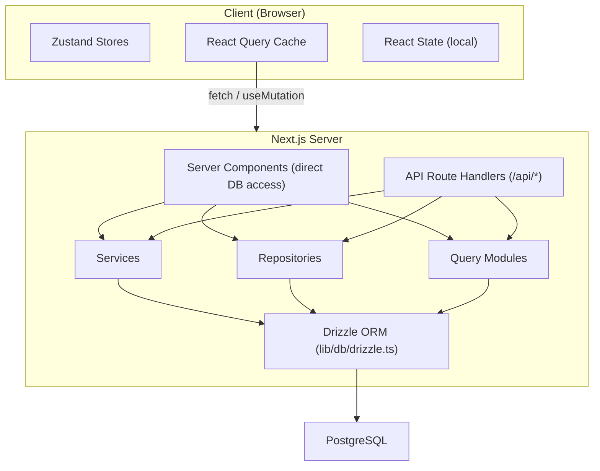

# Flusso di dati e gestione dello stato

Questo documento descrive il modo in cui i dati fluiscono attraverso il modello Ever Works, dal database all'interfaccia utente, coprendo i componenti del server, i percorsi API, React Query, gli archivi Zustand e il modello di repository.

## Panoramica dell'architettura

Il modello utilizza un'architettura dati a più livelli:



## Recupero dati lato server

### Componenti server (accesso diretto al database)

I componenti server nella directory `app/` possono importare e chiamare direttamente funzioni di query del database o metodi di repository. Questo è il percorso più efficiente perché evita round trip HTTP non necessari.

```typescript
// app/[locale]/admin/items/page.tsx (simplified)
import { getItems } from '@/lib/db/queries';

export default async function AdminItemsPage() {
  const items = await getItems();
  return <ItemsList items={items} />;
}
```

### Gestori di route API

Le route API in `app/api/` fungono da ponte tra i componenti client e la logica lato server. Seguono uno schema di gestore sottile: convalidano l'input, chiamano il servizio o il repository appropriato e restituiscono una risposta HTTP.

```typescript
// Typical API route pattern
export async function GET(request: NextRequest) {
  const session = await auth();
  if (!session?.user) {
    return NextResponse.json({ error: 'Unauthorized' }, { status: 401 });
  }

  const data = await someRepository.findAll();
  return NextResponse.json({ success: true, data });
}
```

## Gestione dello stato lato client

### Query TanStack (query di reazione 5)

React Query è lo strumento principale per la gestione dello stato del server lato client. Il modello lo utilizza ampiamente tramite hook personalizzati nella directory `hooks/`.

**Configurazione globale** (`lib/react-query-config.ts`):
- Tempo di inattività predefinito: 5 minuti
- Tempo di raccolta dei rifiuti: 10 minuti
- Nuovo tentativo automatico con backoff esponenziale (fino a 3 tentativi)
- Recupera il focus della finestra e riconnettiti
- Nessun nuovo tentativo in caso di errori client 4xx

**Modello di hook**: Ogni area di funzionalità ha hook dedicati che racchiudono React Query:

```typescript
// hooks/use-admin-items.ts (simplified pattern)
import { useQuery, useMutation, useQueryClient } from '@tanstack/react-query';

export function useAdminItems(params) {
  return useQuery({
    queryKey: ['admin', 'items', params],
    queryFn: () => fetch('/api/admin/items').then(r => r.json()),
    staleTime: 5 * 60 * 1000,
  });
}

export function useCreateItem() {
  const queryClient = useQueryClient();
  return useMutation({
    mutationFn: (data) => fetch('/api/admin/items', {
      method: 'POST',
      body: JSON.stringify(data),
    }).then(r => r.json()),
    onSuccess: () => {
      queryClient.invalidateQueries({ queryKey: ['admin', 'items'] });
    },
  });
}
```

### Negozi Zustand

Zustand viene utilizzato per lo stato dell'interfaccia utente solo client che non richiede la sincronizzazione del server. Gli esempi includono:

- **Stato tema**: preferenza modalità chiaro/scuro
- **Stato filtro**: selezioni di filtri attivi
- **Stato modale**: stato aperto/chiuso per modali e sovrapposizioni
- **Preferenze di layout**: visualizzazione a griglia o a elenco, stato della barra laterale

### Reagire al contesto

I provider di contesto React in `components/context/` e `components/providers/` forniscono lo stato condiviso alle sottostrutture dei componenti. Il wrapper del provider root (`app/[locale]/providers.tsx`) è composto:

- Provider di query React (con client di query)
- Fornitore di temi
- Provider della sessione di autenticazione
- Fornitore di notifiche toast

## Livelli di accesso ai dati

### Modello di deposito

I repository in `lib/repositories/` forniscono un'astrazione pulita sulle operazioni del database. Ogni repository incapsula le query per un'entità di dominio specifica.

```
lib/repositories/
├── admin-analytics-optimized.repository.ts
├── admin-stats.repository.ts
├── category.repository.ts
├── client-dashboard.repository.ts
├── client-item.repository.ts
├── collection.repository.ts
├── integration-mapping.repository.ts
├── item.repository.ts
├── role.repository.ts
├── sponsor-ad.repository.ts
├── tag.repository.ts
├── twenty-crm-config.repository.ts
└── user.repository.ts
```

### Moduli di interrogazione

La directory `lib/db/queries/` contiene oltre 23 moduli di query organizzati per dominio. Questi forniscono funzioni di query ORM Drizzle grezze utilizzate da repository e servizi.

### Livello servizi

La directory `lib/services/` contiene oltre 30 file di servizio che implementano la logica aziendale. I servizi orchestrano più repository, chiamate API esterne ed effetti collaterali (e-mail, notifiche, webhook).

## Architettura client API

### Client API lato server

`lib/api/server-api-client.ts` fornisce un client HTTP centralizzato per le chiamate lato server con:
- Nuovo tentativo automatico con backoff esponenziale
- Timeout configurabili (predefinito 30 secondi)
- Accesso strutturato in fase di sviluppo
- Normalizzazione degli errori

### Client API lato browser

`lib/api/api-client.ts` e `lib/api/api-client-class.ts` forniscono l'astrazione API lato client utilizzata dagli hook React Query per chiamare le route API.

## Dati sui contenuti (CMS basato su Git)

Il contenuto dell'elemento (elenchi di directory) è archiviato in un repository Git e gestito tramite `lib/content.ts` e `lib/repository.ts`. Questo contenuto viene clonato in `.content/` in fase di creazione e sincronizzato periodicamente. Il sistema di contenuti utilizza `isomorphic-git` per le operazioni Git direttamente da Node.js.

## Strategia della cache

Il modello implementa un approccio di memorizzazione nella cache multilivello:

1. **Cache delle query di reazione**: lato client con tempi di stallo/GC configurabili per query
2. **Cache Next.js**: rendering lato server e cache dei dati tramite `lib/cache-config.ts`
3. **Invalidazione cache**: invalidazione mirata tramite `lib/cache-invalidation.ts` utilizzando tag di riconvalida
4. **Pool di connessioni database**: configurato in `lib/db/drizzle.ts` con dimensioni del pool comprese tra 1 e 50 connessioni
