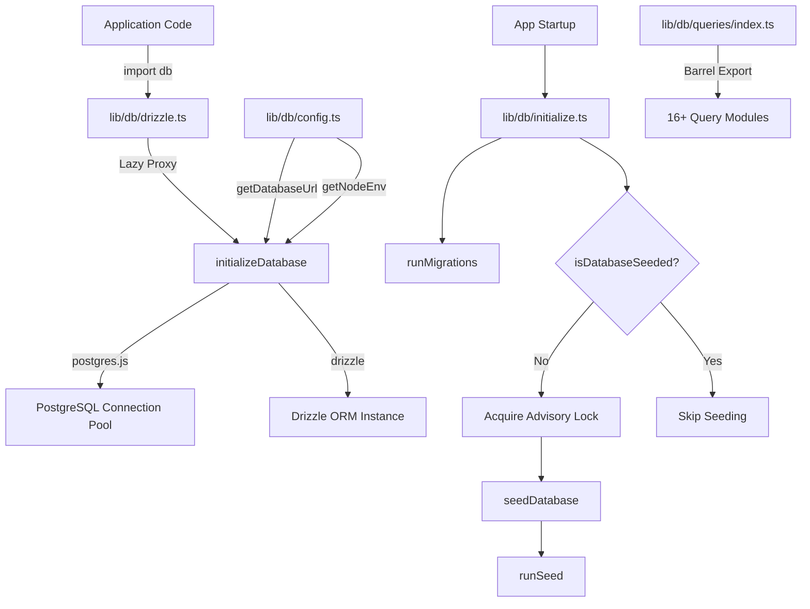
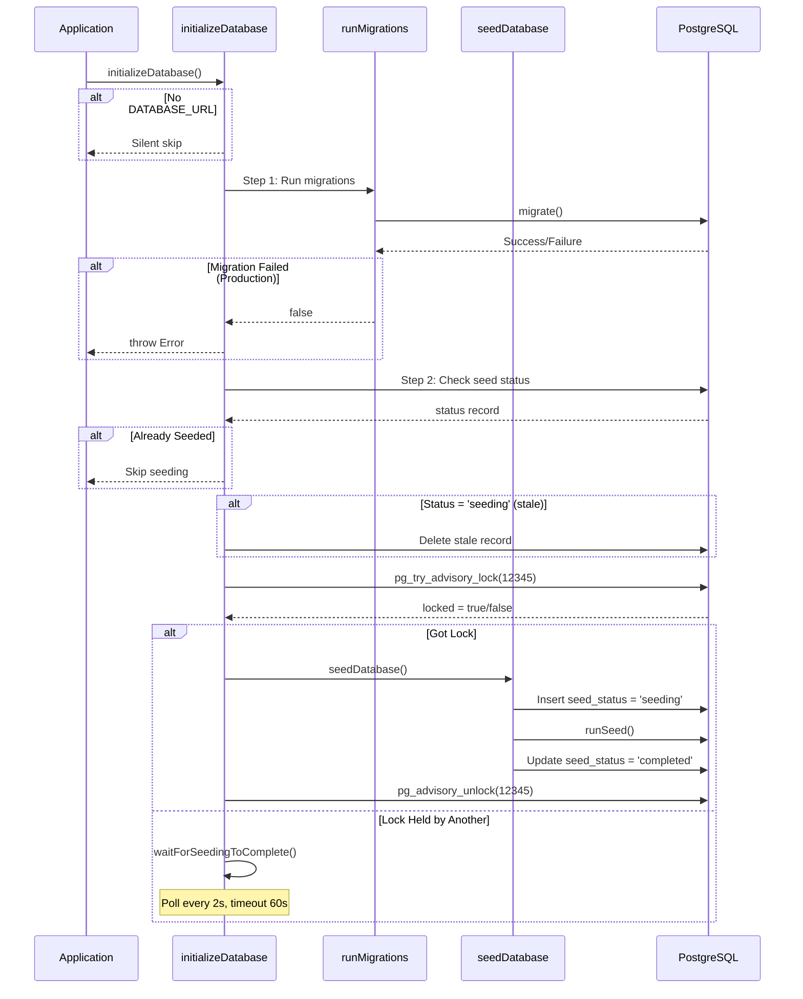

# Modulo Utilità database

Il modulo delle utilità del database (`template/lib/db/`) gestisce il pooling delle connessioni PostgreSQL tramite `postgres.js`, l'inizializzazione di Drizzle ORM, le migrazioni automatizzate e il seeding del database con blocco sicuro della concorrenza. È progettato per funzionare in ambienti serverless (Vercel) in cui più avviamenti a freddo possono gareggiare per inizializzare il database.

## Panoramica dell'architettura



## File di origine

|Archivio|Descrizione|
|------|-------------|
|`lib/db/config.ts`|Configurazione del database script-safe (no `server-only`)|
|`lib/db/drizzle.ts`|Pool di connessioni e istanza Drizzle con proxy lazy|
|`lib/db/initialize.ts`|Migrazione automatica e orchestrazione del seeding|
|`lib/db/migrate.ts`|Corridore di migrazione|
|`lib/db/queries/index.ts`|Esportazione di barili per tutti i moduli di query|

## Configurazione del database (`config.ts`)

Funzioni script-safe che **non** importano `server-only`, consentendo l'uso nella migrazione e negli script seed:

```typescript
function getDatabaseUrl(): string | undefined;
function getNodeEnv(): 'development' | 'production' | 'test';
function isProduction(): boolean;
```

## Connessione e ORM (`drizzle.ts`)

### Modello proxy pigro

L'esportazione `db` utilizza un JavaScript `Proxy` per rinviare l'inizializzazione della connessione fino al primo utilizzo. Ciò impedisce errori di connessione durante la fase di creazione quando `DATABASE_URL` potrebbe non essere disponibile.

```typescript
// Proxy intercepts all property access and initializes on demand
export const db = new Proxy({} as ReturnType<typeof drizzle>, {
  get(target, prop) {
    const database = initializeDatabase();
    return database[prop as keyof typeof database];
  },
});
```

### Configurazione del pool di connessioni

```typescript
function getPoolSize(): number;
// - Reads DB_POOL_SIZE env var (clamped to 1-50)
// - Defaults: 20 (production), 10 (development)
```

Impostazioni della piscina:
- `idle_timeout`: 20 secondi
- `connect_timeout`: 30 secondi
- `prepare`: false (richiesto per alcuni ambienti serverless)

### Singleton tramite `globalThis`

La connessione viene memorizzata nella cache su `globalThis` per sopravvivere ai ricaricamenti del modulo hot Next.js in fase di sviluppo:

```typescript
const globalForDb = globalThis as unknown as {
  conn: postgres.Sql | undefined;
  db: ReturnType<typeof drizzle> | undefined;
};
```

### Accesso diretto all'istanza

Per i casi che richiedono l'istanza Drizzle effettiva (ad esempio, l'adattatore Drizzle NextAuth.js):

```typescript
import { getDrizzleInstance } from '@/lib/db/drizzle';

const adapter = DrizzleAdapter(getDrizzleInstance(), { ... });
```

## Runner di migrazione (`migrate.ts`)

### `runMigrations(): Promise<boolean>`

Esegue le migrazioni di Drizzle dalla cartella `./lib/db/migrations`. Sicuro da chiamare a ogni startup perché `migrate()` di Drizzle è idempotente: tiene traccia delle migrazioni applicate in una tabella `__drizzle_migrations`.

```typescript
import { runMigrations } from '@/lib/db/migrate';

const success = await runMigrations();
if (!success) {
  console.error('Migrations failed -- run pnpm db:migrate manually');
}
```

**Comportamento:**
- Registra la cronologia recente della migrazione prima e dopo l'esecuzione
- Restituisce `true` in caso di successo, `false` in caso di fallimento
- Non genera eccezioni: gli errori vengono registrati e restituiti come valori booleani

## Inizializzazione del database (`initialize.ts`)

### `initializeDatabase(): Promise<void>`

La funzione di inizializzazione principale richiamata all'avvio dell'applicazione. Gestisce l'intero ciclo di vita:



### Sicurezza della concorrenza

È possibile avviare più istanze serverless contemporaneamente. Il modulo impedisce il seeding duplicato utilizzando:

1. **Blocco consultivo PostgreSQL** (`pg_try_advisory_lock(12345)`) -- non bloccante
2. **Tabella stato seme** monitoraggio `seeding`, `completed`, `failed` stati
3. **Rilevamento obsoleto** -- Soglia di 5 minuti per lo stato `seeding` bloccato
4. **Wait-and-poll** -- istanze che non possono acquisire il poll di blocco ogni 2 secondi

### Funzioni di aiuto

```typescript
// Check if database has been successfully seeded
async function isDatabaseSeeded(): Promise<boolean>;

// Wait for another instance to finish seeding (60s timeout, 2s intervals)
async function waitForSeedingToComplete(): Promise<boolean>;
```

## Moduli di interrogazione

La directory `lib/db/queries/` contiene moduli di query specifici del dominio, tutti riesportati tramite `index.ts`:

|Modulo|Dominio|
|--------|--------|
|`activity.queries.ts`|Registrazione delle attività|
|`auth.queries.ts`|Autenticazione (ricerca utente, verifica password)|
|`client.queries.ts`|Profili dei clienti|
|`comment.queries.ts`|Commenti|
|`company.queries.ts`|Profili aziendali|
|`dashboard.queries.ts`|Statistiche del dashboard|
|`engagement.queries.ts`|Visualizzazioni, voti, aggregazione dei preferiti|
|`item.queries.ts`|Articolo CRUD|
|`location-index.queries.ts`|Indicizzazione basata sulla posizione|
|`newsletter.queries.ts`|Iscrizioni alla newsletter|
|`payment.queries.ts`|Registrazioni dei pagamenti|
|`report.queries.ts`|Rapporti|
|`subscription.queries.ts`|Abbonamenti|
|`survey.queries.ts`|Sondaggi e risposte|
|`user.queries.ts`|Gestione utenti|
|`vote.queries.ts`|Sistema di voto|

### Importa modello

```typescript
import {
  getUserByEmail,
  getClientProfileByUserId,
  logActivity,
  isUserAdmin,
} from '@/lib/db/queries';
```

## Variabili d'ambiente

|Variabile|Obbligatorio|Descrizione|
|----------|----------|-------------|
|`DATABASE_URL`|No (DB opzionale)|Stringa di connessione PostgreSQL|
|`DB_POOL_SIZE`|No|Dimensioni del pool di connessioni (impostazione predefinita: 10/20)|
|`NODE_ENV`|No|Determina le impostazioni predefinite e la registrazione delle dimensioni del pool|
