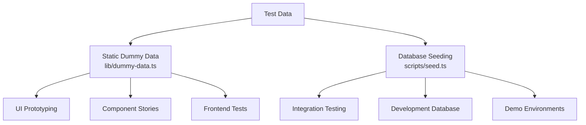
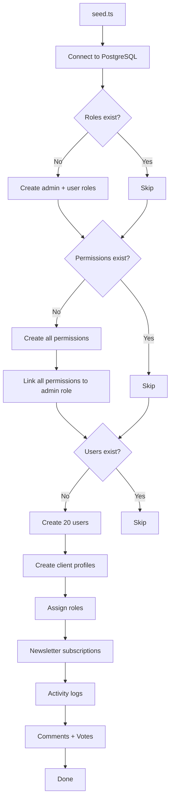
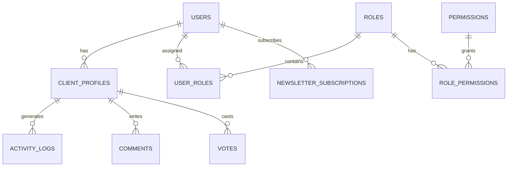

# Sistema di dati fittizi

Il modello fornisce due approcci per testare i dati: dati fittizi statici per lo sviluppo e la prototipazione dell'interfaccia utente e un sistema di seeding del database per generare record realistici in PostgreSQL. Insieme coprono l'intero ciclo di vita dello sviluppo, dai mockup ai test di integrazione.

## Panoramica



## Dati fittizi statici

Il modulo `lib/dummy-data.ts` esporta dati di esempio digitati da utilizzare nei componenti durante lo sviluppo.

### Interfaccia di invio

```typescript
export interface Submission {
  id: string;
  title: string;
  description: string;
  status: "approved" | "pending" | "rejected";
  submittedAt: string | null;
  approvedAt?: string;
  rejectedAt?: string;
  rejectionReason?: string;
  category: string;
  tags: string[];
  views: number;
  likes: number;
}
```

### dummySubmissions

Sei esempi di invii che coprono tutti gli stati di stato:

|ID|Titolo|Stato|Categoria|Viste|Mi piace|
|---|---|---|---|---|---|
| 1 |Moderna piattaforma di e-commerce|approvato|Sviluppo Web| 1250 | 89 |
| 2 |Applicazione per la gestione delle attività|in sospeso|Sviluppo mobile| 567 | 23 |
| 3 |Cruscotto meteo|rifiutato|Sviluppo Web| 890 | 45 |
| 4 |Assistente chat AI|approvato|IA/ML| 2100 | 156 |
| 5 |Applicazione per il monitoraggio del fitness|in sospeso|Sviluppo mobile| 432 | 18 |
| 6 |Piattaforma blog|in sospeso|Sviluppo Web| 0 | 0 |

Utilizzo nei componenti:

```typescript
import { dummySubmissions } from '@/lib/dummy-data';

export function SubmissionList() {
  return (
    <div>
      {dummySubmissions.map((submission) => (
        <SubmissionCard key={submission.id} submission={submission} />
      ))}
    </div>
  );
}
```

### dummyPortfolio

Tre elementi di portfolio di esempio per mostrare le schede progetto:

|ID|Titolo|In primo piano|Tag|
|---|---|---|---|
| 1 |Piattaforma di commercio elettronico|Sì|Next.js, Stripe, e-commerce|
| 2 |Applicazione per la gestione delle attività|Sì|Reagisci, Firebase, in tempo reale|
| 3 |Cruscotto meteo|No|Vue.js, API meteo, dashboard|

Ogni elemento del portafoglio include:

```typescript
{
  id: string;
  title: string;
  description: string;
  imageUrl: string;      // Unsplash placeholder image
  externalUrl: string;   // Demo link
  tags: string[];
  isFeatured: boolean;
}
```

## Semina del database

Lo script `scripts/seed.ts` genera dati realistici direttamente in PostgreSQL utilizzando Drizzle ORM.

### Semina di architettura



### Relazioni tra dati



### Profili utente generati

La seminatrice crea profili con variazione deterministica:

```typescript
// Plan distribution
plan: i % 5 === 0 ? 'premium'    // 20% premium
    : i % 3 === 0 ? 'standard'   // ~13% standard
    : 'free';                     // ~67% free

// Job titles alternate
jobTitle: i % 2 === 0 ? 'Developer' : 'Designer';

// Companies alternate
company: i % 2 === 0 ? 'Acme Inc.' : 'Globex';

// Bios for every 3rd user
bio: i % 3 === 0 ? 'Power user' : null;
```

### Modelli di registro attività

I registri delle attività passano attraverso quattro tipi di azioni:

|Modello di indice|Azione|Descrizione|
|---|---|---|
|`i % 4 === 0`|`SIGN_UP`|Creazione dell'account|
|`i % 4 === 1`|`SIGN_IN`|Evento di accesso|
|`i % 4 === 2`|`COMMENT`|Commento pubblicato|
|`i % 4 === 3`|`VOTE`|Voto espresso|

I timestamp vengono randomizzati negli ultimi 7 giorni.

### Distribuzione dei voti

I voti utilizzano una suddivisione 75/25 che favorisce i voti positivi:

```typescript
voteType: i % 4 === 0 ? VoteType.DOWNVOTE : VoteType.UPVOTE
```

### Configurazione della connessione

Il seeder utilizza impostazioni di connessione conservative adatte agli script:

```typescript
const conn = postgres(databaseUrl, {
  max: 1,              // Single connection (no pool needed)
  idle_timeout: 20,    // Close idle connections after 20s
  connect_timeout: 10, // 10-second connection timeout
  prepare: false,      // Disable prepared statements
});
```

## Semina di prodotti a strisce

Lo script `scripts/seed-stripe-products.ts` crea il catalogo di fatturazione in Stripe. Consulta la documentazione [Script del database](../development/database-scripts.md) per l'elenco completo dei prodotti.

## Idempotenza

Entrambi gli approcci di seeding sono progettati per essere sicuri per l'esecuzione ripetuta:

|Tipo di dati|Condizione di guardia|Comportamento alla riesecuzione|
|---|---|---|
|Ruoli|`SELECT * FROM roles LIMIT 1`|Salta se ne esistono|
|Autorizzazioni|`SELECT * FROM permissions LIMIT 1`|Salta se ne esistono|
|Utenti|`SELECT count(*) FROM users`|Salta se conteggio > 0|
|Notiziario|Incluso nel blocco di creazione dell'utente|Saltato con gli utenti|

## Utilizzo di dati fittizi nello sviluppo

### Modello 1: prototipazione dei componenti

Utilizza dati fittizi statici per creare componenti dell'interfaccia utente prima che il backend sia pronto:

```typescript
import { dummySubmissions, type Submission } from '@/lib/dummy-data';

interface SubmissionCardProps {
  submission: Submission;
}

export function SubmissionCard({ submission }: SubmissionCardProps) {
  const statusColors = {
    approved: 'bg-green-100 text-green-800',
    pending: 'bg-yellow-100 text-yellow-800',
    rejected: 'bg-red-100 text-red-800',
  };

  return (
    <div className="p-4 border rounded-lg">
      <h3>{submission.title}</h3>
      <span className={statusColors[submission.status]}>
        {submission.status}
      </span>
      <p>{submission.description}</p>
      <div className="flex gap-2">
        {submission.tags.map(tag => (
          <span key={tag} className="badge">{tag}</span>
        ))}
      </div>
    </div>
  );
}
```

### Modello 2: modelli di dashboard

```typescript
import { dummySubmissions } from '@/lib/dummy-data';

// Derive stats from dummy data
const stats = {
  total: dummySubmissions.length,
  approved: dummySubmissions.filter(s => s.status === 'approved').length,
  pending: dummySubmissions.filter(s => s.status === 'pending').length,
  rejected: dummySubmissions.filter(s => s.status === 'rejected').length,
  totalViews: dummySubmissions.reduce((sum, s) => sum + s.views, 0),
};
```

### Modello 3: Sostituisci con dati reali

Quando l'integrazione del backend è pronta, scambia l'importazione:

```typescript
// Before (dummy data)
import { dummySubmissions } from '@/lib/dummy-data';
const submissions = dummySubmissions;

// After (real data)
const submissions = await getSubmissions();
```

## Aggiunta di nuovi dati fittizi

Quando aggiungi nuove funzionalità, estendi `lib/dummy-data.ts` con dati di esempio digitati:

1. Definire l'interfaccia TypeScript per la forma dei dati
2. Esportarlo per utilizzarlo nei componenti
3. Creare voci di esempio che coprano casi limite (campi vuoti, stringhe di lunghezza massima, tutti i valori di stato)
4. Utilizza valori realistici (nomi propri, URL validi, numeri ragionevoli)
5. Includi sia gli articoli in evidenza che quelli non in evidenza, ove applicabile

```typescript
// Example: adding dummy reviews
export interface DummyReview {
  id: string;
  authorName: string;
  rating: number;
  comment: string;
  createdAt: string;
}

export const dummyReviews: DummyReview[] = [
  {
    id: "1",
    authorName: "Jane Developer",
    rating: 5,
    comment: "Excellent tool for rapid prototyping",
    createdAt: "2024-02-01T10:00:00Z"
  },
  // ... more entries covering 1-star, no comment, etc.
];
```
