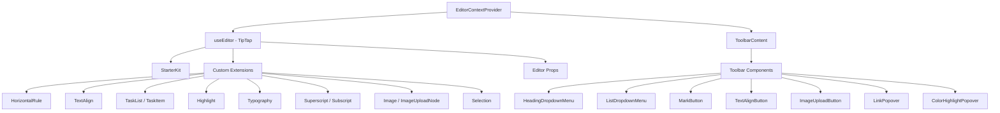

# Sistema editore

Il modello include un editor di testo ricco basato su TipTap (ProseMirror) con un'architettura modulare di estensioni, componenti della barra degli strumenti, hook e funzioni di utilità. L'editor supporta intestazioni, elenchi, elenchi di attività, immagini, blocchi di codice, formattazione del testo e altro.

## Panoramica dell'architettura



## File di origine

|Direttorio|Contenuto|
|-----------|----------|
|`lib/editor/extensions/`|Riesportazione e configurazione dell'estensione TipTap|
|`lib/editor/components/`|Componenti dell'interfaccia utente (pulsanti della barra degli strumenti, popover, icone)|
|`lib/editor/hooks/`|Hook React per la gestione dello stato dell'editor|
|`lib/editor/providers/`|Provider di contesto dell'editor con configurazione dell'estensione|
|`lib/editor/contents/`|Layout della barra degli strumenti e componenti del contenuto dell'editor|
|`lib/editor/utils/`|Funzioni di utilità (scorciatoie, convalida, caricamento)|

## Configurazione dell'estensione

Gli interni sono registrati in `EditorContextProvider`. `StarterKit` fornisce funzionalità di base, con estensioni aggiuntive sovrapposte:

```typescript
const extensions = useMemo(() => [
  StarterKit.configure({
    horizontalRule: false,
    link: { openOnClick: false, enableClickSelection: true },
  }),
  HorizontalRule,
  TextAlign.configure({ types: ['heading', 'paragraph'] }),
  ImageUploadNode.configure({
    accept: 'image/*',
    maxSize: MAX_FILE_SIZE, // 5MB
    limit: 3,
    upload: handleImageUpload,
    onError: (error) => console.error('Upload failed:', error),
  }),
  TaskList,
  TaskItem.configure({ nested: true }),
  Highlight.configure({ multicolor: true }),
  Image,
  Typography,
  Superscript,
  Subscript,
  Selection,
], []);
```

### Riepilogo dell'estensione

|Estensione|Fonte|Scopo|
|-----------|--------|---------|
|`StarterKit`|`@tiptap/starter-kit`|Paragrafi, grassetto, corsivo, elenchi, codice, virgolette|
|`HorizontalRule`|`@tiptap/extension-horizontal-rule`|Divisori orizzontali|
|`TextAlign`|`@tiptap/extension-text-align`|Sinistra, centro, destra, giustifica l'allineamento|
|`TaskList` / `TaskItem`|`@tiptap/extension-list`|Elenchi di caselle di controllo interattive|
|`Highlight`|`@tiptap/extension-highlight`|Evidenziazione del testo multicolore|
|`Typography`|`@tiptap/extension-typography`|virgolette intelligenti, trattini, puntini di sospensione|
|`Superscript`|`@tiptap/extension-superscript`|Testo in apice|
|`Subscript`|`@tiptap/extension-subscript`|Testo in pedice|
|`Selection`|`@tiptap/extensions`|Gestione della selezione migliorata|
|`Image`|`@tiptap/extension-image`|Visualizzazione di immagini statiche|
|`ImageUploadNode`|Personalizzato|Caricamento delle immagini tramite trascinamento con avanzamento|

## Provider del contesto dell'editor

L'editor viene fornito tramite React Context per l'accesso a tutto l'albero:

```typescript
export const EditorContext = createContext<Editor | null>(null);

export function EditorContextProvider({ children }: { children: React.ReactNode }) {
  const editor = useEditor({
    immediatelyRender: false,
    shouldRerenderOnTransaction: false,
    editorProps: {
      attributes: {
        autocomplete: 'on',
        autocorrect: 'on',
        autocapitalize: 'off',
        'aria-label': 'Main content area, start typing to enter text.',
        class: cn('min-h-96'),
      },
    },
    extensions,
  });

  return <EditorContext.Provider value={editor}>{children}</EditorContext.Provider>;
}
```

Scelte chiave di configurazione:
- `immediatelyRender: false` previene le discrepanze nell'idratazione dell'SSR
- `shouldRerenderOnTransaction: false` ottimizza le prestazioni evitando nuovi rendering non necessari

## Configurazione della barra degli strumenti

Il componente `ToolbarContent` definisce il layout completo della barra degli strumenti organizzata in gruppi:

|Gruppo|Componenti|
|-------|------------|
|Storia|Annulla, ripeti|
|Tipi di blocco|Elenco a discesa intestazione (H1-H4), elenco a discesa (elenco puntato, ordinato, attività), Blockquote, Blocco codice|
|Marchi in linea|Grassetto, Corsivo, Barrato, Codice, Sottolineato, Evidenziazione a colori, Collegamento|
|Copione|Apice, pedice|
|Allineamento|Sinistra, Centro, Destra, Giustifica|
|Media|Caricamento immagini|

I gruppi sono separati dai componenti `ToolbarSeparator` con gli elementi `Spacer` per il posizionamento.

## Ganci dell'editore

### `useTiptapEditor`

Fornisce accesso flessibile all'istanza dell'editor sia da oggetti di scena che dal contesto:

```typescript
export function useTiptapEditor(providedEditor?: Editor | null): {
  editor: Editor | null;
  editorState?: Editor["state"];
  canCommand?: Editor["can"];
}
```

Questo hook unisce un editor fornito direttamente con l'editor di contesto, consentendo ai componenti di funzionare sia in modo autonomo che all'interno dell'albero del provider.

### Ganci aggiuntivi

|Gancio|Scopo|
|------|---------|
|`use-editor.ts`|Gestione dello stato dell'editor principale|
|`use-editor-sync.ts`|Sincronizzazione tra istanze dell'editor|
|`use-cursor-visibility.ts`|Posizione del cursore e tracciamento della visibilità|
|`use-element-rect.ts`|Tracciamento del rettangolo di delimitazione dell'elemento|
|`use-scrolling.ts`|Posizione e comportamento dello scorrimento|
|`use-throttled-callback.ts`|Esecuzione della richiamata limitata|
|`use-window-size.ts`|Monitoraggio reattivo delle dimensioni della finestra|
|`use-unmount.ts`|Pulizia durante lo smontaggio del componente|

## Funzioni di utilità

### Formattazione dei tasti di scelta rapida

Il sistema gestisce le scorciatoie da tastiera specifiche della piattaforma:

```typescript
export const MAC_SYMBOLS: Record<string, string> = {
  mod: "Command", command: "Command", meta: "Command",
  ctrl: "Ctrl", alt: "Option", shift: "Shift",
  // ... additional mappings
};

export const formatShortcutKey = (key: string, isMac: boolean, capitalize?: boolean) => {
  // Returns Mac symbols or formatted key names
};

export const parseShortcutKeys = (props: {
  shortcutKeys: string | undefined;
  delimiter?: string;
  capitalize?: boolean;
}) => string[];
```

### Convalida dello schema

```typescript
// Check if a mark type exists in the editor schema
export const isMarkInSchema = (markName: string, editor: Editor | null): boolean;

// Check if a node type exists in the editor schema
export const isNodeInSchema = (nodeName: string, editor: Editor | null): boolean;

// Check if extensions are registered
export function isExtensionAvailable(editor: Editor | null, extensionNames: string | string[]): boolean;
```

### Navigazione dei nodi

```typescript
// Find a node at a specific document position
export function findNodeAtPosition(editor: Editor, position: number): TiptapNode | null;

// Find a node by reference or position
export function findNodePosition(props: {
  editor: Editor | null;
  node?: TiptapNode | null;
  nodePos?: number | null;
}): { pos: number; node: TiptapNode } | null;

// Move focus to the next node
export function focusNextNode(editor: Editor): boolean;
```

### Caricamento immagini

```typescript
export const MAX_FILE_SIZE = 5 * 1024 * 1024; // 5MB

export const handleImageUpload = async (
  file: File,
  onProgress?: (event: { progress: number }) => void,
  abortSignal?: AbortSignal
): Promise<string>;
```

Il gestore del caricamento convalida la dimensione del file, supporta il monitoraggio dell'avanzamento e gestisce l'annullamento tramite `AbortSignal`.

### Sanificazione degli URL

```typescript
export function isAllowedUri(uri: string | undefined, protocols?: ProtocolConfig): boolean;
export function sanitizeUrl(inputUrl: string, baseUrl: string, protocols?: ProtocolConfig): string;
```

Garantisce che nei collegamenti siano consentiti solo i protocolli sicuri (`http`, `https`, `ftp`, `mailto` e così via). Gli URL non sicuri vengono sostituiti con `"#"`.
