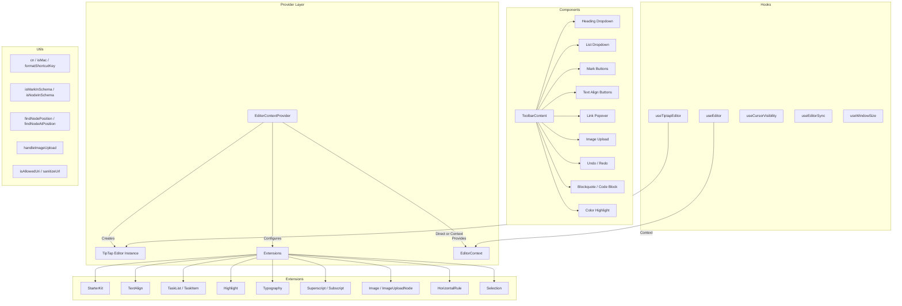

# Modulo Utilità dell'editor

Il modulo delle utilità dell'editor (`template/lib/editor/`) fornisce una soluzione completa di modifica del testo avanzata basata su **TipTap** (ProseMirror). Include un provider di editor preconfigurato, estensioni TipTap, una libreria completa di componenti della barra degli strumenti, funzioni di utilità per la manipolazione del DOM e hook React personalizzati per la gestione dello stato dell'editor.

## Panoramica dell'architettura



## File di origine

|Direttorio|Descrizione|
|-----------|-------------|
|`lib/editor/index.ts`|Esportazione di barili per tutti i sottomoduli|
|`lib/editor/providers/`|`EditorContextProvider` e `EditorContext`|
|`lib/editor/extensions/`|L'estensione TipTap viene riesportata|
|`lib/editor/hooks/`|Ganci React personalizzati|
|`lib/editor/utils/`|Funzioni di utilità|
|`lib/editor/contents/`|Componenti `ToolbarContent` e `EditorContent`|
|`lib/editor/components/`|Primitive dell'interfaccia utente, pulsanti della barra degli strumenti, icone, nodi|
|`lib/editor/styles/`|Stili CSS dell'editor|

## Fornitore dell'editore

### `EditorContextProvider`

Avvolge i bambini con un'istanza dell'editor TipTap preconfigurata:

```tsx
import { EditorContextProvider } from '@/lib/editor';

function MyEditor() {
  return (
    <EditorContextProvider>
      <ToolbarContent editor={null} />
      <EditorContent />
    </EditorContextProvider>
  );
}
```

### Configurazione

Il provider configura TipTap con queste impostazioni:

```typescript
const editor = useEditor({
  immediatelyRender: false,
  shouldRerenderOnTransaction: false,
  editorProps: {
    attributes: {
      autocomplete: 'on',
      autocorrect: 'on',
      autocapitalize: 'off',
      'aria-label': 'Main content area, start typing to enter text.',
      class: 'min-h-96',
    },
  },
  extensions: [/* ... */],
});
```

### Estensioni preconfigurate

|Estensione|Configurazione|
|-----------|--------------|
|`StarterKit`|`horizontalRule: false`, `link.openOnClick: false`|
|`HorizontalRule`|Predefinito|
|`TextAlign`|Si applica ai nodi `heading` e `paragraph`|
|`ImageUploadNode`|Accetta: `image/*`, max 5MB, limite 3 immagini|
|`TaskList` / `TaskItem`|Attività nidificate abilitate|
|`Highlight`|Multicolore abilitato|
|`Image`|Predefinito|
|`Typography`|Virgolette e trattini intelligenti|
|`Superscript` / `Subscript`|Predefinito|
|`Selection`|Predefinito|

## Ganci

### `useEditor(): Editor`

Recupera l'istanza dell'editor da `EditorContext`. Deve essere utilizzato all'interno di un `EditorContextProvider`.

```typescript
import { useEditor } from '@/lib/editor';

function MyComponent() {
  const editor = useEditor();
  // editor is the TipTap Editor instance
}
```

### `useTiptapEditor(providedEditor?): { editor, editorState?, canCommand? }`

Hook flessibile che accetta un'istanza dell'editor opzionale o ricorre al contesto TipTap:

```typescript
import { useTiptapEditor } from '@/lib/editor/hooks';

function ToolbarButton({ editor: externalEditor }) {
  const { editor, editorState, canCommand } = useTiptapEditor(externalEditor);

  const isBold = editorState ? editor?.isActive('bold') : false;
  const canBold = canCommand ? canCommand().toggleBold() : false;
}
```

### Altri ganci

|Gancio|Scopo|
|------|---------|
|`useCursorVisibility`|Tiene traccia della visibilità della posizione del cursore nella finestra|
|`useEditorSync`|Sincronizza il contenuto dell'editor con lo stato esterno|
|`useElementRect`|Tiene traccia del rettangolo di delimitazione dell'elemento|
|`useScrolling`|Rileva lo stato di scorrimento|
|`useThrottledCallback`|Limita una funzione di callback|
|`useUnmount`|Esegue la pulizia allo smontaggio del componente|
|`useWindowSize`|Tiene traccia delle dimensioni della finestra|

## Funzioni di utilità

### Assistente per il nome della classe

```typescript
function cn(...classes: (string | boolean | undefined | null)[]): string;
// Filters falsy values and joins with space
cn('min-h-96', isActive && 'bg-blue-500', undefined); // 'min-h-96 bg-blue-500'
```

### Rilevamento della piattaforma

```typescript
function isMac(): boolean;
// Returns true if navigator.platform includes 'mac'
```

### Formattazione dei tasti di scelta rapida

```typescript
function formatShortcutKey(key: string, isMac: boolean, capitalize?: boolean): string;
// Mac: 'ctrl' -> '???', 'alt' -> '???', 'shift' -> '???', 'meta' -> '???'
// Windows: 'ctrl' -> 'Ctrl'

function parseShortcutKeys(props: {
  shortcutKeys: string | undefined;
  delimiter?: string;    // default: '+'
  capitalize?: boolean;  // default: true
}): string[];
// 'ctrl+shift+b' -> ['???', '???', 'B'] (Mac) or ['Ctrl', 'Shift', 'B'] (Windows)
```

### Ispezione dello schema

```typescript
function isMarkInSchema(markName: string, editor: Editor | null): boolean;
// Checks if a mark type exists in the editor schema

function isNodeInSchema(nodeName: string, editor: Editor | null): boolean;
// Checks if a node type exists in the editor schema

function isExtensionAvailable(editor: Editor | null, extensionNames: string | string[]): boolean;
// Checks if one or more extensions are registered
// Logs a warning if none found
```

### Operazioni sui nodi

```typescript
function findNodeAtPosition(editor: Editor, position: number): TiptapNode | null;
// Returns the node at the given document position

function findNodePosition(props: {
  editor: Editor | null;
  node?: TiptapNode | null;
  nodePos?: number | null;
}): { pos: number; node: TiptapNode } | null;
// Finds position by node reference or position number

function focusNextNode(editor: Editor): boolean;
// Moves cursor to the next node, creating a paragraph if at end

function isNodeTypeSelected(editor: Editor | null, types: string[]): boolean;
// Checks if current selection is a NodeSelection matching any type

function isValidPosition(pos: number | null | undefined): pos is number;
// Type guard for valid document positions (>= 0)
```

### Caricamento immagini

```typescript
const MAX_FILE_SIZE = 5 * 1024 * 1024; // 5MB

async function handleImageUpload(
  file: File,
  onProgress?: (event: { progress: number }) => void,
  abortSignal?: AbortSignal,
): Promise<string>;
// Returns the URL of the uploaded image
// Default implementation is a demo stub -- replace with actual upload logic
```

### Convalida dell'URL

```typescript
function isAllowedUri(uri: string | undefined, protocols?: ProtocolConfig): boolean;
// Checks URI against allowed protocols:
// http, https, ftp, ftps, mailto, tel, callto, sms, cid, xmpp
// Plus any custom protocols passed in

function sanitizeUrl(inputUrl: string, baseUrl: string, protocols?: ProtocolConfig): string;
// Returns sanitized URL or '#' if not allowed
```

## Contenuto della barra degli strumenti

Il componente `ToolbarContent` fornisce una barra degli strumenti completa e preconfigurata:

```tsx
import { ToolbarContent } from '@/lib/editor/contents';

<ToolbarContent editor={editor} />
```

### Gruppi della barra degli strumenti

|Gruppo|Componenti|
|-------|-----------|
|Annulla/Ripeti|`UndoRedoButton` (annulla, ripristina)|
|Blocca la formattazione|`HeadingDropdownMenu` (H1-H4), `ListDropdownMenu` (elenco puntato, ordinato, attività), `BlockquoteButton`, `CodeBlockButton`|
|Formattazione in linea|`MarkButton` (grassetto, corsivo, barrato, codice, sottolineato), `ColorHighlightPopover`, `LinkPopover`|
|Apice|`MarkButton` (apice, pedice)|
|Allineamento del testo|`TextAlignButton` (sinistra, centro, destra, giustifica)|
|Media|`ImageUploadButton`|

## Libreria dei componenti

### Componenti primitivi

Componenti dell'interfaccia utente di base utilizzati dai pulsanti della barra degli strumenti:

- `Badge`, `Button`, `Card`, `DropdownMenu`, `Input`, `Popover`, `Separator`, `Spacer`, `Toolbar`, `Tooltip`

### Componenti del nodo

Viste nodo TipTap personalizzate:

- `HorizontalRuleNode` -- estensione regola orizzontale personalizzata
- `ImageUploadNode` -- nodo di caricamento file con trascinamento

### Componenti dell'icona

Icone SVG per tutte le azioni della barra degli strumenti (grassetto, corsivo, livelli di intestazione, elenchi, allineamento, ecc.).
