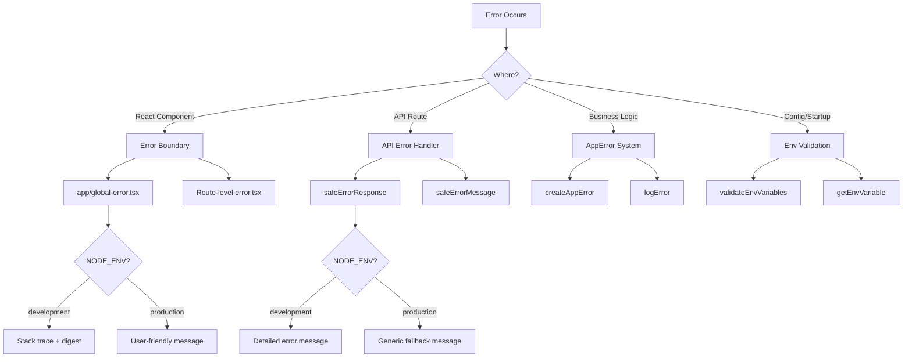

# Modelli di gestione degli errori

## Panoramica

Il modello Ever Works implementa una strategia di gestione degli errori a più livelli che copre i limiti degli errori di React, le risposte agli errori del percorso API, gli errori dell'applicazione digitati e la convalida delle variabili di ambiente. Il progetto dà priorità alla sicurezza (nessuna fuga di informazioni in produzione) mantenendo allo stesso tempo un debugging intuitivo per gli sviluppatori in fase di sviluppo.

## Architettura



## File di origine

|Archivio|Scopo|
|------|---------|
|`template/app/global-error.tsx`|Limite di errore React a livello di root|
|`template/app/not-found.tsx`|Pagina 404 Non trovato|
|`template/lib/utils/api-error.ts`|Utilità per gli errori del percorso API|
|`template/lib/utils/error-handler.ts`|Tipi di errori dell'applicazione e registrazione|
|`template/lib/auth/error-handler.ts`|Gestione degli errori specifica per l'autenticazione|

## Reagire ai confini degli errori

### Confine di errore globale

Il file `global-error.tsx` rileva gli errori non gestiti nella radice dell'applicazione:

```typescript
'use client';

export default function GlobalError({
    error,
    reset,
}: {
    error: Error & { digest?: string };
    reset: () => void;
}) {
    useEffect(() => {
        console.error(error);
    }, [error]);

    return (
        <html lang="en">
            <body>
                <h1>Something went wrong!</h1>
                {process.env.NODE_ENV !== 'production' && (
                    <div>
                        <p className="text-red-600">{error.message}</p>
                        {error.stack && <pre>{error.stack}</pre>}
                        {error.digest && <p>Error ID: {error.digest}</p>}
                    </div>
                )}
                <Button onPress={() => reset()}>Refresh</Button>
                <Link href="/">Go Home</Link>
            </body>
        </html>
    );
}
```

Comportamenti chiave:
- **Sviluppo**: mostra il messaggio di errore, l'analisi dello stack e il digest degli errori
- **Produzione**: mostra solo un messaggio generico
- **Error digest**: un ID univoco generato da Next.js per la correlazione degli errori lato server
- **Funzione di ripristino**: esegue nuovamente il rendering del sottoalbero del limite di errore
- **HTML autonomo**: include i propri tag `<html>` e `<body>` poiché sostituisce l'intera pagina

### Pagina non trovata

```typescript
'use client';

export default function NotFound() {
    const router = useRouter();
    return (
        <div>
            <h1>404</h1>
            <h2>Page Not Found</h2>
            <Button onClick={() => router.back()}>Go Back</Button>
            <Button onClick={() => router.push('/')}>Back to Home</Button>
        </div>
    );
}
```

## Gestione degli errori API

### safeErrorResponse

L'utilità principale per le risposte agli errori del percorso API:

```typescript
export function safeErrorResponse(
    error: unknown,
    fallbackMessage: string,
    status: number = 500
): NextResponse {
    const detail = error instanceof Error ? error.message : String(error);

    // Always log full details server-side
    console.error(`[API Error] ${fallbackMessage}:`, detail);

    const message = process.env.NODE_ENV === "development" ? detail : fallbackMessage;

    return NextResponse.json({ success: false, error: message }, { status });
}
```

Utilizzo nelle rotte API:

```typescript
export async function GET(request: NextRequest) {
    try {
        const result = await someOperation();
        return NextResponse.json(result);
    } catch (error) {
        return safeErrorResponse(error, 'Failed to process request');
    }
}
```

### safeErrorMessage

Per i casi in cui è necessaria la stringa di errore senza creare una risposta:

```typescript
export function safeErrorMessage(error: unknown, fallbackMessage: string): string {
    if (process.env.NODE_ENV === "development") {
        return error instanceof Error ? error.message : String(error);
    }
    return fallbackMessage;
}
```

## Sistema di errori dell'applicazione

### Tipi di errore

```typescript
export enum ErrorType {
    AUTH = 'auth',
    CONFIG = 'config',
    DATABASE = 'database',
    NETWORK = 'network',
    VALIDATION = 'validation',
    UNKNOWN = 'unknown'
}

export interface AppError {
    message: string;
    type: ErrorType;
    code?: string;
    originalError?: unknown;
}
```

### Creazione di errori digitati

```typescript
import { createAppError, ErrorType } from '@/lib/utils/error-handler';

const error = createAppError(
    'Failed to configure OAuth providers',
    ErrorType.CONFIG,
    'OAUTH_CONFIG_FAILED',
    originalError
);
```

### Registrazione degli errori strutturata

```typescript
import { logError } from '@/lib/utils/error-handler';

// Logs: [CONFIG] [Auth Config]: Failed to configure OAuth providers
// Logs: Error code: OAUTH_CONFIG_FAILED
// Logs: Original error: <original error details>
logError(error, 'Auth Config');
```

La funzione `logError` gestisce tre forme di errore:
1. **AppError**: registro strutturato con tipo, codice ed errore originale
2. **Errore**: registro standard con messaggio e analisi dello stack
3. **Sconosciuto** -- registro di fallback con coercizione di stringhe

### Convalida delle variabili d'ambiente

```typescript
import { validateEnvVariables, getEnvVariable } from '@/lib/utils/error-handler';

// Validate multiple variables at once
const validationError = validateEnvVariables([
    'DATABASE_URL', 'AUTH_SECRET', 'CRON_SECRET'
]);
if (validationError) {
    logError(validationError, 'Startup');
}

// Get a single required variable (throws if missing)
const dbUrl = getEnvVariable('DATABASE_URL');

// Get an optional variable
const optional = getEnvVariable('OPTIONAL_VAR', false);
```

## Gestione degli errori nell'autenticazione

La configurazione di autenticazione utilizza il degrado graduale:

```typescript
const configureProviders = () => {
    try {
        const oauthProviders = configureOAuthProviders();
        return createNextAuthProviders({ /* full config */ });
    } catch (error) {
        const appError = createAppError(
            'Failed to configure OAuth providers. Falling back to credentials only.',
            ErrorType.CONFIG,
            'OAUTH_CONFIG_FAILED',
            error
        );
        logError(appError, 'Auth Config');

        // Fallback to credentials only
        return createNextAuthProviders({
            credentials: { enabled: true },
            google: { enabled: false },
            github: { enabled: false },
            facebook: { enabled: false },
            twitter: { enabled: false },
        });
    }
};
```

Se la configurazione del provider OAuth fallisce, il sistema torna all'autenticazione basata solo sulle credenziali invece di bloccarsi.

## Errore nella gestione del flusso per livello

|Strato|Strategia|Comportamento produttivo|
|-------|----------|-------------------|
|Componenti della reazione|Limite errore (`global-error.tsx`)|Messaggio generico, nessuna traccia dello stack|
|Percorsi API|`safeErrorResponse()`|Messaggio di fallback generico|
|Azioni del server|`validatedAction()` rileva gli errori Zod|Primo messaggio di errore di convalida|
|Configurazione autenticazione|Prova/prendi con `createAppError()`|Grazioso degrado alle credenziali|
|Lavori Cron|Try/catch + registrazione strutturata|Errore registrato, risposta restituita|
|Webhook|Prova/prendi + 400 risposta|Messaggio di errore generico al provider|

## Migliori pratiche

1. **Non esporre mai i componenti interni in produzione** -- utilizza sempre `safeErrorResponse` per i percorsi API
2. **Registra tutto lato server**: i dettagli completi sull'errore vanno alla console/registrazione indipendentemente dall'ambiente
3. **Utilizza errori digitati** -- `createAppError` con `ErrorType` per una categorizzazione coerente
4. **Degradamento graduale**: ripiega su funzionalità ridotte anziché bloccarsi
5. **Digest di errori per correlazione**: utilizza il campo `digest` degli errori Next.js per tracciare i problemi lato server
6. **Convalida ai limiti**: controlla le variabili env all'avvio, convalida l'input ai limiti dell'API
