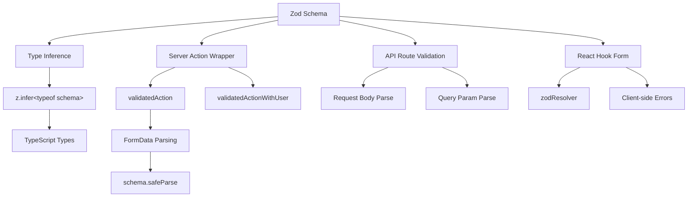

# Modelli di convalida del modulo

## Panoramica

Il modello Ever Works utilizza **Zod** come unica fonte attendibile per la convalida dei dati sia tra client che server. Gli schemi di convalida sono organizzati in `lib/validations/` e vengono utilizzati da:

- **Azioni server** tramite wrapper `validatedAction()` e `validatedActionWithUser()`
- **Gestori di route API** per la convalida del corpo della richiesta/del parametro della query
- Integrazione di **React Hook Form** per la convalida del modulo lato client
- **Inferenza del tipo** tramite `z.infer<>` per la sicurezza del tipo end-to-end

## Architettura



## File di origine

|Archivio|Scopo|
|------|---------|
|`template/lib/validations/auth.ts`|Schema di convalida della password|
|`template/lib/validations/company.ts`|Schemi CRUD aziendali|
|`template/lib/validations/client-item.ts`|Schemi di invio/aggiornamento di elementi client|
|`template/lib/validations/client-dashboard.ts`|Schemi di query del dashboard|
|`template/lib/validations/sponsor-ad.ts`|Schemi del ciclo di vita degli annunci sponsor|
|`template/lib/validations/item.ts`|Schema dei dati sulla posizione|
|`template/lib/validations/user-location.ts`|Schema delle impostazioni della posizione dell'utente|
|`template/lib/auth/middleware.ts`|`validatedAction` / `validatedActionWithUser` utilità|

## Modelli di schemi di convalida

### Modello 1: convalida della password con regole concatenate

```typescript
import { z } from "zod";

export const passwordSchema = z
    .string()
    .min(8, "Password must be at least 8 characters")
    .regex(/[A-Z]/, "Password must contain at least one uppercase letter")
    .regex(/[a-z]/, "Password must contain at least one lowercase letter")
    .regex(/[0-9]/, "Password must contain at least one number")
    .regex(/[^A-Za-z0-9]/, "Password must contain at least one special character");
```

Questo schema impone requisiti di password complessi attraverso perfezionamenti concatenati. Ogni `.regex()` fornisce un messaggio di errore specifico che l'interfaccia utente può visualizzare in linea.

### Modello 2: Crea/Aggiorna coppie di schemi

La convalida aziendale dimostra il modello di creazione/aggiornamento:

```typescript
export const createCompanySchema = z.object({
    name: z.string().min(1, "Company name is required").max(255),
    website: z.string().url("Invalid URL format").optional().or(z.literal("")),
    domain: z.string().max(255).optional()
        .transform((val) => val?.toLowerCase().trim() || undefined),
    slug: z.string().max(255).optional()
        .transform((val) => val?.toLowerCase().trim() || undefined)
        .refine(
            (val) => !val || /^[a-z0-9-]+$/.test(val),
            { message: "Slug must contain only lowercase letters, numbers, and hyphens" }
        ),
    status: z.enum(companyStatus).default("active"),
});

export const updateCompanySchema = z.object({
    id: z.string().uuid(),
    name: z.string().min(1).max(255).optional(),  // Optional for updates
    // ... other fields also optional
    status: z.enum(companyStatus).optional(),
});
```

Differenze chiave:
- **Crea schemi** hanno campi obbligatori con valori predefiniti
- **Gli schemi di aggiornamento** richiedono un `id` e rendono facoltativi tutti gli altri campi
- Entrambi condividono la logica `.transform()` per la normalizzazione (ad esempio, lumache minuscole)

### Modello 3: campi di stato basati su enumerazione

```typescript
export const companyStatus = ["active", "inactive"] as const;
export const itemStatus = ['pending', 'approved', 'rejected'] as const;
export const sponsorAdStatuses = [
    "pending_payment", "pending", "rejected",
    "active", "expired", "cancelled",
] as const;

// Usage in schemas
status: z.enum(companyStatus).default("active"),
status: z.enum(sponsorAdStatuses).optional(),
```

L'utilizzo degli array `as const` con `z.enum()` fornisce sia la convalida in fase di runtime che l'indipendenza dal tipo in fase di compilazione.

### Modello 4: schemi di parametri di query con trasformazioni

```typescript
export const clientItemsListQuerySchema = z.object({
    page: z.string().optional()
        .transform(val => (val ? parseInt(val, 10) : 1))
        .refine(val => !Number.isNaN(val), { message: 'Page must be a valid number' })
        .refine(val => val >= 1, { message: 'Page must be at least 1' }),
    limit: z.string().optional()
        .transform(val => (val ? parseInt(val, 10) : 10))
        .refine(val => val >= 1 && val <= 100, { message: 'Limit must be between 1 and 100' }),
    status: z.enum(clientStatusFilter).optional().default('all'),
    search: z.string().max(100, 'Search query is too long').optional(),
    sortBy: z.enum(['name', 'updated_at', 'status', 'submitted_at']).optional().default('updated_at'),
    sortOrder: z.enum(['asc', 'desc']).optional().default('desc'),
    deleted: z.string().optional().transform(val => val === 'true'),
});
```

I parametri di query arrivano come stringhe. Lo schema utilizza `.transform()` per convertirli nei tipi corretti (numeri, booleani) applicando la convalida e i valori predefiniti.

### Modello 5: schemi di oggetti nidificati con convalida tra campi

```typescript
export const updateLocationSchema = z
    .object({
        defaultLatitude: z.number().min(-90).max(90).nullable().optional(),
        defaultLongitude: z.number().min(-180).max(180).nullable().optional(),
        defaultCity: z.string().max(200).nullable().optional(),
        defaultCountry: z.string().max(100).nullable().optional(),
        locationPrivacy: locationPrivacySchema.optional(),
    })
    .refine(
        (data) => {
            const hasLat = data.defaultLatitude != null;
            const hasLng = data.defaultLongitude != null;
            return hasLat === hasLng;  // Both or neither
        },
        { message: 'Both latitude and longitude must be provided together' }
    );
```

`.refine()` a livello di oggetto convalida le dipendenze tra campi: latitudine e longitudine devono essere entrambe presenti o entrambe assenti.

### Modello 6: Tipi di unione per input flessibili

```typescript
category: z.union([
    z.string().min(1, 'Category is required'),
    z.array(z.string().min(1)).min(1, 'At least one category is required'),
]).optional().nullable(),
```

Questo accetta sia una singola stringa che un array di stringhe per il campo della categoria, adattando diversi tipi di input del modulo.

## Convalida lato server

### wrapper di azione convalidato

```typescript
export function validatedAction<S extends z.ZodType<any, any>, T>(
    schema: S,
    action: ValidatedActionFunction<S, T>
) {
    return async (prevState: ActionState, formData: FormData): Promise<T> => {
        const result = schema.safeParse(Object.fromEntries(formData));
        if (!result.success) {
            return { error: result.error.issues[0].message } as T;
        }
        return action(result.data, formData);
    };
}
```

Questa funzione di ordine superiore:
1. Converte `FormData` in un oggetto semplice
2. Convalida rispetto allo schema Zod utilizzando `safeParse()`
3. Restituisce il primo errore di convalida se non valido
4. Richiama la funzione di azione con dati digitati e analizzati, se validi

### validatedActionWithUser Wrapper

```typescript
export function validatedActionWithUser<S extends z.ZodType<any, any>, T>(
    schema: S,
    action: ValidatedActionWithUserFunction<S, T>
) {
    return async (prevState: ActionState, formData: FormData): Promise<T> => {
        const session = await auth();
        if (!session?.user) {
            throw new Error("User is not authenticated");
        }
        const result = schema.safeParse(Object.fromEntries(formData));
        if (!result.success) {
            return { error: result.error.issues[0].message } as T;
        }
        return action(result.data, formData, session.user);
    };
}
```

Ciò aggiunge un controllo di autenticazione prima della convalida, passando l'oggetto `user` autenticato alla funzione di azione.

## Digitare Inferenza

Ogni schema esporta i tipi TypeScript dedotti:

```typescript
export type CreateCompanyInput = z.infer<typeof createCompanySchema>;
export type UpdateCompanyInput = z.infer<typeof updateCompanySchema>;
export type ClientUpdateItemInput = z.infer<typeof clientUpdateItemSchema>;
export type ClientCreateItemInput = z.infer<typeof clientCreateItemSchema>;
```

Questi tipi vengono utilizzati in tutto il livello di servizio e nei percorsi API, garantendo che la forma dei dati convalidata corrisponda a quanto previsto dalla logica aziendale.

## Migliori pratiche

1. **Schema singolo, più consumatori** -- definito una volta in `lib/validations/`, utilizzato ovunque
2. **Trasforma al confine** -- usa `.transform()` per convertire le stringhe nei tipi corretti
3. **Messaggi di errore personalizzati**: ogni regola di convalida include un messaggio intuitivo
4. **Sottoschemi condivisi**: riutilizza schemi come `locationSchema` e `passwordSchema` nei moduli
5. **Deduci tipi dagli schemi**: non definire mai manualmente i tipi che duplicano le definizioni dello schema
6. **Convalida tra campi** -- utilizza `.refine()` a livello di oggetto per regole multicampo
7. **Impostazioni predefinite ragionevoli** -- utilizzare `.default()` per campi facoltativi con valori standard
