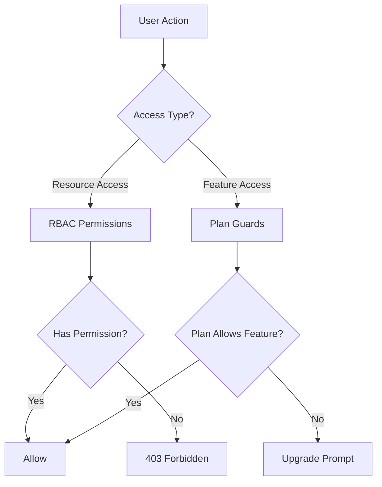
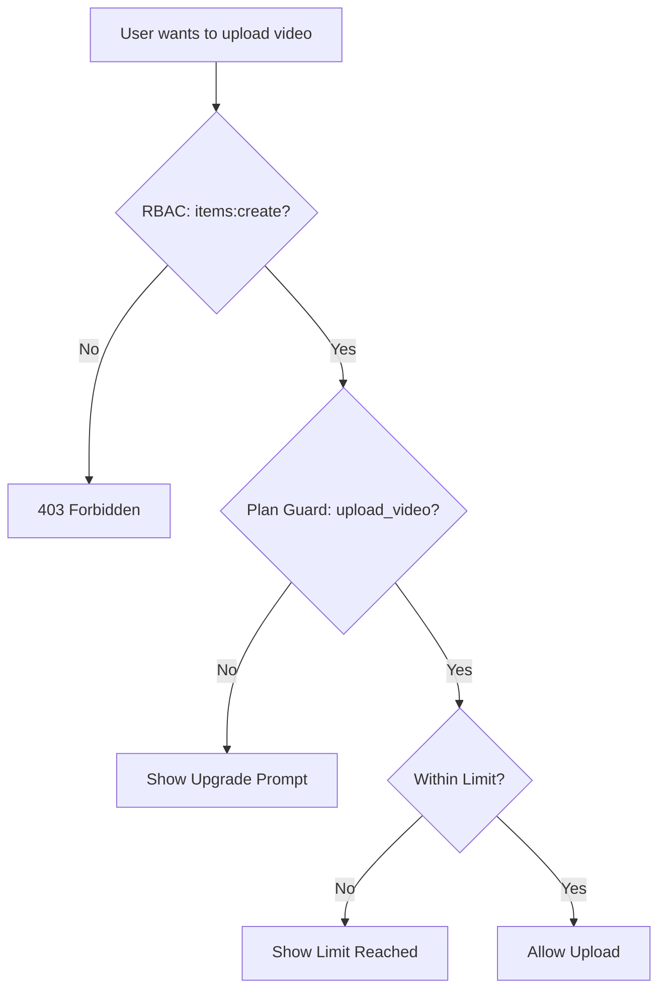

# Guardie e sistema di autorizzazione

Il modello Ever Works implementa un sistema di controllo degli accessi a doppio livello: **Autorizzazioni RBAC** per l'accesso alle risorse basato sui ruoli e **Plan Guards** per il controllo delle funzionalità basate su abbonamento. Insieme, questi sistemi controllano cosa possono fare gli utenti e a quali funzionalità possono accedere.

## Architettura del sistema



## Sistema di autorizzazione RBAC

### Definizioni dei permessi

Tutte le autorizzazioni sono definite in `lib/permissions/definitions.ts` utilizzando un formato `resource:action`:

```typescript
const PERMISSIONS = {
  items: {
    read: 'items:read',
    create: 'items:create',
    update: 'items:update',
    delete: 'items:delete',
    review: 'items:review',
    approve: 'items:approve',
    reject: 'items:reject',
  },
  categories: { read, create, update, delete },
  tags: { read, create, update, delete },
  roles: { read, create, update, delete },
  users: { read, create, update, delete, assignRoles },
  analytics: { read, export },
  system: { settings },
} as const;
```

### Tipo di autorizzazione

Il tipo `Permission` è derivato dall'oggetto const `PERMISSIONS`, garantendo la sicurezza del tipo:

```typescript
type Permission = 'items:read' | 'items:create' | ... | 'system:settings';
```

### Ruoli predefiniti

Sono preconfigurati due ruoli predefiniti:

|Ruolo|ID|Autorizzazioni|
|---|---|---|
|Super amministratore|`super-admin`|Tutti i permessi di sistema|
|Gestore dei contenuti|`content-manager`|Articoli + Categorie + Tag (CRUD completo + recensione)|

### Gruppi di autorizzazione

Le autorizzazioni sono organizzate in gruppi di facile utilizzo dell'interfaccia utente in `lib/permissions/groups.ts`:

|Gruppo|Icona|Risorse incluse|
|---|---|---|
|Gestione dei contenuti|`FileText`|Articoli, categorie, tag|
|Gestione utenti|`Users`|Utenti, ruoli|
|Sistema e analisi|`Settings`|Analitica, Sistema|

### Funzioni di utilità

Il modulo `lib/permissions/utils.ts` fornisce utilità di gestione dello stato per l'interfaccia utente delle autorizzazioni:

```typescript
// Create a permission state map for checkboxes
const state = createPermissionState(currentPermissions);
// { 'items:read': true, 'items:create': true, ... }

// Get selected permissions from state
const selected = getSelectedPermissions(state);

// Calculate changes between old and new permissions
const changes = calculatePermissionChanges(original, updated);
// { added: ['items:delete'], removed: ['tags:create'] }

// Compare two permission sets
const equal = arePermissionsEqual(perms1, perms2);

// Filter permissions by search term
const filtered = filterPermissions(allPerms, 'items');
```

## Sistema di guardie del piano

Le protezioni del piano controllano l'accesso alle funzionalità in base al piano di abbonamento dell'utente. Il sistema è definito in `lib/guards/plan-features.guard.ts`.

### Gerarchia del piano

```typescript
const PLAN_LEVELS: Record<string, number> = {
  free: 1,
  standard: 2,
  premium: 3,
};
```

### Definizioni delle funzionalità

Tutte le funzionalità controllate sono enumerate in `FEATURES`:

|Categoria|Caratteristiche|
|---|---|
|Sottomissione|`submit_product`, `extended_description`, `unlimited_description`, `upload_images`, `upload_video`|
|Distintivi|`verified_badge`, `sponsored_badge`|
|Recensione|`priority_review`, `instant_review`|
|Visibilità|`search_visibility`, `category_placement`, `sponsored_position`, `homepage_featured`, `newsletter_mention`|
|Analitica|`view_statistics`, `advanced_analytics`|
|Supporto|`email_support`, `priority_email_support`, `phone_support`|
|Sociale|`social_sharing`, `learn_more_button`|
|Altro|`free_modifications`, `unlimited_submissions`|

### Matrice di accesso alle funzionalità

Ciascuna funzionalità è associata a una regola di accesso:

|Tipo di accesso|Sintassi|Esempio|
|---|---|---|
|Tutti i piani|`'all'`|`submit_product`, `upload_images`|
|Piano unico|`PaymentPlan.PREMIUM`|`upload_video`, `instant_review`|
|Piano minimo|`{ minPlan: PaymentPlan.STANDARD }`|`verified_badge`, `priority_review`|
|Piani specifici|`[PaymentPlan.STANDARD, PaymentPlan.PREMIUM]`|(funzionalità personalizzate)|

### Limiti del piano

I limiti numerici variano in base al piano:

|Limite|Gratuito|Norma|Premio|
|---|---|---|---|
|`max_images`| 1 | 5 |Illimitato|
|`max_description_words`| 200 | 500 |Illimitato|
|`max_submissions`| 1 | 10 |Illimitato|
|`review_days`| 7 | 3 | 1 |
|`free_modification_days`| 0 | 30 | 365 |

### Utilizzo della protezione lato server

```typescript
import { canAccessFeature, createPlanGuard, FEATURES } from '@/lib/guards';

// Simple check
const allowed = canAccessFeature(FEATURES.UPLOAD_VIDEO, userPlan);

// Guard factory for multiple checks
const guard = createPlanGuard(userPlan);
guard.canAccess(FEATURES.VERIFIED_BADGE);       // boolean
guard.requireFeature(FEATURES.UPLOAD_VIDEO);     // throws PlanGuardError
guard.getLimit('max_images');                    // number | null
guard.isWithinLimit('max_submissions', count);   // boolean
guard.getAccessibleFeatures();                   // Feature[]
```

### Errore PlanGuard

Quando `requireFeature` fallisce, genera un errore digitato:

```typescript
class PlanGuardError extends Error {
  feature: Feature;      // e.g., 'upload_video'
  userPlan: string;      // e.g., 'free'
  requiredPlan: PaymentPlan; // e.g., 'premium'
}
```

### Gancio di protezione lato client

Il gancio `usePlanGuard` in `hooks/use-plan-guard.ts` avvolge il sistema di protezione per i componenti React:

```typescript
import { usePlanGuard, FEATURES } from '@/hooks/use-plan-guard';

function VideoUploadButton() {
  const { canAccess, requireUpgrade, isLoading } = usePlanGuard();

  if (isLoading) return <Spinner />;

  const upgradePlan = requireUpgrade(FEATURES.UPLOAD_VIDEO);
  if (upgradePlan) {
    return <UpgradePrompt plan={upgradePlan} />;
  }

  return <Button>Upload Video</Button>;
}
```

### Ganci specializzati

#### `useFeatureAccess`

Verifica l'accesso a una singola funzionalità:

```typescript
const { hasAccess, requiredPlan, isLoading } = useFeatureAccess(FEATURES.VERIFIED_BADGE);
```

#### `useFeatureLimit`

Controlla i limiti numerici con il conteggio rimanente:

```typescript
const { limit, isUnlimited, remaining, isWithinLimit } = useFeatureLimit('max_images', currentCount);

if (!isUnlimited && remaining <= 0) {
  return <LimitReached />;
}
```

## Comporre Guardie

Le guardie si compongono in modo naturale per scenari complessi di controllo degli accessi:

```typescript
// Server: Combine RBAC + plan check
function canCreateItem(userPermissions: UserPermissions, userPlan: string): boolean {
  const hasRBACAccess = hasPermission(userPermissions, 'items:create');
  const hasPlanAccess = canAccessFeature(FEATURES.SUBMIT_PRODUCT, userPlan);
  return hasRBACAccess && hasPlanAccess;
}

// Client: Combine hooks
function CreateItemButton() {
  const { canAccess } = usePlanGuard();
  const { permissions } = useRolePermissions();

  const canCreate =
    hasPermission(permissions, 'items:create') &&
    canAccess(FEATURES.SUBMIT_PRODUCT);

  if (!canCreate) return null;
  return <Button>Create Item</Button>;
}
```

## Diagramma del flusso di guardia



## Aggiunta di nuove guardie

### Aggiunta di una nuova autorizzazione

1. Aggiungi a `PERMISSIONS` in `lib/permissions/definitions.ts`:

```typescript
billing: {
  read: 'billing:read',
  manage: 'billing:manage',
},
```

2. Aggiungi a un gruppo di autorizzazioni in `lib/permissions/groups.ts`
3. Assegnare i ruoli predefiniti appropriati

### Aggiunta di una nuova funzionalità del piano

1. Aggiungi la costante della funzionalità a `FEATURES` in `lib/guards/plan-features.guard.ts`
2. Definire la regola di accesso in `FEATURE_ACCESS`
3. Facoltativamente aggiungi limiti numerici a `PLAN_LIMITS`

## Migliori pratiche

1. **Preferisci le protezioni del piano per il gating delle funzionalità** e RBAC per il controllo dell'accesso alle risorse: non mescolarli.
2. **Controlla sempre sul server** anche se il client nasconde elementi dell'interfaccia utente: i controlli lato client sono solo per UX.
3. **Utilizzare `createPlanGuard`** per più controlli nella stessa richiesta per evitare ricerche ripetute del piano.
4. **Gestisci gli stati di caricamento** negli hook: i dati del piano possono essere caricati in modo asincrono dal servizio di abbonamento.
5. **Mantieni i nomi delle funzionalità descrittivi** -- utilizza `upload_video` e non `feature_3` per chiarezza nei registri e nei messaggi di errore.
