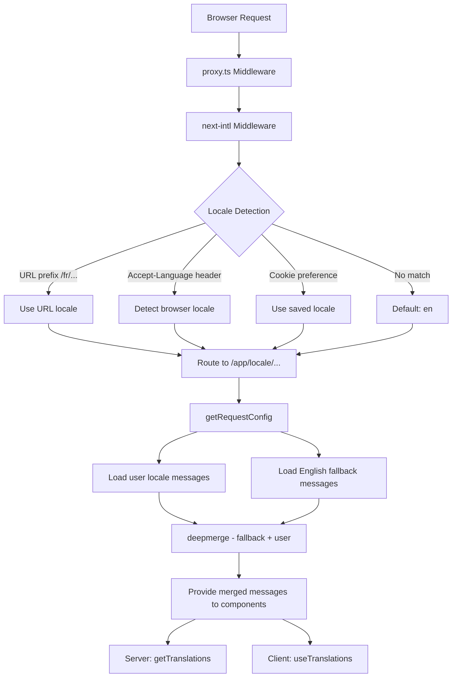

# Implementazione i18n

## Panoramica

Il modello Ever Works implementa l'internazionalizzazione utilizzando **next-intl** con supporto per oltre 20 impostazioni locali, direzione del testo RTL (da destra a sinistra), fallback dei messaggi di unione profonda e navigazione con riconoscimento delle impostazioni locali. Il sistema è costruito attorno a tre livelli: configurazione del routing, caricamento dei messaggi con fallback e aiutanti di navigazione compatibili con le impostazioni locali.

## Architettura



## File di origine

|Archivio|Scopo|
|------|---------|
|`template/i18n/routing.ts`|Configurazione del routing locale|
|`template/i18n/request.ts`|Caricamento dei messaggi con ambito richiesta|
|`template/i18n/navigation.ts`|Esportazioni di navigazione basate sulla lingua|
|`template/lib/constants.ts`|Definizioni locali e RTL|
|`template/messages/*.json`|File di messaggi di traduzione|
|`template/proxy.ts`|Middleware con risoluzione del prefisso locale|

## Località supportate

```typescript
// lib/constants.ts
export const DEFAULT_LOCALE = 'en';
export const LOCALES = [
    'en', 'fr', 'es', 'de', 'zh', 'ar', 'he',
    'ru', 'uk', 'pt', 'it', 'ja', 'ko', 'nl',
    'pl', 'tr', 'vi', 'th', 'hi', 'id', 'bg'
] as const;

export type Locale = (typeof LOCALES)[number];

/** Locales that use right-to-left text direction */
export const RTL_LOCALES: readonly Locale[] = ['ar', 'he'] as const;
```

Il modello supporta 20 lingue, incluse due lingue RTL (arabo ed ebraico).

## Configurazione del percorso

```typescript
// i18n/routing.ts
import { defineRouting } from "next-intl/routing";
import { DEFAULT_LOCALE, LOCALES } from "@/lib/constants";

export const routing = defineRouting({
    locales: LOCALES,
    defaultLocale: DEFAULT_LOCALE,
    localeDetection: true,
    localePrefix: "as-needed",
});
```

|Impostazione|Valore|Effetto|
|---------|-------|--------|
|`locales`|20 codici locali|Set di lingue supportate|
|`defaultLocale`|`'en'`|Fallback quando nessuna lingua corrisponde|
|`localeDetection`|`true`|Rilevamento automatico dall'intestazione `Accept-Language`|
|`localePrefix`|`"as-needed"`|La locale predefinita non ha prefisso; altri lo fanno|

Con `localePrefix: "as-needed"`:
- Inglese (predefinito): `https://example.com/about`
- Francese: `https://example.com/fr/about`
- Arabo: `https://example.com/ar/about`

## Caricamento dei messaggi con fallback

```typescript
// i18n/request.ts
import deepmerge from "deepmerge";
import { getRequestConfig } from "next-intl/server";

export default getRequestConfig(async ({ requestLocale }) => {
    let locale = await requestLocale;

    if (!locale || !routing.locales.includes(locale as any)) {
        locale = routing.defaultLocale;
    }

    const userMessages = (await import(`../messages/${locale}.json`)).default;
    const defaultMessages = (await import(`../messages/en.json`)).default;
    const messages = deepmerge(defaultMessages, userMessages) as any;

    return { locale, messages };
});
```

La strategia di fusione profonda garantisce che:
1. I messaggi in inglese fungono da set di fallback completo
2. I messaggi specifici della lingua sovrascrivono l'inglese laddove esistono traduzioni
3. Le traduzioni mancanti ricadono con grazia in inglese invece di mostrare le chiavi

### Struttura dei file dei messaggi

```
messages/
  en.json        # Complete English messages (base)
  fr.json        # French translations
  es.json        # Spanish translations
  de.json        # German translations
  ar.json        # Arabic translations
  he.json        # Hebrew translations
  zh.json        # Chinese translations
  ...            # 13+ more locales
```

### Formati di data/numero

```typescript
// i18n/request.ts
export const formats = {
    dateTime: {
        short: {
            day: "numeric",
            month: "short",
            year: "numeric",
        },
    },
    number: {
        precise: {
            maximumFractionDigits: 5,
        },
    },
    list: {
        enumeration: {
            style: "long",
            type: "conjunction",
        },
    },
} satisfies Formats;
```

## Aiutanti della navigazione

```typescript
// i18n/navigation.ts
import { createNavigation } from "next-intl/navigation";
import { routing } from "./routing";

export const { Link, redirect, usePathname, useRouter, getPathname } =
    createNavigation(routing);
```

Queste esportazioni sostituiscono le utilità di navigazione standard di Next.js con versioni compatibili con le impostazioni locali:

|Esportazione|Next.js standard|Comportamento locale|
|--------|-----------------|----------------------|
|`Link`|`next/link`|Aggiunge il prefisso locale a `href`|
|`redirect`|`next/navigation`|Conserva la locale corrente nel reindirizzamento|
|`usePathname`|`next/navigation`|Restituisce il percorso senza prefisso locale|
|`useRouter`|`next/navigation`|`push()` / `replace()` aggiungi prefisso locale|
|`getPathname`| -- |Percorso lato server con impostazioni locali|

### Utilizzo nei componenti server

```typescript
import { getTranslations } from 'next-intl/server';

export default async function Page({ params }: { params: Promise<{ locale: string }> }) {
    const { locale } = await params;
    const t = await getTranslations({ locale, namespace: 'common' });

    return <h1>{t('WELCOME')}</h1>;
}
```

### Utilizzo nei componenti client

```typescript
'use client';
import { useTranslations } from 'next-intl';
import { Link } from '@/i18n/navigation';

export function NavLink() {
    const t = useTranslations('navigation');
    return <Link href="/about">{t('ABOUT')}</Link>;
}
```

## Risoluzione delle impostazioni internazionali del middleware

Il middleware in `proxy.ts` risolve le informazioni locali per le decisioni di protezione dell'autenticazione:

```typescript
function resolveLocalePrefix(pathname: string): {
    prefix: string;           // "/fr" or ""
    hasLocale: boolean;
    locale?: string;
    pathWithoutLocale: string; // "/admin/items"
} {
    const segments = pathname.split('/').filter(Boolean);
    const maybeLocale = segments[0];
    const hasLocale = routing.locales.includes(maybeLocale as any);
    const pathWithoutLocale = hasLocale
        ? `/${segments.slice(1).join('/')}`
        : pathname;
    return {
        prefix: hasLocale ? `/${maybeLocale}` : '',
        hasLocale,
        locale: hasLocale ? maybeLocale : undefined,
        pathWithoutLocale
    };
}
```

Viene utilizzato per costruire URL di reindirizzamento compatibili con le impostazioni locali nelle protezioni di autenticazione:

```typescript
url.pathname = `${localePrefix}/auth/signin`;
```

## Supporto RTL

Le impostazioni locali RTL sono definite in `lib/constants.ts`:

```typescript
export const RTL_LOCALES: readonly Locale[] = ['ar', 'he'] as const;
```

Il componente del layout root dovrebbe applicare l'attributo `dir` in base alla locale corrente:

```typescript
// app/[locale]/layout.tsx
const isRTL = RTL_LOCALES.includes(locale as Locale);

return (
    <html lang={locale} dir={isRTL ? 'rtl' : 'ltr'}>
        {/* ... */}
    </html>
);
```

## SEO: alternative hreflang

L'utilità `lib/seo/hreflang.ts` genera collegamenti in lingue alternative per il SEO:

```typescript
import { generateHreflangAlternates } from '@/lib/seo/hreflang';

export async function generateMetadata(): Promise<Metadata> {
    return {
        alternates: {
            languages: generateHreflangAlternates('/about')
        }
    };
}
```

Questo genera tag `<link rel="alternate" hreflang="fr" href="...">` per tutte le versioni locali supportate, più una voce `x-default` che punta alla versione inglese.

## Integrazione del plugin Next.js

```typescript
// next.config.ts
import createNextIntlPlugin from "next-intl/plugin";

const withNextIntl = createNextIntlPlugin('./i18n/request.ts');
const configWithIntl = withNextIntl(nextConfig);
```

Il plugin `next-intl` viene applicato alla configurazione Next.js con un percorso esplicito al file di configurazione della richiesta.

## Migliori pratiche

1. **Utilizza sempre `getTranslations` nei componenti server** -- carica le traduzioni senza costi del pacchetto client
2. **Importa la navigazione da `@/i18n/navigation`** -- garantisce il collegamento compatibile con le impostazioni locali
3. **Mantieni l'inglese completo**: funge da riserva per tutte le altre lingue
4. **Utilizza traduzioni con spazi dei nomi** -- organizza per funzione (`common`, `footer`, `pages`, ecc.)
5. **Controlla RTL con `RTL_LOCALES`** -- applica `dir="rtl"` a livello di layout
6. **Genera tag hreflang** -- utilizza `generateHreflangAlternates()` nelle funzioni di metadati
