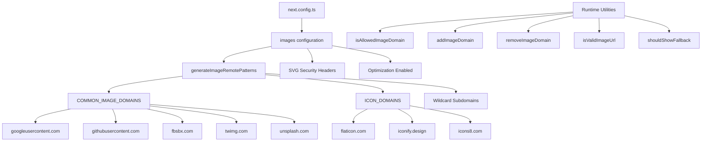

# Ottimizzazione delle immagini

## Panoramica

Il modello Ever Works configura l'ottimizzazione dell'immagine Next.js con modelli remoti dinamici, supporto SVG e un livello di utilità per la gestione del dominio. Il sistema gestisce immagini da fornitori OAuth (Google, GitHub, Facebook, Twitter), servizi di foto stock (Unsplash) e librerie di icone, applicando al contempo intestazioni di sicurezza per i contenuti SVG.

## Architettura



## File di origine

|Archivio|Scopo|
|------|---------|
|`template/next.config.ts`|Configurazione dell'immagine Next.js|
|`template/lib/utils/image-domains.ts`|Utilità di gestione del dominio|

## Configurazione

### Impostazioni immagine Next.js

```typescript
// next.config.ts
images: {
    remotePatterns: generateImageRemotePatterns(),
    dangerouslyAllowSVG: true,
    contentDispositionType: 'attachment',
    contentSecurityPolicy: "default-src 'self'; script-src 'none'; sandbox;",
    unoptimized: false,
},
```

|Impostazione|Valore|Scopo|
|---------|-------|---------|
|`remotePatterns`|Dinamico tramite `generateImageRemotePatterns()`|Autorizza i domini di immagini esterne|
|`dangerouslyAllowSVG`|`true`|Consenti immagini SVG tramite l'ottimizzatore|
|`contentDispositionType`|`'attachment'`|Forza il download anziché il rendering in linea per l'accesso non elaborato|
|`contentSecurityPolicy`|Sandbox rigoroso|Previeni gli attacchi XSS basati su SVG|
|`unoptimized`|`false`|Mantieni abilitata l'ottimizzazione delle immagini|

### Sicurezza SVG

I file SVG possono contenere JavaScript incorporato. Il modello mitiga questo problema con:
- **Politica di sicurezza dei contenuti**: `script-src 'none'; sandbox;` impedisce l'esecuzione di script negli SVG
- **Disposizione dei contenuti**: `attachment` garantisce che gli SVG vengano scaricati, non eseguiti, quando si accede direttamente

## Generazione di modelli remoti

La funzione `generateImageRemotePatterns()` crea dinamicamente la lista consentita:

```typescript
export function generateImageRemotePatterns() {
    const patterns = [
        {
            protocol: 'https' as const,
            hostname: 'lh3.googleusercontent.com',
            pathname: '/a/**'
        },
        {
            protocol: 'https' as const,
            hostname: 'avatars.githubusercontent.com',
            pathname: '/u/**'
        },
        {
            protocol: 'https' as const,
            hostname: 'platform-lookaside.fbsbx.com',
            pathname: '/platform/**'
        },
        // ... more specific patterns
    ];

    // Add wildcard subdomain patterns
    [...COMMON_IMAGE_DOMAINS, ...ICON_DOMAINS].forEach((domain) => {
        patterns.push({
            protocol: 'https' as const,
            hostname: `*.${domain}`,
            pathname: '/**'
        });
    });

    return patterns;
}
```

### Domini consentiti

**Domini di immagini comuni** (avatar OAuth, foto d'archivio):

|Dominio|Fonte|
|--------|--------|
|`lh3.googleusercontent.com`|Avatar di Google OAuth|
|`avatars.githubusercontent.com`|Avatar di GitHub OAuth|
|`platform-lookaside.fbsbx.com`|Avatar OAuth di Facebook|
|`pbs.twimg.com`|Avatar di Twitter/X|
|`images.unsplash.com`|Scopri le foto d'archivio|

**Domini icona** (icone oggetto):

|Dominio|Fonte|
|--------|--------|
|`flaticon.com`|Icone piatte|
|`iconify.design`|Iconizzare le icone|
|`icons8.com`|Icone8 icone|
|`feathericons.com`|Icone di piume|
|`heroicons.com`|Icone degli eroi|
|`tabler-icons.io`|Icone del tavolo|

## Gestione del dominio di runtime

### Controllo dei domini consentiti

```typescript
import { isAllowedImageDomain } from '@/lib/utils/image-domains';

// Returns true for whitelisted domains
isAllowedImageDomain('https://lh3.googleusercontent.com/a/photo.jpg'); // true
isAllowedImageDomain('https://cdn.flaticon.com/icons/svg/123.svg');    // true
isAllowedImageDomain('https://evil-site.com/image.jpg');               // false

// Relative URLs are always allowed
isAllowedImageDomain('/images/logo.png'); // true
```

### Aggiunta di domini dinamici

```typescript
import { addImageDomain, removeImageDomain } from '@/lib/utils/image-domains';

// Add a new domain at runtime
addImageDomain('cdn.example.com');

// Add as an icon domain
addImageDomain('my-icons.com', true);

// Remove a domain
removeImageDomain('old-cdn.com');
```

Nota: le aggiunte al runtime influiscono sulle funzioni dell'utilità ma non modificano i pattern remoti Next.js `next.config.ts` (questi richiedono una ricostruzione).

### Convalida dell'URL

```typescript
import { isValidImageUrl, isProblematicUrl, shouldShowFallback } from '@/lib/utils/image-domains';

// Check URL format validity
isValidImageUrl('https://example.com/photo.jpg'); // true
isValidImageUrl('/images/local.png');              // true (relative)
isValidImageUrl('not-a-url');                      // false

// Check for problematic URLs (non-image pages, redirect URLs)
isProblematicUrl('https://flaticon.com/icone-gratuite/search'); // true (not a direct image)
isProblematicUrl('https://cdn.flaticon.com/icon.svg');          // false (has image extension)

// Determine if fallback icon should be shown
shouldShowFallback('');                                          // true (empty)
shouldShowFallback('https://flaticon.com/icone-gratuite/123');   // true (problematic)
shouldShowFallback('https://cdn.flaticon.com/icon.svg');         // false
```

## Intestazioni di sicurezza

`next.config.ts` applica le intestazioni di sicurezza a tutti i percorsi:

```typescript
async headers() {
    return [{
        source: "/(.*)",
        headers: [
            { key: "X-Content-Type-Options", value: "nosniff" },
            { key: "X-Frame-Options", value: "DENY" },
            { key: "Referrer-Policy", value: "strict-origin-when-cross-origin" },
            { key: "X-DNS-Prefetch-Control", value: "on" },
            { key: "Strict-Transport-Security", value: "max-age=63072000; includeSubDomains; preload" },
            {
                key: "Content-Security-Policy",
                value: "default-src 'self'; script-src 'self' 'unsafe-inline' https://assets.lemonsqueezy.com; style-src 'self' 'unsafe-inline'; img-src 'self' data: https:; font-src 'self'; connect-src 'self' https:; frame-ancestors 'none';"
            },
        ],
    }];
},
```

La direttiva `img-src 'self' data: https:` consente immagini dalla stessa origine, URI di dati e qualsiasi origine HTTPS. Questo è intenzionalmente permissivo per `img-src` perché il componente Immagine Next.js gestisce la convalida del dominio a livello di applicazione.

## Migliori pratiche

1. **Utilizza `next/image`** per tutte le immagini esterne: gestisce l'ottimizzazione, il caricamento lento e la conversione del formato
2. **Aggiungi nuovi domini a `image-domains.ts`** -- non integrato in `next.config.ts`
3. **Controlla `shouldShowFallback()`** prima del rendering: mostra un'icona predefinita per URL non validi/mancanti
4. **Mantieni le intestazioni di sicurezza SVG**: non rimuovere mai le impostazioni `contentSecurityPolicy` o `contentDispositionType`
5. **Preferire restrizioni sul nome del percorso** -- utilizzare modelli `pathname` specifici (ad esempio, `/a/**`) rispetto ai caratteri jolly generici quando possibile
