# Panoramica delle utilità Lib

La directory `template/lib/` è il livello di utilità principale e di logica aziendale del modello Ever Works. Contiene moduli condivisi per analisi, comunicazione API, autenticazione, lavori in background, memorizzazione nella cache, configurazione, accesso al database, pagamenti, strumenti di editor, protezioni e altro ancora. Tutta la logica non componente e non percorso risiede qui seguendo il principio di mantenere la presentazione dei componenti e delegare la logica pesante a `lib/`.

## Mappa del modulo

```mermaid
graph TD
    subgraph Core Infrastructure
        A[config/] --> B[config.ts / config-manager.ts]
        C[db/] --> D[drizzle.ts / queries/ / migrate.ts]
        E[cache-config.ts] --> F[cache-invalidation.ts]
    end

    subgraph Auth & Security
        G[auth/] --> H[NextAuth / Supabase / Guards / Caching]
        I[guards/] --> J[Plan Feature Access Control]
        K[permissions/] --> L[Role-Based Permissions]
    end

    subgraph API Layer
        M[api/] --> N[ApiClient / ServerClient / Error Handling]
    end

    subgraph Analytics & Tracking
        O[analytics/] --> P[PostHog + Sentry Singleton]
    end

    subgraph Background Processing
        Q[background-jobs/] --> R[Trigger.dev / Local / NoOp]
    end

    subgraph Content & Editor
        S[content.ts] --> T[Git CMS Content Loader]
        U[editor/] --> V[TipTap Rich Text Editor]
        W[lib.ts] --> X[Content Path / File Utilities]
    end

    subgraph Business Logic
        Y[services/] --> Z[20+ Domain Services]
        AA[repositories/] --> AB[Data Access Layer]
        AC[payment/] --> AD[Stripe / LemonSqueezy / Polar]
    end

    subgraph Shared Utilities
        AE[constants.ts + constants/]
        AF[utils.ts + utils/]
        AG[types.ts + types/]
        AH[validations/]
        AI[helpers.ts]
    end
```



## Struttura delle directory

|Directory/File|Descrizione|
|-----------------|-------------|
|`lib/analytics/`|Singleton di analisi PostHog + Sentry ([docs](./analytics-module))|
|`lib/api/`|Client HTTP per browser e server ([docs](./api-client-module))|
|`lib/auth/`|Autenticazione con NextAuth.js + Supabase ([docs](./auth-utilities-module))|
|`lib/background-jobs/`|Pianificazione dei lavori con Trigger.dev / local / no-op ([docs](./ background-jobs-module))|
|`lib/cache-config.ts`|Cache TTL e definizioni dei tag ([docs](./cache-invalidation-module))|
|`lib/cache-invalidation.ts`|Funzioni di invalidamento della cache ([docs](./cache-invalidation-module))|
|`lib/config/`|Servizio di configurazione centralizzata con schemi Zod|
|`lib/config.ts`|Configurazione del sito (`siteConfig`)|
|`lib/config-manager.ts`|Gestore della configurazione del runtime|
|`lib/constants.ts`|Barilotto delle costanti dell'applicazione ([docs](./constants-reference-module))|
|`lib/constants/`|Costanti specifiche del dominio (pagamento, analisi)|
|`lib/content.ts`|Caricamento e memorizzazione nella cache dei contenuti CMS basati su Git|
|`lib/db/`|Connessione al database, migrazioni, seeding, query ([docs](./db-utilities-module))|
|`lib/editor/`|Componenti e utilità dell'editor di testo RTF TipTap ([docs](./editor-utilities-module))|
|`lib/guards/`|Controllo dell'accesso alle funzionalità basato sul piano ([docs](./guards-module))|
|`lib/helpers.ts`|Mappatura del codice della lingua con il codice del paese|
|`lib/lib.ts`|Risoluzione del percorso del contenuto, utilità del file system|
|`lib/logger.ts`|Utilità di registrazione strutturata|
|`lib/mail/`|Invio di e-mail con supporto modello|
|`lib/mappers/`|Mappatori di trasformazione dei dati|
|`lib/maps/`|Integrazioni del fornitore di mappe (Google Maps, Mapbox)|
|`lib/middleware/`|Utilità middleware Next.js|
|`lib/newsletter/`|Fornitori di abbonamenti alla newsletter|
|`lib/paginate.ts`|Funzione di aiuto per l'impaginazione|
|`lib/payment/`|Elaborazione dei pagamenti (Stripe, LemonSqueezy, Solidgate, Polar)|
|`lib/permissions/`|Definizioni di autorizzazioni basate sui ruoli|
|`lib/query-client.ts`|Configurazione del client React Query|
|`lib/react-query-config.ts`|Opzioni predefinite di React Query|
|`lib/repositories/`|Livello di accesso ai dati (modello di repository)|
|`lib/repository.ts`|Operazioni del repository Git (clone, pull, sincronizzazione)|
|`lib/seo/`|Metadati SEO e generatori di dati strutturati|
|`lib/services/`|Servizi di logica aziendale (oltre 20 servizi di dominio)|
|`lib/stripe-helpers.ts`|Utilità specifiche per stripe|
|`lib/swagger/`|Annotazioni Swagger/OpenAPI|
|`lib/theme-color-manager.ts`|Gestione dinamica del colore del tema|
|`lib/theme-utils.ts`|Funzioni di utilità del tema|
|`lib/themes.tsx`|Definizioni del tema|
|`lib/types.ts`|Definizioni di tipo condiviso|
|`lib/types/`|Definizioni di tipo specifiche del dominio|
|`lib/utils.ts`|Funzioni di utilità generale|
|`lib/utils/`|Utilità specifiche del dominio (15+ moduli)|
|`lib/validations/`|Schemi di validazione Zod|

## Moduli autonomi chiave

### `lib/helpers.ts` -- Mappatura codice lingua/paese

```typescript
type LanguageCode = 'en' | 'fr' | 'es' | 'zh' | 'de' | 'ar' | ... ;

const LANGUAGE_COUNTRY_CODES: Record<LanguageCode, string>;
// { en: 'US', fr: 'FR', es: 'ES', zh: 'CN', ... }

const appLocales: string[];
// All supported locale codes

function getCountryCode(languageCode?: LanguageCode): string;
// 'en' -> 'US', 'fr' -> 'FR'
```

### `lib/lib.ts` -- Percorso del contenuto e file system

Utilità solo server per la gestione della directory dei contenuti:

```typescript
function getContentPath(): string;
// Returns '.content' path (local) or '/tmp/.content' (Vercel runtime)

async function ensureContentAvailable(): Promise<string>;
// Ensures content is available, triggering Git clone if needed

async function fsExists(filepath: string): Promise<boolean>;
async function dirExists(dirpath: string): Promise<boolean>;
```

### `lib/paginate.ts` -- Assistente per l'impaginazione

```typescript
function paginate<T>(items: T[], page: number, limit: number): T[];
```

### `lib/logger.ts` -- Registrazione strutturata

```typescript
const logger = {
  info(message: string, context?: Record<string, any>): void;
  warn(message: string, context?: Record<string, any>): void;
  error(message: string, context?: Record<string, any>): void;
  debug(message: string, context?: Record<string, any>): void;
};
```

### `lib/color-generator.ts` -- Generazione di colori deterministici

Genera colori coerenti dalle stringhe (utilizzate per avatar, tag, ecc.).

### `lib/theme-color-manager.ts` -- Colori tematici dinamici

Gestisce gli aggiornamenti delle proprietà personalizzate CSS per il cambio di tema.

## Livello servizi (`lib/services/`)

La directory dei servizi contiene i servizi di logica aziendale organizzati per dominio:

|Servizio|Responsabilità|
|---------|---------------|
|`analytics-background-processor.ts`|Elaborazione analitica in background|
|`analytics-export.service.ts`|Esportazione dei dati di analisi|
|`analytics-scheduled-reports.service.ts`|Report analitici pianificati|
|`category-file.service.ts`|Operazioni sui file di categoria|
|`category-git.service.ts`|Categoria Operazioni Git|
|`collection-git.service.ts`|Operazioni di raccolta Git|
|`company.service.ts`|Gestione del profilo aziendale|
|`currency-detection.service.ts`|Rilevamento della valuta dell'utente|
|`currency.service.ts`|Conversione di valuta|
|`email-notification.service.ts`|Notifiche e-mail|
|`engagement.service.ts`|Visualizza/vota/monitoraggio dei preferiti|
|`file.service.ts`|Caricamento/gestione file|
|`geocoding/`|Geocodifica con fornitori Google/Mapbox|
|`item-audit.service.ts`|Traccia di controllo dell'articolo|
|`item-git.service.ts`|Operazioni Git sugli elementi|
|`location/`|Indicizzazione e gestione della posizione|
|`moderation.service.ts`|Moderazione dei contenuti|
|`notification.service.ts`|Notifiche push|
|`posthog-api.service.ts`|API PostHog lato server|
|`role-db.service.ts`|Gestione dei ruoli|
|`settings.service.ts`|Impostazioni dell'applicazione|
|`sponsor-ad.service.ts`|Gestione degli annunci degli sponsor|
|`stripe-products.service.ts`|Sincronizzazione del prodotto Stripe|
|`subscription-jobs.ts`|Lavori in background sull'abbonamento|
|`subscription.service.ts`|Ciclo di vita dell'abbonamento|
|`survey.service.ts`|Gestione dei sondaggi|
|`sync-service.ts`|Sincronizzazione del repository Git|
|`tag-git.service.ts`|Etichetta le operazioni Git|
|`twenty-crm-*.ts`|Integrazione Twenty CRM (5 file)|
|`user-db.service.ts`|Operazioni sul database utente|
|`webhook-subscription.service.ts`|Gestione dei webhook|

## Livello Utilità (`lib/utils/`)

Moduli di utilità per preoccupazioni specifiche:

|Modulo|Scopo|
|--------|---------|
|`api-error.ts`|Classe di errore API|
|`bot-detection.ts`|Rilevamento dello user-agent del bot|
|`checkout-utils.ts`|Aiutanti alla cassa dei pagamenti|
|`client-auth.ts`|Utilità di autenticazione lato client|
|`currency-format.ts`|Formattazione della valuta|
|`custom-navigation.ts`|Navigazione del router personalizzata|
|`database-check.ts`|Controllo dello stato del database|
|`email-validation.ts`|Convalida del formato email|
|`error-handler.ts`|Gestore globale degli errori|
|`featured-items.ts`|Selezione degli articoli in evidenza|
|`footer-utils.ts`|Utilità di collegamento a piè di pagina|
|`image-domains.ts`|Domini immagine consentiti|
|`pagination-validation.ts`|Convalida dei parametri di impaginazione|
|`payment-provider.ts`|Rilevamento del fornitore di servizi di pagamento|
|`plan-expiration.utils.ts`|Pianificare i calcoli della scadenza|
|`rate-limit.ts`|Limitazione della velocità API|
|`request-body.ts`|Richiedi l'analisi del corpo|
|`server-url.ts`|Risoluzione dell'URL del server|
|`settings.ts`|Funzioni di aiuto per le impostazioni|
|`slug.ts`|Generazione di slug URL|
|`url-cleaner.ts`|Sanificazione degli URL|
|`url-filter-sync.ts`|Sincronizzazione dello stato del filtro URL|

## Principi di progettazione

1. **Separazione delle preoccupazioni** -- Logica aziendale in `services/`, accesso ai dati in `repositories/` e `db/queries/`, presentazione in `components/`.

2. **Sicurezza degli script** -- I moduli utilizzati dagli script di migrazione/seed (come `constants/payment.ts` e `db/config.ts`) evitano l'importazione del codice specifico di Next.js.

3. **Inizializzazione lazy** -- Le connessioni al database, i client API e i gestori dei lavori utilizzano modelli singleton con inizializzazione lazy per evitare errori durante la fase di creazione.

4. **Importazioni dinamiche** -- I moduli specifici di Node.js utilizzano importazioni dinamiche nei processi in background e nell'autenticazione per evitare problemi di raggruppamento dei webpack.

5. **Confini server/client** -- I moduli solo server utilizzano il pacchetto `server-only`. I moduli client-safe evitano le importazioni dal server. La direttiva `'use client'` viene utilizzata con parsimonia.
