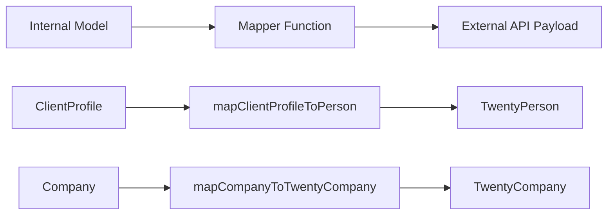

# Modelli di mappatura

Il modello utilizza funzioni di mappatura pure per trasformare i dati tra modelli interni e payload API esterni. I mappatori sono privi di effetti collaterali, a prova di null e convalidano i campi obbligatori prima della trasformazione.

## Panoramica dell'architettura



## File di origine

|Archivio|Scopo|
|------|---------|
|`lib/mappers/twenty-crm.mapper.ts`|Mappa le entità locali sui payload dell'API Twenty CRM|

## Principi di progettazione

Il modulo mapper segue rigide convenzioni di programmazione funzionale:

1. **Funzioni pure** -- nessun effetto collaterale, nessuna mutazione, nessuna chiamata al database
2. **Null-safe**: tutti i campi facoltativi utilizzano controlli null/non definiti espliciti
3. **Convalida prima della mappatura** -- i campi obbligatori vengono convalidati con errori descrittivi
4. **Applicazione dell'ID esterno** -- ogni entità mappata deve avere un `external_id` valido

## Convalida dell'ID esterno

Ogni entità mappata su un sistema esterno richiede un identificatore valido:

```typescript
export function ensureExternalId(id: string | undefined | null, entityType: string): string {
  if (!id || id.trim() === '') {
    throw new Error(`${entityType} ID is required for external_id mapping`);
  }
  return id.trim();
}
```

Questa funzione viene chiamata all'inizio di ogni mapper per garantire che il campo `external_id` non sia mai vuoto.

## Estrazione della posizione

Una funzione di utilità analizza i nomi delle città dalle stringhe di posizione a testo libero:

```typescript
export function extractCityFromLocation(location: string | undefined | null): string | null {
  if (!location || location.trim() === '') return null;
  const parts = location.split(',');
  const city = parts[0]?.trim();
  return city || null;
}
```

Gestisce formati come `"San Francisco"`, `"San Francisco, CA"` e `"San Francisco, CA, USA"`.

## Profilo cliente per venti persone CRM

Mappa i record `ClientProfile` interni al payload Twenty CRM `TwentyPerson`:

```typescript
export function mapClientProfileToPerson(clientProfile: ClientProfile): TwentyPerson {
  const external_id = ensureExternalId(clientProfile.id, 'ClientProfile');

  const person: TwentyPerson = {
    external_id,
    name: clientProfile.name,
    email: clientProfile.email,
  };

  // Optional field mapping (null-safe)
  if (clientProfile.phone)     person.phone = clientProfile.phone;
  if (clientProfile.jobTitle)  person.job_title = clientProfile.jobTitle;
  if (clientProfile.company)   person.company_name = clientProfile.company;
  if (clientProfile.website)   person.website = clientProfile.website;

  const city = extractCityFromLocation(clientProfile.location);
  if (city) person.city = city;

  // Custom fields
  if (clientProfile.accountType) person.account_type = clientProfile.accountType;
  if (clientProfile.plan)        person.plan = clientProfile.plan;
  if (clientProfile.totalSubmissions !== null && clientProfile.totalSubmissions !== undefined) {
    person.total_submissions = clientProfile.totalSubmissions;
  }

  return person;
}
```

### Tabella di mappatura dei campi

|Campo ProfiloCliente|Campo di venti persone|Obbligatorio|Note|
|--------------------|--------------------|----------|-------|
|`id`|`external_id`|Sì|Convalidato e tagliato|
|`name`|`name`|Sì|Mappatura diretta|
|`email`|`email`|Sì|Mappatura diretta|
|`phone`|`phone`|No|Solo se presente|
|`jobTitle`|`job_title`|No|camelCase in snake_case|
|`company`|`company_name`|No|Campo rinominato|
|`website`|`website`|No|Mappatura diretta|
|`location`|`city`|No|Estratto tramite `extractCityFromLocation`|
|`accountType`|`account_type`|No|Campo personalizzato|
|`plan`|`plan`|No|Campo personalizzato|
|`totalSubmissions`|`total_submissions`|No|È richiesto un controllo nullo esplicito|

## Azienda a Twenty CRM Company

Mappa le entità `Company` interne al payload Twenty CRM `TwentyCompany`:

```typescript
export function mapCompanyToTwentyCompany(company: Company): TwentyCompany {
  const external_id = ensureExternalId(company.id, 'Company');

  const twentyCompany: TwentyCompany = {
    external_id,
    name: company.name,
  };

  if (company.domain)  twentyCompany.domain_name = company.domain;
  if (company.website) twentyCompany.website = company.website;
  if (company.status)  twentyCompany.status = company.status;

  return twentyCompany;
}
```

### Tabella di mappatura dei campi

|Campo aziendale|Campo TwentyCompany|Obbligatorio|Note|
|--------------|---------------------|----------|-------|
|`id`|`external_id`|Sì|Convalidato e tagliato|
|`name`|`name`|Sì|Mappatura diretta|
|`domain`|`domain_name`|No|Campo rinominato|
|`website`|`website`|No|Mappatura diretta|
|`status`|`status`|No|`'active'` o `'inactive'`|

## Aggiunta di nuovi mappatori

Quando crei i mappatori per nuove integrazioni, segui gli schemi stabiliti:

```typescript
// 1. Always validate external_id first
const external_id = ensureExternalId(entity.id, 'EntityName');

// 2. Build the required fields object
const payload: ExternalType = {
  external_id,
  // ... required fields
};

// 3. Conditionally add optional fields (null-safe)
if (entity.optionalField) {
  payload.optional_field = entity.optionalField;
}

// 4. Return the payload -- never mutate the input
return payload;
```

## Considerazioni sui test

Poiché i mappatori sono funzioni pure, sono semplici da testare unitariamente:

- Prova con tutti i campi facoltativi compilati
- Test con tutti i campi facoltativi come `null` o `undefined`
- Verificare che gli ID richiesti mancanti generino errori descrittivi
- Testare l'estrazione della posizione con vari formati di stringa
- Verificare che l'oggetto di input non venga mai modificato
