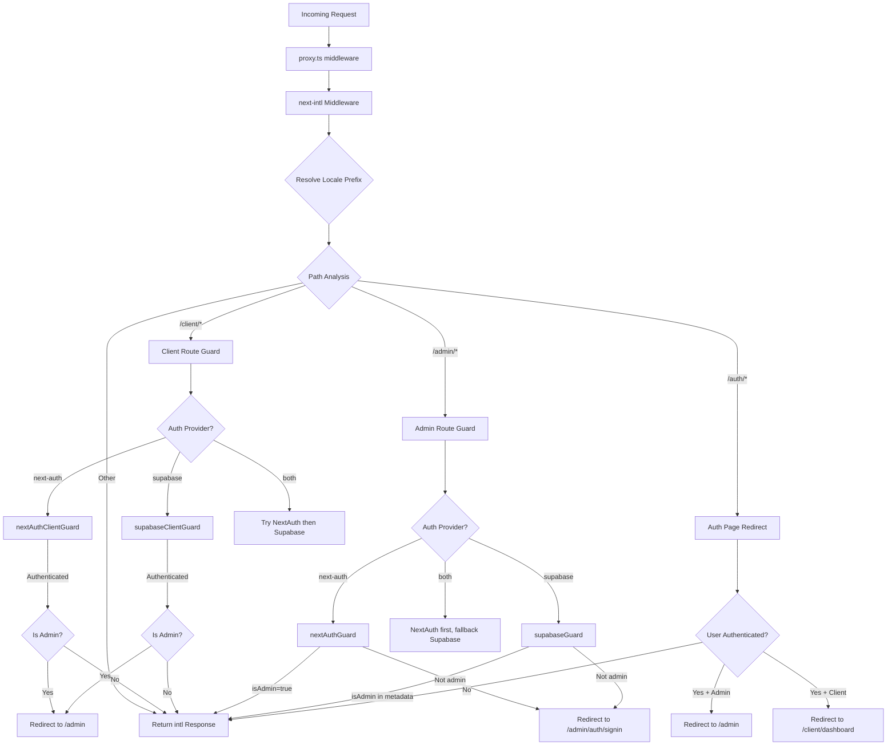

# Catena del middleware ed elaborazione delle richieste

## Panoramica

Il modello Ever Works utilizza un'architettura **middleware unificata** definita in `proxy.ts` alla radice del progetto. Questo middleware orchestra tre aspetti critici per ogni richiesta in arrivo:

1. **Internazionalizzazione** -- rilevamento della lingua, inserimento del prefisso e instradamento tramite `next-intl`
2. **Protezioni di autenticazione**: protezione dei percorsi `/admin/*` e `/client/*` utilizzando NextAuth, Supabase o entrambi
3. **Reindirizzamento basato sui ruoli**: allontanamento degli utenti autenticati dalle pagine di autenticazione pubbliche e reindirizzamento degli amministratori/clienti alle rispettive dashboard

Il progetto supporta un modello di **provider di autenticazione collegabile**: il middleware legge l'attuale `AuthProviderType` (`'next-auth'`, `'supabase'` o `'both'`) dalla configurazione di autenticazione centralizzata e seleziona di conseguenza le funzioni di protezione appropriate.

## Diagramma dell'architettura



## File di origine

|Archivio|Scopo|
|------|---------|
|`template/proxy.ts`|Punto di ingresso principale del middleware|
|`template/lib/auth/config.ts`|Configurazione del provider di autenticazione (`getAuthConfig()`)|
|`template/lib/auth/supabase/middleware.ts`|Assistente per l'aggiornamento della sessione di Supabase|
|`template/lib/auth/validate-callback-url.ts`|Costruzione sicura dell'URL di richiamata|
|`template/i18n/routing.ts`|Configurazione del routing locale|

## Richiesta di elaborazione dell'ordine

### Fase 1: Internazionalizzazione

Ogni richiesta passa prima attraverso il middleware `next-intl` creato con `createIntlMiddleware(routing)`:

```typescript
import createIntlMiddleware from 'next-intl/middleware';
import { routing } from './i18n/routing';

const intl = createIntlMiddleware(routing);
```

Gestisce il rilevamento locale tramite l'intestazione `Accept-Language`, le preferenze dei cookie e il prefisso URL. La configurazione del routing utilizza `localePrefix: "as-needed"`, ovvero la locale predefinita (`en`) non richiede un prefisso URL.

### Passaggio 2: risoluzione della lingua

L'helper `resolveLocalePrefix` estrae le informazioni sulla locale dal nome del percorso:

```typescript
function resolveLocalePrefix(pathname: string): {
    prefix: string;       // e.g., "/fr" or ""
    hasLocale: boolean;
    locale?: string;
    pathWithoutLocale: string;  // e.g., "/admin/items"
}
```

Questo è fondamentale perché tutte le successive corrispondenze del percorso (ad esempio, il controllo di `/admin` o `/client`) devono operare sul percorso **senza** il prefisso locale.

### Passaggio 3: selezione della protezione basata sul percorso

Il middleware valuta `pathWithoutLocale` per determinare quale catena di protezione applicare:

|Modello del percorso|Guardia applicata|Scopo|
|-------------|--------------|---------|
|`/client` o `/client/*`|Protezione dell'autenticazione del cliente|Richiede l'autenticazione; reindirizza gli amministratori a `/admin`|
|`/admin/*` (tranne `/admin/auth/signin`)|Protezione autenticazione amministratore|Richiede l'autenticazione + `isAdmin` flag|
|`/auth/*`|Reindirizzamento della pagina di autenticazione|Reindirizza gli utenti autenticati lontano dall'accesso/registrazione|
|Tutto il resto|Nessuna guardia|Passa attraverso con la risposta i18n|

### Passaggio 4: verifica dell'autenticazione

#### NextAuth Guard (basato su JWT)

```typescript
const token = await getToken({ req, secret: process.env.AUTH_SECRET });
if (token?.isAdmin === true) {
    return baseRes; // Admin access granted
}
```

Le guardie NextAuth utilizzano `getToken()` da `next-auth/jwt` per leggere il token JWT dai cookie. Questo è compatibile con Edge Runtime e non richiede una ricerca nel database.

#### Guardia Supabase

```typescript
const supRes = await supabaseUpdate(req);
// Merge cookies...
const { data: { user } } = await supabase.auth.getUser();
const isAdmin = user?.user_metadata?.isAdmin === true
    || user?.user_metadata?.role === 'admin';
```

La guardia Supabase aggiorna innanzitutto la sessione utilizzando `updateSession()`, quindi controlla i metadati dell'utente per i flag di amministrazione.

### Passaggio 5: Propagazione dei cookie

Un dettaglio di implementazione critico: quando una guardia produce una risposta di reindirizzamento, tutti i cookie di `intlResponse` devono essere propagati:

```typescript
const redirectRes = NextResponse.redirect(url);
baseRes.cookies.getAll().forEach((c) => redirectRes.cookies.set(c));
return redirectRes;
```

Ciò garantisce che le preferenze locali e i cookie della sessione di autenticazione sopravvivano ai reindirizzamenti.

## Configurazione

### Selezione del fornitore di autenticazione

Il provider di autenticazione è determinato da `getAuthConfig()` in `lib/auth/config.ts`:

```typescript
export type AuthProviderType = 'supabase' | 'next-auth' | 'both';

export function getAuthConfig(): AuthConfig {
    // Priority 1: Global override via configureAuth()
    // Priority 2: Environment-based (detects Supabase env vars)
    // Priority 3: Default ('next-auth')
}
```

### Corrispondenza del middleware

```typescript
export const config = {
    matcher: ['/((?!api|trpc|_next|_vercel|.*\\..*).*)']
};
```

Questa espressione regolare esclude:
- `/api/*` percorsi (gestiti dal livello API Next.js)
- `/trpc/*` percorsi
- `/_next/*` (interni Next.js)
- `/_vercel/*` (interni Vercel)
- Qualsiasi percorso con estensione file (risorse statiche)

### Sicurezza dell'URL di richiamata

Il middleware utilizza `createSafeCallbackUrl()` per prevenire attacchi di reindirizzamento aperto:

```typescript
export function createSafeCallbackUrl(pathname: string, search?: string): string {
    // Limits URL length to 2048 characters
    // Validates relative-only paths
}

export function isValidCallbackUrl(url: string | null): boolean {
    return url?.startsWith('/') && !url.startsWith('//');
}
```

## Modalità doppio provider ("entrambi")

Quando `provider === 'both'`, il middleware implementa una catena di fallback:

1. **Percorsi client**: provare prima NextAuth; se non autenticato, prova Supabase
2. **Percorsi amministrativi**: prova prima NextAuth; se produce un reindirizzamento (negato), prova Supabase
3. **Pagine di autenticazione**: controlla prima il token NextAuth, quindi controlla la sessione Supabase

Ciò consente alle organizzazioni di migrare tra provider di autenticazione senza interrompere gli utenti esistenti.

## Dettagli chiave dell'implementazione

### Compatibilità Edge Runtime

Il middleware viene eseguito in Next.js Edge Runtime. Tutti i controlli di autenticazione utilizzano API compatibili con Edge:
- NextAuth: `getToken()` (basato su JWT, non è necessario DB)
- Supabase: `createServerClient()` con sessione basata su cookie

### Sviluppo e registrazione della produzione

La registrazione del debug è protetta da `NODE_ENV === 'development'`:

```typescript
if (process.env.NODE_ENV === 'development') {
    console.log('[Middleware] Admin access granted via token');
}
```

### Aggiornamento della sessione Supabase

L'helper middleware Supabase (`updateSession`) viene chiamato prima di ogni controllo di autenticazione per garantire che i token vengano aggiornati:

```typescript
export async function updateSession(request: NextRequest) {
    const supabase = createServerClient(url, anonKey, {
        cookies: { getAll, setAll }
    });
    // IMPORTANT: DO NOT REMOVE auth.getUser()
    await supabase.auth.getUser();
    return supabaseResponse;
}
```

Il commento nel codice sorgente sottolinea che `auth.getUser()` non deve essere rimosso: attiva il ciclo di aggiornamento del token che impedisce disconnessioni casuali.
