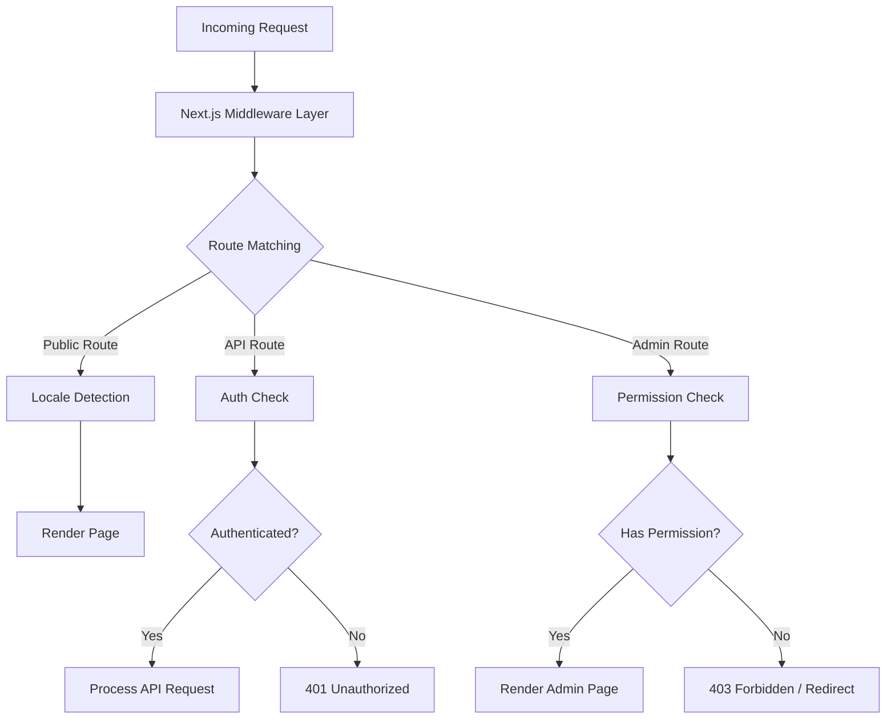
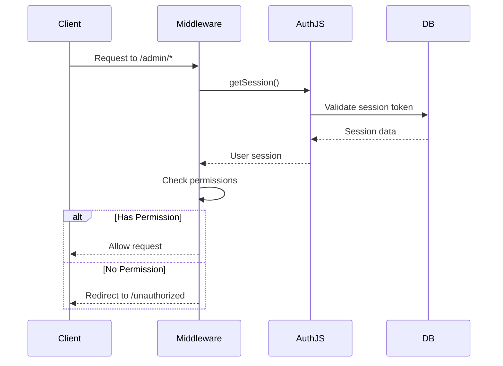
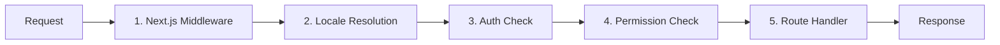

# Approfondimento sul middleware

Il modello Ever Works utilizza un'architettura middleware a più livelli basata sulle convenzioni del router app Next.js e sulla logica di controllo delle autorizzazioni personalizzata. Questo documento copre l'intera pipeline di elaborazione delle richieste, i controlli delle autorizzazioni, il middleware di autenticazione, la gestione delle impostazioni locali e l'ordinamento del middleware.

## Panoramica dell'architettura



## Middleware di controllo delle autorizzazioni

Il sistema di controllo delle autorizzazioni risiede in `lib/middleware/permission-check.ts` e fornisce un controllo granulare degli accessi per i percorsi API e le pagine di amministrazione.

### Interfaccia principale

```typescript
interface UserPermissions {
  userId: string;
  roles: string[];
  permissions: Permission[];
}
```

### Funzioni di controllo dei permessi

|Funzione|Scopo|Ritorni|
|---|---|---|
|`hasPermission(user, permission)`|Controlla l'autorizzazione singola|`boolean`|
|`hasAnyPermission(user, permissions)`|Controlla se l'utente ne ha almeno uno|`boolean`|
|`hasAllPermissions(user, permissions)`|Controlla se l'utente ha tutti elencati|`boolean`|
|`hasResourcePermission(user, resource, action)`|Controllare il formato `resource:action`|`boolean`|
|`getResourcePermissions(user, resource)`|Ottieni tutte le autorizzazioni per una risorsa|`Permission[]`|
|`canManageResource(user, resource)`|Controlla l'accesso per creare/aggiornare/eliminare|`boolean`|
|`isSuperAdmin(user)`|Controlla il ruolo di super amministratore o tutte le autorizzazioni|`boolean`|

### Utilizzo nelle rotte API

```typescript
import { hasPermission, hasAnyPermission } from '@/lib/middleware/permission-check';

export async function GET(request: Request) {
  const userPermissions = await getUserPermissions(session);

  // Single permission check
  if (!hasPermission(userPermissions, 'items:read')) {
    return new Response('Forbidden', { status: 403 });
  }

  // Multiple permission check (any)
  if (!hasAnyPermission(userPermissions, ['items:review', 'items:approve'])) {
    return new Response('Forbidden', { status: 403 });
  }
}
```

### Controlli a livello di risorse

```typescript
// Check specific resource and action
const canEdit = hasResourcePermission(userPermissions, 'items', 'update');

// Get all permissions for a resource
const itemPerms = getResourcePermissions(userPermissions, 'items');
// Returns: ['items:read', 'items:create', 'items:update']

// Check management capability (create, update, or delete)
const canManage = canManageResource(userPermissions, 'categories');
```

### Assistenti specializzati nelle autorizzazioni

Il middleware fornisce helper specifici del dominio che combinano più controlli di autorizzazione:

```typescript
// Can the user review, approve, or reject items?
const canReview = canReviewItems(userPermissions);

// Can the user manage users (read, create, update, delete, assignRoles)?
const canAdmin = canManageUsers(userPermissions);

// Can the user view analytics data?
const canView = canViewAnalytics(userPermissions);

// Is the user a super admin?
const isAdmin = isSuperAdmin(userPermissions);
```

### Rilevamento super amministratore

La funzione `isSuperAdmin` utilizza un approccio a due livelli:

1. **Verifica ruolo** (primario): controlla se l'utente ha il ruolo `super-admin`
2. **Controllo delle autorizzazioni** (fallback): verifica che l'utente disponga di tutte le autorizzazioni di sistema

```typescript
function isSuperAdmin(userPermissions: UserPermissions): boolean {
  // Fast path: check role
  if (userPermissions.roles.includes('super-admin')) {
    return true;
  }
  // Exhaustive check: verify all permissions
  return hasAllPermissions(userPermissions, allSystemPermissions);
}
```

## Middleware di autenticazione

L'autenticazione viene gestita tramite NextAuth.js (Auth.js v5) configurato in `auth.config.ts`. Il middleware viene eseguito su ogni richiesta ai percorsi protetti.

### Configurazione del fornitore

La configurazione di autenticazione configura dinamicamente i provider OAuth con fallback grazioso:

|Fornitore|Origine della configurazione|
|---|---|
|Google|`authConfig.google.clientId/clientSecret`|
|GitHub|`authConfig.github.clientId/clientSecret`|
|Facebook|`authConfig.facebook.clientId/clientSecret`|
|Twitter/X|`authConfig.twitter.clientId/clientSecret`|
|Credenziali|Sempre abilitato|

Se la configurazione OAuth fallisce, il sistema torna all'autenticazione basata solo sulle credenziali.

### Flusso della sessione di autenticazione



## Middleware locale

Il modello supporta oltre 20 lingue tramite l'integrazione del middleware `next-intl`. Il rilevamento delle impostazioni locali segue lo schema del prefisso "secondo necessità":

- Impostazioni internazionali predefinite (`en`): Nessun prefisso URL -- `/items/my-app`
- Altre impostazioni locali: prefisso locale -- `/fr/items/my-app`

### Località supportate

|Locale|Lingua|Locale|Lingua|
|---|---|---|---|
|`en`|Inglese (predefinito)|`ja`|giapponese|
|`fr`|francese|`ko`|Coreano|
|`es`|spagnolo|`nl`|olandese|
|`de`|tedesco|`pl`|Polacco|
|`zh`|Cinese|`tr`|Turco|
|`ar`|Arabo|`vi`|Vietnamita|
|`he`|Ebraico|`th`|tailandese|
|`ru`|Russo|`hi`|Hindi|
|`uk`|ucraino|`id`|Indonesiano|
|`pt`|portoghese|`bg`|Bulgaro|
|`it`|italiano| | |

## Richiesta di pipeline di elaborazione

La pipeline completa di elaborazione delle richieste segue questo ordine:



### Passaggi della pipeline

1. **Next.js Middleware** (`middleware.ts`): viene eseguito su ogni richiesta che corrisponde ai matcher configurati. Gestisce reindirizzamenti, riscritture e inserimento di intestazioni.

2. **Risoluzione locale**: rileva la locale preferita dell'utente dal percorso URL, dall'intestazione `Accept-Language` o dal cookie. Imposta le impostazioni internazionali per il contesto della richiesta.

3. **Verifica autenticazione**: per percorsi protetti (`/admin/*`, `/dashboard/*`, `/api/admin/*`), convalida il token di sessione dell'utente.

4. **Controllo delle autorizzazioni**: dopo l'autenticazione, verifica che l'utente disponga delle autorizzazioni richieste per la risorsa e l'azione specifica.

5. **Gestore del percorso**: il componente della pagina effettivo o il gestore del percorso API elabora la richiesta.

### Garanzie sull'ordinazione del middleware

Il sistema impone un ordine rigoroso:

- Il rilevamento della lingua viene sempre eseguito per primo (necessario per le pagine di errore)
- I controlli di autenticazione vengono eseguiti prima dei controlli delle autorizzazioni (è necessario che un utente controlli le autorizzazioni)
- I controlli dei permessi sono l'ultimo passaggio prima dei gestori del percorso
- I percorsi API utilizzano controlli delle autorizzazioni a livello di funzione (non a livello di middleware)

## Utilità di convalida delle autorizzazioni

Il middleware include aiutanti di convalida per lavorare con le stringhe di autorizzazione:

```typescript
// Validate a permission string
validatePermission('items:read');     // true
validatePermission('invalid:perm');   // false

// Parse a permission into parts
parsePermission('items:update');
// Returns: { resource: 'items', action: 'update' }

// Get summary grouped by resource
getPermissionSummary(userPermissions);
// Returns: { items: ['read', 'create'], categories: ['read'] }
```

## Gestione degli errori

Il sistema middleware gestisce gli errori a ogni livello:

|Strato|Errore|Risposta|
|---|---|---|
|Locale|Impostazioni locali non valide|Reindirizzamento alle impostazioni locali predefinite|
|Aut|Nessuna sessione|401 o reindirizzare all'accesso|
|Aut|Sessione scaduta|401 con suggerimento di aggiornamento|
|Autorizzazione|Autorizzazione mancante|403 Proibito|
|Autorizzazione|Stringa di autorizzazione non valida|Avviso registrato, accesso negato|

## Migliori pratiche

1. **Utilizza il controllo più specifico**: preferisci `hasPermission` con una singola autorizzazione rispetto a `isSuperAdmin` per il controllo delle funzionalità regolari.

2. **Verifica le autorizzazioni nei percorsi API**: non fare affidamento esclusivamente sul middleware; convalidare sempre nel gestore del percorso per la difesa in profondità.

3. **Utilizza importazioni dinamiche** nel middleware per evitare di raggruppare moduli solo server nell'edge runtime.

4. **Mantieni rapidi i controlli delle autorizzazioni**: la ricerca del set di autorizzazioni `O(1)` garantisce un sovraccarico minimo per richiesta.

5. **Errori di autorizzazione di registro**: utilizza la registrazione strutturata con l'ID utente e i tentativi di autorizzazione per il controllo di sicurezza.
