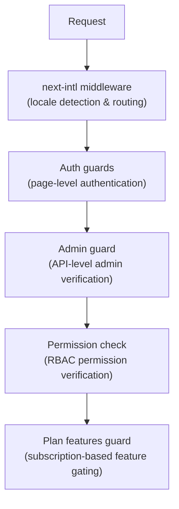

# Middleware e protezioni

Il modello Ever Works utilizza un sistema di protezione a più livelli costituito da middleware Next.js per il routing, controlli di autenticazione per la protezione delle pagine e delle API, controlli delle autorizzazioni per RBAC e controlli delle funzionalità basati sul piano per il gating degli abbonamenti.

## Livelli del middleware



## Middleware locale (successivo-intl)

Il middleware root gestisce il routing dell'internazionalizzazione tramite `next-intl`. Viene configurato tramite `i18n/routing.ts` e `i18n/request.ts`.

Responsabilità:
- Rileva le impostazioni locali dell'utente dal percorso URL, dai cookie o dall'intestazione `Accept-Language`
- Reindirizzare le richieste senza prefisso locale alle impostazioni locali appropriate
- L'impostazione predefinita è inglese (`en`) quando non viene rilevata alcuna preferenza
- Supporta 6 lingue: `en`, `fr`, `es`, `de`, `ar`, `zh`

## Guardie dell'autenticazione

### Guardie a livello di pagina (`lib/auth/guards.ts`)

Il modulo guards fornisce controlli di autenticazione lato server per le pagine. Questi vengono chiamati nella parte superiore dei componenti del server per proteggere l'accesso alla pagina.

**`requireAuth()`** -- Richiede l'autenticazione dell'utente:

```typescript
import { requireAuth } from '@/lib/auth/guards';

export default async function ProtectedPage() {
  const session = await requireAuth();
  // session.user is guaranteed to exist here
  return <div>Welcome {session.user.email}</div>;
}
```

Se l'utente non è autenticato, viene reindirizzato a `/auth/signin`.

**`requireAdmin()`** -- Richiede che l'utente sia autenticato E abbia il ruolo di amministratore:

```typescript
import { requireAdmin } from '@/lib/auth/guards';

export default async function AdminPage() {
  const session = await requireAdmin();
  return <div>Admin: {session.user.email}</div>;
}
```

Se l'utente non è autenticato, viene reindirizzato a `/admin/auth/signin`. Se autenticati ma non amministratori, vengono reindirizzati a `/unauthorized`.

**`getSession()`** -- Ottiene la sessione senza reindirizzamento:

```typescript
const session = await getSession();
if (session) {
  // Authenticated
} else {
  // Guest
}
```

**`checkIsAdmin()`** -- Controlla lo stato dell'amministratore senza reindirizzare:

```typescript
const isAdmin = await checkIsAdmin();
// Returns true or false
```

### Azioni convalidate (`lib/auth/guards.ts`)

Il modulo guards fornisce inoltre wrapper di azioni convalidati per le azioni del server Next.js:

**`validatedAction(schema, action)`** -- Convalida i dati del modulo rispetto a uno schema Zod:

```typescript
export const myAction = validatedAction(mySchema, async (data, formData) => {
  // data is validated and typed
});
```

**`validatedActionWithUser(schema, action)`** -- Convalida e richiede l'autenticazione:

```typescript
export const myAction = validatedActionWithUser(mySchema, async (data, formData, user) => {
  // data is validated, user is authenticated
});
```

## Guardia amministrativa (`lib/auth/admin-guard.ts`)

La protezione amministrativa fornisce protezione del percorso API specificatamente per gli endpoint amministrativi.

**`checkAdminAuth()`** -- Funzione middleware per percorsi API:

```typescript
import { checkAdminAuth } from '@/lib/auth/admin-guard';

export async function GET(request: NextRequest) {
  const authError = await checkAdminAuth();
  if (authError) return authError;

  // User is verified admin, proceed with handler
}
```

Restituisce `null` se autorizzato o `NextResponse` con lo stato di errore appropriato (401 o 403).

**`withAdminAuth(handler)`** -- Wrapper di funzioni di ordine superiore:

```typescript
import { withAdminAuth } from '@/lib/auth/admin-guard';

export const GET = withAdminAuth(async (request) => {
  // Already verified as admin
  return NextResponse.json({ data: 'admin only' });
});
```

La guardia amministrativa verifica sia l'autenticazione (la sessione esiste) che l'autorizzazione (l'utente ha il ruolo di amministratore nel database tramite `isAdmin()` check).

## Sistema di controllo delle autorizzazioni (`lib/middleware/permission-check.ts`)

Il sistema di autorizzazione implementa il controllo degli accessi basato sui ruoli (RBAC) con autorizzazioni granulari.

### Struttura dei permessi

Le autorizzazioni seguono il formato `resource:action`:

```typescript
// Examples of permission keys
'items:read'
'items:create'
'items:update'
'items:delete'
'items:review'
'items:approve'
'items:reject'
'categories:read'
'categories:create'
'users:assignRoles'
'analytics:read'
'system:settings'
```

### Funzioni di controllo dei permessi

```typescript
import {
  hasPermission,
  hasAnyPermission,
  hasAllPermissions,
  hasResourcePermission,
  canManageResource,
  canReviewItems,
  canManageUsers,
  canManageRoles,
  canViewAnalytics,
  isSuperAdmin,
} from '@/lib/middleware/permission-check';

// Single permission check
hasPermission(userPermissions, 'items:create');

// Any of multiple permissions
hasAnyPermission(userPermissions, ['items:create', 'items:update']);

// All permissions required
hasAllPermissions(userPermissions, ['items:read', 'items:update']);

// Resource-level check
hasResourcePermission(userPermissions, 'items', 'create');

// Domain-specific helpers
canManageResource(userPermissions, 'categories'); // create, update, or delete
canReviewItems(userPermissions);                  // review, approve, or reject
canManageUsers(userPermissions);                  // user CRUD + assignRoles
isSuperAdmin(userPermissions);                    // all system permissions
```

### Rilevamento super amministratore

La funzione `isSuperAdmin()` verifica due condizioni:
1. Se l'utente ha il ruolo `super-admin` (preferito)
2. Come fallback, se l'utente dispone di TUTTE le autorizzazioni di sistema

### Convalida dell'autorizzazione

```typescript
// Validate a permission string is defined in the system
validatePermission('items:create'); // true
validatePermission('invalid:perm'); // false

// Parse permission into resource and action
parsePermission('items:create'); // { resource: 'items', action: 'create' }
```

## Caratteristiche del piano Guardia (`lib/guards/plan-features.guard.ts`)

Il piano prevede l'accesso alle funzionalità di controllo della guardia in base ai piani di abbonamento (gratuito, standard, premium).

### Gerarchia del piano

```typescript
const PLAN_LEVELS = {
  free: 1,
  standard: 2,
  premium: 3,
};
```

### Matrice di accesso alle funzionalità

Ogni funzionalità è mappata ai piani che possono accedervi:

|Caratteristica|Gratuito|Norma|Premio|
|---------|------|----------|---------|
|Invia prodotto|Sì|Sì|Sì|
|Carica immagini|Sì|Sì|Sì|
|Supporto via e-mail|Sì|Sì|Sì|
|Descrizione estesa| - |Sì|Sì|
|Distintivo verificato| - |Sì|Sì|
|Revisione prioritaria| - |Sì|Sì|
|Visualizza statistiche| - |Sì|Sì|
|Carica video| - | - |Sì|
|Distintivo sponsorizzato| - | - |Sì|
|Home page in primo piano| - | - |Sì|
|Analisi avanzata| - | - |Sì|
|Invii illimitati| - | - |Sì|

### Limiti del piano

Ogni piano ha limiti numerici per determinate funzionalità:

|Limite|Gratuito|Norma|Premio|
|-------|------|----------|---------|
|Immagini massime| 1 | 5 |Illimitato|
|Parole descrittive massime| 200 | 500 |Illimitato|
|Numero massimo di invii| 1 | 10 |Illimitato|
|Giornate di revisione| 7 | 3 | 1 |
|Giorni di modifica gratuiti| 0 | 30 | 365 |

### Utilizzando il Piano Guardia

**Chiamate di funzioni dirette:**

```typescript
import { canAccessFeature, getFeatureLimit, isWithinLimit } from '@/lib/guards';

canAccessFeature('upload_video', 'free');    // false
canAccessFeature('upload_video', 'premium'); // true
getFeatureLimit('max_images', 'standard');   // 5
isWithinLimit('max_submissions', 3, 'free'); // false (limit is 1)
```

**Fabbrica di guardie (per controlli multipli):**

```typescript
import { createPlanGuard } from '@/lib/guards';

const guard = createPlanGuard('standard');
guard.canAccess('verified_badge');     // true
guard.canAccess('upload_video');       // false
guard.getLimit('max_images');          // 5
guard.requireFeature('upload_video');  // throws PlanGuardError
```

**Integrazione dell'hook React:**

```typescript
import { createPlanGuardResult } from '@/lib/guards';

// In a hook or component
const guardResult = createPlanGuardResult(userPlan);
guardResult.canAccess('verified_badge');
guardResult.accessibleFeatures; // array of all accessible features
```

Il `PlanGuardError` generato da `requireFeature()` include il nome della funzionalità, il piano attuale dell'utente e il piano richiesto, abilitando richieste informative di aggiornamento nell'interfaccia utente.
