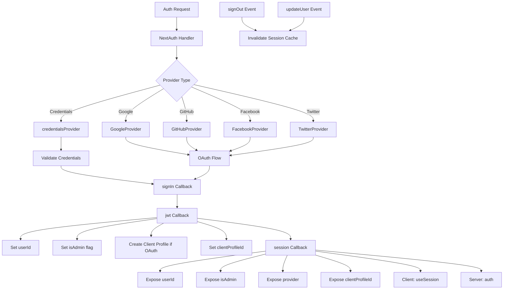

# Configurazione NextAuth

## Panoramica

Il modello Ever Works configura NextAuth.js (Auth.js v5) con sessioni basate su JWT, un adattatore Drizzle ORM, più provider OAuth (Google, GitHub, Facebook, Twitter), autenticazione basata su credenziali e callback personalizzati per la gestione del ruolo amministratore/client. Il sistema supporta la creazione automatica del profilo client per gli utenti OAuth e la memorizzazione nella cache delle sessioni con invalidazione della cache.

## Architettura



## File di origine

|Archivio|Scopo|
|------|---------|
|`template/lib/auth/index.ts`|Configurazione ed esportazioni principali di NextAuth|
|`template/auth.config.ts`|Configurazione del provider (compatibile con Edge)|
|`template/lib/auth/config.ts`|Selezione del tipo di provider di autenticazione|
|`template/lib/auth/providers.ts`|Funzioni di fabbrica del provider OAuth|
|`template/lib/auth/credentials.ts`|Implementazione del provider di credenziali|
|`template/lib/auth/guards.ts`|Utilità di protezione dell'autenticazione lato server|
|`template/lib/auth/middleware.ts`|Wrapper di azioni convalidati|
|`template/lib/auth/setup.ts`|Assistente per l'inizializzazione dell'autenticazione|
|`template/lib/auth/cached-session.ts`|Gestione della cache della sessione|
|`template/lib/auth/session-cache.ts`|Implementazione della cache di sessione|
|`template/lib/auth/admin-guard.ts`|Logica di guardia specifica dell'amministratore|

## Inizializzazione NextAuth

```typescript
// lib/auth/index.ts
export const { handlers, auth, signIn, signOut, unstable_update } = NextAuth({
    adapter: drizzle,
    session: {
        strategy: 'jwt',
        maxAge: 30 * 24 * 60 * 60,    // 30 days
        updateAge: 24 * 60 * 60        // Refresh every 24 hours
    },
    jwt: {
        maxAge: 30 * 24 * 60 * 60      // 30 days
    },
    callbacks: { authorized, redirect, signIn, jwt, session },
    events: { signOut, updateUser },
    pages: {
        signIn: '/auth/signin',
        signOut: '/auth/signout',
        error: '/auth/error',
        verifyRequest: '/auth/verify-request',
        newUser: '/auth/register'
    },
    ...authConfig  // Merges providers from auth.config.ts
});
```

### Strategia della sessione

Il modello utilizza **sessioni JWT** (`strategy: 'jwt'`), non sessioni di database. Ciò significa:
- Le sessioni vengono archiviate in cookie crittografati, non nel database
- Non è necessaria alcuna query sul database per convalidare una sessione
- Compatibile con Edge Runtime (middleware)
- I dati della sessione sono limitati a ciò che rientra in un token JWT

## Adattatore database

```typescript
const isDatabaseAvailable = !!coreConfig.DATABASE_URL && typeof db !== 'undefined';

const drizzle = isDatabaseAvailable
    ? DrizzleAdapter(getDrizzleInstance(), {
        usersTable: users,
        accountsTable: accounts,
        sessionsTable: sessions,
        verificationTokensTable: verificationTokens
    })
    : undefined;
```

L'adattatore viene creato in modo condizionale in base alla disponibilità del database. Ciò consente al modello di avviarsi anche senza un database (ad esempio durante la configurazione iniziale), sebbene l'autenticazione sarà limitata.

## Configurazione del fornitore

### auth.config.ts (compatibile con Edge)

```typescript
// auth.config.ts
const configureProviders = () => {
    try {
        const oauthProviders = configureOAuthProviders();
        return createNextAuthProviders({
            google: oauthProviders.find((p) => p.id === 'google')
                ? { enabled: true, clientId: '...', clientSecret: '...' }
                : { enabled: false },
            github: { /* ... */ },
            facebook: { /* ... */ },
            twitter: { /* ... */ },
            credentials: { enabled: true },
        });
    } catch (error) {
        // Fallback to credentials only
        return createNextAuthProviders({
            credentials: { enabled: true },
            google: { enabled: false },
            github: { enabled: false },
            facebook: { enabled: false },
            twitter: { enabled: false },
        });
    }
};

export default {
    trustHost: true,
    providers: configureProviders(),
} satisfies NextAuthConfig;
```

### Fabbrica dei fornitori

```typescript
// lib/auth/providers.ts
export function createNextAuthProviders(config: OAuthProvidersConfig) {
    const providers = [];

    if (config.google?.enabled && config.google.clientId && config.google.clientSecret) {
        providers.push(GoogleProvider({
            clientId: config.google.clientId,
            clientSecret: config.google.clientSecret,
            ...config.google.options,
        }));
    }
    // GitHub, Facebook, Twitter follow the same pattern...

    if (config.credentials?.enabled) {
        providers.push(credentialsProvider);
    }

    return providers;
}
```

I provider vengono aggiunti solo quando dispongono di credenziali valide, evitando errori di configurazione all'avvio.

## Richiamate

### accedi Richiamata

```typescript
signIn: async ({ user, account, profile }) => {
    const isCredentials = account?.provider === 'credentials';

    if (!user?.email) {
        return !isCredentials; // Allow OAuth without email
    }

    if (!isDatabaseAvailable) {
        return !isCredentials; // Skip DB validation if no DB
    }

    // For OAuth providers, allow account linking
    if (!isCredentials && account?.provider) {
        return true;
    }

    return true;
}
```

### jwt Richiamata

Il callback JWT è il nucleo della pipeline di autenticazione. Funziona su ogni richiesta e gestisce:

```typescript
jwt: async ({ token, user, account }) => {
    // 1. Set userId from user object or token.sub
    if (user?.id) token.userId = user.id;
    if (!token.userId && token.sub) token.userId = token.sub;

    // 2. Set clientProfileId
    if (user?.clientProfileId) token.clientProfileId = user.clientProfileId;

    // 3. Record provider
    if (account?.provider) token.provider = account.provider;

    // 4. Auto-create client profile for OAuth users
    if (isOAuthProvider && !token.clientProfileId && token.userId) {
        let clientProfile = await getClientProfileByUserId(token.userId);
        if (!clientProfile) {
            clientProfile = await createClientProfile({
                userId: token.userId,
                email: token.email,
                name: token.name || token.email?.split('@')[0],
            });
        }
        token.clientProfileId = clientProfile?.id;
    }

    // 5. Set isAdmin flag
    if (user?.isClient !== undefined) {
        token.isAdmin = !user.isClient;
    } else if (user?.isAdmin !== undefined) {
        token.isAdmin = user.isAdmin;
    } else if (token.isAdmin === undefined) {
        token.isAdmin = false; // Default: non-admin
    }

    return token;
}
```

### Richiamata della sessione

Mappa i campi token JWT sull'oggetto sessione esposto ai componenti client:

```typescript
session: async ({ session, token }) => {
    if (token && session.user) {
        session.user.id = token.userId;
        session.user.clientProfileId = token.clientProfileId;
        session.user.provider = token.provider || 'credentials';
        session.user.isAdmin = token.isAdmin;
    }
    return session;
}
```

## Eventi

### Invalidazione della cache di sessione

```typescript
events: {
    signOut: async (event) => {
        const token = 'token' in event ? event.token : undefined;
        if (token?.userId) {
            await invalidateSessionCache(undefined, token.userId);
        }
    },
    updateUser: async ({ user }) => {
        if (user?.id) {
            await invalidateSessionCache(undefined, user.id);
        }
    }
}
```

Entrambi gli eventi `signOut` e `updateUser` attivano l'invalidazione della cache della sessione, garantendo che i dati della sessione obsoleti non vengano forniti dopo le modifiche dello stato di autenticazione.

## Protezioni lato server

### richiedonoAut

```typescript
export async function requireAuth() {
    const session = await auth();
    if (!session?.user) {
        redirect('/auth/signin');
    }
    return session;
}
```

### richiedonoAdmin

```typescript
export async function requireAdmin() {
    const session = await auth();
    if (!session?.user) {
        redirect('/admin/auth/signin');
    }
    if (!session.user.isAdmin) {
        redirect('/unauthorized');
    }
    return session;
}
```

### Guardie di utilità

```typescript
// Check without redirecting
export async function getSession() {
    return await auth();
}

export async function checkIsAdmin() {
    const session = await auth();
    return session?.user?.isAdmin === true;
}
```

## Pagine personalizzate

|Pagina|Percorso|Scopo|
|------|------|---------|
|Accedi|`/auth/signin`|Modulo di accesso|
|Esci|`/auth/signout`|Conferma di disconnessione|
|Errore|`/auth/error`|Visualizzazione dell'errore di autenticazione|
|Verifica richiesta|`/auth/verify-request`|Richiesta di verifica e-mail|
|Registrati|`/auth/register`|Nuova registrazione utente|

## Variabili d'ambiente

|Variabile|Obbligatorio|Scopo|
|----------|----------|---------|
|`AUTH_SECRET`|Sì|Segreto di crittografia JWT|
|`AUTH_GOOGLE_ID`|No|ID client Google OAuth|
|`AUTH_GOOGLE_SECRET`|No|Segreto client Google OAuth|
|`AUTH_GITHUB_ID`|No|ID client GitHub OAuth|
|`AUTH_GITHUB_SECRET`|No|Segreto client GitHub OAuth|
|`AUTH_FACEBOOK_ID`|No|ID client OAuth di Facebook|
|`AUTH_FACEBOOK_SECRET`|No|Segreto client OAuth di Facebook|
|`AUTH_TWITTER_ID`|No|ID client Twitter/X OAuth|
|`AUTH_TWITTER_SECRET`|No|Segreto client Twitter/X OAuth|
|`DATABASE_URL`|Per adattatore|Stringa di connessione al database|

## Migliori pratiche

1. **Utilizza la strategia JWT** per la compatibilità Edge Runtime nel middleware
2. **Crea automaticamente profili client** per gli utenti OAuth nel callback JWT
3. **Degradazione regolare**: se la configurazione OAuth fallisce, torna solo alle credenziali
4. **Invalida la cache sugli eventi di autenticazione**: la disconnessione e l'aggiornamento dell'utente cancellano entrambe le sessioni memorizzate nella cache
5. **Adattatore condizionale** -- consente l'avvio senza un database per la configurazione iniziale
6. **Funzioni di protezione** -- utilizza `requireAuth()` / `requireAdmin()` nei componenti del server, non controlli manuali della sessione
7. **Pagine personalizzate**: sostituisci le pagine NextAuth predefinite per un'interfaccia utente coerente con il design del modello
