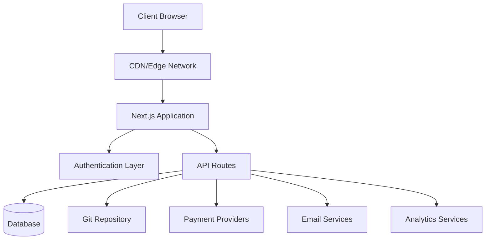
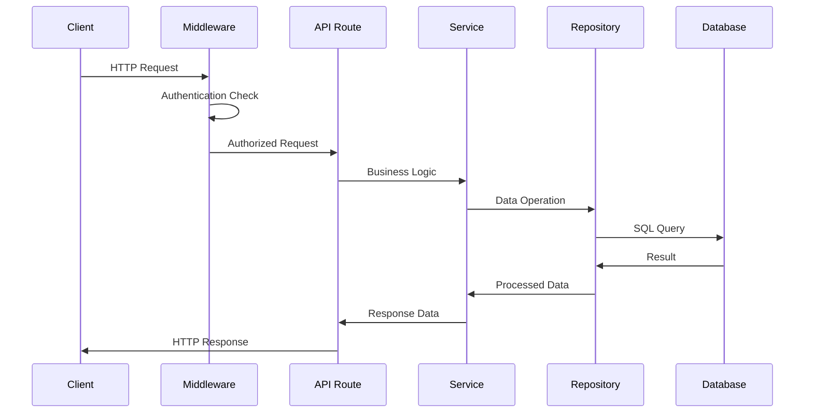
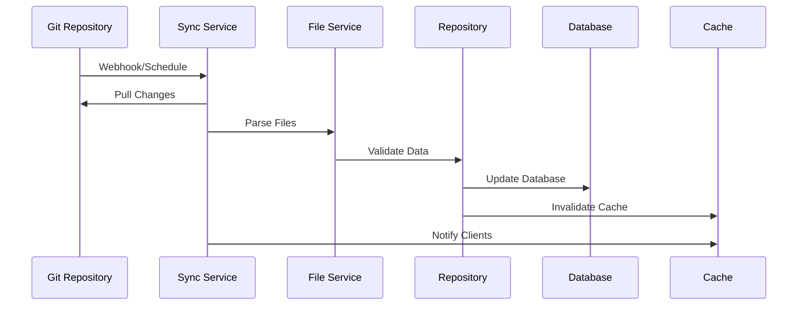
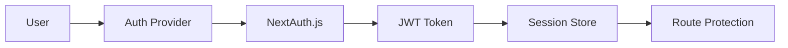

# Panoramica dell'architettura

Ever Works segue un'architettura moderna e scalabile progettata per prestazioni, manutenibilità ed esperienza degli sviluppatori.

## Architettura di alto livello



## Principi fondamentali

### 1. Separazione delle preoccupazioni
- **Livello presentazione**: componenti React e logica dell'interfaccia utente
- **Livello aziendale**: servizi e repository
- **Livello dati**: database e API esterne

### 2. Design modulare
- Organizzazione basata sulle funzionalità
- Componenti riutilizzabili
- Integrazioni simili a plugin

### 3. Digitare Sicurezza
- TypeScript ovunque
- Controllo rigoroso del tipo
- Convalida runtime con Zod

### 4. Prestazioni innanzitutto
- Rendering lato server
- Generazione statica ove possibile
- Strategie di memorizzazione nella cache ottimizzate

## Livelli di applicazione

### Livello frontend

**Tecnologia**: React 19 + Next.js 15
**Responsabilità**:
- Rendering dell'interfaccia utente
- Gestione dello stato lato client
- Interazioni dell'utente
- Gestione del percorso

**Componenti chiave**:
- Componenti della pagina (`app/[locale]/`)
- Componenti dell'interfaccia utente riutilizzabili (`components/`)
- Ganci personalizzati (`hooks/`)
- Fornitori di contesto (`components/providers/`)

### Livello API

**Tecnologia**: percorsi API Next.js
**Responsabilità**:
- Esecuzione della logica aziendale
- Convalida dei dati
- Integrazione di servizi esterni
- Gestione dell'autenticazione

**Struttura**:
```
app/api/
├── auth/           # Authentication endpoints
├── admin/          # Admin-only endpoints
├── items/          # Item management
└── webhooks/       # External service webhooks
```

### Livello dati

**Tecnologie**: Drizzle ORM + PostgreSQL
**Responsabilità**:
- Persistenza dei dati
- Ottimizzazione delle query
- Gestione delle transazioni
- Migrazioni di schemi

**Componenti**:
- Schema del database (`lib/db/schema.ts`)
- Repository (`lib/repositories/`)
- File di migrazione (`lib/db/migrations/`)

### Livello di contenuto

**Tecnologia**: CMS basato su Git
**Responsabilità**:
- Sincronizzazione dei contenuti
- Controllo della versione
- Modifica collaborativa
- Convalida del contenuto

**Struttura**:
```
.content/
├── config.yml      # Site configuration
├── items/          # Item definitions
├── categories/     # Category definitions
└── tags/           # Tag definitions
```

## Modelli di progettazione

### 1. Modello di deposito

Astrarre la logica di accesso ai dati:

```typescript
interface ItemRepository {
  findById(id: string): Promise<Item | null>;
  findBySlug(slug: string): Promise<Item | null>;
  findWithFilters(filters: ItemFilters): Promise<Item[]>;
  create(item: CreateItemRequest): Promise<Item>;
  update(id: string, updates: UpdateItemRequest): Promise<Item>;
  delete(id: string): Promise<void>;
}
```

### 2. Modello del livello di servizio

Incapsula la logica aziendale:

```typescript
class ItemService {
  constructor(
    private itemRepository: ItemRepository,
    private gitService: GitService,
    private notificationService: NotificationService
  ) {}

  async submitItem(data: SubmitItemRequest): Promise<SubmissionResult> {
    // Business logic here
  }
}
```

### 3. Modello di fabbrica

Crea istanze del servizio:

```typescript
class PaymentProviderFactory {
  static create(provider: PaymentProvider): PaymentService {
    switch (provider) {
      case 'stripe':
        return new StripePaymentService();
      case 'lemonsqueezy':
        return new LemonSqueezyPaymentService();
      default:
        throw new Error(`Unsupported provider: ${provider}`);
    }
  }
}
```

### 4. Modello dell'osservatore

Aggiornamenti guidati dagli eventi:

```typescript
class ContentSyncService {
  private observers: ContentObserver[] = [];

  addObserver(observer: ContentObserver): void {
    this.observers.push(observer);
  }

  notifyObservers(event: ContentEvent): void {
    this.observers.forEach(observer => observer.update(event));
  }
}
```

## Flusso di dati

### 1. Richiedi flusso



### 2. Flusso di sincronizzazione dei contenuti



## Architettura di sicurezza

### 1. Flusso di autenticazione



### 2. Livelli di autorizzazione

- **A livello di percorso**: protezione middleware
- **A livello API**: Endpoint Guard
- **Livello dati**: sicurezza a livello di riga
- **Livello interfaccia utente**: controllo degli accessi basato su componenti

### 3. Misure di sicurezza

- **Convalida dell'input**: schemi Zod
- **SQL Injection**: query con parametri
- **Protezione XSS**: sanificazione dei contenuti
- **Protezione CSRF**: convalida del token
- **Limitazione della velocità**: richiesta di limitazione

## Strategia di memorizzazione nella cache

### 1. Cache dell'applicazione

- **React Query**: cache dei dati lato client
- **Next.js Cache**: cache del percorso API e pagina
- **Generazione statica**: pagine predefinite

### 2. Cache del database

- **Pool di connessioni**: connessioni DB efficienti
- **Ottimizzazione delle query**: query indicizzate
- **Repliche di lettura**: operazioni di lettura distribuite

### 3. Cache della CDN

- **Risorse statiche**: Immagini, CSS, JS
- **Risposte API**: endpoint memorizzabili nella cache
- **Edge Location**: distribuzione globale

## Considerazioni sulla scalabilità

### 1. Ridimensionamento orizzontale

- **Design stateless**: nessuna sessione lato server
- **Ridimensionamento del database**: lettura di repliche e partizionamento orizzontale
- **Distribuzione CDN**: caching edge globale

### 2. Ottimizzazione delle prestazioni

- **Suddivisione del codice**: importazioni dinamiche
- **Ottimizzazione immagine**: componente Immagine Next.js
- **Ottimizzazione del bundle**: scuotimento e minimizzazione degli alberi

### 3. Monitoraggio e osservabilità

- **Tracciamento errori**: integrazione Sentry
- **Monitoraggio delle prestazioni**: Core Web Vitals
- **Analisi**: integrazione di PostHog
- **Logging**: registrazione strutturata

## Decisioni tecnologiche

### Perché Next.js?
- **Framework full-stack**: percorsi API + frontend
- **Prestazioni**: SSR, SSG e ISR
- **Esperienza sviluppatore**: ricaricamento a caldo, supporto TypeScript
- **Ecosistema**: ricco ecosistema di plugin

### Perché Drizzle ORM?
- **Sicurezza del tipo**: supporto completo di TypeScript
- **Prestazioni**: spese generali minime
- **Flessibilità**: SQL grezzo quando necessario
- **Sistema di migrazione**: modifiche allo schema controllate dalla versione

### Perché un CMS basato su Git?
- **Controllo della versione**: monitoraggio della cronologia completa
- **Collaborazione**: flusso di lavoro della richiesta pull
- **Backup**: distribuito per natura
- **Flessibilità**: qualsiasi provider Git

### Perché reagire alla query?
- **Caching**: gestione intelligente della cache
- **Sincronizzazione**: aggiornamenti in background
- **Aggiornamenti ottimistici**: migliore UX
- **Gestione degli errori**: riprova la logica

## Punti di estensione

L’architettura prevede diversi punti di estensione:

### 1. Provider di autenticazione personalizzati
```typescript
// lib/auth/providers/custom-provider.ts
export function CustomProvider(options: CustomProviderOptions) {
  return {
    id: "custom",
    name: "Custom Provider",
    type: "oauth",
    // Implementation
  }
}
```

### 3. Integrazione della fonte di contenuto
```typescript
// lib/content/sources/custom-source.ts
export class CustomContentSource implements ContentSource {
  async sync(): Promise<SyncResult> {
    // Implementation
  }
}
```

## Passaggi successivi

- [Esplora lo stack tecnologico](./tech-stack) in dettaglio
