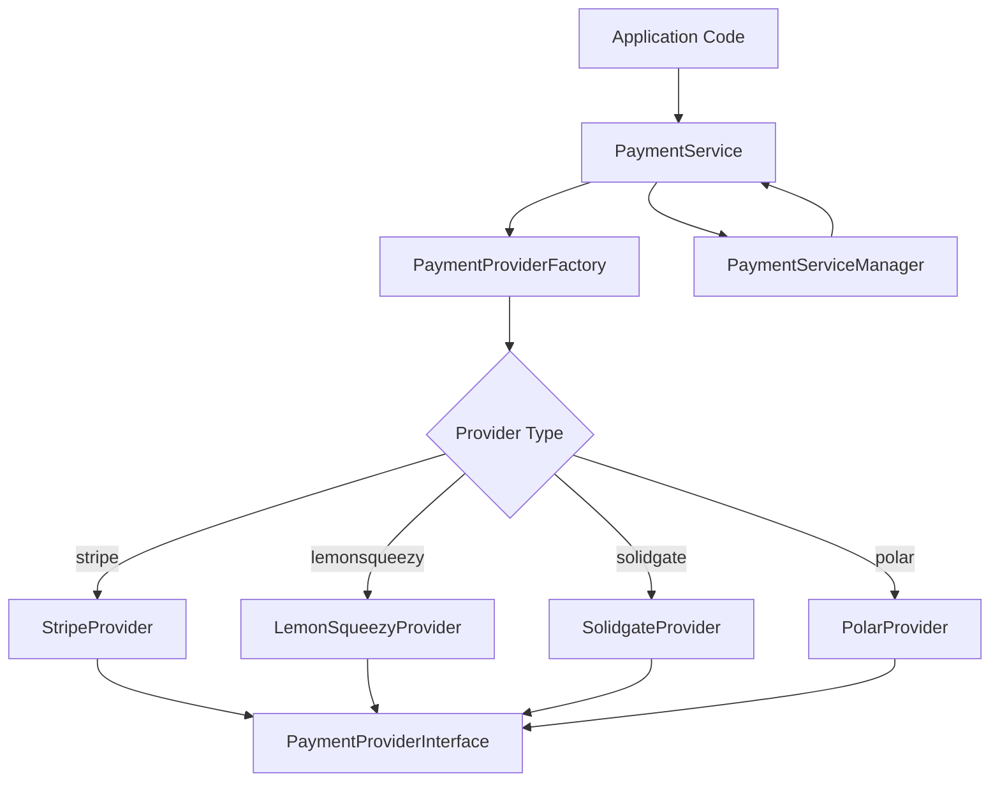
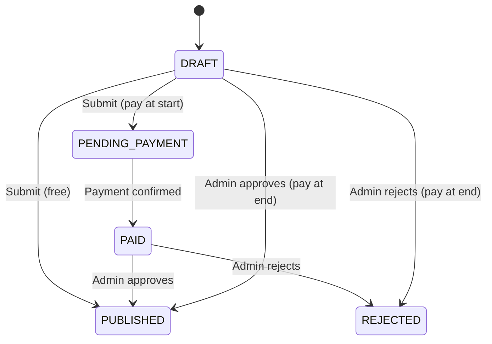

# Libreria dei pagamenti

Il modello implementa un sistema di pagamento multi-provider utilizzando i modelli Factory e Strategy. Supporta Stripe, LemonSqueezy, Solidgate e Polar come fornitori di pagamenti, con un'interfaccia unificata per pagamenti, abbonamenti, webhook e rimborsi.

## Panoramica dell'architettura



## File di origine

|Archivio|Scopo|
|------|---------|
|`lib/payment/index.ts`|Esportazioni API pubbliche|
|`lib/payment/lib/payment-provider-factory.ts`|Factory per la creazione di istanze del provider|
|`lib/payment/lib/payment-service.ts`|Facciata di servizio unificata|
|`lib/payment/lib/payment-service-manager.ts`|Gestore singleton per il ciclo di vita del servizio|
|`lib/payment/types/payment-types.ts`|Interfacce ed enumerazioni principali|
|`lib/payment/types/payment.ts`|Flusso di pagamento e tipi di invio|
|`lib/payment/config/`|Configurazione e convalida del provider|
|`lib/payment/lib/providers/`|Implementazioni del singolo fornitore|
|`lib/payment/hooks/`|Hook React per flussi di pagamento lato client|
|`lib/payment/ui/`|Componenti del modulo di pagamento|

## Interfacce principali

### PaymentProviderInterface

Ogni provider implementa questa interfaccia completa:

```typescript
export interface PaymentProviderInterface {
  // Payment operations
  createPaymentIntent(params: CreatePaymentParams): Promise<PaymentIntent>;
  confirmPayment(paymentId: string, paymentMethodId: string): Promise<PaymentIntent>;
  verifyPayment(paymentId: string): Promise<PaymentVerificationResult>;
  createSetupIntent(user: User | null): Promise<SetupIntent>;

  // Subscription management
  createCustomer(params: CreateCustomerParams): Promise<CustomerResult>;
  createSubscription(params: CreateSubscriptionParams): Promise<SubscriptionInfo>;
  cancelSubscription(subscriptionId: string, cancelAtPeriodEnd?: boolean): Promise<SubscriptionInfo>;
  updateSubscription(params: UpdateSubscriptionParams): Promise<SubscriptionInfo>;
  hasCustomerId(user: User | null): boolean;
  getCustomerId(user: User | null): Promise<string | null>;

  // Webhooks and refunds
  handleWebhook(payload: any, signature: string, ...args: any[]): Promise<WebhookResult>;
  refundPayment(paymentId: string, amount?: number): Promise<any>;

  // Client configuration and UI
  getClientConfig(): ClientConfig;
  getUIComponents(): UIComponents;
}
```

### PaymentProviderFactory

Crea istanze del provider in base alla configurazione:

```typescript
export type SupportedProvider = 'stripe' | 'solidgate' | 'lemonsqueezy' | 'polar';

export class PaymentProviderFactory {
  static createProvider(
    providerType: SupportedProvider,
    config: PaymentProviderConfig
  ): PaymentProviderInterface {
    switch (providerType) {
      case 'stripe':       return new StripeProvider(config);
      case 'solidgate':    return new SolidgateProvider(config);
      case 'lemonsqueezy': return new LemonSqueezyProvider(config);
      case 'polar':        return new PolarProvider(config);
      default:             throw new Error(`Unsupported payment provider: ${providerType}`);
    }
  }
}
```

## Servizio di pagamento

La classe `PaymentService` fornisce una facciata unificata su tutte le operazioni del provider:

```typescript
export class PaymentService {
  private provider: PaymentProviderInterface;

  constructor(config: PaymentServiceConfig) {
    this.provider = PaymentProviderFactory.createProvider(config.provider, config.config);
  }

  // All methods delegate to the underlying provider
  async createPaymentIntent(params: CreatePaymentParams): Promise<PaymentIntent> {
    return this.provider.createPaymentIntent(params);
  }

  async createSubscription(params: CreateSubscriptionParams): Promise<SubscriptionInfo> {
    return this.provider.createSubscription(params);
  }

  // ... additional delegated methods
}
```

## Tipi di dati

### Enumerazioni di pagamento

```typescript
export enum PaymentType {
  ONE_TIME = 'one_time',
  SUBSCRIPTION = 'subscription',
  FREE = 'free',
}

export enum SubscriptionStatus {
  INCOMPLETE = 'incomplete',
  INCOMPLETE_EXPIRED = 'incomplete_expired',
  TRIALING = 'trialing',
  ACTIVE = 'active',
  PAST_DUE = 'past_due',
  CANCELED = 'canceled',
  UNPAID = 'unpaid',
}

export enum PaymentFlow {
  PAY_AT_START = "pay_at_start",
  PAY_AT_END = "pay_at_end",
}
```

### Eventi webhook

```typescript
export enum WebhookEventType {
  PAYMENT_SUCCEEDED = 'payment_succeeded',
  PAYMENT_FAILED = 'payment_failed',
  SUBSCRIPTION_CREATED = 'subscription_created',
  SUBSCRIPTION_UPDATED = 'subscription_updated',
  SUBSCRIPTION_CANCELLED = 'subscription_cancelled',
  INVOICE_PAID = 'invoice_paid',
  REFUND_CREATED = 'refund_created',
  // ... additional event types
}
```

### Strutture dati chiave

|Digitare|Scopo|
|------|---------|
|`PaymentIntent`|Sessione di pagamento con ID, importo, valuta, stato, clientSecret|
|`SubscriptionInfo`|Dettagli dell'abbonamento con stato, fine periodo, informazioni sulla prova|
|`CustomerResult`|Cliente creato con ID, email, nome|
|`WebhookResult`|Webhook elaborato con tipo, ID, dati|
|`ClientConfig`|Configurazione frontend-safe con chiave pubblica e tipo di gateway|
|`UIComponents`|Componenti React e risorse visive per il fornitore|

## Utilità valutarie

La libreria include funzioni di supporto per la formattazione della valuta:

```typescript
// Format cents to display currency
export function formatCentsToCurrency(
  cents: number, currency: string = 'USD', locale: string = 'en-US'
): string {
  const amount = cents / 100;
  return new Intl.NumberFormat(locale, {
    style: 'currency', currency,
    minimumFractionDigits: 2, maximumFractionDigits: 2,
  }).format(amount);
}

// Convert between cents and decimal
export function convertCentsToDecimal(cents: number): number;
export function convertDecimalToCents(decimal: number): number;

// Convert timestamps to Date objects
export function convertNumberToDate(timestamp?: number): Date | null;
export function safeTimestampToDate(timestamp: number | null | undefined): Date | undefined;
```

## Tipi di flusso di pagamento

Il sistema supporta due flussi di pagamento di invio:

|Flusso|Enum|Descrizione|
|------|------|-------------|
|Paga all'inizio|`PAY_AT_START`|Pagamento richiesto prima della revisione dell'invio|
|Paga alla fine|`PAY_AT_END`|Pagamento riscosso dopo l'approvazione dell'amministratore|

### Ciclo di vita dello stato di invio



## Interfaccia dei componenti dell'interfaccia utente

Ogni provider espone componenti dell'interfaccia utente per l'integrazione del frontend:

```typescript
export interface UIComponents {
  PaymentForm: React.ComponentType<PaymentFormProps>;
  logo: string;
  cardBrands: CardBrandIcon[];
  supportedPaymentMethods: string[];
  translations: Record<string, Record<string, string>>;
}
```

## Integrazione lato client

L'hook `usePayment` e il contesto `PaymentProvider` forniscono l'integrazione di React:

```typescript
import { usePayment, PaymentProvider } from '@/lib/payment';

// Wrap your app with the payment provider
<PaymentProvider>
  <PaymentForm
    amount={2999}
    currency="usd"
    isSubscription={false}
    onSuccess={(paymentId) => console.log('Paid:', paymentId)}
    onError={(error) => console.error('Failed:', error)}
  />
</PaymentProvider>
```

## Configurazione del fornitore

```typescript
export interface PaymentProviderConfig {
  apiKey: string;
  webhookSecret?: string;
  secretKey?: string;
  options?: Record<string, any>;
}
```

Ciascun fornitore richiede almeno un `apiKey`. Stripe e Solidgate utilizzano anche `webhookSecret` per la verifica della firma del webhook.
