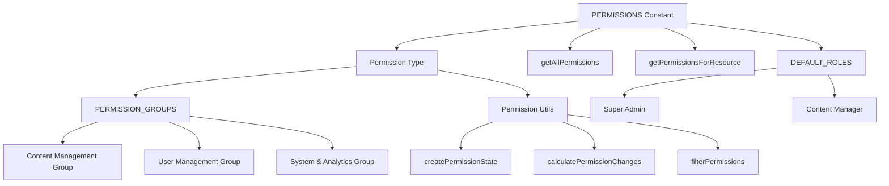

# Sistema di autorizzazioni

Il modello implementa un sistema di autorizzazioni granulare e basato sulle risorse con definizioni di autorizzazioni indipendenti dai tipi, raggruppamenti logici per l'organizzazione dell'interfaccia utente e funzioni di utilità per la gestione dello stato e il rilevamento delle modifiche.

## Panoramica dell'architettura



## File di origine

|Archivio|Scopo|
|------|---------|
|`lib/permissions/definitions.ts`|Costanti di autorizzazione, estrazione dei tipi, ruoli predefiniti|
|`lib/permissions/groups.ts`|Raggruppamenti di autorizzazioni orientati all'interfaccia utente con metadati|
|`lib/permissions/utils.ts`|Gestione dello stato, calcolo delle differenze e filtraggio|

## Definizioni dei permessi

Le autorizzazioni seguono una convenzione di denominazione `resource:action`. L'oggetto `PERMISSIONS` li organizza per risorsa:

```typescript
export const PERMISSIONS = {
  items: {
    read: 'items:read',
    create: 'items:create',
    update: 'items:update',
    delete: 'items:delete',
    review: 'items:review',
    approve: 'items:approve',
    reject: 'items:reject',
  },
  categories: {
    read: 'categories:read',
    create: 'categories:create',
    update: 'categories:update',
    delete: 'categories:delete',
  },
  tags: {
    read: 'tags:read',
    create: 'tags:create',
    update: 'tags:update',
    delete: 'tags:delete',
  },
  roles: {
    read: 'roles:read',
    create: 'roles:create',
    update: 'roles:update',
    delete: 'roles:delete',
  },
  users: {
    read: 'users:read',
    create: 'users:create',
    update: 'users:update',
    delete: 'users:delete',
    assignRoles: 'users:assignRoles',
  },
  analytics: {
    read: 'analytics:read',
    export: 'analytics:export',
  },
  system: {
    settings: 'system:settings',
  },
} as const;
```

### Elenco completo delle autorizzazioni

|Risorsa|Azioni|
|----------|---------|
|`items`|`read`, `create`, `update`, `delete`, `review`, `approve`, `reject`|
|`categories`|`read`, `create`, `update`, `delete`|
|`tags`|`read`, `create`, `update`, `delete`|
|`roles`|`read`, `create`, `update`, `delete`|
|`users`|`read`, `create`, `update`, `delete`, `assignRoles`|
|`analytics`|`read`, `export`|
|`system`|`settings`|

## Tipo di autorizzazione indipendente dal tipo

Il tipo `Permission` viene estratto dalla costante `PERMISSIONS` utilizzando tipi condizionali ricorsivi:

```typescript
type PermissionValues<T> = T extends Record<string, infer U>
  ? U extends Record<string, infer V>
    ? V extends string ? V : never
    : never
  : never;

export type Permission = PermissionValues<typeof PERMISSIONS>;
// Resolves to: 'items:read' | 'items:create' | ... | 'system:settings'
```

Ciò garantisce la sicurezza in fase di compilazione: qualsiasi stringa di autorizzazione che non esiste nella costante `PERMISSIONS` causerà un errore TypeScript.

## Funzioni di interrogazione

```typescript
// Get all permissions as a flat array
export function getAllPermissions(): Permission[];

// Get permissions for a specific resource
export function getPermissionsForResource(resource: keyof typeof PERMISSIONS): Permission[];

// Validate whether a string is a valid permission
export function isValidPermission(permission: string): permission is Permission;
```

## Ruoli predefiniti

Due definizioni di ruolo integrate forniscono punti di partenza:

```typescript
export const DEFAULT_ROLES = {
  SUPER_ADMIN: {
    id: 'super-admin',
    name: 'Super Administrator',
    description: 'Full system access with all permissions',
    permissions: getAllPermissions(), // Every permission
  },
  CONTENT_MANAGER: {
    id: 'content-manager',
    name: 'Content Manager',
    description: 'Manage content including items, categories, and tags',
    permissions: [
      ...getPermissionsForResource('items'),
      ...getPermissionsForResource('categories'),
      ...getPermissionsForResource('tags'),
    ],
  },
} as const;
```

## Gruppi di autorizzazione

I gruppi organizzano le autorizzazioni per la visualizzazione dell'interfaccia utente con icone e descrizioni:

```typescript
export interface PermissionGroup {
  id: string;
  name: string;
  description: string;
  icon: string;       // Lucide icon name
  permissions: Permission[];
}

export const PERMISSION_GROUPS: PermissionGroup[] = [
  {
    id: 'content',
    name: 'Content Management',
    description: 'Manage items, categories, and tags',
    icon: 'FileText',
    permissions: [...items, ...categories, ...tags],
  },
  {
    id: 'users',
    name: 'User Management',
    description: 'Manage users and their roles',
    icon: 'Users',
    permissions: [...users, ...roles],
  },
  {
    id: 'system',
    name: 'System & Analytics',
    description: 'System settings and analytics access',
    icon: 'Settings',
    permissions: [...analytics, ...system],
  },
];
```

### Funzioni di query di gruppo

```typescript
// Find which group a permission belongs to
export function getPermissionGroup(permission: Permission): PermissionGroup | undefined;

// Get all permissions in a group by group ID
export function getPermissionsByGroup(groupId: string): Permission[];
```

### Formattazione visualizzazione autorizzazione

```typescript
// Format for display: "items:approve" -> "Approve Items"
export function formatPermissionName(permission: Permission): string;

// Generate description: "items:approve" -> "Approve submissions items and submissions"
export function formatPermissionDescription(permission: Permission): string;
```

Il formattatore della descrizione utilizza tabelle di ricerca sia per le azioni che per le risorse:

|Azione|Descrizione Prefisso|
|--------|-------------------|
|`read`|Visualizza e accedi|
|`create`|Crea nuovo|
|`update`|Modifica esistente|
|`delete`|Rimuovi|
|`review`|Revisionare e moderare|
|`approve`|Approvare le proposte|
|`reject`|Rifiuta le proposte|
|`assignRoles`|Assegna ruoli a|
|`export`|Esporta dati da|
|`settings`|Gestisci le impostazioni per|

## Gestione dello stato dei permessi

Il modulo delle utilità fornisce funzioni per la gestione dello stato dei permessi nell'interfaccia utente:

### Creazione dello stato dalle autorizzazioni

```typescript
export function createPermissionState(currentPermissions: Permission[]): PermissionState;
// Returns: { 'items:read': true, 'items:create': true, ... }
```

### Estrazione dei permessi selezionati

```typescript
export function getSelectedPermissions(permissionState: PermissionState): Permission[];
// Filters the state object to return only permissions where value is `true`
```

### Rilevamento modifiche

```typescript
export function calculatePermissionChanges(
  originalPermissions: Permission[],
  newPermissions: Permission[]
): PermissionChanges;
// Returns: { added: Permission[], removed: Permission[] }
```

### Controllo dell'uguaglianza

```typescript
export function arePermissionsEqual(
  permissions1: Permission[],
  permissions2: Permission[]
): boolean;
// Uses Set-based comparison for order-independent equality
```

### Filtraggio della ricerca

```typescript
export function filterPermissions(
  permissions: Permission[],
  searchTerm: string
): Permission[];
// Matches against permission string and space-separated format
// e.g., "assign" matches "users:assignRoles" and "users assignRoles"
```

## Esempio di utilizzo

```typescript
import { PERMISSIONS, getAllPermissions } from '@/lib/permissions/definitions';
import { PERMISSION_GROUPS, formatPermissionName } from '@/lib/permissions/groups';
import { createPermissionState, calculatePermissionChanges } from '@/lib/permissions/utils';

// Check a specific permission
if (userPermissions.includes(PERMISSIONS.items.approve)) {
  // User can approve items
}

// Build a permission editor UI
const state = createPermissionState(user.permissions);

// After user toggles permissions
const changes = calculatePermissionChanges(user.permissions, newPermissions);
console.log(`Added: ${changes.added.length}, Removed: ${changes.removed.length}`);
```
