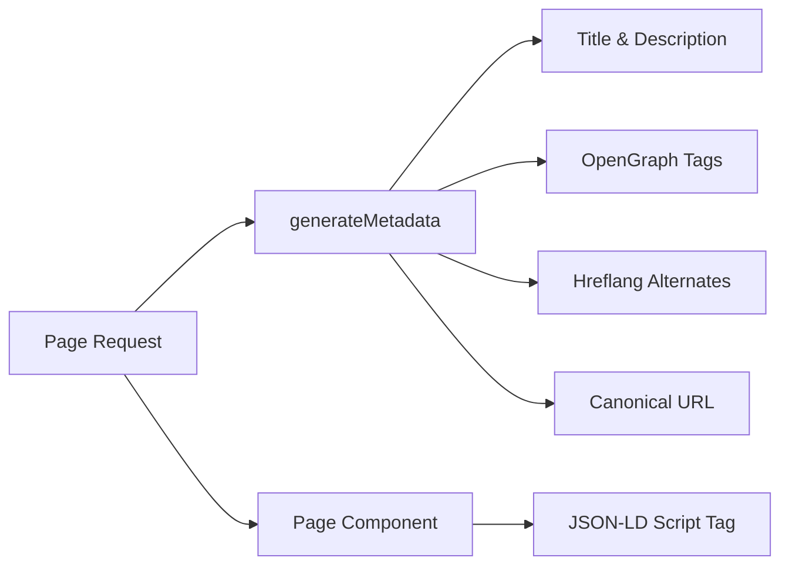

# Sistema SEO

Il modello Ever Works include un sistema SEO completo che genera dati strutturati (JSON-LD), tag hreflang, metadati OpenGraph e mappe del sito dinamiche. Tutte le utilità SEO risiedono in `lib/seo/` e si integrano con l'API dei metadati Next.js.

## Panoramica dell'architettura



### File di origine

|Archivio|Scopo|
|---|---|
|`lib/seo/schema.ts`|Generatori di dati strutturati JSON-LD|
|`lib/seo/hreflang.ts`|Generatori di URL alternativi in lingua|
|`lib/seo/listing-metadata.ts`|Fabbrica di metadati della pagina di elenco|

## Dati strutturati JSON-LD

Il modulo `lib/seo/schema.ts` genera dati strutturati Schema.org per risultati avanzati dei motori di ricerca.

### Schema del prodotto

Per le pagine dei dettagli dell'articolo, genera uno schema `Product`:

```typescript
import { generateProductSchema } from '@/lib/seo/schema';

const schema = generateProductSchema({
  name: 'My App',
  description: 'A productivity tool',
  image: 'https://example.com/icon.png',
  url: 'https://example.com/items/my-app',
  category: 'Productivity',
  sourceUrl: 'https://myapp.com',
  brandName: 'MyApp Inc.',
});
```

Output generato:

```json
{
  "@context": "https://schema.org",
  "@type": "Product",
  "name": "My App",
  "description": "A productivity tool",
  "image": "https://example.com/icon.png",
  "url": "https://example.com/items/my-app",
  "category": "Productivity",
  "brand": {
    "@type": "Brand",
    "name": "MyApp Inc."
  },
  "offers": {
    "@type": "Offer",
    "url": "https://myapp.com",
    "availability": "https://schema.org/InStock"
  }
}
```

### Schema organizzativo

Genera uno schema `Organization` a livello di sito per la visibilità del Pannello informazioni:

```typescript
import { generateOrganizationSchema } from '@/lib/seo/schema';

const schema = generateOrganizationSchema();
```

Questo schema include:
- Nome del marchio, URL e logo
- Collegamenti al profilo social (`sameAs` array) da `siteConfig.social`
- Punto di contatto con email (se configurato)

### Schema del sito Web con SearchAction

Abilita la casella di ricerca di Google Sitelink:

```typescript
import { generateWebSiteSchema } from '@/lib/seo/schema';

const schema = generateWebSiteSchema('en');
// Includes potentialAction with SearchAction targeting /?q={search_term_string}
```

Lo schema rispetta i prefissi locali:
- Impostazioni internazionali predefinite: `https://example.com`
- Altre località: `https://example.com/fr`

### Schema del pangrattato

Genera `BreadcrumbList` per i risultati di ricerca basati sulla navigazione:

```typescript
import { generateBreadcrumbSchema } from '@/lib/seo/schema';

const schema = generateBreadcrumbSchema([
  { name: 'Home', url: 'https://example.com' },
  { name: 'Productivity', url: 'https://example.com/categories/productivity' },
  { name: 'My App', url: 'https://example.com/items/my-app' },
]);
```

### Incorporamento nelle pagine

JSON-LD è incorporato utilizzando un tag `<script>` nel componente della pagina:

```tsx
export default function ItemDetailPage({ item }) {
  const schema = generateProductSchema({ ... });

  return (
    <>
      <script
        type="application/ld+json"
        dangerouslySetInnerHTML={{ __html: JSON.stringify(schema) }}
      />
      <ItemDetail item={item} />
    </>
  );
}
```

## Tag hreflang

Il modulo `lib/seo/hreflang.ts` genera URL alternativi in lingue per SEO multilocale.

### Modello URL

Il modello utilizza il modello di prefisso locale "secondo necessità":

|Locale|Modello URL|
|---|---|
|`en` (predefinito)|`https://example.com/items/my-app`|
|`fr`|`https://example.com/fr/items/my-app`|
|`es`|`https://example.com/es/items/my-app`|
|`x-default`|Uguale a `en` (impostazione internazionale predefinita)|

### Generazione di alternative

```typescript
import { generateHreflangAlternates } from '@/lib/seo/hreflang';

// For any page path
const alternates = generateHreflangAlternates('/about');
// Returns: { en: 'https://example.com/about', fr: 'https://example.com/fr/about', ... }

// Convenience functions for common page types
import { generateItemHreflangAlternates } from '@/lib/seo/hreflang';
const itemAlternates = generateItemHreflangAlternates('my-app');

import { generatePageHreflangAlternates } from '@/lib/seo/hreflang';
const pageAlternates = generatePageHreflangAlternates('about');
```

### Integrazione con i metadati Next.js

```typescript
export async function generateMetadata({ params }) {
  const { locale, slug } = await params;
  return {
    alternates: {
      canonical: `https://example.com/${locale}/items/${slug}`,
      languages: generateItemHreflangAlternates(slug),
    },
  };
}
```

### Mappature locali supportate

Tutte le oltre 20 località sono mappate in `LOCALE_TO_HREFLANG`:

```
en -> en, fr -> fr, es -> es, de -> de, zh -> zh,
ar -> ar, he -> he, ru -> ru, uk -> uk, pt -> pt,
it -> it, ja -> ja, ko -> ko, nl -> nl, pl -> pl,
tr -> tr, vi -> vi, th -> th, hi -> hi, id -> id, bg -> bg
```

## Metadati della pagina di elenco

Il modulo `lib/seo/listing-metadata.ts` genera oggetti `Metadata` completi per le pagine di elenchi e categorie.

### Utilizzo

```typescript
import { generateListingMetadata } from '@/lib/seo/listing-metadata';

export async function generateMetadata({ params }) {
  const { locale } = await params;
  return generateListingMetadata({
    title: 'Time Tracking Tools',
    description: 'Browse the best time tracking tools',
    path: '/categories/time-tracking',
    locale,
    itemCount: 42,
    keywords: ['time tracking', 'productivity', 'tools'],
    imageUrl: 'https://example.com/og/time-tracking.png',
  });
}
```

### Struttura dei metadati generati

La funzione produce un oggetto Next.js `Metadata` completo:

|Campo|Fonte|
|---|---|
|`title`|`{titolo} \|{nomesito}`|
|`description`|Personalizzato o generato automaticamente dal titolo + conteggio degli articoli|
|`keywords`|Array di parole chiave unito|
|`openGraph.type`|`'website'`|
|`openGraph.siteName`|Da `siteConfig.name`|
|`openGraph.url`|URL canonico con impostazioni internazionali|
|`openGraph.images`|URL immagine facoltativo|
|`twitter.card`|`'summary_large_image'`|
|`alternates.canonical`|URL canonico completo|
|`alternates.languages`|L'hreflang si alterna per tutte le localizzazioni|

## Generazione di immagini OpenGraph

Le immagini OG dinamiche vengono generate utilizzando Next.js `ImageResponse` a due livelli:

|Archivio|Itinerario|Scopo|
|---|---|---|
|`app/opengraph-image.tsx`|`/opengraph-image`|Immagine OG predefinita a livello di sito|
|`app/[locale]/items/[slug]/opengraph-image.tsx`|`/items/{slug}/opengraph-image`|Immagine OG dinamica per articolo|

Questi file utilizzano il modulo `next/og` per eseguire il rendering dei componenti React come immagini al momento della richiesta, consentendo testo dinamico, loghi e branding.

## Lista di controllo SEO

Quando aggiungi un nuovo tipo di pagina, assicurati che siano presenti i seguenti elementi SEO:

|Elemento|Attuazione|
|---|---|
|Titolo della pagina|`generateMetadata` con titolo descrittivo|
|Meta descrizione|Descrizione personalizzata o generata automaticamente|
|URL canonico|Impostato in `alternates.canonical`|
|Tag hreflang|Utilizza `generateHreflangAlternates`|
|Tag OpenGraph|Incluso tramite `generateListingMetadata` o manualmente|
|Scheda Twitter|Imposta `twitter.card` su `summary_large_image`|
|JSON-LD|Aggiungi schema tramite `<script type="application/ld+json">`|
|Pangrattato|Utilizzare `generateBreadcrumbSchema` per le pagine nidificate|

## Migliori pratiche

1. **Imposta sempre gli URL canonici**: previene problemi di contenuti duplicati nelle diverse impostazioni locali.
2. **Includi hreflang per tutte le lingue**: anche se il contenuto non è ancora tradotto, la struttura dell'URL aiuta i motori di ricerca.
3. **Utilizza titoli descrittivi e univoci**: evita titoli generici come "Home" senza il nome del sito.
4. **Mantieni le descrizioni sotto i 160 caratteri**: le descrizioni più lunghe verranno troncate nei risultati di ricerca.
5. **Testa i dati strutturati** con lo strumento Test dei risultati avanzati di Google prima dell'implementazione.
6. **Genera immagini OG in modo dinamico**: le immagini di riserva statiche perdono opportunità di branding specifiche dell'articolo.
