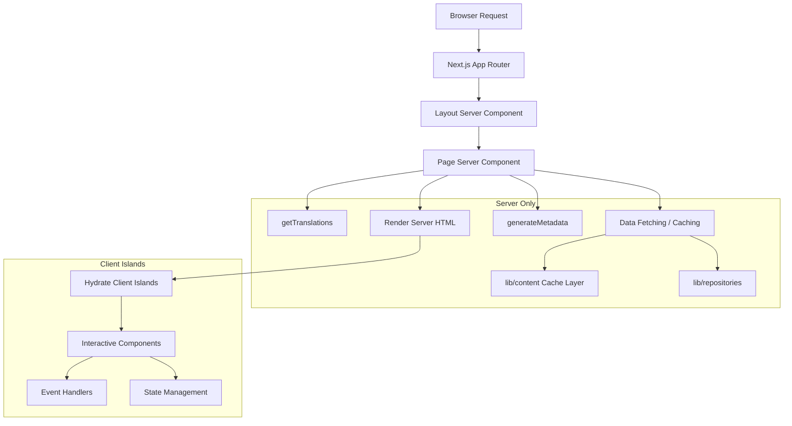

# Modelli dei componenti server

## Panoramica

Il modello Ever Works sfrutta React Server Components (RSC) come strategia di rendering predefinita in tutto il router dell'app Next.js. I componenti server gestiscono il recupero dei dati, il caricamento delle traduzioni, la generazione dei metadati e la composizione del layout sul server, inviando al client solo l'HTML sottoposto a rendering.

## Architettura



## File di origine

|Archivio|Modello dimostrato|
|------|---------------------|
|`template/app/[locale]/about/page.tsx`|Recupero dati, i18n, metadati, rendering MDX|
|`template/app/[locale]/layout.tsx`|Layout root con provider locale|
|`template/app/layout.tsx`|Layout globale, caratteri, fornitori|
|`template/app/sitemap.ts`|Generazione di percorsi solo per server|
|`template/app/robots.ts`|Configurazione solo server|

## Modelli fondamentali

### Modello 1: componenti della pagina asincroni con i18n

Ogni pagina localizzata segue questo schema:

```typescript
// Server Component -- no "use client" directive
export const revalidate = 3600; // ISR: revalidate every hour

interface PageProps {
    params: Promise<{ locale: string }>;
}

export async function generateMetadata({ params }: PageProps): Promise<Metadata> {
    const { locale } = await params;
    const t = await getTranslations({ locale, namespace: 'footer' });
    return {
        title: t('ABOUT_US'),
        description: t('ABOUT_PAGE_META_DESCRIPTION'),
        alternates: {
            languages: generateHreflangAlternates('/about')
        }
    };
}

export default async function AboutPage({ params }: PageProps) {
    const { locale } = await params;
    const pageData = await getCachedPageContent('about', locale);
    const tCommon = await getTranslations({ locale, namespace: 'common' });

    return (
        <PageContainer>
            <MDX source={pageData?.content || DEFAULT_CONTENT} />
        </PageContainer>
    );
}
```

Caratteristiche principali:
- `params` è un `Promise` (convenzione per router app Next.js 15+)
- Più chiamate `getTranslations()` per spazi dei nomi diversi
- Recupero dei contenuti memorizzati nella cache tramite `getCachedPageContent()`
- Intervallo di riconvalida statico con `export const revalidate`

### Modello 2: generazione di metadati

I componenti server generano metadati SEO a livello di percorso:

```typescript
export async function generateMetadata({ params }: PageProps): Promise<Metadata> {
    const { locale } = await params;
    const t = await getTranslations({ locale, namespace: 'pages' });

    return {
        metadataBase: new URL(appUrl),
        title: t('PAGE_TITLE'),
        description: t('PAGE_DESCRIPTION'),
        alternates: {
            languages: generateHreflangAlternates('/path')
        }
    };
}
```

L'utilità `generateHreflangAlternates()` di `lib/seo/hreflang.ts` genera automaticamente collegamenti a lingue alternative per tutte le versioni locali supportate.

### Modello 3: ISR con memorizzazione nella cache dei contenuti

```typescript
export const revalidate = 3600; // Revalidate every hour

export default async function Page({ params }: PageProps) {
    const data = await getCachedPageContent('page-name', locale);
    // Render with cached data...
}
```

La funzione `getCachedPageContent()` fornisce un livello di cache lato server sul contenuto CMS basato su Git in `.content/`. Combinato con `revalidate`, crea un modello ISR (rigenerazione statica incrementale) in cui le pagine vengono generate staticamente e aggiornate periodicamente.

### Modello 4: controlli di autenticazione lato server

Le pagine protette utilizzano protezioni lato server da `lib/auth/guards.ts`:

```typescript
import { requireAuth, requireAdmin } from '@/lib/auth/guards';

export default async function ProtectedPage() {
    const session = await requireAuth();
    // session.user is guaranteed to exist here
    return <div>Welcome {session.user.email}</div>;
}

export default async function AdminPage() {
    const session = await requireAdmin();
    // session.user.isAdmin is guaranteed true here
    return <AdminDashboard />;
}
```

Queste guardie chiamano internamente `auth()` e utilizzano `redirect()` da `next/navigation` per inviare gli utenti non autenticati alla pagina di accesso. Il reindirizzamento avviene lato server, quindi non è necessario JavaScript del client.

### Modello 5: composizione di componenti server e client

I componenti server delegano l'interattività alle "isole" dei componenti client:

```typescript
// Server Component (page.tsx)
export default async function Page({ params }: PageProps) {
    const { locale } = await params;
    const data = await fetchData();
    const t = await getTranslations({ locale, namespace: 'page' });

    return (
        <div>
            <h1>{t('TITLE')}</h1>
            {/* Server-rendered static content */}
            <StaticContent data={data} />
            {/* Client island for interactivity */}
            <InteractiveFilter initialData={data} />
        </div>
    );
}
```

I dati scorrono dal server al client come oggetti di scena serializzabili. I componenti client ricevono dati precaricati e gestiscono le interazioni dell'utente.

## Strategie di recupero dei dati

### Accesso diretto al repository

I componenti server possono importare e chiamare direttamente le funzioni del repository:

```typescript
import { getItemBySlug } from '@/lib/repositories/item-repository';

export default async function ItemPage({ params }) {
    const item = await getItemBySlug(params.slug);
    // ...
}
```

### Livello contenuto memorizzato nella cache

Per contenuti CMS basati su Git:

```typescript
import { getCachedPageContent } from '@/lib/content';

const pageData = await getCachedPageContent('about', locale);
```

### Chiamate API esterne

Le funzioni di servizio in `lib/services/` incapsulano le interazioni API esterne:

```typescript
import { triggerManualSync } from '@/lib/services/sync-service';
```

## Streaming e suspense

I componenti server supportano lo streaming tramite i limiti di React Suspense. Le pagine di grandi dimensioni possono mostrare gli stati di caricamento per le singole sezioni:

```typescript
import { Suspense } from 'react';

export default async function Page() {
    return (
        <div>
            <Header /> {/* Renders immediately */}
            <Suspense fallback={<LoadingSkeleton />}>
                <SlowDataSection /> {/* Streams when ready */}
            </Suspense>
        </div>
    );
}
```

## Migliori pratiche nel modello

1. **No `"use client"` se non necessario** -- i componenti sono componenti server per impostazione predefinita
2. **Traduzioni caricate lato server** -- `getTranslations()` viene eseguito solo sul server
3. **Metadati posizionati insieme alle pagine** -- `generateMetadata` viene esportato dallo stesso file
4. **Riconvalida a livello di percorso** -- `export const revalidate` controlla i tempi ISR
5. **Funzioni di protezione per l'autenticazione**: reindirizzamenti lato server senza costi del pacchetto client
6. **Prop down, eventi up**: i componenti del server trasmettono i dati alle isole client come oggetti di scena
