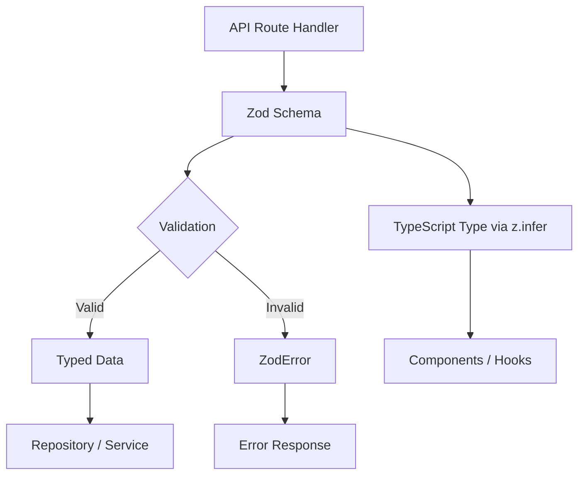

# Modelli di convalida

Il modello utilizza Zod per la convalida basata su schema su tutti i limiti dell'API. Gli schemi di convalida definiscono forme di dati, vincoli, trasformazioni e inferenza di tipo in un'unica fonte di verità. Ogni dominio dispone del proprio modulo di convalida con schemi per le operazioni di creazione, aggiornamento e query.

## Panoramica dell'architettura



## File di origine

|Archivio|Scopo|
|------|---------|
|`lib/validations/auth.ts`|Password e schemi di autenticazione|
|`lib/validations/item.ts`|Schema dei dati sulla posizione dell'articolo|
|`lib/validations/client-item.ts`|Schemi di creazione/aggiornamento/interrogazione di elementi rivolti al client|
|`lib/validations/company.ts`|CRUD aziendale e schemi di associazione articolo-azienda|
|`lib/validations/sponsor-ad.ts`|Schemi del ciclo di vita degli annunci sponsor|
|`lib/validations/client-dashboard.ts`|Schemi dei parametri di query del dashboard|
|`lib/validations/user-location.ts`|Posizione dell'utente e impostazioni sulla privacy|

## Modelli fondamentali

### Modello 1: schema + tipo dedotto

Ogni schema esporta un tipo TypeScript corrispondente tramite `z.infer`:

```typescript
import { z } from 'zod';

export const createCompanySchema = z.object({
  name: z.string().min(1, "Company name is required").max(255),
  website: z.string().url("Invalid URL format").optional().or(z.literal("")),
  status: z.enum(["active", "inactive"]).default("active"),
});

export type CreateCompanyInput = z.infer<typeof createCompanySchema>;
// Inferred type:
// {
//   name: string;
//   website?: string | "";
//   status: "active" | "inactive";
// }
```

### Modello 2: Trasforma e Normalizza

Gli schemi utilizzano `.transform()` per normalizzare i dati di input:

```typescript
domain: z.string()
  .max(255)
  .optional()
  .transform((val) => val?.toLowerCase().trim() || undefined),

slug: z.string()
  .max(255)
  .optional()
  .transform((val) => val?.toLowerCase().trim() || undefined)
  .refine(
    (val) => !val || /^[a-z0-9-]+$/.test(val),
    { message: "Slug must contain only lowercase letters, numbers, and hyphens" }
  ),
```

### Modello 3: vincoli di enumerazione

I campi di stato utilizzano `z.enum()` con array const per l'indipendenza dal tipo:

```typescript
export const companyStatus = ["active", "inactive"] as const;
export const sponsorAdStatuses = [
  "pending_payment", "pending", "rejected",
  "active", "expired", "cancelled",
] as const;
export const sponsorAdIntervals = ["weekly", "monthly"] as const;

// Usage in schemas
status: z.enum(companyStatus).default("active"),
interval: z.enum(sponsorAdIntervals),
```

### Modello 4: parametri di query forzati

I parametri della stringa di query dalle richieste HTTP vengono forzati dalle stringhe:

```typescript
export const querySponsorAdsSchema = z.object({
  page: z.coerce.number().int().positive().default(1),
  limit: z.coerce.number().int().positive().max(100).default(10),
  status: z.enum(sponsorAdStatuses).optional(),
  sortBy: z.enum(["createdAt", "updatedAt", "startDate", "endDate", "status"]).default("createdAt"),
  sortOrder: z.enum(["asc", "desc"]).default("desc"),
});
```

### Modello 5: trasformazione da stringa a numero

Per i parametri di query che arrivano come stringhe ma rappresentano numeri:

```typescript
page: z.string()
  .optional()
  .transform(val => (val ? parseInt(val, 10) : 1))
  .refine(val => !Number.isNaN(val), { message: 'Page must be a valid number' })
  .refine(val => val >= 1, { message: 'Page must be at least 1' }),

deleted: z.string()
  .optional()
  .transform(val => val === 'true'),  // String "true" -> boolean true
```

### Modello 6: convalida su campo incrociato con perfezionamento

Regole di convalida complesse che si estendono su più campi:

```typescript
export const updateLocationSchema = z.object({
  defaultLatitude: z.number().min(-90).max(90).nullable().optional(),
  defaultLongitude: z.number().min(-180).max(180).nullable().optional(),
  defaultCity: z.string().max(200).nullable().optional(),
  defaultCountry: z.string().max(100).nullable().optional(),
  locationPrivacy: locationPrivacySchema.optional(),
}).refine(
  (data) => {
    const hasLat = data.defaultLatitude != null;
    const hasLng = data.defaultLongitude != null;
    return hasLat === hasLng;  // Both or neither
  },
  { message: 'Both latitude and longitude must be provided together' }
);
```

### Modello 7: Tipi di unione

Campi che accettano più formati:

```typescript
category: z.union([
  z.string().min(1, 'Category is required'),
  z.array(z.string().min(1)).min(1, 'At least one category is required'),
]).optional().nullable(),
```

## Schemi di dominio

### Autenticazione

Convalida della password con più vincoli regex:

```typescript
export const passwordSchema = z.string()
  .min(8, "Password must be at least 8 characters")
  .regex(/[A-Z]/, "Must contain at least one uppercase letter")
  .regex(/[a-z]/, "Must contain at least one lowercase letter")
  .regex(/[0-9]/, "Must contain at least one number")
  .regex(/[^A-Za-z0-9]/, "Must contain at least one special character");
```

### Posizione dell'articolo

Dati geografici con coordinate limitate:

```typescript
export const locationSchema = z.object({
  address: z.string().optional(),
  city: z.string().optional(),
  state: z.string().optional(),
  country: z.string().optional(),
  postal_code: z.string().optional(),
  latitude: z.number().min(-90).max(90).optional(),
  longitude: z.number().min(-180).max(180).optional(),
  service_area: z.enum(['local', 'regional', 'national', 'global']).optional(),
  is_remote: z.boolean().optional(),
  geocoded_by: z.enum(['mapbox', 'google']).optional(),
}).optional();
```

### Privacy sulla posizione dell'utente

Impostazioni sulla privacy basate su enumerazione:

```typescript
export const locationPrivacyValues = ['private', 'city', 'exact'] as const;
export const locationPrivacySchema = z.enum(locationPrivacyValues);
export type LocationPrivacy = z.infer<typeof locationPrivacySchema>;
```

### Invio dell'articolo cliente

Schema di creazione completo con costanti di convalida esterne:

```typescript
import { ITEM_VALIDATION } from '@/lib/types/item';

export const clientCreateItemSchema = z.object({
  name: z.string()
    .min(ITEM_VALIDATION.NAME_MIN_LENGTH)
    .max(ITEM_VALIDATION.NAME_MAX_LENGTH),
  description: z.string()
    .min(ITEM_VALIDATION.DESCRIPTION_MIN_LENGTH)
    .max(ITEM_VALIDATION.DESCRIPTION_MAX_LENGTH),
  source_url: z.string().url('Invalid URL format'),
  category: z.union([
    z.string().min(1),
    z.array(z.string().min(1)).min(1),
  ]).optional().nullable(),
  tags: z.array(z.string().min(1)).optional().default([]),
  icon_url: z.string().url().optional().or(z.literal('')),
  location: locationSchema,
});
```

### Ciclo di vita dell'annuncio dello sponsor

Schemi multipli che coprono l'intero flusso di lavoro degli annunci dello sponsor:

|Schema|Scopo|
|--------|---------|
|`createSponsorAdSchema`|Invio di un nuovo annuncio sponsor|
|`updateSponsorAdSchema`|Aggiornamento amministratore (stato, date, abbonamento)|
|`approveSponsorAdSchema`|Approvazione dell'amministratore|
|`rejectSponsorAdSchema`|Rifiuto dell'amministratore con motivo (10-500 caratteri)|
|`cancelSponsorAdSchema`|Cancellazione con motivo facoltativo|
|`querySponsorAdsSchema`|Elenco impaginato con filtri|

## Modelli di riutilizzo dello schema

### Schemi parziali per gli aggiornamenti

Gli schemi di aggiornamento spesso rispecchiano gli schemi di creazione con tutti i campi facoltativi:

```typescript
export const updateCompanySchema = z.object({
  id: z.string().uuid(),
  name: z.string().min(1).max(255).optional(),
  website: z.string().url().optional().or(z.literal("")),
  status: z.enum(companyStatus).optional(),
});
```

### Aliasing dello schema

Quando due operazioni hanno esigenze di convalida identiche:

```typescript
export const assignCompanyToItemSchema = z.object({
  itemSlug: z.string().min(1).max(255).transform(val => val.toLowerCase().trim()),
  companyId: z.string().uuid("Invalid company ID format"),
});

// Reuse for updates (identical validation)
export const updateItemCompanySchema = assignCompanyToItemSchema;
```

### Raccolta selettiva

Utilizzo di `.pick()` per creare schemi di sottoinsiemi:

```typescript
const validatedData = userValidationSchema
  .pick({ email: true, password: true })
  .parse(data);
```

## Utilizzo nelle rotte API

```typescript
import { clientCreateItemSchema } from '@/lib/validations/client-item';

export async function POST(request: Request) {
  const body = await request.json();

  // Validation + transformation in one step
  const result = clientCreateItemSchema.safeParse(body);

  if (!result.success) {
    return Response.json(
      { errors: result.error.flatten().fieldErrors },
      { status: 400 }
    );
  }

  // result.data is fully typed and transformed
  const item = await repository.create(result.data);
  return Response.json(item, { status: 201 });
}
```
