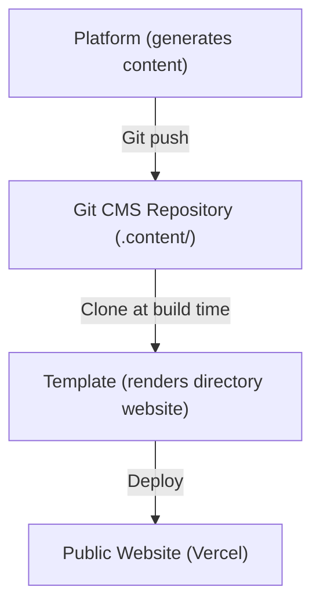
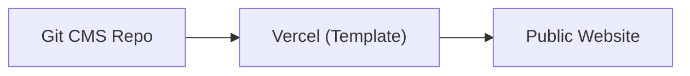
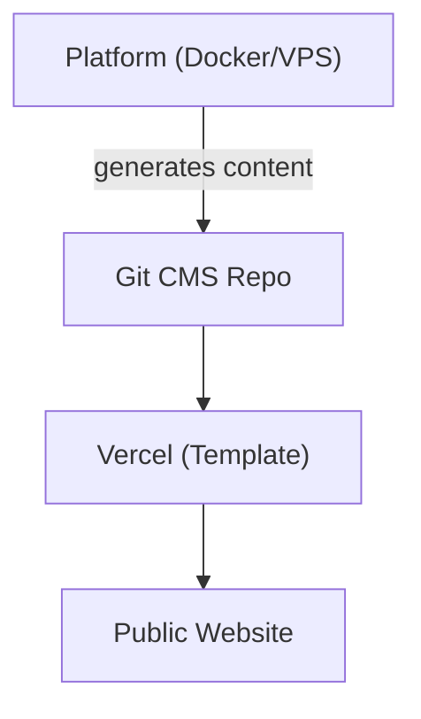
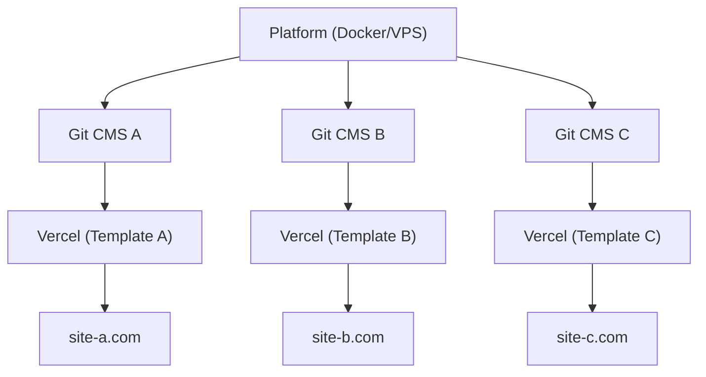

# Piattaforma vs Template

Ever Works è composto da due prodotti principali che servono scopi diversi ma lavorano insieme come un ecosistema unificato. Questa pagina spiega la differenza e quando utilizzare ciascuno.

## Ever Works Platform

La **Ever Works Platform** è l'infrastruttura backend per la costruzione e la gestione di siti web directory su scala. Fornisce un'API REST, pipeline di generazione di contenuti alimentate dall'IA, un sistema di plugin e orchestrazione del deployment.

Per la documentazione completa della piattaforma, visita [docs.ever.works](https://docs.ever.works).

## Directory Web Template

Il **Directory Web Template** (questo progetto) è un sito web directory full-stack pronto per la produzione che puoi clonare, personalizzare e distribuire come applicazione autonoma.

### Cosa fa

- Fornisce un **sito web directory** completo con elenchi di elementi, ricerca, filtraggio, categorie, tag e collezioni
- Include **autenticazione** tramite NextAuth.js v5 con provider OAuth (Google, GitHub, Facebook, Twitter, Microsoft) e Supabase Auth
- Supporta **pagamenti** tramite Stripe, LemonSqueezy e Polar con gestione degli abbonamenti
- Offre **internazionalizzazione** con più lingue e supporto RTL tramite next-intl
- Utilizza un **CMS basato su Git** per sincronizzare i contenuti della directory dai repository Git
- Include un **sistema di temi** con temi integrati e generazione dinamica dei colori
- Fornisce **analisi e monitoraggio** tramite PostHog e Sentry
- Include **ottimizzazione SEO**, generazione di sitemap e dati strutturati (JSON-LD)
- Include una **dashboard amministrativa** con gestione dei contenuti, degli utenti e analisi

### Stack Tecnologico

- **Framework:** Next.js 15, React 19
- **Linguaggio:** TypeScript 5
- **ORM:** Drizzle ORM (PostgreSQL)
- **UI:** Tailwind CSS 4, HeroUI React, Radix UI
- **Auth:** NextAuth.js v5, Supabase Auth
- **Pagamenti:** Stripe, LemonSqueezy, Polar
- **Testing:** Playwright (E2E)
- **Deployment:** Vercel (primario), Docker (alternativo)

## Confronto Affiancato

| Aspetto             | Piattaforma                                | Template                               |
| ------------------- | ------------------------------------------ | -------------------------------------- |
| **Scopo**           | Infrastruttura backend e pipeline IA       | Sito web directory frontend            |
| **Architettura**    | Monorepo (Turborepo + pnpm)                | Applicazione Next.js autonoma          |
| **Backend**         | NestJS 11 API                              | API route di Next.js                   |
| **ORM Database**    | TypeORM                                    | Drizzle ORM                            |
| **Autenticazione**  | JWT + OAuth (NestJS Guards)                | NextAuth.js v5 + Supabase Auth         |
| **Pagamenti**       | Non incluso                                | Stripe, LemonSqueezy, Polar            |
| **Funzionalità IA** | Agenti LangChain, 7 provider LLM           | Nessuna (consuma contenuto generato da IA) |
| **Contenuto**       | Genera contenuto tramite pipeline IA       | Legge contenuto da CMS basato su Git   |
| **Deployment**      | Docker su qualsiasi VPS                    | Vercel (o Docker)                      |
| **Testing**         | Jest + Vitest                              | Playwright                             |
| **Pubblico**        | Operatori di piattaforma, sviluppatori IA  | Costruttori di siti web, creatori di directory |

## Come Si Connettono

La Piattaforma e il Template lavorano insieme attraverso il pattern del **CMS basato su Git**:

### Funzionamento Indipendente

- **Template senza Piattaforma:** Gestisci manualmente i contenuti della directory modificando file YAML e Markdown nel repository Git CMS. Il Template funziona come un sito web directory completamente funzionale senza generazione IA.
- **Piattaforma senza Template:** Usa l'API della Piattaforma per generare dati della directory ed esportarli in qualsiasi frontend.

## Quando Usare Quale

### Usa il Template quando...

- Vuoi lanciare un sito web directory rapidamente con una configurazione backend minima
- Il contenuto della tua directory è curato manualmente o proviene da una fonte di dati statica
- Hai bisogno di un sito web pronto per la produzione con autenticazione, pagamenti e SEO out of the box
- Preferisci distribuire su Vercel senza gestione del server

### Usa la Piattaforma quando...

- Hai bisogno di generazione di contenuti alimentata dall'IA per directory di grandi dimensioni
- Vuoi pipeline automatizzate che scoprano, arricchiscano e aggiornino gli elementi della directory
- Vuoi gestire più directory da un unico backend
- Vuoi utilizzare il sistema di plugin per integrazioni personalizzate

### Usa Entrambi quando...

- Vuoi che i contenuti generati dall'IA fluiscano in un sito web di produzione
- Stai costruendo un prodotto SaaS su Ever Works
- Hai bisogno di generazione automatizzata di contenuti E un frontend raffinato

## Architetture di Deployment

### Solo Template (La Più Semplice)

Gestione manuale dei contenuti tramite Git. Deployment Vercel singolo.

### Piattaforma + Template (Full Stack)

Generazione automatizzata dei contenuti tramite Piattaforma. Connesso tramite Git.

### Piattaforma + Template Multipli

Una singola istanza della Piattaforma gestisce più siti web directory.
