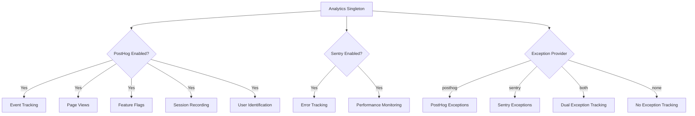
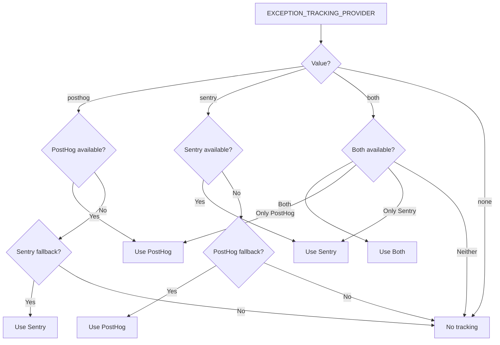

# Configurazione Analitica

Il template fornisce un sistema di analisi unificato che integra PostHog per l'analisi del prodotto e Sentry per il monitoraggio degli errori. Entrambi i provider sono gestiti tramite una classe singleton `Analytics` con comportamento di fallback automatico.

## Architettura



## Variabili d'Ambiente

### Configurazione PostHog

| Variable | Obbligatorio | Predefinito | Descrizione |
|---|---|---|---|
| `NEXT_PUBLIC_POSTHOG_KEY` | Sì (per l'analisi) | -- | Chiave API del progetto PostHog |
| `NEXT_PUBLIC_POSTHOG_HOST` | Sì (per l'analisi) | -- | URL dell'istanza PostHog |
| `POSTHOG_DEBUG` | No | `false` | Abilita la registrazione di debug |
| `POSTHOG_SESSION_RECORDING_ENABLED` | No | `true` | Abilita le registrazioni di sessione |
| `POSTHOG_AUTO_CAPTURE` | No | `false` | Acquisizione automatica delle visualizzazioni di pagina |
| `POSTHOG_EXCEPTION_TRACKING` | No | `true` | Abilita il monitoraggio delle eccezioni PostHog |

### Configurazione Sentry

| Variable | Obbligatorio | Predefinito | Descrizione |
|---|---|---|---|
| `NEXT_PUBLIC_SENTRY_DSN` | Sì (per gli errori) | -- | Sentry Data Source Name |
| `SENTRY_ENABLE_DEV` | No | `false` | Abilita Sentry in sviluppo |
| `SENTRY_DEBUG` | No | `false` | Abilita la modalità di debug di Sentry |
| `SENTRY_EXCEPTION_TRACKING` | No | `true` | Abilita il monitoraggio delle eccezioni Sentry |

### Monitoraggio Unificato delle Eccezioni

| Variable | Obbligatorio | Predefinito | Descrizione |
|---|---|---|---|
| `EXCEPTION_TRACKING_PROVIDER` | No | `both` | Provider da utilizzare: `posthog`, `sentry`, `both` o `none` |

## Configurazione di PostHog

### Passaggio 1: Ottenere le Credenziali

1. Registrati su [posthog.com](https://posthog.com) o ospita PostHog autonomamente
2. Crea un progetto
3. Copia la chiave API del progetto e l'URL dell'host

### Passaggio 2: Configurare l'Ambiente

```env
NEXT_PUBLIC_POSTHOG_KEY=phc_your_project_key_here
NEXT_PUBLIC_POSTHOG_HOST=https://app.posthog.com
```

PostHog viene abilitato automaticamente quando sono impostati sia `NEXT_PUBLIC_POSTHOG_KEY` che `NEXT_PUBLIC_POSTHOG_HOST`.

### Passaggio 3: Frequenze di Campionamento

Le frequenze di campionamento vengono regolate automaticamente in base all'ambiente:

| Ambiente | Frequenza di Campionamento degli Eventi | Frequenza di Campionamento della Registrazione della Sessione |
|---|---|---|
| Produzione | 10% (`0.1`) | 10% (`0.1`) |
| Sviluppo | 100% (`1.0`) | 100% (`1.0`) |

## Configurazione di Sentry

### Passaggio 1: Ottenere il DSN

1. Crea un progetto su [sentry.io](https://sentry.io)
2. Copia il DSN dalle impostazioni del progetto

### Passaggio 2: Configurare l'Ambiente

```env
NEXT_PUBLIC_SENTRY_DSN=https://examplePublicKey@o0.ingest.sentry.io/0
SENTRY_ENABLE_DEV=true  # Opzionale: abilita in sviluppo
```

Sentry viene abilitato automaticamente in produzione quando il DSN è impostato. Per lo sviluppo, imposta esplicitamente `SENTRY_ENABLE_DEV=true`.

## API della Classe Analytics

La classe `Analytics` è un singleton accessibile in tutta l'applicazione:

```typescript
import { analytics } from '@/lib/analytics';
```

### Inizializzazione

```typescript
// Inizializza analytics (chiamare una volta nella radice dell'app)
analytics.init();
```

Il metodo `init()` è solo lato client ed è sicuro chiamarlo in contesti server (non eseguirà alcuna operazione).

### Monitoraggio degli Eventi

```typescript
// Traccia un evento personalizzato
analytics.track('button_clicked', {
  buttonName: 'signup',
  page: '/landing'
});

// Traccia una visualizzazione di pagina
analytics.trackPageView('/dashboard', {
  referrer: document.referrer
});
```

### Identificazione Utente

```typescript
// Identifica un utente (dopo il login)
analytics.identify('user-123', {
  email: 'user@example.com',
  plan: 'premium',
  company: 'Acme Inc.'
});

// Reimposta l'identità (dopo il logout)
analytics.reset();

// Imposta proprietà utente persistenti
analytics.setUserProperties({
  subscription_tier: 'premium',
  signup_date: '2024-01-15'
});

// Imposta super proprietà (inviate con ogni evento)
analytics.setSuperProperties({
  app_version: '2.0.0',
  platform: 'web'
});
```

### Flag di Funzionalità

```typescript
// Verifica se un flag di funzionalità è abilitato
const isEnabled = analytics.isFeatureEnabled('new-dashboard', false);

// Ricarica i flag di funzionalità dal server
await analytics.reloadFeatureFlags();
```

### Monitoraggio delle Eccezioni

```typescript
// Cattura un'eccezione (instradato al provider configurato)
analytics.captureException(error, {
  component: 'PaymentForm',
  action: 'submit'
});

// Cattura con un messaggio stringa
analytics.captureException('Payment processing failed', {
  orderId: 'ord-123'
});
```

## Selezione del Provider di Monitoraggio delle Eccezioni



## Registrazione della Sessione

Quando `POSTHOG_SESSION_RECORDING_ENABLED=true`, PostHog registra le sessioni utente con queste impostazioni sulla privacy:

```typescript
session_recording: {
  maskAllInputs: true,        // Maschera i valori degli input del modulo
  maskTextSelector: "[data-mask]",  // Maschera gli elementi con data-mask
  sampleRate: 0.1,            // 10% in produzione
}
```

Aggiungi `data-mask` a qualsiasi elemento il cui contenuto testuale deve essere nascosto nelle registrazioni.

## Monitoraggio delle Eccezioni con PostHog

Quando il monitoraggio delle eccezioni PostHog è abilitato, il sistema installa gestori di errori globali:

- **`window.onerror`** -- Cattura gli errori JavaScript non gestiti
- **`unhandledrejection`** -- Cattura le Promise rejection non gestite

Questi vengono inoltrati a PostHog come eventi `$exception` con stack trace.

## Integrazione Sentry-PostHog

Quando entrambi i provider sono attivi (`EXCEPTION_TRACKING_PROVIDER=both`), il sistema crea un collegamento bidirezionale:

1. La proprietà `sentry` di PostHog viene impostata sull'SDK Sentry
2. Un processore di eventi Sentry personalizzato inola gli errori a PostHog come eventi `sentry_error`
3. Ciò consente di correlare le sessioni utente (PostHog) con i dettagli degli errori (Sentry)

## Costanti di Monitoraggio degli Spettatori

Il file `lib/constants/analytics.ts` fornisce costanti per il monitoraggio anonimo dei visitatori:

```typescript
// Nome del cookie per l'ID visitatore anonimo
```
