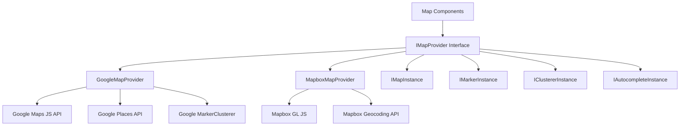
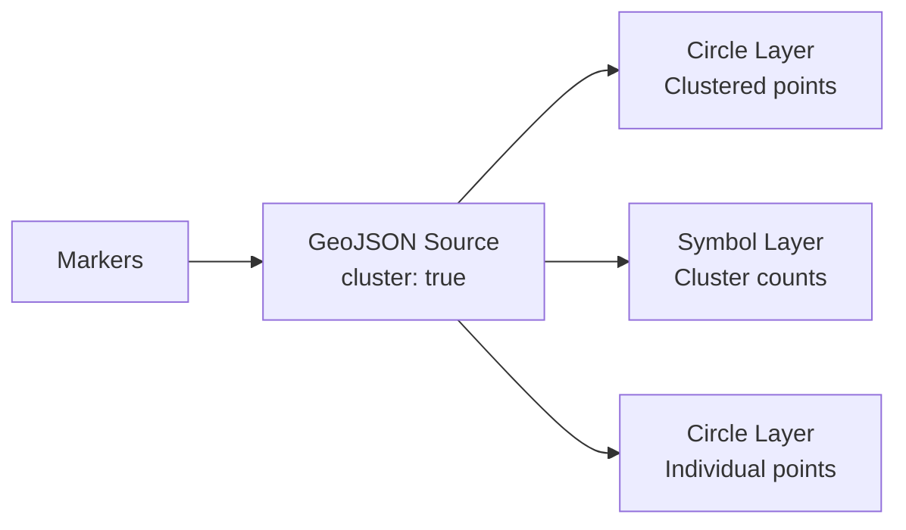

# Configurazione Mappa

Il template include un sistema di mappe agnostico al provider che supporta sia Google Maps che Mapbox GL JS. Uno strato di interfaccia condivisa consente di passare da un provider all'altro senza modificare il codice dei componenti.

## Architettura



## Selezione del Provider

Il provider di mappe è determinato dalle chiavi API configurate:

| Provider | Variabile d'Ambiente Richiesta |
|---|---|
| Google Maps | `NEXT_PUBLIC_GOOGLE_MAPS_API_KEY` |
| Mapbox | `NEXT_PUBLIC_MAPBOX_ACCESS_TOKEN` |

Se entrambe sono configurate, il provider viene selezionato tramite le impostazioni di configurazione mappa dell'applicazione.

## Configurazione Google Maps

### Passaggio 1: Ottenere la Chiave API

1. Vai a [Google Cloud Console](https://console.cloud.google.com)
2. Abilita le seguenti API:
   - Maps JavaScript API
   - Places API
   - Geocoding API
3. Crea una chiave API con restrizioni HTTP referrer

### Passaggio 2: Configurare l'Ambiente

```env
NEXT_PUBLIC_GOOGLE_MAPS_API_KEY=AIzaSy...your-api-key
NEXT_PUBLIC_GOOGLE_MAPS_MAP_ID=your-map-id        # Optional: for styled maps
```

### Passaggio 3: Sicurezza

Il provider Google Maps impone l'uso della chiave solo nel browser:

```typescript
// @security Uses NEXT_PUBLIC_GOOGLE_MAPS_API_KEY (browser-exposed).
// Only use HTTP referrer-restricted keys, never unrestricted or server keys.
```

**Restrizioni richieste per la chiave API:**
- Restrizione dell'applicazione: HTTP referrer
- Aggiungi i pattern del tuo dominio (es. `https://yourdomain.com/*`)
- Restrizione API: Limita a Maps JavaScript, Places e Geocoding API

## Configurazione Mapbox

### Passaggio 1: Ottenere il Token di Accesso

1. Registrati su [mapbox.com](https://www.mapbox.com)
2. Copia il tuo token di accesso pubblico (inizia con `pk.`)

### Passaggio 2: Configurare l'Ambiente

```env
NEXT_PUBLIC_MAPBOX_ACCESS_TOKEN=pk.eyJ1Ijoi...your-token
```

### Passaggio 3: Sicurezza

```typescript
// @security Uses NEXT_PUBLIC_MAPBOX_ACCESS_TOKEN (browser-exposed).
// Only use public tokens (pk.*) with URL restrictions, never secret tokens (sk.*).
```

**Restrizioni richieste per il token:**
- Usa un token **pubblico** (prefisso `pk.`)
- Aggiungi restrizioni URL per i tuoi domini
- Non utilizzare mai token segreti (`sk.*`) nel codice client

## Interfaccia del Provider

Entrambi i provider implementano l'interfaccia `IMapProvider` con capacità identiche:

### Metodi IMapProvider

| Metodo | Descrizione |
|---|---|
| `isLoaded()` | Verifica se lo script del provider è caricato |
| `loadScript()` | Carica la libreria del provider (idempotente) |
| `createMap(container, options)` | Crea un'istanza mappa in un elemento DOM |
| `createMarker(map, options)` | Aggiunge un marker alla mappa |
| `createClusterer(map, options, onClick)` | Raggruppa marker vicini in cluster |
| `createAutocomplete(input, onSelect)` | Collega il completamento automatico degli indirizzi a un input |
| `getStyleUrl(style)` | Ottieni l'URL dello stile per la vista stradale o satellite |
| `isConfigured()` | Verifica se le chiavi API sono presenti |

### Stili Mappa

| Stile | Google Maps | Mapbox |
|---|---|---|
| `streets` | `roadmap` | `mapbox://styles/mapbox/streets-v12` |
| `satellite` | `satellite` | `mapbox://styles/mapbox/satellite-streets-v12` |

## Sistema di Tipi

La libreria mappa definisce tipi completi in `lib/maps/types.ts`:

### Tipi Principali

```typescript
interface Coordinates {
  latitude: number;
  longitude: number;
}

interface MapBounds {
  north: number;
  south: number;
  east: number;
  west: number;
}

interface MapViewport {
  center: Coordinates;
  zoom: number;
  bounds?: MapBounds;
}
```

### Tipi Marker

```typescript
interface MapMarkerData {
  id: string;
  coordinates: Coordinates;
  title: string;
  icon?: string;
  category?: string;
  slug: string;
  description?: string;
}

interface MapMarkerWithDistance extends MapMarkerData {
  distanceKm?: number;
}
```

### Configurazione Cluster

```typescript
interface ClusterOptions {
  radius?: number;     // Cluster radius in pixels (default: 60)
  maxZoom?: number;    // Max zoom for clustering (default: 16)
  minZoom?: number;    // Min zoom for clustering (default: 0)
  minPoints?: number;  // Min points to form cluster (default: 2)
}
```

### Gestori di Eventi

```typescript
interface MapEventHandlers {
  onMarkerClick?: (marker: MapMarkerData) => void;
  onClusterClick?: (cluster: MapClusterData) => void;
  onViewportChange?: (viewport: MapViewport) => void;
  onMapReady?: () => void;
  onMapError?: (error: Error) => void;
}
```

## Props del Componente Mappa

L'interfaccia `MapComponentProps` definisce l'insieme completo di props per il componente mappa principale:

| Prop | Tipo | Predefinito | Descrizione |
|---|---|---|---|
| `markers` | `MapMarkerData[]` | `[]` | Marker da visualizzare |
| `center` | `Coordinates` | -- | Posizione centrale iniziale |
| `zoom` | `number` | -- | Livello di zoom iniziale (1-20) |
| `style` | `MapStyle` | `streets` | Stile mappa (strade/satellite) |
| `height` | `string \| number` | -- | Altezza del contenitore |
| `width` | `string \| number` | -- | Larghezza del contenitore |
| `enableClustering` | `boolean` | `false` | Abilita clustering dei marker |
| `clusterOptions` | `ClusterOptions` | -- | Configurazione clustering |
| `controls` | `MapControlsConfig` | -- | Impostazioni controlli UI |
| `isLoading` | `boolean` | `false` | Stato di caricamento esterno |
| `isDisabled` | `boolean` | `false` | Disabilita interazione |
| `onMarkerClick` | `function` | -- | Gestore clic marker |
| `onClusterClick` | `function` | -- | Gestore clic cluster |
| `onViewportChange` | `function` | -- | Gestore cambio viewport |

## Completamento Automatico Indirizzo

Entrambi i provider supportano il completamento automatico degli indirizzi con un'interfaccia unificata:

```typescript
interface AddressSuggestion {
  id: string;
  mainText: string;       // Street address
  secondaryText: string;  // City, state
  fullAddress: string;    // Complete formatted address
  coordinates?: Coordinates;
}
```

**Google Maps:** Utilizza l'API Places Autocomplete con i campi `formatted_address`, `geometry`, `name` e `address_components`.

**Mapbox:** Utilizza l'API Geocoding (`/geocoding/v5/mapbox.places/`) con input con debounce (300ms) e un'interfaccia a tendina personalizzata.

## Selettore di Posizione

L'interfaccia `LocationPickerProps` supporta un'esperienza completa di selezione della posizione:

```typescript
interface LocationPickerValue {
  address?: string;
  city?: string;
  state?: string;
  country?: string;
  postalCode?: string;
  latitude?: number;
  longitude?: number;
  serviceArea?: 'local' | 'regional' | 'national' | 'global';
  isRemote?: boolean;
}
```

## Servizi di Geocodifica

La geocodifica lato server è disponibile tramite `lib/services/geocoding/`:

| File | Scopo |
|---|---|
| `geocoding-provider.interface.ts` | Interfaccia di geocodifica condivisa |
| `google-geocoding.provider.ts` | Implementazione API Geocoding Google |
| `mapbox-geocoding.provider.ts` | Implementazione API Geocoding Mapbox |
| `geocoding.service.ts` | Servizio di geocodifica unificato |

## Implementazione del Clustering

### Clustering Google Maps

Utilizza `@googlemaps/markerclusterer` con `AdvancedMarkerElement`:

- Importa dinamicamente la libreria clusterer
- Crea elementi di contenuto marker personalizzati con icone
- Comportamento predefinito: zoom ai limiti del cluster al clic

### Clustering Mapbox

Utilizza il clustering nativo a livello di sorgente Mapbox GL:

- Sorgente GeoJSON con `cluster: true`
- Tre livelli: cerchi cluster, etichette conteggio, punti non raggruppati
- Codificati a colori per dimensione del cluster (piccolo: ciano, medio: giallo, grande: rosa)



## Configurazione Controlli

```typescript
interface MapControlsConfig {
  showZoomControls?: boolean;        // Zoom in/out buttons
  showFullscreenControl?: boolean;   // Fullscreen toggle
  showNavigationControl?: boolean;   // Compass/navigation
  showScaleControl?: boolean;        // Distance scale
}
```

## Risoluzione dei Problemi

| Problema | Soluzione |
|---|---|
| Mappa non visualizzata | Verifica che la chiave API sia impostata e corretta |
| "Google Maps API key not configured" | Imposta `NEXT_PUBLIC_GOOGLE_MAPS_API_KEY` |
| Mappa Mapbox vuota | Assicurati che il token inizi con `pk.` (pubblico) |
| Marker non raggruppati | Imposta `enableClustering={true}` sul componente mappa |
| Completamento automatico non funzionante | Verifica che Places API sia abilitata (Google) |
| Errori CORS | Controlla le restrizioni di dominio della chiave API |
| Limitazione della velocità | Monitora l'utilizzo delle API nella dashboard del provider |
