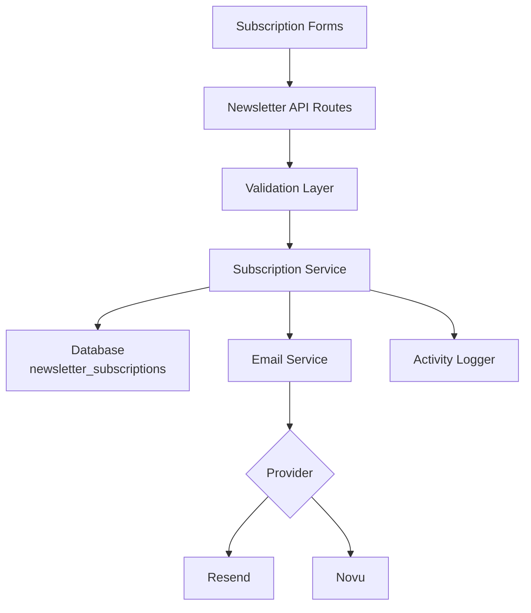
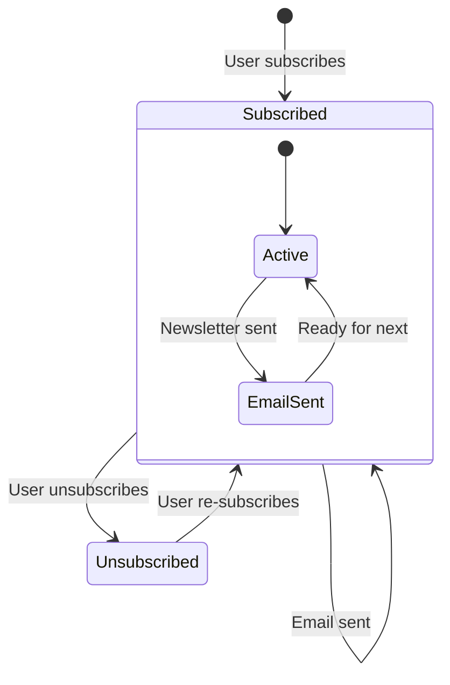

# Configurazione Newsletter

Il template include un sistema completo di iscrizione alla newsletter con integrazione del provider email, validazione, gestione del ciclo di vita delle iscrizioni e registrazione delle attività. La configurazione è centralizzata in `lib/newsletter/`.

## Architettura



## Struttura dei File

```
lib/newsletter/
├── config.ts    # Configuration, types, validation schemas
└── utils.ts     # Email sending, subscription validation, logging
```

## Costanti di Configurazione

L'oggetto `NEWSLETTER_CONFIG` in `config.ts` definisce tutti i valori predefiniti e i messaggi:

```typescript
export const NEWSLETTER_CONFIG = {
  DEFAULT_PROVIDER: "resend",
  DEFAULT_FROM: "onboarding@resend.dev",
  DEFAULT_COMPANY_NAME: "Ever Works",

  SOURCES: {
    FOOTER: "footer",
    POPUP: "popup",
    SIGNUP: "signup",
  },

  ERRORS: {
    INVALID_EMAIL: "Please enter a valid email address",
    ALREADY_SUBSCRIBED: "Email is already subscribed to the newsletter",
    NOT_SUBSCRIBED: "Email is not subscribed to the newsletter",
    SUBSCRIPTION_FAILED: "Failed to create subscription. Please try again.",
    UNSUBSCRIPTION_FAILED: "Failed to unsubscribe. Please try again.",
    EMAIL_SEND_FAILED: "Failed to send email. Please try again.",
    STATS_FAILED: "Failed to get newsletter statistics",
  },

  SUCCESS: {
    SUBSCRIBED: "Successfully subscribed to newsletter",
    UNSUBSCRIBED: "Successfully unsubscribed from newsletter",
  },
};
```

## Configurazione del Provider Email

### Resend (Predefinito)

```env
RESEND_API_KEY=re_your_api_key_here
```

1. Registrarsi su [resend.com](https://resend.com)
2. Creare una chiave API
3. Verificare il dominio di invio (o usare `onboarding@resend.dev` per i test)

### Novu

```env
NOVU_API_KEY=your_novu_api_key
```

Per Novu è disponibile una configurazione aggiuntiva nella configurazione del sito:

```yaml
mail:
  provider: "novu"
  template_id: "your-template-id"
  backend_url: "https://api.novu.co"
```

## Configurazione Email

La funzione `createEmailConfig()` costruisce la configurazione email dalla configurazione dell'applicazione:

```typescript
interface EmailConfig {
  provider: string;      // "resend" or "novu"
  defaultFrom: string;   // Sender email address
  domain: string;        // Application domain URL
  apiKeys: {
    resend: string;
    novu: string;
  };
  novu?: {
    templateId?: string;
    backendUrl?: string;
  };
}
```

Priorità di configurazione:

| Impostazione      | Sorgente                       | Fallback                   |
|---|---|---|
| Provider          | `config.mail.provider`         | `"resend"`                 |
| Indirizzo mittente| `config.mail.default_from`     | `"onboarding@resend.dev"`  |
| Dominio           | `config.app_url`               | `coreConfig.APP_URL`       |
| Chiave Resend     | Var. ambiente `RESEND_API_KEY` | Stringa vuota              |
| Chiave Novu       | Var. ambiente `NOVU_API_KEY`  | Stringa vuota              |

## Schemi di Validazione

Il sistema newsletter usa schemi Zod per la validazione degli input:

### Schema Email

```typescript
const emailSchema = z.object({
  email: z
    .string()
    .email("Please enter a valid email address")
    .transform((email) => email.toLowerCase().trim()),
});
```

### Schema Iscrizione

```typescript
const newsletterSubscriptionSchema = z.object({
  email: z
    .string()
    .email("Please enter a valid email address")
    .transform((email) => email.toLowerCase().trim()),
  source: z
    .enum(["footer", "popup", "signup"])
    .default("footer"),
});
```

## Sorgenti di Iscrizione

Tracciare l'origine delle iscrizioni:

| Sorgente | Descrizione                                   |
|---|---|
| `footer` | Modulo di iscrizione nel piè di pagina del sito |
| `popup`  | Popup/modal newsletter                          |
| `signup` | Flusso di registrazione account                 |

## Utilità Newsletter

### Invio Email

```typescript
import { sendEmailSafely, createEmailService } from '@/lib/newsletter/utils';

// Create email service
const { service, config } = await createEmailService();

// Send email with error handling
const result = await sendEmailSafely(
  service,
  config,
  {
    subject: "Welcome to our newsletter!",
    html: "<h1>Welcome!</h1>",
    text: "Welcome!"
  },
  "user@example.com",
  "welcome"
);

if (!result.success) {
  console.error(result.error);
}
```

### Validazione Iscrizione

```typescript
import { canSubscribe, canUnsubscribe } from '@/lib/newsletter/utils';

// Check if email can be subscribed
const { canSubscribe: allowed, error } = await canSubscribe("user@example.com");
if (!allowed) {
  // Email is already subscribed
}

// Check if email can be unsubscribed
const { canUnsubscribe: allowed, error } = await canUnsubscribe("user@example.com");
if (!allowed) {
  // Email is not currently subscribed
}
```

### Registrazione Attività

```typescript
import { logNewsletterActivity, trackNewsletterMetric } from '@/lib/newsletter/utils';

// Log newsletter activity
logNewsletterActivity("subscribe", "user@example.com", "footer", {
  ip: "192.168.1.1"
});

// Track newsletter metrics
trackNewsletterMetric("subscription", "user@example.com", "popup");
```

Tipi di attività:

| Azione         | Quando Registrata                                  |
|---|---|
| `subscribe`    | L'utente si iscrive alla newsletter                |
| `unsubscribe`  | L'utente cancella l'iscrizione                     |
| `email_sent`   | Email newsletter inviata con successo              |
| `email_failed` | Invio email newsletter fallito                     |

### Utilità Template

```typescript
import { getTemplateWithCompany } from '@/lib/newsletter/utils';

// Generate email template with company name
const template = await getTemplateWithCompany(
  (email, companyName) => ({
    subject: `Welcome to ${companyName}`,
    html: `<p>Thanks for subscribing, ${email}!</p>`,
    text: `Thanks for subscribing, ${email}!`
  }),
  "user@example.com"
);
```

### Helper di Risposta

```typescript
import { createErrorResponse, createSuccessResponse } from '@/lib/newsletter/utils';

// Standardized error response
const error = createErrorResponse(
  "Subscription failed",
  "user@example.com",
  "subscribe"
);
// { error: "Subscription failed", email: "user@example.com", context: "subscribe" }

// Standardized success response
const success = createSuccessResponse("user@example.com", "subscribe");
// { success: true, email: "user@example.com", context: "subscribe" }
```

## Schema del Database

Le iscrizioni alla newsletter sono memorizzate nella tabella `newsletter_subscriptions`:

| Colonna          | Tipo      | Descrizione                                      |
|---|---|---|
| `id`             | UUID      | Chiave primaria                                  |
| `email`          | String    | Email iscritto (univoca)                         |
| `isActive`       | Boolean   | Stato iscrizione corrente                        |
| `subscribedAt`   | Timestamp | Quando è iniziata l'iscrizione                   |
| `unsubscribedAt` | Timestamp | Quando è stata cancellata (nullable)             |
| `lastEmailSent`  | Timestamp | Ultima email inviata all'iscritto                |
| `source`         | String    | Sorgente iscrizione (footer, popup, signup)      |

## Ciclo di Vita dell'Iscrizione



## Tipi

```typescript
type NewsletterSource = "footer" | "popup" | "signup";

interface NewsletterActionResult {
  success?: boolean;
  error?: string;
  email?: string;
}

interface NewsletterStats {
  totalActive: number;
  recentSubscriptions: number;
}
```

## Sicurezza

- Gli indirizzi email vengono normalizzati in minuscolo e rimossi gli spazi prima della memorizzazione
- La validazione email usa una regex sicura che previene gli attacchi ReDoS (da `lib/utils/email-validation.ts`)
- La funzione `sendEmailSafely` avvolge tutte le operazioni email in blocchi try-catch
- Le chiavi API non vengono mai esposte al client — tutte le operazioni email avvengono lato server

## Risoluzione dei Problemi

| Problema                       | Soluzione                                                                         |
|---|---|
| Le email non vengono inviate   | Verificare che `RESEND_API_KEY` o `NOVU_API_KEY` sia impostato                    |
| Errore "già iscritto"          | Controllare la tabella `newsletter_subscriptions` per un'iscrizione attiva        |
| Indirizzo mittente errato      | Aggiornare `mail.default_from` nella configurazione del sito                      |
| Template non caricato          | Assicurarsi che `getCompanyName()` possa accedere alla configurazione del sito    |
| Sorgente non tracciata         | Passare il parametro `source` nelle richieste di iscrizione                       |
